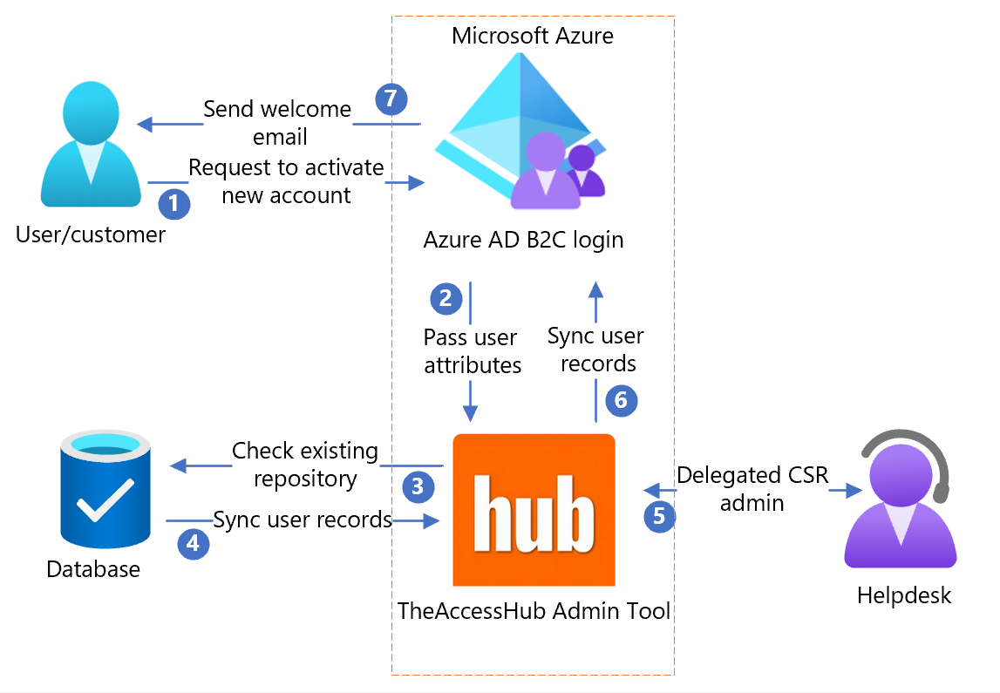

# Configure TheAccessHub Admin Tool with Azure Active Directory B2C

In this tutorial, learn how to integrate Azure Active Directory B2C (Azure AD B2C) with [TheAccessHub Admin Tool](https://n8id.com/products/theaccesshub-admintool/) from N8 Identity [N8ID](https://n8id.com/). The solution addresses customer account migration and customer service request (CSR) administration.  

Use this solution for the following scenarios:

- You have a site and want to migrate to Azure AD B2C. 
  - However, customer-account migration is challenging, including passwords.
- You need a CSR tool to administer Azure AD B2C accounts.
- Delegated CSR administration is a requirement.
- You want to synchronize and merge data from repositories into Azure AD B2C.

## Prerequisites

To get started, you'll need:

* An Azure subscription

  - If you don't have a one, you can get an [Azure free account](https://azure.microsoft.com/free/)
- An [Azure AD B2C tenant](./tutorial-create-tenant.md) linked to your Azure subscription
- TheAccessHub Admin Tool environment
  - See, [N8 Identity/contact](https://n8id.com/contact/) for a new environment
- Optional: 
  - Connection and credential information for databases or Lightweight Directory Access Protocols (LDAPs), from which you want to migrate customer data
  - A configured Azure AD B2C environment for [custom policies](./tutorial-create-user-flows.md?pivots=b2c-custom-policy) to integrate TheAccessHub Admin Tool into your sign-up policy flow

## Scenario description

The TheAccessHub Admin Tool runs in the N8ID Azure subscription or the customer subscription. The following architecture diagram shows the implementation.

   

1. User arrives on a sign-in page, creates an account, and enters information. Azure AD B2C collects user attributes.
2. Azure AD B2C calls the TheAccessHub Admin Tool and passes the user attributes.
3. TheAccessHub Admin Tool checks your database for current user information.  
4. User records synchronize from the database to TheAccessHub Admin Tool.
5. TheAccessHub Admin Tool shares the data with the delegated CSR or helpdesk admin.
6. TheAccessHub Admin Tool syncs user records with Azure AD B2C.
7. Based on TheAccessHub Admin Tool response, Azure AD B2C sends a customized welcome email to users.

## Create a Global Administrator in your Azure AD B2C tenant

TheAccessHub Admin Tool permissions act on behalf of a Global Administrator to read user information and conduct changes in your Azure AD B2C tenant. Changes to your regular administrators won't affect TheAccessHub Admin Tool interaction with the tenant.

To create a Global Administrator:

1. In the Azure portal, sign in to your Azure AD B2C tenant as an Administrator. 
2. Go to **Microsoft Entra ID** > **Users**.
3. Select **New User**.
4. Choose **Create User** to create a regular directory user and not a customer.
5. On the identity information form:
* Enter the **username**, such as theaccesshub.
* Enter the **account name**, such as TheAccessHub Service Account.
7. Select **Show Password**.
8. Copy and save the initial password.
9. To assign the Global Administrator role, for **User**, select the user's current role.
10. Select the **Global Administrator** record.
11. Select **Create**.

## Connect TheAccessHub Admin Tool to your Azure AD B2C tenant

TheAccessHub Admin Tool uses the Microsoft Graph API to read and make changes to a directory. It acts as a Global Administrator in your tenant. Use the following instructions to add needed permissions. 

To authorize TheAccessHub Admin Tool to access your directory:

1. Use the credentials N8 Identity provided to sign in to TheAccessHub Admin Tool.
2. Go to **System Admin** > **Azure AD B2C Config**.
3. Select **Authorize Connection**.
4. In the new window, sign in with your Global Administrator account. When you sign in for the first time with the new service account, a prompt to reset your password can appear.
5. Follow the prompts and select **Accept**.

## Configure a new CSR user with your enterprise identity

Create a CSR or Helpdesk user who accesses TheAccessHub Admin Tool with enterprise Microsoft Entra credentials.

To configure a CSR or Helpdesk user with single sign-on (SSO):

1. Use the credentials N8 Identity provided to sign in to TheAccessHub Admin Tool.
2. Go to **Manager Tools** > **Manage Colleagues**.
3. Select **Add Colleague**.
4. For **Colleague Type**, select **Azure Administrator**.
5. For the profile information, select a home organization to control who has permission to manage this user.
6. For **Login ID/Azure AD User Name**, enter the user principal name from the user Microsoft Entra account.
7. On the **TheAccessHub Roles** tab, select the **Helpdesk** managed role. 
6. Select **Submit**.

> [!NOTE]
> The Helpdesk role provides access to the **Manage Colleagues** view. Place the user into a group or make them an organization owner.

## Configure a new CSR user with a new identity

Create a CSR or Helpdesk user to access TheAccessHub Admin Tool with a new local credential. This user is for organizations that don't use Microsoft Entra ID.

See, [The AccessHub Admin Tool: Add Colleague Administrator](https://youtu.be/iOpOI2OpnLI) without SSO.

1. Use the credentials N8ID provided to sign in to TheAccessHub Admin Tool.
2. Go to **Manager Tools** > **Manage Colleagues**.
3. Select **Add Colleague**.
4. For **Colleague Type**, select **Local Administrator**.
5. For the profile information, select a home organization to control who has permission to manage this user.
6. On the **TheAccessHub Roles** tab, select the **Helpdesk** managed role. 
7. Copy the **Login ID/Email** and **One Time Password** attributes. Provide them to the new user to sign in to TheAccessHub Admin Tool. 
8. Select **Submit**.

> [!NOTE]
> The Helpdesk role provides access to the **Manage Colleagues** view. Place the user into a group or make them an organization owner.

## Configure partitioned CSR administration

In TheAccessHub Admin Tool, permissions to manage customer and CSR/Helpdesk users are managed through an organization hierarchy. Colleagues and customers have a home organization. You can assign colleagues or colleague groups as organization owners.  

Organization owners can manage and change colleagues and customers in organizations or suborganizations they own. For multiple colleagues to manage a set of users, create a group with multiple members. Then, assign the group as an organization owner. All group members can manage colleagues and customers in the organization.

### Create a new group

1. Use the credentials N8ID provided to sign in to TheAccessHub Admin Tool.
2. Go to **Organization > Manage Groups**.
3. Select **Add Group**.
4. Enter values for **Group name**, **Group description**, and **Group owner**.
5. Search for and select the boxes for colleagues to be members of the group.
6. Select **Add**.
7. Group members appear at the bottom of the page. Select the **X** on a row to remove a member.
8. Select **Submit**.

### Create a new organization

1. Use the credentials N8ID provided to sign in to TheAccessHub Admin Tool.
2. Go to **Organization** > **Manage Organizations**.'
3. Select **Add Organization**.
4. Enter values for **Organization name**, **Organization owner**, and **Parent organization**
5. Select **Submit**.

> [!NOTE]
> Align the organization name with customer data. When loading colleague and customer data, and you enter the organization name in the load, the colleague appears in the organization. The owner manages customers and colleagues in the organization and suborganizations. The parent organization is responsible for the organization.

### Modify the hierarchy via the tree view

Use this function to visualize colleague and group management.

1. Use the credentials N8ID provided to sign in to TheAccessHub Admin Tool.
2. Go to **Manager Tools** > **Tree View**.
3. To modify the hierarchy, drag organizations into parent organizations.
4. Select **Save**.

## Customize the welcome notification

If you're using TheAccessHub Admin Tool to migrate users from one solution into Azure AD B2C, you can customize the user welcome notification. The notification goes to users during migration and can include a link to set a new password in the Azure AD B2C directory.

To customize the notification:

1. Use the credentials N8ID provided to sign in to TheAccessHub Admin Tool.
2. Go to **System Admin** > **Notifications**.
3. Select the **Create Colleague** template.
4. Select **Edit**.
5. Make needed changes to the **Message** and **Template**. The **Template** field is HTML-aware and can send HTML-formatted notifications.
6. Select **Save**.

## Migrate data from external data sources to Azure AD B2C

With TheAccessHub Admin Tool, you can import data from various databases, LDAPs, and .csv files and then push that data to your Azure AD B2C tenant. You load the data to migrate it into the Azure AD B2C user colleague type in TheAccessHub Admin Tool.  

> [!TIP]
> If the data source isn't Azure, the data goes into TheAccessHub Admin Tool and Azure AD B2C. If the external data source isn't a .csv file on your machine, set up a data source before the data load. Use the following steps to create a data source and load the data.

### Configure a data source

1. Use the credentials N8ID provided to sign in to TheAccessHub Admin Tool.
2. Go to **System Admin** > **Data Sources**.
3. Select **Add Data Source**.
4. Supply **Name** and **Type** values for this data source.
5. Enter form data for databases:

* **Type**: **Database**
* **Database type**: select a supported database
* **Connection URL**: enter a JDBC connection string, such as `jdbc:postgresql://myhost.com:5432/databasename`
* **Username**: username to access the database
* **Password**: password to access the database
* **Query**: the SQL query to extract customer details, such as `SELECT * FROM mytable;`'
* Select **Test Connection**. A data sample appears to confirm the connection is working.

6. Enter form data for LDAPs:
   
* **Type**: **LDAP**
* **Host**: host name, or IP address, of the machine on which the LDAP server runs, such as `mysite.com`
* **Port**, port number in which the LDAP server is listening
* **SSL**, select the box for the TheAccessHub Admin Tool to communicate to the LDAP with SSL (recommended)
* **Login DN**: user account distinguished name (DN) to sign in and do the LDAP search
* **Password**: user password 
* **Base DN**: DN at the top of the hierarchy in which to do the search
* **Filter**: LDAP filter string to obtain your customer records
* **Attributes**: comma-separated attribute list, from your customer records, to pass to TheAccessHub Admin Tool
* Select the **Test Connection**. A data sample appears to confirm the connection is working.

7. Enter data for OneDrive. **Type**: **OneDrive for Business**.'
8. Select **Authorize Connection**.
9. A new window prompts you to sign in to OneDrive. Sign in with read access to the OneDrive account. TheAccessHub Admin Tool reads .csv load files.
10. Follow the prompts and select **Accept**.
11. Select **Save**.  

### Synchronize data from your data source into Azure AD B2C

1. Use the credentials N8ID provided to sign in to TheAccessHub Admin Tool.
2. Go to **System Admin** > **Data Synchronization**.
3. Select **New Load**.
4. **Colleague Type**: **Azure AD B2C User**.
5. Select **Source**. In the dialog, select your data source. If you created a OneDrive data source, select the file.
6. To create new customer accounts, change the first policy, **IF colleague not found in TheAccessHub THEN**: **Do Nothing**.
7. To update customer accounts, change the second policy, **IF source and TheAccessHub data mismatch THEN**: **Do Nothing**.
8. Select **Next**.
9. In **Search-Mapping configuration**, identify load-record correlation with customers in TheAccessHub Admin Tool. 
10. Select source identifying attributes. Match attributes TheAccessHub Admin Tool attributes with the same values. If there's a match, the record is overridden. Otherwise, a new customer is created. 
11. Sequence the number of checks. For example, check email first, then first and last name.
12. On the left-side menu, select **Data Mapping**.
13. In **Data-Mapping configuration**, assign the TheAccessHub Admin Tool attributes to be populated from your source attributes. Unmapped attributes remain unchanged for customers. If you map the attribute `org_name` with a current organization value, created customers go in the organization.
15. Select **Next**.
16. For this load to be recurring, select **Daily/Weekly** or **Monthly**. Otherwise, keep the default, **Now**.
17. Select **Submit**.
18. For the **Now** schedule, a new record is added to **Data Synchronizations**. 
19. When validation is 100 percent, select the new record to see the outcome. For scheduled loads, records appear after the scheduled time.
20. If there are no errors, select **Run**. Otherwise, to remove the load, from the **More** menu, select **Remove**. 
21. If there are errors, you can manually update the records. On each record, select **Update** and make corrections. 
22. When **Data Synchronization** is 100 percent, customers appear or receive changes in Azure AD B2C.

> [!TIP]
> If there are multiple errors, you can continue with errors and resolve them later. In TheAccessHub Admin Tool, use **Support Interventions**.

## Synchronize Azure AD B2C customer data 

TheAccessHub Admin Tool can synchronize customer information from Azure AD B2C into TheAccessHub Admin Tool as a one-time, or an ongoing, operation. This operation ensures CSR or Helpdesk administrators see up-to-date customer information.

To synchronize data from Azure AD B2C into TheAccessHub Admin Tool:

1. Use the credentials N8ID provided to sign in to TheAccessHub Admin Tool.
2. Go to **System Admin** > **Data Synchronization**.
3. Select **New Load**.
4. **Colleague Type**: **Azure AD B2C User**.
5. For **Options**, leave the defaults.
6. Select **Next**.
7. For **Data Mapping & Search**, leave the defaults. Exception: if you map the attribute `org_name` to a current organization value, created customers appear in the organization.
8. Select **Next**.
9. For load to be recurring, select a **Daily/Weekly** or **Monthly** schedule. Otherwise, leave the **Now** default. We recommend recurring.
10. Select **Submit**.
11. If you selected **Now**, a new record appears on **Data Synchronizations**. After validation is 100 percent, select the new record to see the load outcome. For scheduled loads, records appear after the scheduled time.
12. If there are no errors, select **Run**. Otherwise, to remove the load, from the **More** menu, select **Remove**. 
13. If there are errors, manually update each record and select **Update**.
14. When **Data Synchronization** is 100 percent, the changes are initiated.

> [!TIP]
> If there are multiple errors, you can continue with errors and resolve them later. In TheAccessHub Admin Tool, use **Support Interventions**

## Configure Azure AD B2C policies

If you occasionally sync TheAccessHub Admin Tool, it might not be up to date with Azure AD B2C. You can use TheAccessHub Admin Tool API and Azure AD B2C policies to inform TheAccessHub Admin Tool of changes. This solution requires technical knowledge of [Azure AD B2C custom policies](./user-flow-overview.md). 

### Create a secure credential to invoke TheAccessHub Admin Tool API

For your sign-up custom policies, the following steps enable a secure certificate to notify TheAccessHub Admin Tool of new accounts.

1. Use the credentials N8ID provided to sign in to TheAccessHub Admin Tool.
2. Go to **System Admin** > **Admin Tools** > **API Security**.
3. Select **Generate**.
4. Copy the **Certificate Password**.
5. For the client certificate, select **Download**.
6. Use the instruction in [HTTPS client certificate authentication](./secure-rest-api.md#https-client-certificate-authentication) to add the client certificate to Azure AD B2C.

### Retrieve your custom policy examples

1. Use the credentials N8 Identity provided to sign in to TheAccessHub Admin Tool.
2. Go to **System Admin** > **Admin Tools** > **Azure B2C Policies**.
3. Supply your Azure AD B2C tenant domain and the two Identity Experience Framework IDs from your Identity Experience Framework configuration.
4. Select **Save**.
5. Select **Download** to get a .zip file with basic policies that add customers into TheAccessHub Admin Tool as customers sign up.
6. Use the instructions in [Create user flows](./tutorial-create-user-flows.md?pivots=b2c-custom-policy) to design custom policies in Azure AD B2C.

## Next steps

- [Custom policies in Azure AD B2C](./custom-policy-overview.md)
- [Get started with custom policies in Azure AD B2C](tutorial-create-user-flows.md?pivots=b2c-custom-policy)
