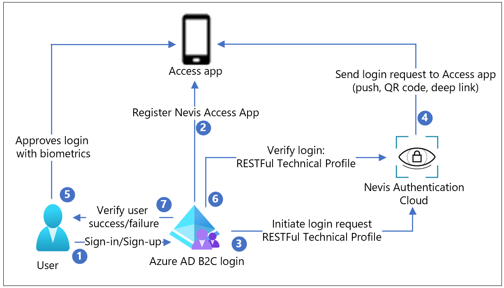

# Tutorial to configure Nevis with Azure Active Directory B2C for passwordless authentication

In this sample tutorial, learn how to extend Azure AD B2C with  [Nevis](https://www.nevis.net/en/solution/authentication-cloud) to enable passwordless authentication. Nevis provides a mobile-first, fully branded end-user experience with Nevis Access app to provide strong customer authentication and comply with Payment Services Directive 2 (PSD2) transaction requirements.

## Prerequisites

To get started, you'll need:

- A Nevis [trial account](https://www.nevis-security.com/aadb2c/)

- An Azure AD subscription. If you don't have one, get a [free account](https://azure.microsoft.com/free/).

- An [Azure AD B2C tenant](./tutorial-create-tenant.md) that is linked to your Azure subscription.

- Configured Azure AD B2C environment for using [custom policies](./tutorial-create-user-flows.md?pivots=b2c-custom-policy), if you wish to integrate Nevis into your sign-up policy flow.

## Scenario description

In this scenario, add fully branded access app to your back-end application for passwordless authentication. The following components make up the solution:

- An Azure AD B2C tenant, with a combined sign-in and sign-up policy to your back-end
- Nevis instance and its REST API to enhance Azure AD B2C
- Your own branded access app

The diagram shows the implementation.

|Step | Description |
|:-----| :-----------|
| 1. | A user attempts to sign in or sign up to an application via Azure AD B2C sign-in and sign-up policy.
| 2. | During sign-up, the Nevis Access App is registered to the user device using a QR code. A private key is generated on the user device and is used to sign the user requests.
| 3. |  Azure AD B2C uses a RESTful technical profile to start the login with the Nevis solution.
| 4. | The login request is sent to the access app, either as a push message, QR code or as a deep-link.
| 5. | The user approves the sign-in attempt with their biometrics. A message is then returned to Nevis, which verifies the login with the stored public key.
| 6. | Azure AD B2C sends one last request to Nevis to confirm that the login was successfully completed.
| 7. |Based on the success/failure message from Azure AD B2C user is granted/denied access to the application.

## Integrate your Azure AD B2C tenant

### Onboard to Nevis 

[Sign up for a Nevis account](https://www.nevis-security.com/aadb2c/).
You'll receive two emails:

1. A management account notification

2. A mobile app invitation.

### Add your Azure AD B2C tenant to your Nevis account

1. From the Nevis management account trial email, copy your management key to your clipboard.

2. Open https://console.nevis.cloud/ in a browser.

3. Sign in to the management console with your key.

4. Select **Add Instance**

5. Select the newly created instance to open it.

6. In the side navigation bar, select **Custom Integrations**

7. Select **Add custom integration**.

8. For Integration Name, enter your Azure AD B2C tenant name.

9. For URL/Domain, enter `https://yourtenant.onmicrosoft.com`

10. Select **Next**

>[!NOTE]
>You'll need the Nevis access token later.

11. Select **Done**.

### Install the Nevis Access app on your phone

1. From the Nevis mobile app trial email, open the **Test Flight app** invitation.

2. Install the app.

3. Follow the instructions given to install the Nevis Access app.

### Integrate Azure AD B2C with Nevis

1. Open the [Azure portal](https://portal.azure.com/).

2. Switch to your Azure AD B2C tenant. Make sure you've selected the right tenant, as the Azure AD B2C tenant usually is in a separate tenant.

3. In the menu, select **Identity Experience Framework (IEF)**

4. Select **Policy Keys**

5. Select **Add** and create a new key with the following settings:

      a. Select **Manual** in Options

      b. Set Name to **AuthCloudAccessToken**

      c. Paste the previously stored **Nevis Access Token** in the Secret field

      d. For the Key Usage select **Encryption**

      e. Select **Create**

### Configure and upload the nevis.html to Azure blob storage

1. In your Identity Environment (IDE), go to the [**policy**](https://github.com/azure-ad-b2c/partner-integrations/tree/master/samples/Nevis/policy) folder.

2. Open the  [**nevis.html**](https://github.com/azure-ad-b2c/partner-integrations/blob/master/samples/Nevis/policy/nevis.html) file.

3. Replace the  **authentication_cloud_url** with the URL of your Nevis Admin console - `https://<instance_id>.mauth.nevis.cloud`.

4. **Save** the changes to the file.

5. Follow the [instructions](./customize-ui-with-html.md#2-create-an-azure-blob-storage-account) and upload the **nevis.html** file to your Azure blob storage.

6. Follow the [instructions](./customize-ui-with-html.md#3-configure-cors) and enable Cross-Origin Resource Sharing (CORS) for this file.

7. Once the upload is complete and CORS is enabled, select the **nevis.html** file in the list.

8. In the **Overview** tab, next to the **URL**, select the **copy link** icon.

9. Open the link in a new browser tab to make sure it displays a grey box.

>[!NOTE]
>You'll need the blob link later.

### Customize your TrustFrameworkBase.xml

1. In your IDE, go to the [**policy**](https://github.com/azure-ad-b2c/partner-integrations/tree/master/samples/Nevis/policy) folder.

2. Open the [**TrustFrameworkBase.xml**](https://github.com/azure-ad-b2c/partner-integrations/blob/master/samples/Nevis/policy/TrustFrameworkBase.xml) file.

3. Replace **yourtenant** with your Azure tenant account name in the **TenantId**.

4. Replace **yourtenant** with your Azure tenant account name in **PublicPolicyURI**.

5. Replace all **authentication_cloud_url** instances with the URL of your Nevis Admin console

6. **Save** the changes to your file.

### Customize your TrustFrameworkExtensions.xml

1. In your IDE, go to the [**policy**](https://github.com/azure-ad-b2c/partner-integrations/tree/master/samples/Nevis/policy) folder.

2. Open the [**TrustFrameworkExtensions.xml**](https://github.com/azure-ad-b2c/partner-integrations/blob/master/samples/Nevis/policy/TrustFrameworkExtensions.xml) file.

3. Replace **yourtenant** with your Azure tenant account name in the **TenantId**.

4. Replace **yourtenant** with your Azure tenant account name in **PublicPolicyURI**.

5. Under **BasePolicy**, in the **TenantId**, also replace _yourtenant_ with your Azure tenant account name.

6. Under **BuildingBlocks**, replace **LoadUri** with the blob link URL of your _nevis.html_ in your blob storage account.

7. **Save** the file.

### Customize your SignUpOrSignin.xml

1. In your IDE, go to the [**policy**](https://github.com/azure-ad-b2c/partner-integrations/tree/master/samples/Nevis/policy) folder.

2. Open the [**SignUpOrSignin.xml**](https://github.com/azure-ad-b2c/partner-integrations/blob/master/samples/Nevis/policy/SignUpOrSignin.xml) file.

3. Replace **yourtenant** with your Azure tenant account name in the **TenantId**.

4. Replace **yourtenant** with your Azure tenant account name in **PublicPolicyUri**.

5. Under **BasePolicy**, in **TenantId**, also replace **yourtenant** with your Azure tenant account name.

6. **Save** the file.

### Upload your custom policies to Azure AD B2C

1. Open your [Azure AD B2C tenant](https://portal.azure.com/#blade/Microsoft_AAD_B2CAdmin/TenantManagementMenuBlade/overview) home.

2. Select **Identity Experience Framework**.

3. Select **Upload custom policy**.

4. Select the **TrustFrameworkBase.xml** file you modified.

5. Select the **Overwrite the custom policy if it already exists** checkbox.
6. Select **Upload**.

7. Repeat step 5 and 6 for **TrustFrameworkExtensions.xml**.

8. Repeat step 5 and 6 for **SignUpOrSignin.xml**.

## Test the user flow

### Test account creation and Nevis Access app setup

1. Open your [Azure AD B2C tenant](https://portal.azure.com/#blade/Microsoft_AAD_B2CAdmin/TenantManagementMenuBlade/overview) home.

2. Select **Identity Experience Framework**.

3. Scroll down to Custom policies and select **B2C_1A_signup_signin**.

4. Select **Run now**.

5. In the popup window, select **Sign up now**.

6. Add your email address.

7. Select **Send verification code**.

8. Copy over the verification code from the email.

9. Select **Verify**.

10. Fill in the form with your new password and Display name.

11. Select **Create**.

12. You'll be taken to the QR code scan page.

13. On your phone, open the **Nevis Access app**.

14. Select **Face ID**.

15. When the screen says **Authenticator registration was successful**, select **Continue**.

16. On your phone, authenticate with your face again.

17. You'll be taken to the [jwt.ms](https://jwt.ms) landing page that displays your decoded token details.

### Test the pure passwordless sign-in

1. Under **Identity Experience Framework**, select the **B2C_1A_signup_signin**.

2. Select **Run now**.

3. On the popup window, select **Passwordless Authentication**.

4. Enter your email address.

5. Select **Continue**.

6. On your phone, in notifications, select **Nevis Access app notification**.

7. Authenticate with your face.

8. You'll be automatically taken to the [jwt.ms](https://jwt.ms) landing page that displays your tokens.

## Next steps

For additional information, review the following articles

- [Custom policies in Azure AD B2C](./custom-policy-overview.md)

- [Get started with custom policies in Azure AD B2C](tutorial-create-user-flows.md?pivots=b2c-custom-policy)
