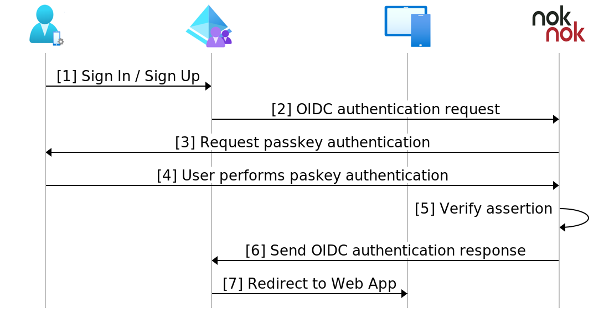

# Tutorial: Configure Nok Nok Passport with Azure Active Directory B2C for passwordless FIDO2 authentication

Learn to integrate the Nok Nok S3 Authentication Suite into your Azure Active Directory B2C (Azure AD B2C) tenant. Nok Nok solutions enable FIDO certified multi-factor authentication such as FIDO UAF, FIDO U2F, WebAuthn, and FIDO2 for mobile and web applications. Nok Nok solutions improve security posture while balancing user experience.

To to noknok.com to learn more: [Nok Nok Labs, Inc.](https://noknok.com/)

## Prerequisites

To get started, you need:

* An Azure subscription
  * If you don't have one, get a [Azure free account](https://azure.microsoft.com/free/)
* An Azure AD B2C tenant linked to the Azure subscription
  * [Tutorial: Create an Azure Active Directory B2C tenant](tutorial-create-tenant.md) 
* Go to [noknok.com](https://noknok.com/). On the top menu, select **Demo**.

## Scenario description

To enable passwordless FIDO authentication for your users, enable Nok Nok as an identity provider (IdP) in your Azure AD B2C tenant. Nok Nok solution integration includes the following components:

* **Azure AD B2C** – authorization server that verifies user credentials
* **Web and mobile applications** – mobile or web apps to protect with Nok Nok solutions and Azure AD B2C
* **Nok Nok app SDK or Passport app** – authenticate Azure AD B2C enabled applications. 
  * Go to the Apple App Store for [Nok Nok Passport](https://apps.apple.com/us/app/nok-nok-passport/id1050437340)
  * Or, Google Play [Nok Nok Passport](https://play.google.com/store/apps/details?id=com.noknok.android.passport2&hl=en&gl=US)

The following diagram illustrates the Nok Nok solution as IdP for Azure AD B2C using OpenID Connect (OIDC) for passwordless authentication.

   

1. At the sign-in page, user selects sign-in or sign-up and enters the username.
2. Azure AD B2C redirects user to the Nok Nok OIDC authentication provider.
3. For mobile authentications, a QR code appears or push notification goes to the user device. For desktop sign-in, the user is redirected to the web app sign-in page for passwordless authentication.
4. User scans the QR code with Nok Nok app SDK or Passport app. Or, username is sign-in page input.
5. User is prompted for authentication. User does passwordless authentication: biometrics, device PIN, or any roaming authenticator. Authentication prompt appears on web application. User does passwordless authentication: biometrics, device PIN, or any roaming authenticator. 
6. Nok Nok server validates FIDO assertion and sends OIDC authentication response to Azure AD B2C.
7. User is granted or denied access.

## Get started with Nok Nok

1. Go to the noknok.com [Contact](https://noknok.com/contact/) page. 
2. Fill out the form for a Nok Nok tenant. 
3. An email arrives with tenant access information and links to documentation. 
4. Use the Nok Nok integration documentation to complete the tenant OIDC configuration.

## Integrate with Azure AD B2C

Use the following instructions to add and configure an IdP then configure a user flow.

### Add a new Identity provider

For the following instructions, use the directory with the Azure AD B2C tenant. To add a new IdP:

1. Sign in to the **[Azure portal](https://portal.azure.com/#home)** as Global Administrator of the Azure AD B2C tenant.
2. In the portal toolbar, select the **Directories + subscriptions**.
3. On **Portal settings, Directories + subscriptions**, in the **Directory name** list, locate the Azure AD B2C directory.
4. Select **Switch**.
5. In the top-left corner of the Azure portal, select **All services**.
6. Search for and select **Azure AD B2C**.
7. Navigate to **Dashboard** > **Azure Active Directory B2C** > **Identity providers**.
8. Select **Identity providers**.
9. Select **Add**.

### Configure an Identity provider 

To configure an IdP:

1. Select **Identity provider type** > **OpenID Connect (Preview)**.
2. For **Name**, enter Nok Nok Authentication Provider, or another name.
3. For **Metadata URL**, enter hosted Nok Nok Authentication app URI, followed by the path such as `https://demo.noknok.com/mytenant/oidc/.well-known/openid-configuration`
4. For **Client Secret**, use the Client Secret from Nok Nok.
5. For **Client ID**, use the client ID provided by Nok Nok.
6. For **Scope**, use **OpenID profile email**.
7. For **Response type**, use **code**.
8. For **Response mode**, use **form_post**.
9. Select **OK**.
10. Select **Map this identity provider’s claims**.
11. For **UserID**, select **From subscription**.
12. For **Display name**, select **From subscription**.
13. For **Response mode**, select **From subscription**. 
14. Select **Save**.

### Create a user flow policy

For the following instructions, Nok Nok is a new OIDC IdP in the B2C identity providers list.

1. In your Azure AD B2C tenant, under **Policies**, select **User flows**.
2. Select **New**.
3. Select **Sign up and sign in**.
4. Select a **version**.
5. Select **Create**.
6. Enter a policy **Name**.
7. In **Identity providers**, select the created Nok Nok IdP.
8. You can add an email address. Azure won't redirect sign-in to Nok Nok; a screen appears with user options.
9. Leave the **Multi-factor Authentication** field.
10. Select **Enforce conditional access policies**.
11. Under **User attributes and token claims**, in the Collect attribute option, select **Email Address**. 
12. Add user attributes for Microsoft Entra ID to collect, with claims that Azure AD B2C returns to the client application.
13. Select **Create**.
14. Select the new **User flow**.
15. On the left panel, select **Application Claims**. 
16. Under options, select the **email** checkbox
17. Select **Save**.

## Test the user flow

1. Open the Azure AD B2C tenant and under **Policies** select **Identity Experience Framework**.
2. Select the created **SignUpSignIn**.
3. Select **Run user flow**.
4. For **Application**, select the registered app. The example is JWT.
5. For **Reply URL**, select the redirect URL.
6. Select **Run user flow**.
7. Perform a sign-up flow and create an account.
8. After the user attribute is created, Nok Nok is called.

If the flow is incomplete, confirm the user is or isn't saved in the directory.

## Next steps

* [Azure AD B2C custom policy overview](./custom-policy-overview.md)
* [Tutorial: Create user flows and custom policies in Azure Active Directory B2C](tutorial-create-user-flows.md?pivots=b2c-custom-policy)
