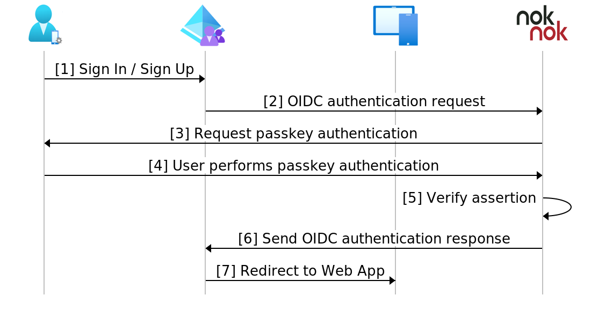

# Tutorial: Configure Nok Nok S3 Authentication Suite with Azure AD B2C for FIDO passkey authentication

In this article, you learn to integrate the Nok Nok S3 Authentication Suite into your Azure Active Directory (AD) B2C tenant. The Nok Nok solution enables FIDO-certified multifactor authentication, such as FIDO Universal Authentication Framework (UAF), FIDO Universal Second Factor (U2F), WebAuthn, and FIDO2, for mobile and web applications. The Nok Nok solution strengthens your security while maintaining an optimal user experience.

Learn more at [Nok Nok](https://noknok.com/).

## Prerequisites

To get started, you need:

* An Azure subscription. If you don't have one, get an [Azure free account](https://azure.microsoft.com/free/).
* An Azure AD B2C tenant linked to the Azure subscription. Learn how to [Create an Azure AD B2C tenant](tutorial-create-tenant.md).
* A Nok Nok Cloud evaluation tenant for FIDO registration and authentication.

## Scenario description

To enable passkey authentication for your users, enable Nok Nok as an identity provider (IdP) in your Azure AD B2C tenant. The Nok Nok integration includes the following components:

* **Azure AD B2C** – authorization server that verifies user credentials.
* **Web and mobile applications** – mobile or web apps to protect with Nok Nok solutions and Azure AD B2C.
* **Nok Nok tutorial web app** – application to register the passkey on your device.
* **Nok Nok sign-in app** – application for authenticating Azure AD B2C applications with passkey.

The following diagram illustrates the Nok Nok solution as an IdP for Azure AD B2C by using OpenID Connect (OIDC) for passkey authentication.

### Scenario 1: Passkey registration
1. The user navigates to the Nok Nok tutorial web app using the link provided by Nok Nok.
2. The user enters their Azure AD B2C username and default tutorial app password.
3. The user receives a prompt to register the passkey.
4. The Nok Nok server validates the passkey credential and confirms successful passkey registration to the user.
5. The passkey on the user's device is ready for authentication.

### Scenario 2: Passkey authentication
1. The user selects the sign-in with Nok Nok Cloud button on the Azure AD B2C sign-in page.
2. Azure AD B2C redirects the user to the Nok Nok sign-in app.
3. The user authenticates with their passkey.
4. The Nok Nok server validates the passkey assertion and sends an OIDC authentication response to Azure AD B2C.
5. Based on the authentication result, Azure AD B2C either grants or denies access to the target application.

## Get started with Nok Nok

1. [Contact Nok Nok](https://noknok.com/contact/).
2. Fill out the form for a Nok Nok tenant.
3. An email arrives with tenant access information and links to documentation.
4. Use the Nok Nok integration documentation to complete the tenant OIDC configuration.

## Integrate with Azure AD B2C

Use the following instructions to add and configure an IdP, and then configure a user flow.

### Add a new identity provider

For the following instructions, use the directory with the Azure AD B2C tenant. To add a new IdP:

1. Sign in to the [Azure portal](https://portal.azure.com/#home) as at least as the B2C Identity Experience Framework (IEF) Policy Administrator of the Azure AD B2C tenant.
2. In the portal toolbar, select **Directories + subscriptions**.
3. On **Portal settings, Directories + subscriptions**, in the **Directory name** list, locate the Azure AD B2C directory.
4. Select **Switch**.
5. In the top-left corner of the Azure portal, select **All services**.
6. Search for and select **Azure AD B2C**.
7. Navigate to **Dashboard** > **Azure Active Directory B2C** > **Identity providers**.
8. Select **Identity providers**.
9. Select **Add**.

### Configure an identity provider

To configure an IdP:

1. Select **Identity provider type** > **OpenID Connect (Preview)**.
2. For **Name**, enter the Nok Nok Authentication Provider or another name.
3. For **Metadata URL**, enter the following URL after replacing the placeholder with the tenant ID that Nok Nok provides: `https://cloud.noknok.com/<tenant_id>/webapps/nnlfed/realms/<tenant_id>/.well-known/openid-configuration`.
4. For **Client Secret**, use the Client Secret from Nok Nok.
5. For **Client ID**, use the Client ID provided by Nok Nok.
6. For **Scope**, use **openid**.
7. For **Response type**, use **code**.
8. For **Response mode**, use **form_post**.
9. For **User ID**, use **sub**.
10. For **Display name**, use **sub**.
11. Select **Save**.

### Create a user flow policy

For the following instructions, Nok Nok is a new OIDC IdP in the B2C identity providers list.

1. In your Azure AD B2C tenant, under **Policies**, select **User flows**.
2. Select **New**.
3. Select **Sign up and sign in**.
4. Select a **Version**.
5. Select **Create**.
6. Enter a policy **Name**.
7. In **Identity providers**, select the created Nok Nok IdP.
8. Check **Email signup** under **Local accounts** to display an intermediate Azure AD B2C signin/signup page with a button that redirects the user to the Nok Nok sign-in app.
9. Leave the **Multi-factor Authentication** field.
10. Select **Create** to save.

## Test the user flow

1. Open the Azure AD B2C tenant. Under **Policies**, select **Identity Experience Framework**.
2. Select the created **SignUpSignIn**.
3. Select **Run user flow**.
4. For **Application**, select the registered app. The example is JSON Web Token (JWT).
5. For **Reply URL**, select the redirect URL of the application that you selected at the previous step.
6. Select **Run user flow**.
7. Perform sign-in using the Azure AD B2C username and the passkey that you previously registered for the same user.
8. Verify that you received the token after authentication.

If the flow is incomplete, confirm the user is or isn't saved in the directory.

## Next steps

* [Azure AD B2C custom policy overview](./custom-policy-overview.md)
* [Tutorial: Create user flows and custom policies in Azure Active Directory B2C](tutorial-create-user-flows.md?pivots=b2c-custom-policy)
