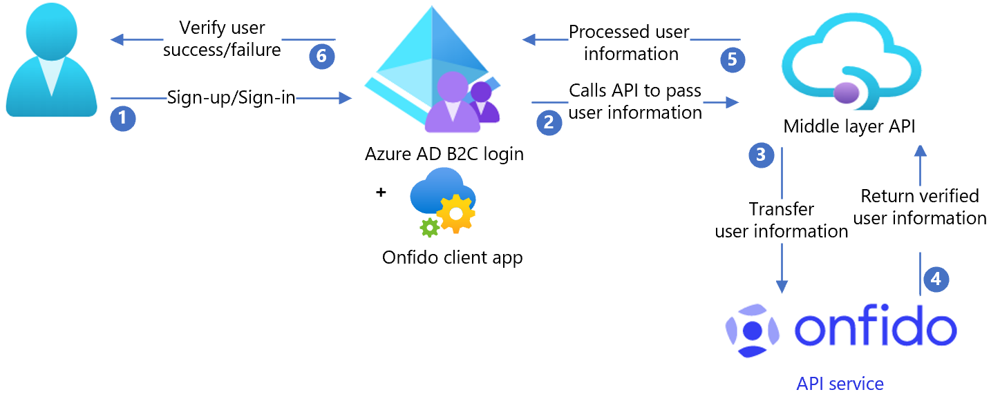

# Tutorial for configuring Onfido with Azure Active Directory B2C

In this tutorial, learn how to integrate Azure Active Directory B2C (Azure AD B2C) with [Onfido](https://onfido.com/), a document ID and facial biometrics verification app. Use it to meet *Know Your Customer* and identity requirements. Onfido uses artificial intelligence (AI) technology that verifies identity by matching a photo ID with facial biometrics. The solution connects a digital identity to a person, provides a reliable onboarding experience, and helps reduce fraud.

In this tutorial, you'll enable the Onfido service to verify identity in the sign-up, or sign-in, flow. Onfido results inform decisions about which products or services the user accesses.

## Prerequisites

To get started, you'll need:

* An Azure subscription

  - If you don't have on, you can get an [Azure free account](https://azure.microsoft.com/free/)
- [An Azure AD B2C tenant](./tutorial-create-tenant.md) linked to your Azure subscription
- An Onfido trial account
  - Go to onfido.com [Contact us](https://onfido.com/signup/) and fill out the form

## Scenario description

The Onfido integration includes the following components:

- **Azure AD B2C tenant** – The authorization server that verifies user credentials based on custom policies defined in the tenant. It's also known as the identity provider (IdP). It hosts the Onfido client app, which collects the user documents and transmits them to the Onfido API service.
- **Onfido client** – A configurable, JavaScript client document-collection utility deployed in webpages. It checks details such as document size and quality.
- **Intermediate REST API** – Provides endpoints for the Azure AD B2C tenant to communicate with the Onfido API service. It handles data processing and adheres to security requirements of both.
- **Onfido API service** – The back-end service, which saves and verifies user documents.

The following architecture diagram shows the implementation.

   

1. User signs up to create a new account and enters attributes. Azure AD B2C collects the attributes. Onfido client app hosted in Azure AD B2C checks for the user information.
2. Azure AD B2C calls the middle layer API and passes the attributes.
3. Middle layer API collects attributes and converts them to an Onfido API format.
4. Onfido processes attributes to validate user identification and sends result to the middle layer API.
5. Middle layer API processes the results and sends relevant information to Azure AD B2C, in JavaScript Object Notation (JSON) format.
6. Azure AD B2C receives the information. If the response fails, an error message appears. If the response succeeds, the user is authenticated and written into the directory.

## Create an Onfido account

1. Create an Onfido account: go to onfido.com [Contact us](https://onfido.com/signup/) and fill out the form.
2. Create an API key: go to [Get started (API v3.5)](https://documentation.onfido.com/). 

>[!NOTE]
> You'll need the key later.

### Onfido documentation

Live keys are billable, however, you can use the sandbox keys for testing. Go to onfido.com for, [Sandbox and live differences](https://documentation.onfido.com/?javascript#sandbox-and-live-differences). The sandbox keys produce the same result structure as live keys, however, results are predetermined. Documents aren't processed or saved.

For more Onfido documentation, see:

* [Onfido API documentation](https://documentation.onfido.com)
* [Onfido Developer Hub](https://developers.onfido.com)

## Configure Azure AD B2C with Onfido

### Deploy the API

1. Deploy the API code to an Azure service. Go to [samples/OnFido-Combined/API/Onfido.Api/](https://github.com/azure-ad-b2c/partner-integrations/tree/master/samples/OnFido-Combined/API/Onfido.Api). You can publish the code from Visual Studio.
2. Set up cross-origin resource sharing (CORS).
3. Add **Allowed Origin** as `https://{your_tenant_name}.b2clogin.com`.

>[!NOTE]
>You'll need the deployed service URL to configure Microsoft Entra ID.

#### Adding sensitive configuration settings

[Configure app settings](../app-service/configure-common.md#configure-app-settings) in the Azure App service without checking them into a repository. 

REST API settings:

* **Application setting name**: OnfidoSettings:AuthToken
* **Source**: Onfido Account

### Deploy the UI

#### Configure your storage location

1. In the Azure portal, [create a container](../storage/blobs/storage-quickstart-blobs-portal.md#create-a-container).
2. Store the UI files in [/samples/OnFido-Combined/UI](https://github.com/azure-ad-b2c/partner-integrations/tree/master/samples/OnFido-Combined/UI), in your blob container.
3. Allow CORS access to the storage container you created: Go to **Settings** >**Allowed Origin**.
4. Enter `https://{your_tenant_name}.b2clogin.com`. 
5. Replace your tenant name with your Azure AD B2C tenant name, using lower-case letters. For example, `https://fabrikam.b2clogin.com`. 
6. For **Allowed Methods**, select `GET` and `PUT`.
7. Select **Save**.

#### Update UI files

1. In the UI files, go to [samples/OnFido-Combined/UI/ocean_blue](https://github.com/azure-ad-b2c/partner-integrations/tree/master/samples/OnFido-Combined/UI/ocean_blue).
2. Open each html file.
3. Find `{your-ui-blob-container-url}`, and replace it with your UI **ocean_blue**, **dist**, and **assets** folder URLs.
4. Find `{your-intermediate-api-url}`, and replace it with the intermediate API app service URL.

#### Upload your files

1. Store the UI folder files in your blob container.
2. [Use Azure Storage Explorer to manage Azure managed disks](../virtual-machines/disks-use-storage-explorer-managed-disks.md) and access permissions.

### Configure Azure AD B2C

#### Replace the configuration values

In [/samples/OnFido-Combined/Policies](https://github.com/azure-ad-b2c/partner-integrations/tree/master/samples/OnFido-Combined/Policies), find the following placeholders and replace them with the corresponding values from your instance.

|Placeholder|Replace with value|Example|
|---|---|---|
|{your_tenant_name}|Your tenant short name|"your tenant" from yourtenant.onmicrosoft.com|
|{your_tenantID}|Your Azure AD B2C TenantID| 01234567-89ab-cdef-0123-456789abcdef|
|{your_tenant_IdentityExperienceFramework_appid}|IdentityExperienceFramework app App ID configured in your Azure AD B2C tenant|01234567-89ab-cdef-0123-456789abcdef|
|{your_tenant_ ProxyIdentityExperienceFramework_appid}|ProxyIdentityExperienceFramework app App ID configured in your Azure AD B2C tenant| 01234567-89ab-cdef-0123-456789abcdef|
|{your_tenant_extensions_appid}|Your tenant storage application App ID| 01234567-89ab-cdef-0123-456789abcdef|
|{your_tenant_extensions_app_objectid}|Your tenant storage application Object ID| 01234567-89ab-cdef-0123-456789abcdef|
|{your_app_insights_instrumentation_key}|Your app insights instance* instrumentation key|01234567-89ab-cdef-0123-456789abcdef|
|{your_ui_file_base_url}|Location URL of your UI folders **ocean_blue**, **dist**, and **assets**| `https://yourstorage.blob.core.windows.net/UI/`|
|{your_app_service_URL}|The app service URL you set up|`https://yourapp.azurewebsites.net`|

*App insights can be in a different tenant. This step is optional. Remove the corresponding TechnicalProfiles and OrchestrationSteps, if they're not needed.

### Configure Azure AD B2C policy

See, [Custom policy starter pack](tutorial-create-user-flows.md?pivots=b2c-custom-policy#custom-policy-starter-pack) for instructions to set up your Azure AD B2C tenant and configure policies. Custom policies are a set of XML files you upload to your Azure AD B2C tenant to define technical profiles and user journeys.

>[!NOTE]
>We recommend you add consent notification on the attribute collection page. Notify users that information goes to third-party services for identity verification.

## Test the user flow

1. Open the Azure AD B2C tenant.
2. Under **Policies** select **Identity Experience Framework**.
3. Select your previously created **SignUpSignIn**.
4. Select **Run user flow**.
5. For **Application**, select the registered app (example is JWT).
6. For **Reply URL**, select the **redirect URL**.
7. Select **Run user flow**.
8. Complete the sign-up flow.
9. Create an account.
10. When the user attribute is created, Onfido is called during the flow. 

>[!NOTE]
>If the flow is incomplete, confirm the user is saved in the directory.

## Next steps

- [Custom policies in Azure AD B2C](./custom-policy-overview.md)
- [Get started with custom policies in Azure AD B2C](tutorial-create-user-flows.md?pivots=b2c-custom-policy)
