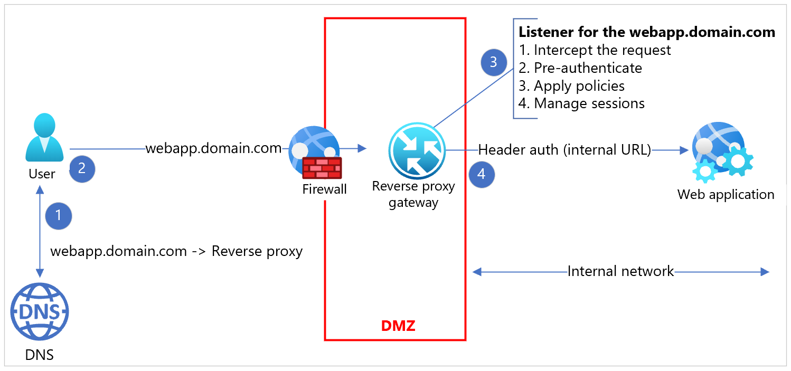
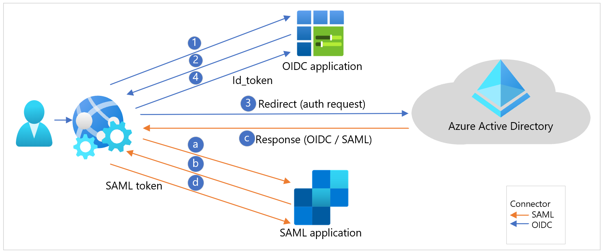
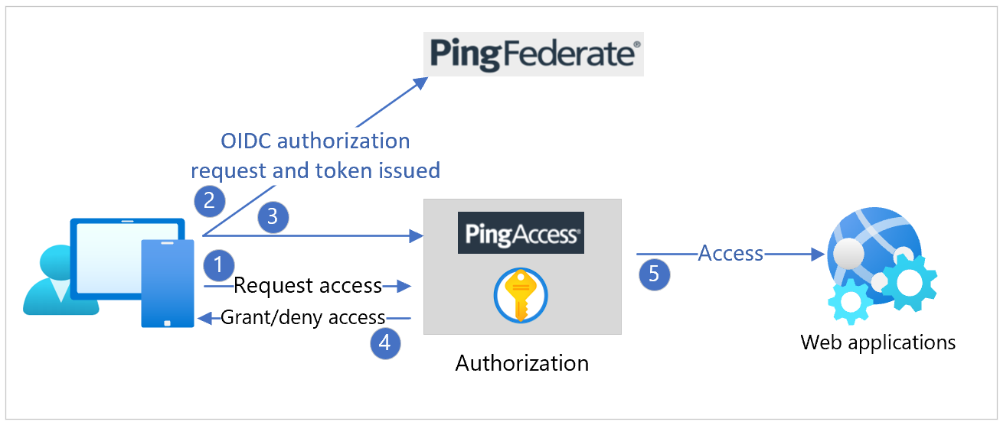
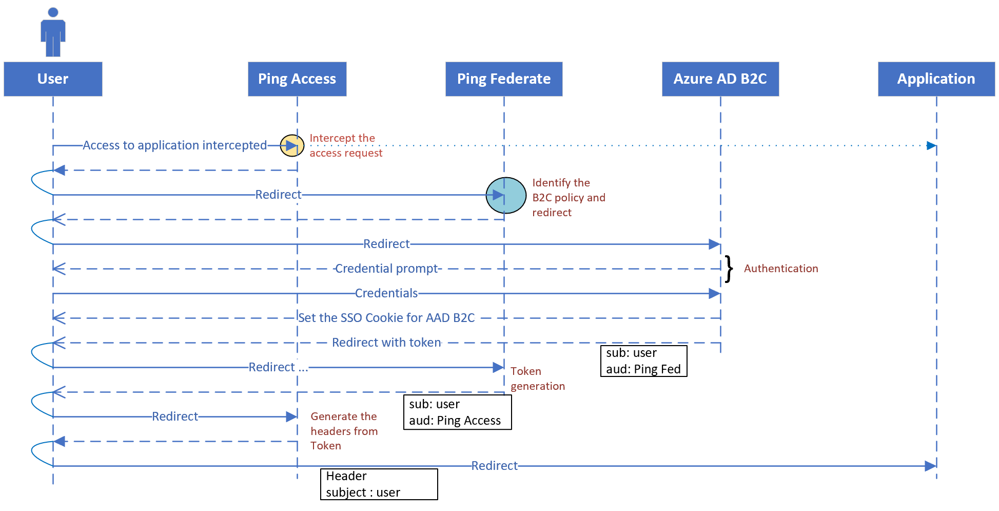
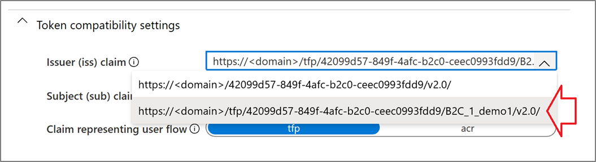
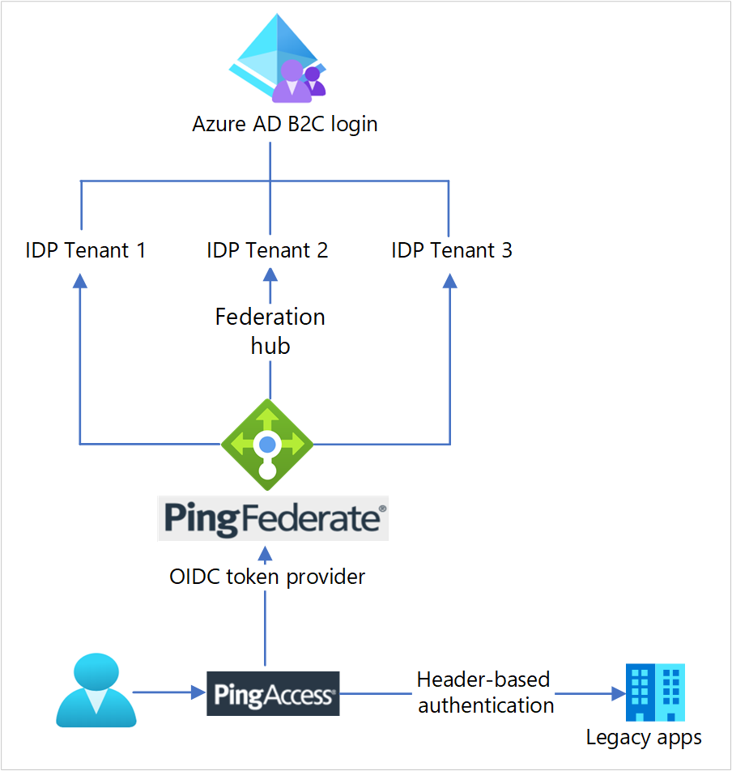

# Tutorial: Configure Ping Identity with Azure Active Directory B2C for secure hybrid access

In this tutorial, learn how to extend the capabilities of Azure Active Directory B2C (Azure AD B2C) with [PingAccess](https://www.pingidentity.com/en/platform/capabilities/web-api-access/pingaccess.html) and [PingFederate](https://www.pingidentity.com/en/platform/capabilities/authentication-authority/pingfederate.html). PingAccess provides access to applications and APIs, and a policy engine for authorized user access. PingFederate is an enterprise federation server for user authentication and single sign-on, an authority that permits customers, employees, and partners to access applications from devices. Use them together to enable secure hybrid access (SHA).

Many e-commerce sites and web applications exposed to the internet are deployed behind proxy systems, or a reverse-proxy system. These proxy systems pre-authenticate, enforce policy, and route traffic. Typical scenarios include protecting web applications from inbound web traffic and providing a uniform session management across distributed server deployments.

Generally, configurations include an authentication translation layer that externalizes the authentication from the web application. Reverse proxies provide the authenticated user context to the web applications, such as a header value in clear or digest form. The applications aren't using industry standard tokens such as Security Assertion Markup Language (SAML), OAuth, or OpenID Connect (OIDC). Instead, the proxy provides authentication context and maintains the session with the end-user agent such as browser or native application. As a service running as a man-in-the-middle, proxies provide significant session control. The proxy service is efficient and scalable, not a bottleneck for applications behind the proxy service. The diagram is a reverse-proxy implementation and communications flow.

   

## Modernization

If you want to modernize an identity platform in such configurations, there might be customer concerns:

- Decouple the effort to modernize applications from modernizing an identity platform
- Environments with modern and legacy authentication, consuming from the modernized identity service provider
  - Drive the end-user experience consistency
  - Provide a single sign-in experience across applications

In answer to these concerns, the approach in this tutorial is an Azure AD B2C, [PingAccess](https://www.pingidentity.com/en/platform/capabilities/web-api-access/pingaccess.html), and [PingFederate](https://www.pingidentity.com/en/platform/capabilities/authentication-authority/pingfederate.html) integration.

## Shared environment

A technically viable, and cost-effective, solution is to configure the reverse proxy system to use the modernized identity system, delegating authentication.  
Proxies support the modern authentication protocols and use the redirect-based (passive) authentication that sends users to the new identity provider (IdP).

### Azure AD B2C as an identity provider

In Azure AD B2C, you define policies that drive user experiences and behaviors, also called user journeys. Each such policy exposes a protocol endpoint that can perform the authentication as an IdP. On the application side, there's no special handling required for certain policies. An application makes a standard authentication request to the protocol-specific authentication endpoint exposed by a policy.  
You can configure Azure AD B2C to share the same issuer across policies or unique issuer for each policy. Each application can point to policies by making a protocol-native authentication request, which drives user behaviors such as sign-in, sign-up, and profile edits. The diagram shows OIDC and SAML application workflows.

  

The scenario can be challenging for the legacy applications to redirect the user accurately. The access request to the applications might not include the user experience context. In most cases, the proxy layer, or an integrated agent on the web application, intercepts the access request.

### PingAccess reverse proxy

You can deploy PingAccess as the reverse proxy. PingAccess intercepts a direct request by being the man-in-the-middle, or as a redirect from an agent running on the web application server.

Configure PingAccess with OIDC, OAuth2, or SAML for authentication with an upstream authentication provider. You can configure an upstream IdP for this purpose on the PingAccess server. See the following diagram.

   

In a typical Azure AD B2C deployment with policies exposing IdPs, there's a challenge. PingAccess is configured with one, upstream IdP.  

### PingFederate federation proxy

You can configure PingFederate as an authentication provider, or a proxy, for upstream IdPs. See the following diagram.

   

Use this function to contextually, dynamically, or declaratively switch an inbound request to an Azure AD B2C policy. See the following diagram of protocol sequence flow.

   

## Prerequisites

To get started, you'll need:

- An Azure subscription
  - If you don't have one, get an [Azure free account](https://azure.microsoft.com/free/)
- An [Azure AD B2C tenant](tutorial-create-tenant.md) linked to your Azure subscription
- PingAccess and PingFederate deployed in Docker containers or on Azure virtual machines (VMs)

## Connectivity and communication

Confirm the following connectivity and communication.

- **PingAccess server** – Communicates with the PingFederate server, client browser, OIDC, OAuth well-known and keys discovery published by the Azure AD B2C service and PingFederate server
- **PingFederate server** – Communicates with the PingAccess server, client browser, OIDC, OAuth well-known and keys discovery published by the Azure AD B2C service
- **Legacy or header-based AuthN application** – Communicates to and from PingAccess server
- **SAML relying party application** – Reaches the browser traffic from the client. Accesses the SAML federation metadata published by the Azure AD B2C service.
- **Modern application** – Reaches the browser traffic from the client. Accesses the OIDC, OAuth well-known, and keys discovery published by the Azure AD B2C service.
- **REST API** – Reaches the traffic from a native or web client. Accesses the OIDC, OAuth well-known, and keys discovery published by the Azure AD B2C service

## Configure Azure AD B2C

You can use basic user flows or advanced Identity Enterprise Framework (IEF) policies. PingAccess generates the metadata endpoint, based on the issuer value, by using the [WebFinger](https://tools.ietf.org/html/rfc7033) protocol for discovery convention. To follow this convention, update the Azure AD B2C issuer using user-flow policy properties.

   

In the advanced policies, configuration includes the IssuanceClaimPattern metadata element to AuthorityWithTfp value in the [JWT token issuer technical profile](./jwt-issuer-technical-profile.md).

## Configure PingAccess and PingFederate

Use the instructions in the following sections to configure PingAccess and PingFederate. See the following diagram of the overall integration user flow.

   

### Configure PingFederate as the token provider

To configure PingFederate as the token provider for PingAccess, ensure connectivity from PingFederate to PingAccess. Confirm connectivity from PingAccess to PingFederate.  

For more information, see [Configure PingFederate as the token provider for PingAccess](https://docs.pingidentity.com/access/sources/dita/topic?category=pingaccess&Releasestatus_ce=Current&resourceid=pa_configure_pf_as_the_token_provider_for_pa) in the Ping Identity documentation.

### Configure a PingAccess application for header-based authentication

Use the following instructions to create a PingAccess application for the target web application, for header-based authentication. 

#### Create a virtual host

>[!IMPORTANT]
>Create a virtual host for every application. For more information, see [What can I configure with PingAccess?](https://docs.pingidentity.com/access/sources/dita/topic?category=pingaccess&Releasestatus_ce=Current&resourceid=pa_what_can_I_configure_with_pa) in the Ping Identity documentation.

To create a virtual host:

1. Go to **Settings** > **Access** > **Virtual Hosts**.
2. Select **Add Virtual Host**.
3. For **Host**, enter the FQDN portion of the Application URL.
4. For **Port**, enter **443**.
5. Select **Save**.

#### Create a web session

To create a web session:

1. Navigate to **Settings** > **Access** > **Web Sessions**.
2. Select **Add Web Session**.
3. Enter a **Name** for the web session.
4. Select the **Cookie Type**: **Signed JWT** or **Encrypted JWT**.
5. Enter a unique value for **Audience**.
6. For **Client ID**, enter the **Microsoft Entra Application ID**.
7. For **Client Secret**, enter the **Key** you generated for the application in Microsoft Entra ID.
8. (Optional) Create and use custom claims with the Microsoft Graph API: Select **Advanced**. Deselect **Request Profile** and **Refresh User Attributes**. Learn more about custom claims: [Header-based single sign-on for on-premises apps with Microsoft Entra application proxy](../active-directory/app-proxy/application-proxy-configure-single-sign-on-with-headers.md).
9. Select **Save**

#### Create identity mapping

>[!NOTE]
>You can use identity mapping with more than one application, if they're expecting the same data in the header.

To create identity mapping:

1. Go to **Settings** > **Access** > **Identity Mappings**.
2. Select **Add Identity Mapping**.
3. Specify a **Name*. 
4. Select the identity-mapping **Type of Header Identity Mapping**.
5. In the **Attribute-Mapping** table, specify the required mappings. For example,

  | Attribute name | Header name |
   |---|---|
   | 'upn' | x-userprincipalname |
   | 'email' | x-email |
   | 'oid' | x-oid |
   | 'scp' | x-scope |
   | 'amr' | x-amr |

6. Select **Save**

#### Create a site

>[!NOTE]
>In some configurations, a site can contain multiple applications. You can use a site with more than one application, when appropriate.

To create a site:

1. Go to **Main** > **Sites**.
2. Select **Add Site**.
3. Enter the site **Name**.
4. Enter the site **Target**. The target is the hostname:port pair for the server hosting the application. Don't enter the application path in this field. For example, an application at https://mysite:9999/AppName has a target value of mysite:9999.
5. Indicate if the target expects secure connections.
6. If the target expects secure connections, set the Trusted Certificate Group to **Trust Any**.
7. Select **Save**.

#### Create an application

To create an application in PingAccess for each application in Azure that you want to protect.

1. Go to **Main** > **Applications**

2. Select **Add Application**

3. Specify a **Name** for the application

4. Optionally, enter a **Description** for the application

5. Specify the **Context Root** for the application. For example, an application at https://mysite:9999/AppName will have a context root of /AppName. The context root must begin with a slash (/), must not end with a slash (/), and can be more than one layer deep, for example, /Apps/MyApp.

6. Select the **virtual host** you created

   >[!NOTE]
   >The combination of virtual host and context root must be unique in PingAccess.

7. Select the **web session** you created

8. Select the **Site** you created that contains the application

9. Select the **Identity Mapping** you created

10. Select **Enabled** to enable the site when you save

11. Select **Save**

### Configure the PingFederate authentication policy

Configure the PingFederate authentication policy to federate to the multiple IdPs provided by the Azure AD B2C tenants

1. Create a contract to bridge the attributes between the IdPs and the SP. You should need only one contract unless the SP requires a different set of attributes from each IdP. For more information, see [Federation hub and authentication policy contracts](https://docs.pingidentity.com/access/sources/dita/topic?category=pingfederate&Releasestatus_ce=Current&resourceid=pf_fed_hub_auth_polic_contract) in the Ping Identity documentation.

2. For each IdP, create an IdP connection between the IdP and PingFederate, the federation hub as the SP.

3. On the **Target Session Mapping** window, add the applicable authentication policy contracts to the IdP connection.

4. On the **Selectors** window, configure an authentication selector. For example, see an instance of the **Identifier First Adapter** to map each IdP to the corresponding IdP connection in an authentication policy.

5. Create an SP connection between PingFederate, the federation hub as the IdP, and the SP.

6. Add the corresponding authentication policy contract to the SP connection on the **Authentication Source Mapping** window.

7. Work with each IdP to connect to PingFederate, the federation hub as the SP.

8. Work with the SP to connect to PingFederate, the federation hub as the IdP.

## Next steps

For additional information, review the following articles

- [Custom policies in Azure AD B2C](./custom-policy-overview.md)

- [Get started with custom policies in Azure AD B2C](tutorial-create-user-flows.md?pivots=b2c-custom-policy)
