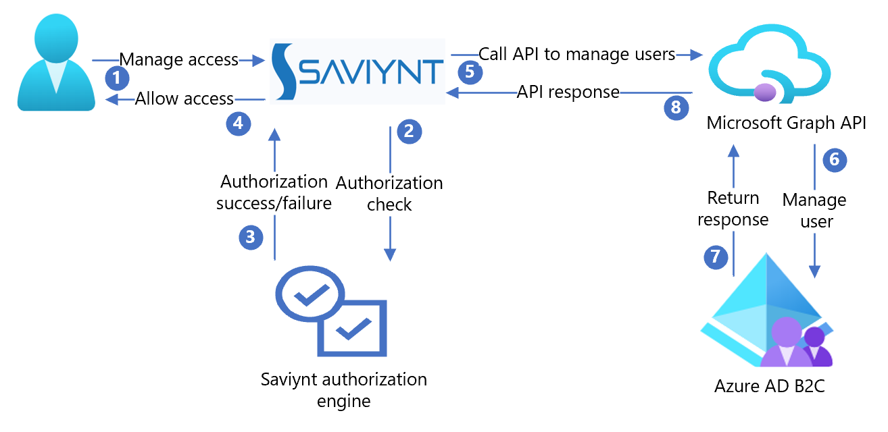

# Tutorial to configure Saviynt with Azure Active Directory B2C

Learn to integrate Azure Active Directory B2C (Azure AD B2C) with the Saviynt Security Manager platform, which has visibility, security, and governance. Saviynt incorporates application risk and governance, infrastructure management, privileged account management, and customer risk analysis.

Learn more: [Saviynt for Azure AD B2C](https://saviynt.com/integrations/old-version-azure-ad/for-b2c/)

Use the following instructions to set up access control delegated administration for Azure AD B2C users. Saviynt determines if a user is authorized to manage Azure AD B2C users with:

* Feature level security to determine if users can perform an operation
  * For example, create user, update user, reset user password, and so on
* Field level security to determine if users can read/write user attributes during user management operations 
  * For example, a Help Desk agent can update a phone number; other attributes are read-only
* Data level security to determine if users can perform an operation on another user
  * For example, a Help Desk administrator for the United Kingdom region manages UK users

## Prerequisites

To get started, you need:

* An Azure subscription

  * If you don't have on, get an [Azure free account](https://azure.microsoft.com/free/)
* An [Azure AD B2C tenant](./tutorial-create-tenant.md) linked to your Azure subscription
* Go to saviynt.com [Contact Us](https://saviynt.com/contact-us/) to request a demo

## Scenario description

The Saviynt integration includes the following components:

* **Azure AD B2C** – identity as a service for custom control of customer sign-up, sign-in, and profile management
  * See, [Azure AD B2C, Get started](https://azure.microsoft.com/services/active-directory/external-identities/b2c/) 
* **Saviynt for Azure AD B2C** – identity governance for delegated administration of user life-cycle management and access governance
  * See, [Saviynt for Azure AD B2C](https://saviynt.com/integrations/old-version-azure-ad/for-b2c/)
* **Microsoft Graph API** – interface for Saviynt to manage Azure AD B2C users and their access
  * See, [Use the Microsoft Graph API](/graph/use-the-api)
    

The following architecture diagram illustrates the implementation.

   

1. A delegated administrator starts the Azure AD B2C user operation with Saviynt.
2. Saviynt verifies the delegated administrator can perform the operation.
3. Saviynt sends an authorization success or failure response.
4. Saviynt allows the delegated administrator to perform the operation.
5. Saviynt invokes Microsoft Graph API, with user attributes, to manage the user in Azure AD B2C.
6. Microsoft Graph API creates, updates, or deletes the user in Azure AD B2C.
7. Azure AD B2C sends a success or failure response.
8. Microsoft Graph API returns the response to Saviynt.

## Create a Saviynt account and create delegated policies

1. Create a Saviynt account. To get started, go to saviynt.com [Contact Us](https://saviynt.com/contact-us/).
2. Create delegated administration policies.
3. Assign users the delegated administrator role.

## Configure Azure AD B2C with Saviynt

Use the following instructions to create an application, delete users, and more. 

<a name='create-an-azure-ad-application-for-saviynt'></a>

### Create a Microsoft Entra application for Saviynt

For the following instructions, use the directory with the Azure AD B2C tenant.

1. Sign in to the [Azure portal](https://portal.azure.com/#home).
2. In the portal toolbar, select **Directories + subscriptions**.
3. On the **Portal settings, Directories + subscriptions** page, in the **Directory name** list, find your Azure AD B2C directory.
4. Select **Switch**.
5. In the Azure portal, search and select **Azure AD B2C**.
6. Select **App registrations** > **New registration**.
7. Enter an application name. For example, Saviynt.
8. Select **Create**.
9. Go to **API Permissions**.
10. Select **+ Add a permission.**
11. The Request API permissions page appears. 
12. Select **Microsoft APIs** tab.
13. Select **Microsoft Graph** as commonly used Microsoft APIs.
14. Go to the next page.
15. Select **Application permissions**.
16. Select **Directory**.
17. Select the **Directory.Read.All** and **Directory.ReadWrite.All** checkboxes.
18. Select **Add Permissions**. 
19. Review the permissions.
20. Select **Grant admin consent for Default Directory**.
21. Select **Save**.
22. Go to **Certificates and Secrets**.
23. Select **+ Add Client Secret**. 
24. Enter the client secret description.
25. Select the expiry option.
26. Select **Add**.
27. The Secret Key appears in the Client Secret section. Save the Client Secret to use later.

1. Go to **Overview**.
2. Copy the **Client ID** and **Tenant ID**.

Save the Tenant ID, Client ID, and Client Secret to complete the setup.

### Enable Saviynt to delete users

Enable Saviynt to perform user delete operations in Azure AD B2C.

Learn more: [Application and service principal objects in Microsoft Entra ID](../active-directory/develop/app-objects-and-service-principals.md)

1. Install the latest version of the Microsoft Graph PowerShell module on a Windows workstation or server.

For more information, see [Microsoft Graph PowerShell documentation](/powershell/microsoftgraph/).

2. Connect to the PowerShell module and execute the following commands:

```powershell
Connect-MgGraph #Enter Admin credentials of the Azure portal
$webApp = Get-MgServicePrincipal –AppPrincipalId “<ClientId of Azure AD Application>”
New-MgDirectoryRoleMemberByRef -RoleName "Company Administrator" -RoleMemberType ServicePrincipal -RoleMemberObjectId $webApp.ObjectId
```

## Test the solution

Browse to your Saviynt application tenant and test user life-cycle management and access governance use cases.

## Next steps

* [Azure AD B2C custom policy overview](./custom-policy-overview.md)
* [Tutorial: Create user flows and custom policies in Azure AD B2C](tutorial-create-user-flows.md?pivots=b2c-custom-policy)
* [Add a web API application to your Azure Active Directory B2C tenant](./add-web-api-application.md)
