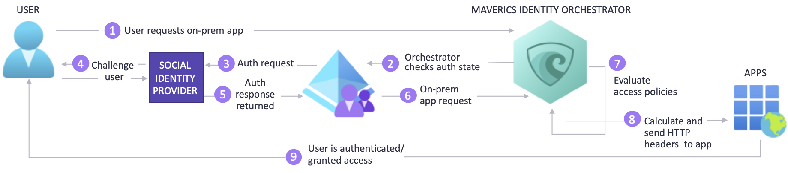

# Tutorial to configure Azure Active Directory B2C with Strata

In this tutorial, learn how to integrate Azure Active Directory B2C (Azure AD B2C) with Strata [Maverics Identity Orchestrator](https://www.strata.io/), which helps protect on-premises applications. It connects to identity systems, migrates users and credentials, synchronizes policies and configurations, and abstracts authentication and session management. Use Strata to transition from legacy, to Azure AD B2C, without rewriting applications. 

The solution has the following benefits:

- **Customer single sign-on (SSO) to on-premises hybrid apps** - Azure AD B2C supports customer SSO with Maverics Identity Orchestrator
  - Users sign in with accounts hosted in Azure AD B2C or identity provider (IdP)
  - Maverics proves SSO to apps historically secured by legacy identity systems like Symantec SiteMinder
- **Extend standards SSO to apps** - Use Azure AD B2C to manage user access and enable SSO with Maverics Identity Orchestrator Security Assertion Markup Language (SAML) or OpenID Connect (OIDC) connectors
- **Easy configuration** - Connect Maverics Identity Orchestrator SAML or OIDC connectors to Azure AD B2C

## Prerequisites

To get started, you'll need:

* An Azure subscription

  - If you don't have one, you can get an [Azure free account](https://azure.microsoft.com/free/)
- An [Azure AD B2C tenant](./tutorial-create-tenant.md) linked to your Azure subscription
- An instance of [Azure Key Vault](https://azure.microsoft.com/services/key-vault/) to store secrets used by Maverics Identity Orchestrator. Connect to Azure AD B2C or other attribute providers such as a Lightweight Directory Access Protocol (LDAP) directory or database.
- An instance of [Maverics Identity Orchestrator](https://www.strata.io/) running in an Azure virtual machine (VM), or an on-premises server. To get software and documentation, go to strata.io [Contact Strata Identity](https://www.strata.io/company/contact/).
- An on-premises application to transition to Azure AD B2C

## Scenario description

Maverics Identity Orchestrator integration includes the following components:

- **Azure AD B2C** - The authorization server that verifies user credentials
  - Authenticated users access on-premises apps using a local account in the Azure AD B2C directory
- **External social or enterprise identity provider (IdP)**: An OIDC provider, Facebook, Google, or GitHub
  - See, [Add an identity provider to your Azure Active Directory B2C tenant](./add-identity-provider.md)
- **Strata Maverics Identity Orchestrator**: The user sign-on service that passes identity to apps through HTTP headers

The following architecture diagram shows the implementation.

   

1. The user requests access the on-premises hosted application. Maverics Identity Orchestrator proxies the request to the application.
2. Orchestrator checks the user authentication state. If there's no session token, or the token is invalid, the user goes to Azure AD B2C for authentication
3. Azure AD B2C sends the authentication request to the configured social IdP.
4. The IdP challenges the user for credential. Multi-factor authentication (MFA) might be required.
5. The IdP sends the authentication response to Azure AD B2C. The user can create a local account in the Azure AD B2C directory.
6. Azure AD B2C sends the user request to the endpoint specified during the Orchestrator app registration in the Azure AD B2C tenant.
7. The Orchestrator evaluates access policies and attribute values for HTTP headers forwarded to the app. Orchestrator might call to other attribute providers to retrieve information to set the header values. The Orchestrator sends the request to the app.
8. The user is authenticated and has access to the app.

## Maverics Identity Orchestrator

To get software and documentation, go to strata.io [Contact Strata Identity](https://www.strata.io/company/contact/). Determine Orchestrator prerequisites. Install and configure.

## Configure your Azure AD B2C tenant

During the following instructions, document: 

* Tenant name and identifier
* Client ID
* Client secret
* Configured claims
* Redirect URI

1. [Register a web application in Azure Active Directory B2C](./tutorial-register-applications.md?tabs=app-reg-ga) in Azure AD B2C tenant.
2. Grant Microsoft MS Graph API permissions to your applications. Use permissions: `offline_access`, `openid`.
3. Add a redirect URI that matches the `oauthRedirectURL` parameter of the Orchestrator Azure AD B2C connector configuration, for example, `https://example.com/oidc-endpoint`.
4. [Create user flows and custom policies in Azure Active Directory B2C](./tutorial-create-user-flows.md).
5. [Add an identity provider to your Azure Active Directory B2C tenant](./add-identity-provider.md). Sign in your user with a local account, a social, or enterprise.
6. Define the attributes to be collected during sign-up.
7. Specify attributes to be returned to the application with your Orchestrator instance. 

> [!NOTE]
> The Orchestrator consumes attributes from claims returned by Azure AD B2C and can retrieve attributes from connected identity systems such as LDAP directories and databases. Those attributes are in HTTP headers and sent to the upstream on-premises application.

## Configure Maverics Identity Orchestrator

Use the instructions in the following sections to configure an Orchestrator instance.

### Maverics Identity Orchestrator server requirements

You can run your Orchestrator instance on any server, whether on-premises or in a public cloud infrastructure by provider such as Azure, AWS, or GCP.

- **Operating System**: REHL 7.7 or higher, CentOS 7+
- **Disk**: 10 GB (small)
- **Memory**: 16 GB
- **Ports**: 22 (SSH/SCP), 443, 80
- **Root access**: For install/administrative tasks
- **Maverics Identity Orchestrator**: Runs as user `maverics` under `systemd`
- **Network egress**: From the server hosting Maverics Identity Orchestrator that can reach your Microsoft Entra tenant

### Install Maverics Identity Orchestrator

1. Obtain the latest Maverics RPM package. 
2. Place the package on the system you'd like to install Maverics. If you're copying to a remote host, use SSH [scp](https://www.ssh.com/academy/ssh/scp).
3. Run the following command. Use your filename to replace `maverics.rpm`.

   `sudo rpm -Uvf maverics.rpm`

   By default, Maverics is in the `/usr/local/bin` directory.

4. Maverics runs as a service under `systemd`.  
5. To verify Maverics service is running, run the following command:

   `sudo service maverics status`

6. The following message (or similar) appears.

```
Redirecting to /bin/systemctl status maverics.service
  maverics.service - Maverics
  Loaded: loaded (/etc/systemd/system/maverics.service; enabled; vendor preset: disabled)
  Active: active (running) since Thu 2020-08-13 16:48:01 UTC; 24h ago
  Main PID: 330772 (maverics)
  Tasks: 5 (limit: 11389)
  Memory: 14.0M
  CGroup: /system.slice/maverics.service
          └─330772 /usr/local/bin/maverics --config /etc/maverics/maverics.yaml
  ```

> [!NOTE]
> If Maverics fails to start, execute the following command:

   `journalctl --unit=maverics.service --reverse`

   The most recent log entry appears in the output.

7. The default `maverics.yaml` file is created in the `/etc/maverics` directory.
8. Configure your Orchestrator to protect the application. 
9. Integrate with Azure AD B2C, and store.
10. Retrieve secrets from [Azure Key Vault](https://azure.microsoft.com/services/key-vault/?OCID=AID2100131_SEM_bf7bdd52c7b91367064882c1ce4d83a9:G:s&ef_id=bf7bdd52c7b91367064882c1ce4d83a9:G:s&msclkid=bf7bdd52c7b91367064882c1ce4d83a9). 
11. Define the location from where the Orchestrator reads its configuration.

### Supply configuration using environment variables

Configure your Orchestrator instances with environment variables.

`MAVERICS_CONFIG`

This environment variable informs the Orchestrator instance what YAML configuration files to use, and where to find them during startup or restart. Set the environment variable in `/etc/maverics/maverics.env`.

### Create the Orchestrator TLS configuration

The `tls` field in `maverics.yaml` declares the transport layer security configurations your Orchestrator instance uses. Connectors use TLS objects and the Orchestrator server.

The `maverics` key is reserved for the Orchestrator server. Use other keys to inject a TLS object into a connector.

```yaml
tls:
  maverics:
    certFile: /etc/maverics/maverics.cert
    keyFile: /etc/maverics/maverics.key
```

### Configure the Azure AD B2C Connector

Orchestrators use Connectors to integrate with authentication and attribute providers. The Orchestrators App Gateway uses the Azure AD B2C connector as an authentication and attribute provider. Azure AD B2C uses the social IdP for authentication and then provides attributes to the Orchestrator, passing them in claims set in HTTP headers.  

The Connector configuration corresponds to the app registered in the Azure AD B2C tenant.

1. From your app config, copy the Client ID, Client secret, and redirect URI into your tenant.
2. Enter a Connector name (example is `azureADB2C`).
3. Set the connector `type` to be `azure`. 
4. Make a note of the Connector name. You'll use this value in other configuration parameters.
5. Set the `authType` to `oidc`.
6. For the `oauthClientID` parameter, set the Client ID you copied.
7. For the `oauthClientSecret` parameter, set the Client secret you copied.
8. For the `oauthRedirectURL` parameter, set the redirect URI you copied.
9. The Azure AD B2C OIDC Connector uses the OIDC endpoint to discover metadata, including URLs and signing keys. For the tenant endpoint, use `oidcWellKnownURL`.

```yaml
connectors:
  name: azureADB2C
  type: azure
  oidcWellKnownURL: https://<tenant name>.b2clogin.com/<tenant name>.onmicrosoft.com/B2C_1_login/v2.0/.well-known/openid-configuration
  oauthRedirectURL: https://example.com/oidc-endpoint
  oauthClientID: <azureADB2CClientID>
  oauthClientSecret: <azureADB2CClientSecret>
  authType: oidc
```

### Define Azure AD B2C as your authentication provider

An authentication provider determines authentication for users who don't present a valid session during an app resource request. Azure AD B2C tenant configuration determines how users are challenged for credentials, while it applies other authentication policies. An example is to require a second factor to complete authentication and decide what is returned to the Orchestrator App Gateway, after authentication.

The value for the `authProvider` must match your Connector `name` value.

```yaml
authProvider: azureADB2C
```

### Protect on-premises apps with an Orchestrator App Gateway

The Orchestrator App Gateway configuration declares how Azure AD B2C protects your application and how users access the app.

1. Enter an App gateway name. 
2. Set the `location`. The example uses the app root `/`.
3. Define the protected application in `upstream`. Use the host:port convention: `https://example.com:8080`.
4. Set the values for error and unauthorized pages.
5. Define the HTTP header names and attribute values for the application to establish authentication and control. Header names typically correspond to app configuration. Attribute values are namespaced by the Connector. In the example, values returned from Azure AD B2C are prefixed with the Connector name `azureADB2C`. The suffix is the attribute name with the required value, for example `given_name`.
6. Set the policies. Three actions are defined: `allowUnauthenticated`, `allowAnyAuthenticated`, and `allowIfAny`. Each action is associated with a `resource`. Policy is evaluated for that `resource`.

>[!NOTE]
>`headers` and `policies` use JavaScript or GoLang service extensions to implement arbitrary logic.

```yaml
appgateways:
  - name: Sonar
    location: /
    upstream: https://example.com:8080
    errorPage: https://example.com:8080/sonar/error
    unauthorizedPage: https://example.com:8080/sonar/accessdenied

    headers:
      SM_USER: azureADB2C.sub
      firstname: azureADB2C.given_name
      lastname: azureADB2C.family_name

    policies:
      - resource: ~ \.(jpg|png|ico|svg)
        allowUnauthenticated: true
      - resource: /
        allowAnyAuthenticated: true
      - resource: /sonar/daily_deals
        allowIfAny:
          azureADB2C.customAttribute: Rewards Member
```

### Azure Key Vault as secrets provider

Secure the secrets your Orchestrator uses to connect to Azure AD B2C, and other identity systems. Maverics load secrets in plain text out of `maverics.yaml`, however, in this tutorial, use Azure Key Vault as the secrets provider.

Follow the instructions in, [Quickstart: Set and retrieve a secret from Azure Key Vault using the Azure portal](../key-vault/secrets/quick-create-portal.md). Add your secrets to the vault and make a note of the `SECRET NAME` for each secret. For example, `AzureADB2CClientSecret`.

To declare a value as a secret in a `maverics.yaml` config file, wrap the secret with angle brackets:

```yaml
connectors:
  - name: AzureADB2C
    type: azure
    oauthClientID: <AzureADB2CClientID>
    oauthClientSecret: <AzureADB2CClientSecret>
```

The value in the angle brackets must correspond to the `SECRET NAME` given to a secret in your Azure Key Vault.

To load secrets from Azure Key Vault, set the environment variable `MAVERICS_SECRET_PROVIDER` in the file `/etc/maverics/maverics.env`, with the credentials found in the azure-credentials.json file. Use the following pattern:

`MAVERICS_SECRET_PROVIDER='azurekeyvault://<KEYVAULT NAME>.vault.azure.net?clientID=<APPID>&clientSecret=<PASSWORD>&tenantID=<TENANT>'`

### Complete the configuration

The following information illustrates how Orchestrator configuration appears.

```yaml
version: 0.4.2
listenAddress: ":443"
tls:
  maverics:
    certFile: certs/maverics.crt
    keyFile: certs/maverics.key

authProvider: azureADB2C

connectors:
  - name: azureADB2C
    type: azure
    oidcWellKnownURL: https://<tenant name>.b2clogin.com/<tenant name>.onmicrosoft.com/B2C_1_login/v2.0/.well-known/openid-configuration
    oauthRedirectURL: https://example.com/oidc-endpoint
    oauthClientID: <azureADB2CClientID>
    oauthClientSecret: <azureADB2CClientSecret>
    authType: oidc

appgateways:
  - name: Sonar
    location: /
    upstream: http://example.com:8080
    errorPage: http://example.com:8080/sonar/accessdenied
    unauthorizedPage: http://example.com:8080/sonar/accessdenied

    headers:
      SM_USER: azureADB2C.sub
      firstname: azureADB2C.given_name
      lastname: azureADB2C.family_name

    policies:
      - resource: ~ \.(jpg|png|ico|svg)
        allowUnauthenticated: true
      - resource: /
        allowAnyAuthenticated: true
      - resource: /sonar/daily_deals
        allowIfAny:
          azureADB2C.customAttribute: Rewards Member
```

## Test the flow

1. Navigate to the on-premises application URL, `https://example.com/sonar/dashboard`.
2. The Orchestrator redirects to the user flow page.
3. From the list, select the IdP.
4. Enter credentials, including an MFA token, if required by the IdP.
5. You're redirected to Azure AD B2C, which forwards the app request to the Orchestrator redirect URI.
6. The Orchestrator evaluates policies, and calculates headers.
7. The requested application appears.

## Next steps

- [Azure AD B2C custom policy overview](./custom-policy-overview.md)
- [Tutorial: Create user flows and custom policies in Azure Active Directory B2C](tutorial-create-user-flows.md?pivots=b2c-custom-policy)
