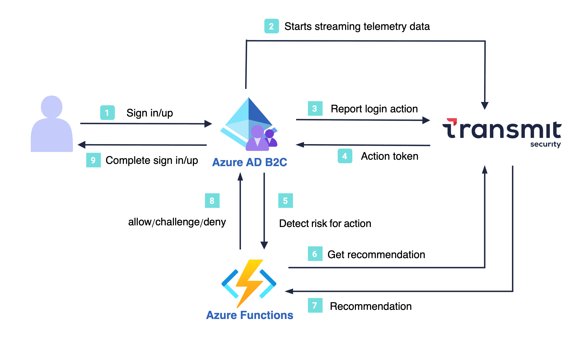

# Configure Transmit Security with Azure Active Directory B2C for risk detection and prevention

In this tutorial, learn to integrate Azure Active Directory B2C (Azure AD B2C) authentication with [Transmit Security's Detection and Response Services (DRS)](https://transmitsecurity.com/platform/detection-and-response). Transmit Security allows you to detect risk in customer interactions on digital channels, and to enable informed identity and trust decisions across the consumer experience.

::: zone pivot="b2c-user-flow"

[!INCLUDE [active-directory-b2c-limited-to-custom-policy](../../includes/active-directory-b2c-limited-to-custom-policy.md)]

::: zone-end

::: zone pivot="b2c-custom-policy"

## Scenario description

A Transmit Detection and Response integration includes the following components:

- **Azure AD B2C tenant**: Authenticates the user and hosts a script that collects device information as users execute a target policy. It blocks or challenges sign-in/up attempts based on the risk recommendation returned by Transmit.
- **Custom UI templates**: Customizes HTML content of the pages rendered by Azure AD B2C. These pages include the JavaScript snippets required for Transmit risk detection.
- **Transmit data collection service**: Dynamically embedded script that logs device information, which is used to continuously assess risk during user interactions.
- **Transmit DRS API endpoint**: Provides the risk recommendation based on collected data. Azure AD B2C communicates with this endpoint using a REST API connector.
- **Azure Functions**: Your hosted API endpoint that is used to obtain a recommendation from the Transmit DRS API endpoint via the API connector.

The following architecture diagram illustrates the implementation described in the guide:

[  ](./media/partner-transmit-security/transmit-security-integration-diagram.png#lightbox)

1. The user signs-in with Azure AD B2C.
2. A custom page initializes the Transmit SDK, which starts streaming device information to Transmit.
3. Azure AD B2C reports a sign-in action event to Transmit in order to obtain an action token.
4. Transmit returns an action token, and Azure AD B2C proceeds with the user sign-up or sign-in.
5. After the user signs-in, Azure AD B2C requests a risk recommendation from Transmit via the Azure Function.
6. The Azure Function sends Transmit the recommendation request with the action token.
7. Transmit returns a recommendation (challenge/allow/deny) based on the collected device information.
8. The Azure Function passes the recommendation result to Azure AD B2C to handle accordingly.
9. Azure AD B2C performs more steps if needed, like multifactor authentication and completes the sign-up or sign-in flow.

## Prerequisites

* A Microsoft Entra subscription. If you don't have one, get a [free account](https://azure.microsoft.com/free/)
* [An Azure AD B2C tenant](./tutorial-create-tenant.md) linked to the Entra subscription
* [A registered web application](./tutorial-register-applications.md) in your Azure AD B2C tenant
* [Azure AD B2C custom policies](./tutorial-create-user-flows.md?pivots=b2c-custom-policy)
* A Transmit Security tenant. Go to [transmitsecurity.com](https://transmitsecurity.com/)

## Step 1: Create a Transmit app

Sign in to the [Transmit Admin Portal](https://portal.transmitsecurity.io/) and [create an application](https://developer.transmitsecurity.com/guides/user/create_new_application/):

1. From **Applications**, select **Add application**.
1. Configure the application with the following attributes:

   | Property | Description |
   |:---------|:---------------------|
   | **Application name** | Application name|
   | **Client name** | Client name|
   | **Redirect URIs** | Enter your website URL. This attribute is a required field but not used for this flow|

3. Select **Add**.

4. Upon registration, a **Client ID** and **Client Secret** appear. Record the values for use later.

## Step 2: Create your custom UI

Start by integrating Transmit DRS into the B2C frontend application. Create a custom sign-in page that integrates the [Transmit SDK](https://developer.transmitsecurity.com/sdk-ref/platform/introduction/), and replaces the default Azure AD B2C sign-in page. 

Once activated, Transmit DRS starts collecting information for the user interacting with your app. Transmit DRS returns an action token that Azure AD B2C needs for risk recommendation.

To integrating Transmit DRS into the B2C sign-in page, follow these steps:

1. Prepare a custom HTML file for your sign-in page based on the [sample templates](./customize-ui-with-html.md#sample-templates). Add the following script to load and initialize the Transmit SDK, and to obtain an action token. The returned action token should be stored in a hidden HTML element (`ts-drs-response` in this example).

    ```html
    <!-- Function that obtains an action token -->
    <script>
    function fill_token() {
       window.tsPlatform.drs.triggerActionEvent("login").then((actionResponse) => {
          let actionToken = actionResponse.actionToken;
          document.getElementById("ts-drs-response").value = actionToken;
          console.log(actionToken);
       });
    }
    </script>
    
    <!-- Loads DRS SDK -->
    <script src="https://platform-websdk.transmitsecurity.io/platform-websdk/latest/ts-platform-websdk.js" defer> </script>
    
    <!-- Upon page load, initializes DRS SDK and calls the fill_token function -->
    <script defer>
    window.onload = function() {
       if (window.tsPlatform) {
          // Client ID found in the app settings in Transmit Admin portal
          window.tsPlatform.initialize({ clientId: "[clientId]" });
          console.log("Transmit Security platform initialized");
          fill_token();
       } else {/
          console.error("Transmit Security platform failed to load");
       }
    };
    </script>
    ```

1. [Enable JavaScript and page layout versions in Azure AS B2C](./javascript-and-page-layout.md).

1. Host the HTML page on a Cross-Origin Resource Sharing (CORS) enabled web endpoint by [creating a storage account](../storage/blobs/storage-blobs-introduction.md) and [adding CORS support for Azure Storage](/rest/api/storageservices/cross-origin-resource-sharing--cors--support-for-the-azure-storage-services).

## Step 3: Create an Azure Function

Azure AD B2C can obtain a risk recommendation from Transmit using a [API connector](./add-api-connector.md). Passing this request through an intermediate web API (such as using [Azure Functions](/azure/azure-functions/)) provides more flexibility in your implementation logic. 

Follow these steps to create an Azure function that uses the action token from the frontend application to get a recommendation from the [Transmit DRS endpoint](https://developer.transmitsecurity.com/openapi/risk/recommendations/#operation/getRiskRecommendation).

1. Create the entry point of your Azure Function, an HTTP-triggered function that processes incoming HTTP requests.

    ```csharp
    public static async Task<HttpResponseMessage> Run(HttpRequest req, ILogger log)
    {
        // Function code goes here
    }
    ```

2. Extract the action token from the request. Your custom policy defines how to pass the request, in query string parameters or body.

    ```csharp
    // Checks for the action token in the query string
    string actionToken = req.Query["actiontoken"];
    
    // Checks for the action token in the request body
    string requestBody = await new StreamReader(req.Body).ReadToEndAsync();
    dynamic data = JsonConvert.DeserializeObject(requestBody);
    actionToken = actionToken ?? data?.actiontoken;
    ```

3. Validate the action token by checking that the provided value isn't empty or null:

    ```csharp
    // Returns an error response if the action token is missing
    if (string.IsNullOrEmpty(actionToken))
       {
           var respContent = new { version = "1.0.0", status = (int)HttpStatusCode.BadRequest, userMessage = "Invalid or missing action token" };
           var json = JsonConvert.SerializeObject(respContent);
           log.LogInformation(json);
           return new HttpResponseMessage(HttpStatusCode.BadRequest)
           {
               Content = new StringContent(json, Encoding.UTF8, "application/json")
           };
       }
    ```

4. Call the Transmit DRS API. The Transmit Client ID and Client Secret obtained in Step 1 should be used to generate bearer tokens for API authorization. Make sure to add the necessary environment variables (like ClientId and ClientSecret) in your `local.settings.json` file.

    ```csharp
    HttpClient client = new HttpClient();
    client.DefaultRequestHeaders.Add("Authorization", $"Bearer {transmitSecurityApiKey}");
    
    // Add code here that sends this GET request:
    // https://api.transmitsecurity.io/risk/v1/recommendation?action_token=[YOUR_ACTION_TOKEN]
    
    HttpResponseMessage response = await client.GetAsync(urlWithActionToken);
    ```

5. Process the API response. The following code forwards the API response if successful; otherwise, handles any errors.

    ```csharp
     if (response.IsSuccessStatusCode)
       {
           log.LogInformation(responseContent);
           return new HttpResponseMessage(HttpStatusCode.OK)
           {
               Content = new StringContent(responseContent, Encoding.UTF8, "application/json")
           };
       }
       else
       {
           var errorContent = new { version = "1.0.0", status = (int)response.StatusCode, userMessage = "Error calling Transmit Security API" };
           var json = JsonConvert.SerializeObject(errorContent);
           log.LogError(json);
           return new HttpResponseMessage(response.StatusCode)
           {
               Content = new StringContent(json, Encoding.UTF8, "application/json")
           };
       }
    ```

## Step 4: Configure your custom policies

You incorporate Transmit DRS into your Azure B2C application by extending your custom policies.

1. Download the [custom policy starter pack](https://github.com/Azure-Samples/active-directory-b2c-custom-policy-starterpack/archive/master.zip) to get started (see [Create custom policies in Azure AD B2C](./tutorial-create-user-flows.md?pivots=b2c-custom-policy))

2. Create a new file that inherits from **TrustFrameworkExtensions**, which extens the base policy with tenant-specific customizations for Transmit DRS.

    ```xml
    <BasePolicy>
       <TenantId>YOUR AZURE TENANT</TenantId>
       <PolicyId>B2C_1A_TrustFrameworkExtensions</PolicyId>
    </BasePolicy>
    ```

2. In the `BuildingBlocks` section, define `actiontoken`, `ts-drs-response`, and `ts-drs-recommendation` as claims:

    ```xml
    <BuildingBlocks>
       <ClaimsSchema>
       <ClaimType Id="ts-drs-response">
          <DisplayName>ts-drs-response</DisplayName>
          <DataType>string</DataType>
          <UserHelpText>Parameter provided to the DRS service for the response</UserHelpText>
          <UserInputType>TextBox</UserInputType>
       </ClaimType>
       <ClaimType Id="actiontoken">
          <DisplayName>actiontoken</DisplayName>
          <DataType>string</DataType>
          <UserHelpText />
          <UserInputType>TextBox</UserInputType>
       </ClaimType>
       <ClaimType Id="ts-drs-recommendation">
          <DisplayName>recommendation</DisplayName>
          <DataType>string</DataType>
          <UserHelpText />
          <UserInputType>TextBox</UserInputType>
       </ClaimType>
       </ClaimsSchema>
    <BuildingBlocks>
    ```

3. In the `BuildingBlocks` section, add a reference to your custom UI:

    ```xml
    <BuildingBlocks>
       <ClaimsSchema>
       <!-- your claim schemas-->
       </ClaimsSchema>
    
       <ContentDefinitions>
       <ContentDefinition Id="api.selfasserted">
       <!-- URL of your hosted custom HTML file-->
          <LoadUri>YOUR_SIGNIN_PAGE_URL</LoadUri>
       </ContentDefinition>
       </ContentDefinitions>
    </BuildingBlocks>
    ```

4. In the `ClaimsProviders` section, configure a claims provider that includes the following technical profiles: one (`SelfAsserted-LocalAccountSignin-Email`) that outputs the action token, and another (`login-DRSCheck` in our example) for the Azure function that receives the action token as input and outputs the risk recommendation.

    ```xml
    <ClaimsProviders>
       <ClaimsProvider>
       <DisplayName>Sign in using DRS</DisplayName>
       <TechnicalProfiles>
          <TechnicalProfile Id="SelfAsserted-LocalAccountSignin-Email">
             <DisplayName>Local Account Sign-in</DisplayName>
             <Protocol Name="Proprietary" Handler="Web.TPEngine.Providers.SelfAssertedAttributeProvider, Web.TPEngine, Version=1.0.0.0, Culture=neutral, PublicKeyToken=null" />
             <Metadata>
             <Item Key="SignUpTarget">SignUpWithLogonEmailExchange</Item>
             <Item Key="setting.operatingMode">Email</Item>
             <Item Key="setting.showSignupLink">true</Item>
             <Item Key="setting.showCancelButton">false</Item>
             <Item Key="ContentDefinitionReferenceId">api.selfasserted</Item>
             <Item Key="language.button_continue">Sign In</Item>
             </Metadata>
             <IncludeInSso>false</IncludeInSso>
             <InputClaims>
             <InputClaim ClaimTypeReferenceId="signInName" />
             </InputClaims>
             <OutputClaims>
             <OutputClaim ClaimTypeReferenceId="signInName" Required="true" />
             <OutputClaim ClaimTypeReferenceId="password" Required="true" />
             <OutputClaim ClaimTypeReferenceId="objectId" />
             <OutputClaim ClaimTypeReferenceId="authenticationSource" />
             <!-- Outputs the action token value provided by the frontend-->
             <OutputClaim ClaimTypeReferenceId="ts-drs-response" />
             </OutputClaims>
             <ValidationTechnicalProfiles>
             <ValidationTechnicalProfile ReferenceId="login-DRSCheck" />
             <ValidationTechnicalProfile ReferenceId="login-NonInteractive" />
             </ValidationTechnicalProfiles>
          </TechnicalProfile>
          <TechnicalProfile Id="login-DRSCheck">
             <DisplayName>DRS check to validate the interaction and device </DisplayName>
             <Protocol Name="Proprietary" Handler="Web.TPEngine.Providers.RestfulProvider, Web.TPEngine, Version=1.0.0.0, Culture=neutral, PublicKeyToken=null" />
             <Metadata>
             <!-- Azure Function App -->
             <Item Key="ServiceUrl">YOUR_FUNCTION_URL</Item>
             <Item Key="AuthenticationType">None</Item>
             <Item Key="SendClaimsIn">Body</Item>
             <!-- JSON, Form, Header, and Query String formats supported -->
             <Item Key="ClaimsFormat">Body</Item>
             <!-- Defines format to expect claims returning to B2C -->
             <!-- REMOVE the following line in production environments -->
             <Item Key="AllowInsecureAuthInProduction">true</Item>
             </Metadata>
             <InputClaims>
             <!-- Receives the action token value as input -->
             <InputClaim ClaimTypeReferenceId="ts-drs-response" PartnerClaimType="actiontoken" DefaultValue="0" />
             </InputClaims>
             <OutputClaims>
             <!-- Outputs the risk recommendation value returned by Transmit (via the Azure function) -->
             <OutputClaim ClaimTypeReferenceId="ts-drs-recommendation" PartnerClaimType="recommendation.type" />
             </OutputClaims>
          </TechnicalProfile>
       </TechnicalProfiles>
       </ClaimsProvider>
    </ClaimsProviders>
    ```

5. In the `UserJourneys` section, create a new user journey (`SignInDRS` in our example) that identifies the user and performs the appropriate identity protection steps based on the Transmit risk recommendation. For example, the journey can proceed normally if Transmit returns **allow** or **trust**, terminate and inform the user of the issue if 'deny', or trigger a step-up authentication process if **challenge**.

```xml
  <UserJourneys>
    <UserJourney Id="SignInDRS">
      <OrchestrationSteps>
        <!-- Step that identifies the user by email and stores the action token -->
        <OrchestrationStep Order="1" Type="CombinedSignInAndSignUp" ContentDefinitionReferenceId="api.selfasserted">
          <ClaimsProviderSelections>
            <ClaimsProviderSelection ValidationClaimsExchangeId="LocalAccountSigninEmailExchange" />
          </ClaimsProviderSelections>
          <ClaimsExchanges>
            <ClaimsExchange Id="LocalAccountSigninEmailExchange" TechnicalProfileReferenceId="SelfAsserted-LocalAccountSignin-Email" />
          </ClaimsExchanges>
        </OrchestrationStep>

        <!-- Step to perform DRS check -->
        <OrchestrationStep Order="2" Type="ClaimsExchange">
          <ClaimsExchanges>
            <ClaimsExchange Id="DRSCheckExchange" TechnicalProfileReferenceId="login-DRSCheck" />
          </ClaimsExchanges>
        </OrchestrationStep>

        <!-- Conditional step for ACCEPT or TRUST -->
        <OrchestrationStep Order="3" Type="ClaimsExchange">
          <Preconditions>
            <Precondition Type="ClaimEquals" ExecuteActionsIf="false">
              <Value>ts-drs-recommendation</Value>
              <Value>ACCEPT</Value>
              <Value>TRUST</Value>
              <Action>SkipThisOrchestrationStep</Action>
            </Precondition>
          </Preconditions>
          <!-- Define the ClaimsExchange or other actions for ACCEPT or TRUST -->
        </OrchestrationStep>

        <!-- Conditional step for CHALLENGE -->
        <OrchestrationStep Order="4" Type="ClaimsExchange">
          <Preconditions>
            <Precondition Type="ClaimEquals" ExecuteActionsIf="false">
              <Value>ts-drs-recommendation</Value>
              <Value>CHALLENGE</Value>
              <Action>SkipThisOrchestrationStep</Action>
            </Precondition>
          </Preconditions>
          <!-- Define the ClaimsExchange or other actions for CHALLENGE -->
        </OrchestrationStep>

        <!-- Conditional step for DENY -->
        <OrchestrationStep Order="5" Type="ClaimsExchange">
          <Preconditions>
            <Precondition Type="ClaimEquals" ExecuteActionsIf="false">
              <Value>ts-drs-recommendation</Value>
              <Value>DENY</Value>
              <Action>SkipThisOrchestrationStep</Action>
            </Precondition>
          </Preconditions>
          <!-- Define the ClaimsExchange or other actions for DENY -->
        </OrchestrationStep>
    </UserJourney>
  </UserJourneys>
```

7. Save the policy file as `DRSTrustFrameworkExtensions.xml`.

8. Create a new file that inherits from the file you saved. It extends the sign-in policy that works as an entry point for the sign-up and sign-in user journeys with Transmit DRS.

    ```xml
    <BasePolicy>
       <TenantId>YOUR AZURE TENANT</TenantId>
       <PolicyId>B2C_1A_DRSTrustFrameworkExtensions</PolicyId>
    </BasePolicy>
    ```

9. In the `RelyingParty` section, configure your DRS-enhanced user journey (`SignInDRS` in our example).

    ```xml
    <RelyingParty>
       <DefaultUserJourney ReferenceId="SignInDRS" />
       <UserJourneyBehaviors>
       <ScriptExecution>Allow</ScriptExecution>
       </UserJourneyBehaviors>
       <TechnicalProfile Id="PolicyProfile">
       <DisplayName>PolicyProfile</DisplayName>
       <Protocol Name="OpenIdConnect" />
       <OutputClaims>
          <OutputClaim ClaimTypeReferenceId="displayName" />
          <OutputClaim ClaimTypeReferenceId="givenName" />
          <OutputClaim ClaimTypeReferenceId="surname" />
          <OutputClaim ClaimTypeReferenceId="email" />
          <OutputClaim ClaimTypeReferenceId="objectId" PartnerClaimType="sub" />
       </OutputClaims>
       <SubjectNamingInfo ClaimType="sub" />
       </TechnicalProfile>
    </RelyingParty>
    ```

9. Save the policy file as `DRSSignIn.xml`.

## Step 5: Upload the custom policy

Using the directory with your Azure AD B2C tenant, upload the custom policy:

1. Sign in to the [Azure portal](https://portal.azure.com/).
1. In the portal toolbar, select **Directories + subscriptions**.
1. On the **Portal settings | Directories + subscriptions** page, in the **Directory name** list, find the Azure AD B2C directory and then select **Switch**.
1. Under **Policies**, select **Identity Experience Framework**.
1. Select **Upload Custom Policy**, and then upload the updated custom policy files.

## Step 6: Test your custom policy

Using the directory with your Azure AD B2C tenant, test your custom policy:

1. In the Azure AD B2C tenant, and under Policies, select Identity Experience Framework.
2. Under **Custom policies**, select the Sign in policy.
3. For **Application**, select the web application you registered.
4. Select **Run now**.
5. Complete the user flow.

::: zone-end

## Next steps

* Ask questions on [Stackoverflow](https://stackoverflow.com/questions/tagged/azure-ad-b2c)
* Check out the [Azure AD B2C custom policy overview](custom-policy-overview.md)
