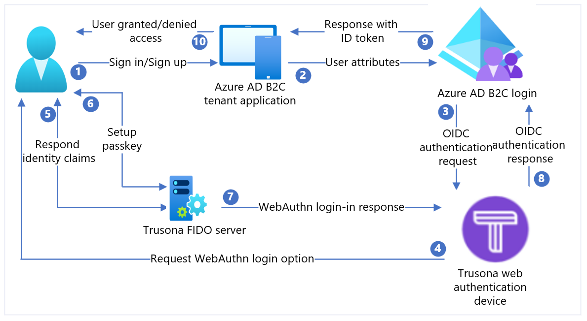

# Configure Trusona Authentication Cloud with Azure Active Directory B2C

In this sample tutorial, you'll learn how to integrate Azure AD B2C authentication with [Trusona Authentication Cloud](https://www.trusona.com/customers/authentication-cloud). It's a cloud-based service enabling users to authenticate with a **tap-and-go** experience, without the need for any kind of mobile authenticator app.

Benefits of integrating Trusona Authentication Cloud with Azure AD B2C include:
-	Deliver strong authentication with a better user experience
    - Happier users who spend more online 
    - Lower attrition and abandonment, increased revenues
    - Higher retention, lifetime value (LTV)

-	Lower cost of running the business
    - Reduced account takeovers and account sharing
    - Reduced fraud and fewer manual fraud analysis actions
    - Reduced spend on outsourcing manual reviews

-	Eliminate passwords
    - No more password resets
    - Reduced call center complaints
    - Fast, simple, frictionless logins using passkeys

## Prerequisites

To get started, you need:

- A Trusona Authentication Cloud trial account. To request an account, [contact Trusona](mailto:info@trusona.com).
- An Azure subscription. If you don't have a subscription, you can get a [free account](https://azure.microsoft.com/free/).
- [An Azure AD B2C tenant](tutorial-create-tenant.md) that is linked to your Azure subscription.

::: zone pivot="b2c-custom-policy"
- Complete the steps in the article [get started with custom policies in Azure AD B2C](tutorial-create-user-flows.md?pivots=b2c-custom-policy).

::: zone-end


## Scenario description

Web Authentication standard - WebAuthn implements modern operating systems and browsers to support authentication via finger print, Windows hello, or external FIDO devices such as USB, Bluetooth and OTP.

In this scenario, Trusona acts as an Identity Provider (IdP) for Azure AD B2C to enable passwordless authentication. The following components make up the solution:
-	An Azure AD B2C combined sign-in and sign-up policy.
-	Trusona Authentication Cloud added to Azure AD B2C as an IdP. 



| Steps | Description |
|:------|:------|
|1. | A user attempts to sign in to the web application via their browser.|
|2.| The web application redirects to Azure AD B2C sign-up and sign-in policy.|
|3. | Azure AD B2C redirects the user for authentication to the Trusona Authentication Cloud OpenID Connect (OIDC) IdP.|
|4. | The user is presented with a sign-in web page that asks for their username – typically an email address.|
|5. | The user enters their email address and selects the **Continue** button. If the user's account isn't found in the Trusona Authentication Cloud, then a response is sent to the browser that initiates a WebAuthn registration process on the device. Otherwise a response is sent to the browser that begins a WebAuthn authentication process.|
|6. | The user is asked to select a credential to use. The passkey is associated with the domain of the web application or a hardware security key. Once the user selects a credential, the OS requests the user to use a biometric, passcode, or PIN to confirm their identity. This unlocks the Secure Enclave/Trusted Execution environment, which generates an authentication assertion signed by the private key associated with the selected credential.|
|7. | The authentication assertion is returned to the Trusona cloud service for verification.|
|8. | Once verified, Trusona Authentication Cloud (IdP) creates an OIDC ID token and then forwards it to Azure AD B2C (Service Provider). Azure AD B2C validates the signature of the token and the issuer against the values in the Trusona’s OpenID discovery document. These details were configured during IdP setup. Once verified, Azure AD B2C issues an OIDC id_token (depending on the scope) and redirects the user back to the initiating application with the token. 
|9. | The web application (or the developer libraries it uses to implement authentication) retrieves the token and verifies the authenticity of the Azure AD B2C token. If that’s the case, it extracts the claims and pass them to the web application to consume. 
|10. | Upon verification, user is granted/denied access. |

## Step 1: Onboard with Trusona Authentication Cloud

1.	Sign in to the [Trusona Portal](https://portal.trusona.io).
2.	From the left navigation panel, select **Settings**
3.	In the Settings menu, select the slider to **Enable OIDC**.
4.	Select the appropriate **Inputs** and provide the **Redirect URL** `https://{your-tenant-name}.b2clogin.com/{your-tenant-name}.onmicrosoft.com/oauth2/authresp`.
5.	**Generate** a secret key and **Copy** the key for use in your Azure AD B2C setup.

    > [!NOTE]
    >1. The Trusona portal supports self-service registration. Upon registering you will be assigned to a Trusona account with read-only rights.  Afterwards, Trusona will assign you to the correct account and elevate your rights to read-write based upon your organization’s access control policy for portal users.
    >2. Microsoft Entra ID’s initial domain name is used as the client redirect host.

    [](./media/partner-trusona/trusona-auth-cloud-oidc-settings.png#lightbox)

## Step 2: Register a web application in Azure AD B2C

Before your applications can interact with Azure AD B2C, they must be registered in your customer tenant. This tutorial shows you how to register a Web Application using the Azure portal. For testing purposes like this tutorial, you're registering `https://jwt.ms`, a Microsoft-owned web application that displays the decoded contents of a token (the contents of the token never leave your browser).
To register a web application in your Azure AD B2C tenant, use our new unified app registration experience. 

1. Sign in to the [Azure portal](https://portal.azure.com).
1. Make sure you're using the directory that contains your Azure AD B2C tenant. Select the **Directories + subscriptions** icon in the portal toolbar.
1. On the **Portal settings | Directories + subscriptions** page, find your Azure AD B2C directory in the **Directory name** list, and then select **Switch**.
1. In the Azure portal, search for and select **Azure AD B2C**.
1. Select **App registrations**, and then select **New registration**.
1. Enter a **Name** for the application. For example, *jwt ms*.
1. Under **Supported account types**, select **Accounts in any identity provider or organizational directory (for authenticating users with user flows)**.
1. Under **Redirect URI**, select **Web**, and then enter `https://jwt.ms` in the URL text box.

   The redirect URI is the endpoint to which the authorization server, Azure AD B2C in this case sends the user to. After completing its interaction with the user, an access token or authorization code is sent upon successful authorization. In a production application, it's typically a publicly accessible endpoint where your app is running, like `https://contoso.com/auth-response`. For testing purposes like this tutorial, you can set it to `https://jwt.ms`, a Microsoft-owned web application that displays the decoded contents of a token (the contents of the token never leave your browser). During app development, you might add the endpoint where your application listens locally, like `https://localhost:5000`. You can add and modify redirect URIs in your registered applications at any time.

   The following restrictions apply to redirect URIs:

    * The reply URL must begin with the scheme `https`, unless you use a localhost redirect URL.
    * The reply URL is case-sensitive. Its case must match the case of the URL path of your running application. For example, if your application includes as part of its path `.../abc/response-oidc`,  don't specify `.../ABC/response-oidc` in the reply URL. Because the web browser treats paths as case-sensitive, cookies associated with `.../abc/response-oidc` may be excluded if redirected to the case-mismatched `.../ABC/response-oidc` URL.
    * The reply URL should include or exclude the trailing forward slash as your application expects it. For example, `https://contoso.com/auth-response` and `https://contoso.com/auth-response/` might be treated as nonmatching URLs in your application.

1. Under **Permissions**, select the **Grant admin consent to openid and offline_access permissions** check box.
1. Select **Register**.

### Enable ID token implicit grant
If you register this app and configure it with `https://jwt.ms/` app for testing a user flow or custom policy, you need to enable the implicit grant flow in the app registration:

1. In the left menu, under **Manage**, select **Authentication**.

1. Under **Implicit grant and hybrid flows**, select **ID tokens (used for implicit and hybrid flows)** check boxes.

1. Select **Save**.

::: zone pivot="b2c-user-flow"

## Step 3: Configure Trusona Authentication Cloud as an IdP in Azure AD B2C

1. Sign in to the [Azure portal](https://portal.azure.com/) as the global administrator of your Azure AD B2C tenant.

1. Make sure you're using the directory that contains your Azure AD B2C tenant. Select the **Directories + subscriptions** icon in the portal toolbar.

1. On the **Portal settings | Directories + subscriptions** page, find your Azure AD B2C directory in the **Directory name** list, and then select **Switch**.

1. Choose **All services** in the top-left corner of the Azure portal, search for and select **Azure AD B2C**.

1. Navigate to **Dashboard** > **Azure Active Directory B2C** > **Identity providers**.

1. Select **Identity providers**.

1. Select **Add**.

### Configure an IdP 

1. Select **Identity provider type** > **OpenID Connect (Preview)**.

1. Fill out the form to set up the IdP:  

   | Property | Value  |
   | :--- | :--- |
   | Metadata URL | `https://authcloud.trusona.net/.well-known/openid-configuration`|
   | Client ID |available on the Trusona Authentication Cloud portal  |
   | Client secret | available on the Trusona Authentication Cloud portal  |
   | Scope | OpenID profile email |
   | Response type | code |
   | Response mode  | form_post |

1. Select **OK**.  

1. Select **Map this identity provider’s claims**.  

1. Fill out the form to map the IdP:

   | Property | Value  |
   | :--- | :--- |
   | UserID | sub  |
   | Display name | nickname |
   | Given name | given_name |
   | Surname | family_name |
   | Response mode | email |

1. Select **OK** to complete the setup for your new OIDC IdP.

## Step 4: Create a user flow policy

You should now see Trusona as a **new OpenID Connect Identity Provider** listed within your B2C IdPs.

1. In your Azure AD B2C tenant, under **Policies**, select **User flows**.

1. Select **New user flow**.

1. Select **Sign up and sign in**, select a version, and then select **Create**.

1. Enter a **Name** for your policy.

1. In the **Identity providers** section, select your newly created **Trusona Authentication Cloud-Identity Provider**.

   > [!NOTE]
   > Because Trusona is inherently multi-factor, it's best to leave multi-factor authentication disabled.

1. Select **Create**.

1. Under **User Attributes and Claims**, choose **Show more**. In the form, select at least one attribute that you specified during the setup of your identity provider in earlier section.

1. Select **OK**.  

## Step 5: Test your user flow

1. Select the policy you created.

1. Select **Run user flow**, and then select the settings:

   a. **Application**: Select the registered app, for example, jwt ms.
 
   b. **Reply URL**: Select the redirect URL, for example, `https://jwt.ms`.
   
2. Select **Run user flow**. You should be redirected to the Trusona Authentication Cloud. The user is presented with a sign-in web page that asks for their username – typically an email address. If the user's account isn't found in Trusona Authentication Cloud,  then a response is sent to the browser that initiates a WebAuthn registration process on the device.  Otherwise a response is sent to the browser that begins a WebAuthn authentication process. The user is asked to select a credential to use. The passkey is associated with the domain of the web application or a hardware security key. Once the user selects a credential, the OS requests the user to use a biometric, passcode, or PIN to confirm their identity. This unlocks the Secure Enclave/Trusted Execution environment, which generates an authentication assertion signed by the private key associated with the selected credential. Azure AD B2C validates the Trusona authentication response and issues an OIDC token. It redirects the user back to the initiating application, for example, `https://jwt.ms`, which displays the contents of the token returned by Azure AD B2C.
::: zone-end

::: zone pivot="b2c-custom-policy"

## Step 3: Create Trusona Authentication Cloud policy key

Store the client secret that you previously generated in [step 1](#step-1-onboard-with-trusona-authentication-cloud) in your Azure AD B2C tenant.

1. Sign in to the [Azure portal](https://portal.azure.com/).

1. Make sure you're using the directory that contains your Azure AD B2C tenant. Select the **Directories + subscriptions** icon in the portal toolbar.

1. On the **Portal settings | Directories + subscriptions** page, find your Azure AD B2C directory in the **Directory name** list, and then select **Switch**.

1. Choose **All services** in the top-left corner of the Azure portal, and then search for and select **Azure AD B2C**.

1. On the Overview page, select **Identity Experience Framework**.

1. Select **Policy Keys** and then select **Add**.

1. For **Options**, choose **Manual**.

1. Enter a **Name** for the policy key. For example, `TrusonaTacClientSecret`. The prefix `B2C_1A_` is added automatically to the name of your key.

1. In **Secret**, enter your client secret that you previously recorded.

1. For **Key usage**, select `Signature`.

1. Select **Create**.

## Step 4: Configure Trusona Authentication Cloud as an IdP

>[!TIP]
>You should have the Azure AD B2C policy configured at this point. If not, follow the [instructions](tutorial-create-user-flows.md?pivots=b2c-custom-policy#custom-policy-starter-pack) on how to set up your Azure AD B2C tenant and configure policies.

To enable users to sign in using Trusona Authentication Cloud, you need to define Trusona as a claims provider that Azure AD B2C can communicate with through an endpoint. The endpoint provides a set of claims that are used by Azure AD B2C to verify a specific user has authenticated using a passkey or a hardware security key available on their device, proving the user’s identity.

Use the following steps to add Trusona as a claims provider: 

1. Get the custom policy starter packs from GitHub, then update the XML files in the LocalAccounts starter pack with your Azure AD B2C tenant name:

    1. [Download the .zip file](https://github.com/Azure-Samples/active-directory-b2c-custom-policy-starterpack/archive/master.zip) or clone the repository:
        ```
            git clone https://github.com/Azure-Samples/active-directory-b2c-custom-policy-starterpack
       ```
    
    1. In all of the files in the **LocalAccounts** directory, replace the string `yourtenant` with the name of your Azure AD B2C tenant. For example, if the name of your B2C tenant is `contoso`, all instances of `yourtenant.onmicrosoft.com` become `contoso.onmicrosoft.com`. 

1. Open the `LocalAccounts/TrustFrameworkExtensions.xml`.

1. Find the **ClaimsProviders** element. If it doesn't exist, add it under the root element, `TrustFrameworkPolicy`.

1. Add a new **ClaimsProvider** similar to the one shown as follows:

```xml
<ClaimsProvider>
  <Domain>TrusonaTAC</Domain>
  <DisplayName>Trusona TAC</DisplayName>
  <TechnicalProfiles>
    <TechnicalProfile Id="TrusonaTAC-OpenIdConnect">
      <DisplayName>TrusonaTAC</DisplayName>
      <Description>Login with your Trusona TAC  account</Description>
      <Protocol Name="OpenIdConnect" />
      <Metadata>
        <Item Key="METADATA">https://authcloud.trusona.net/.well-known/openid-configuration</Item>
        <Item Key="scope">openid profile email</Item>
         <!-- Update the Client ID to the Trusona Authentication Cloud Application ID -->
         <Item Key="client_id">00000000-0000-0000-0000-000000000000</Item>
        <Item Key="response_types">code</Item>
        <Item Key="response_mode">form_post</Item>
        <Item Key="HttpBinding">POST</Item>
        <Item Key="UsePolicyInRedirectUri">false</Item>
        <Item Key="IncludeClaimResolvingInClaimsHandling">true</Item>
        <!-- trying to add additional claim-->
        <!--Insert b2c-extensions-app application ID here, for example: 11111111-1111-1111-1111-111111111111-->
        <Item Key="11111111-1111-1111-1111-111111111111"></Item>
        <!--Insert b2c-extensions-app application ObjectId here, for example: 22222222-2222-2222-2222-222222222222-->
        <Item Key="11111111-1111-1111-1111-111111111111"></Item>
        <!-- The key allows you to specify each of the Azure AD tenants that can be used to sign in. Update the GUIDs for each tenant. -->
        <!--<Item Key="ValidTokenIssuerPrefixes">https://login.microsoftonline.com/187f16e9-81ab-4516-8db7-1c8ef94ffeca,https://login.microsoftonline.com/11111111-1111-1111-1111-111111111111</Item>-->
        <!-- The commented key specifies that users from any tenant can sign-in. Uncomment if you would like anyone with an Azure AD account to be able to sign in. -->
        <Item Key="ValidTokenIssuerPrefixes">https://login.microsoftonline.com/</Item>
        
      </Metadata>
      <CryptographicKeys>
       <!-- Update the Client Secret to the Trusona Authentication Cloud Client Secret Name -->
        <Key Id="client_secret" StorageReferenceId="B2C_1A_TrusonaTacSecret" />
      </CryptographicKeys>
      <OutputClaims>
        <OutputClaim ClaimTypeReferenceId="issuerUserId" PartnerClaimType="sub" />
        <OutputClaim ClaimTypeReferenceId="tenantId" PartnerClaimType="tid" AlwaysUseDefaultValue="true" DefaultValue="{Policy:TenantObjectId}" />
        <OutputClaim ClaimTypeReferenceId="authenticationSource" DefaultValue="socialIdpAuthentication" AlwaysUseDefaultValue="true" />
        <OutputClaim ClaimTypeReferenceId="identityProvider" PartnerClaimType="iss" DefaultValue="https://authcloud.trusona.net/" />
        <OutputClaim ClaimTypeReferenceId="issuerUserId" PartnerClaimType="sub" />
        <OutputClaim ClaimTypeReferenceId="displayName" PartnerClaimType="name" />
        <OutputClaim ClaimTypeReferenceId="givenName" PartnerClaimType="given_name" />
        <OutputClaim ClaimTypeReferenceId="surName" PartnerClaimType="family_name" />
        <OutputClaim ClaimTypeReferenceId="email" />
      </OutputClaims>
      <OutputClaimsTransformations>
        <OutputClaimsTransformation ReferenceId="CreateRandomUPNUserName" />
        <OutputClaimsTransformation ReferenceId="CreateUserPrincipalName" />
        <OutputClaimsTransformation ReferenceId="CreateAlternativeSecurityId" />
        <OutputClaimsTransformation ReferenceId="CreateSubjectClaimFromAlternativeSecurityId" />
      </OutputClaimsTransformations>
      <UseTechnicalProfileForSessionManagement ReferenceId="SM-SocialLogin" />
    </TechnicalProfile>
  </TechnicalProfiles>
</ClaimsProvider>
```


1. Set **client_id** with the Trusona Authentication Cloud application ID that you previously recorded in [step 1](#step-1-onboard-with-trusona-authentication-cloud).

1. Update **client_secret** section with the name of the policy key created in [Step 3](#step-3-create-trusona-authentication-cloud-policy-key). For example, `B2C_1A_TrusonaTacClientSecret`:

   ```xml
   <Key Id="client_secret" StorageReferenceId="B2C_1A_TrusonaTacClientSecret" />
   ```
1. Save the changes.

## Step 5: Add a user journey

At this point, you've set up the IdP, but it's not yet available in any of the sign-in pages. If you've your own custom user journey continue to [Step 6](#step-6-add-the-idp-to-a-user-journey), otherwise, create a duplicate of an existing template user journey as follows:

1. Open the `LocalAccounts/TrustFrameworkBase.xml` file from the starter pack.

2. Find and copy the entire contents of the **UserJourney** element that includes `Id=SignUpOrSignIn`.

3. Open the `LocalAccounts/TrustFrameworkExtensions.xml` and find the **UserJourneys** element. If the element doesn't exist, add one.

4. Paste the entire content of the UserJourney element that you copied as a child of the UserJourneys element.

5. Rename the `Id` of the user journey. For example, `Id=TrusonaTacSUSI`.

## Step 6: Add the IdP to a user journey

Now that you have a user journey, add the new IdP to the user journey.

1. Find the orchestration step element that includes `Type=CombinedSignInAndSignUp`, or `Type=ClaimsProviderSelection` in the user journey. It's usually the first orchestration step. The **ClaimsProviderSelections** element contains a list of IdPs that a user can sign in with. The order of the elements controls the order of the sign-in buttons presented to the user. Add a **ClaimsProviderSelection** XML element. Set the value of **TargetClaimsExchangeId** to a friendly name, such as `TrusonaTacExchange`.

1. In the next orchestration step, add a **ClaimsExchange** element. Set the **Id** to the value of the target claims exchange ID. Update the value of **TechnicalProfileReferenceId** to the ID of the technical profile you created earlier while adding the claims provider, for example, `TrusonaTAC-OpenIdConnect`.

The following XML demonstrates orchestration steps of a user journey with the identity provider:

```xml
    <UserJourney Id="TrusonaTacSUSI">
      <OrchestrationSteps>
        <OrchestrationStep Order="1" Type="CombinedSignInAndSignUp" ContentDefinitionReferenceId="api.signuporsignin">
          <ClaimsProviderSelections>
            <ClaimsProviderSelection TargetClaimsExchangeId="TrusonaTacExchange" />
            <ClaimsProviderSelection ValidationClaimsExchangeId="LocalAccountSigninEmailExchange" />
          </ClaimsProviderSelections>
          <ClaimsExchanges>
            <ClaimsExchange Id="LocalAccountSigninEmailExchange" TechnicalProfileReferenceId="SelfAsserted-LocalAccountSignin-Email" />
          </ClaimsExchanges>
        </OrchestrationStep>
        <!-- Check if the user has selected to sign in using one of the social providers -->
        <OrchestrationStep Order="2" Type="ClaimsExchange">
          <Preconditions>
            <Precondition Type="ClaimsExist" ExecuteActionsIf="true">
              <Value>objectId</Value>
              <Action>SkipThisOrchestrationStep</Action>
            </Precondition>
          </Preconditions>
          <ClaimsExchanges>
            <ClaimsExchange Id="TrusonaTacExchange" TechnicalProfileReferenceId="TrusonaTAC-OpenIdConnect" />
            <ClaimsExchange Id="SignUpWithLogonEmailExchange" TechnicalProfileReferenceId="LocalAccountSignUpWithLogonEmail" />
          </ClaimsExchanges>
        </OrchestrationStep>
        <OrchestrationStep Order="3" Type="ClaimsExchange">
          <Preconditions>
            <Precondition Type="ClaimEquals" ExecuteActionsIf="true">
              <Value>authenticationSource</Value>
              <Value>localAccountAuthentication</Value>
              <Action>SkipThisOrchestrationStep</Action>
            </Precondition>
          </Preconditions>
          <ClaimsExchanges>
            <ClaimsExchange Id="AADUserReadUsingAlternativeSecurityId" TechnicalProfileReferenceId="AAD-UserReadUsingAlternativeSecurityId-NoError" />
          </ClaimsExchanges>
        </OrchestrationStep>
        <!-- Show self-asserted page only if the directory does not have the user account already (we do not have an objectId). This can only happen when authentication happened using a social IDP. If local account was created or authentication done using ESTS in step 2, then an user account must exist in the directory by this time. -->
        <OrchestrationStep Order="4" Type="ClaimsExchange">
          <Preconditions>
            <Precondition Type="ClaimsExist" ExecuteActionsIf="true">
              <Value>objectId</Value>
              <Action>SkipThisOrchestrationStep</Action>
            </Precondition>
          </Preconditions>
          <ClaimsExchanges>
            <ClaimsExchange Id="SelfAsserted-Social" TechnicalProfileReferenceId="SelfAsserted-Social" />
          </ClaimsExchanges>
        </OrchestrationStep>
        <!-- This step reads any user attributes that we may not have received when authenticating using ESTS so they can be sent in the token. -->
        <OrchestrationStep Order="5" Type="ClaimsExchange">
          <Preconditions>
            <Precondition Type="ClaimEquals" ExecuteActionsIf="true">
              <Value>authenticationSource</Value>
              <Value>socialIdpAuthentication</Value>
              <Action>SkipThisOrchestrationStep</Action>
            </Precondition>
          </Preconditions>
          <ClaimsExchanges>
            <ClaimsExchange Id="AADUserReadWithObjectId" TechnicalProfileReferenceId="AAD-UserReadUsingObjectId" />
          </ClaimsExchanges>
        </OrchestrationStep>
        <!-- The previous step (SelfAsserted-Social) could have been skipped if there were no attributes to collect from the user. So, in that case, create the user in the directory if one does not already exist (verified using objectId which would be set from the last step if account was created in the directory. -->
        <OrchestrationStep Order="6" Type="ClaimsExchange">
          <Preconditions>
            <Precondition Type="ClaimsExist" ExecuteActionsIf="true">
              <Value>objectId</Value>
              <Action>SkipThisOrchestrationStep</Action>
            </Precondition>
          </Preconditions>
          <ClaimsExchanges>
            <ClaimsExchange Id="AADUserWrite" TechnicalProfileReferenceId="AAD-UserWriteUsingAlternativeSecurityId" />
          </ClaimsExchanges>
        </OrchestrationStep>
        <OrchestrationStep Order="7" Type="SendClaims" CpimIssuerTechnicalProfileReferenceId="JwtIssuer" />
      </OrchestrationSteps>
      <ClientDefinition ReferenceId="DefaultWeb" />
    </UserJourney>
```
Learn more about [User Journeys](custom-policy-overview.md#user-journeys).

## Step 7: Configure the relying party policy

The relying party policy, for example [SignUpSignIn.xml](https://github.com/Azure-Samples/active-directory-b2c-custom-policy-starterpack/blob/main/LocalAccounts/SignUpOrSignin.xml), specifies the user journey which Azure AD B2C executes. Find the **DefaultUserJourney** element within relying party. Update the **ReferenceId** to match the user journey ID, in which you added the identity provider.

In the following example, for the `Trusona Authentication Cloud` user journey, the **ReferenceId** is set to `TrusonaTacSUSI`:

```xml
   <RelyingParty>
        <DefaultUserJourney ReferenceId="TrusonaTacSUSI" />
        <TechnicalProfile Id="PolicyProfile">
          <DisplayName>PolicyProfile</DisplayName>
          <Protocol Name="OpenIdConnect" />
          <OutputClaims>
            <OutputClaim ClaimTypeReferenceId="displayName" />
            <OutputClaim ClaimTypeReferenceId="givenName" />
            <OutputClaim ClaimTypeReferenceId="surname" />
            <OutputClaim ClaimTypeReferenceId="email" />
            <OutputClaim ClaimTypeReferenceId="objectId" PartnerClaimType="sub"/>
            <OutputClaim ClaimTypeReferenceId="identityProvider" />
            <OutputClaim ClaimTypeReferenceId="tenantId" AlwaysUseDefaultValue="true" DefaultValue="{Policy:TenantObjectId}" />
            <OutputClaim ClaimTypeReferenceId="correlationId" DefaultValue="{Context:CorrelationId}" />
          </OutputClaims>
          <SubjectNamingInfo ClaimType="sub" />
        </TechnicalProfile>
      </RelyingParty>

```

## Step 8: Upload the custom policy

1. Sign in to the [Azure portal](https://portal.azure.com/#home).

1. Make sure you're using the directory that contains your Azure AD B2C tenant:

   a. Select the **Directories + subscriptions** icon in the portal toolbar.

   b. On the **Portal settings | Directories + subscriptions** page, find your Azure AD B2C directory in the **Directory name** list, and then select **Switch**.

1. In the [Azure portal](https://portal.azure.com/#home), search for and select **Azure AD B2C**.

1. Under Policies, select **Identity Experience Framework**.

1. Select **Upload Custom Policy**, and then upload the two policy files that you changed, in the following order: the extension policy, for example `TrustFrameworkExtensions.xml`, then the relying party policy, such as `SignUpOrSignin.xml`.

## Step 9: Test your custom policy

1. In your Azure AD B2C tenant, under **Policies**, select **Identity Experience Framework**.

1. Under **Custom policies**, select **TrusonaTacSUSI**.

1. For **Application**, select the web application that you previously registered as part of this article's prerequisites. for example `jwt ms`. The **Reply URL** should show `https://jwt.ms`.

1. Select **Run now**. Your browser should be redirected to the Trusona Authentication Cloud sign-in page. 

2. A sign in screen is shown; at the bottom should be a button to use **Trusona Authentication Cloud** authentication.

1. You should be redirected to Trusona Authentication Cloud. The user is presented with a sign-in web page that asks for their username – typically an email address. If the user's account isn't found in the Trusona Authentication Cloud, then a response is sent to the browser that initiates a WebAuthn registration process on the device. Otherwise a response is sent to the browser that begins a WebAuthn authentication process. The user is asked to select a credential to use. The passkey is associated with the domain of the web application or a hardware security key. Once the user selects a credential, the OS requests the user to use a biometric, passcode, or PIN to confirm their identity. This unlocks the Secure Enclave/Trusted Execution environment, which generates an authentication assertion signed by the private key associated with the selected credential.

1. If the sign-in process is successful, your browser is redirected to `https://jwt.ms`, which displays the contents of the token returned by Azure AD B2C.

::: zone-end


## Next steps  


For additional information, review the following articles:

- [Azure AD B2C docs](solution-articles.md)

- [Ask your question on Stackoverflow](https://stackoverflow.com/questions/tagged/azure-ad-b2c)

- [Azure AD B2C Samples](https://stackoverflow.com/questions/tagged/azure-ad-b2c)

- [Azure AD B2C YouTube training playlist](https://www.youtube.com/playlist?list=PL3ZTgFEc7LyuJ8YRSGXBUVItCPnQz3YX0)

- [Custom policies in Azure AD B2C](custom-policy-overview.md)

- [Get started with custom policies in Azure AD B2C](tutorial-create-user-flows.md?pivots=b2c-custom-policy)
