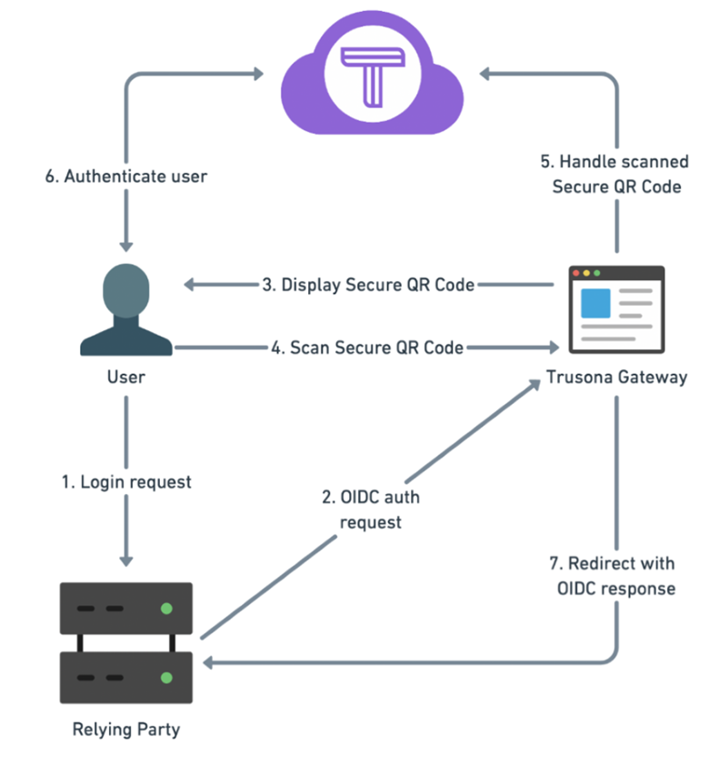

# Integrating Trusona with Azure Active Directory B2C

Trusona is an independent software vendor (ISV) provider that helps secure sign-in by enabling passwordless authentication, multi-factor authentication, and digital license scanning. In this article, you'll learn how to add Trusona as an identity provider in Azure AD B2C to enable passwordless authentication.

## Prerequisites

To get started, you'll need:

* An Azure AD subscription. If you don't have a subscription, you can get a [free account](https://azure.microsoft.com/free/).
* [An Azure AD B2C tenant](tutorial-create-tenant.md) that is linked to your Azure subscription.
* A [trial account](https://www.trusona.com/aadb2c) at Trusona

## Scenario description

In this scenario, Trusona acts as an identity provider for Azure AD B2C to enable passwordless authentication. The following components make up the solution:

* An Azure AD B2C combined sign-in and sign-up policy
* Trusona added to Azure AD B2C as an identity provider
* The downloadable Trusona app

|  |  |
|------|------|
|1     | A user attempts to sign in to or sign up with the application. The user is authenticated via the Azure AD B2C sign-up and sign-in policy. During sign-up, the user's previously verified email address from the Trusona app is used.     |
|2     | Azure B2C redirects the user to the Trusona OpenID Connect (OIDC) identity provider using the implicit flow.     |
|3     | For desktop PC-based logins, Trusona displays a unique, stateless, animated, and dynamic QR code for scanning with the Trusona app. For mobile-based logins, Trusona uses a "deep link" to open the Trusona app. These two methods are used for device and ultimately user discovery.     |
|4     | The user scans the displayed QR code with the Trusona app.     |
|5     | The user's account is found in the Trusona cloud service and the authentication is prepared.     |
|6     | The Trusona cloud service issues an authentication challenge to the user via a push notification sent to the Trusona app: a. The user is prompted with the authentication challenge.   b. The user chooses to accept or reject the challenge.   c. The user is asked to use OS security (for example, biometric, passcode, PIN, or pattern) to confirm and sign the challenge with a private key in the Secure Enclave/Trusted Execution environment.   d. The Trusona app generates a dynamic anti-replay payload based on the parameters of the authentication in real time.   e. The entire response is signed (for a second time) by a private key in the Secure Enclave/Trusted Execution environment and returned to the Trusona cloud service for verification.      |
|7     |  The Trusona cloud service redirects the user back to the initiating application with an id_token. Azure AD B2C verifies the id_token using Trusona's published OpenID configuration as configured during identity provider setup.    |
|  |  |

## Onboard with Trusona

1. Fill out the [form](https://www.trusona.com/aadb2c) to create a Trusona account and get started.

2. Download the Trusona mobile app from the app store. Install the app and register your email.

3. Verify your email through the secure "magic link" sent by the software.  

4. Go to the [Trusona Developer’s dashboard](https://dashboard.trusona.com) for self-service.

5. Select **I’m Ready** and authenticate yourself with your Trusona app.

6. From the left navigation panel, choose **OIDC Integrations**.

7. Select **Create OpenID Connect Integration**.

8. Provide a **Name** of your choice and use the domain information previously provided (for example, Contoso) in the **Client Redirect Host field**.  

   > [!NOTE]
   > Azure Active Directory’s initial domain name is used as the Client Redirect host.

9. Follow the instructions in the [Trusona integration guide](https://docs.trusona.com/integrations/aad-b2c-integration/). When prompted, use the initial domain name (for example, Contoso) referred in the previous step.  

## Integrate with Azure AD B2C

### Add a new identity provider

> [!NOTE]
> If you don't have one already, [create an Azure AD B2C tenant](tutorial-create-tenant.md) that is linked to your Azure subscription.

1. Sign in to the [Azure portal](https://portal.azure.com/) as the global administrator of your Azure AD B2C tenant.

2. Make sure you're using the directory that contains your Azure AD B2C tenant by selecting the **Directory + subscription** filter in the top menu and choosing the directory that contains your tenant.

3. Choose **All services** in the top-left corner of the Azure portal, search for and select **Azure AD B2C**.

4. Navigate to **Dashboard** > **Azure Active Directory B2C** > **Identity providers**.

3. Select **Identity providers**.

4. Select **Add**.

### Configure an identity provider  

1. Select **Identity provider type** > **OpenID Connect (Preview)**.

2. Fill out the form to set up the identity provider:  

   | Property | Value  |
   | :--- | :--- |
   | Metadata URL | `https://gateway.trusona.net/oidc/.well-known/openid-configuration`|
   | Client ID | Will be emailed to you from Trusona |
   | Scope | OpenID profile email |
   | Response type | Id_token |
   | Response mode  | Form_post |

3. Select **OK**.  

4. Select **Map this identity provider’s claims**.  

5. Fill out the form to map the identity provider:

   | Property | Value  |
   | :--- | :--- |
   | UserID | Sub  |
   | Display name | nickname |
   | Given name | given_name |
   | Surname | Family_name |
   | Response mode | email |

6. Select **OK** to complete the setup for your new OIDC identity Provider.

### Create a user flow policy

1. You should now see Trusona as a **new OpenID Connect Identity Provider** listed within your B2C identity providers.

2. Select **User flows (policies)** from the left navigation panel.

3. Select **Add** > **New user flow** > **Sign up and sign in**.

### Configure the Policy

1. Name your policy.

2. Select your newly created **Trusona Identity Provider**.

3. Because Trusona is inherently multi-factor, it's best to leave multi-factor authentication disabled.

4. Select **Create**.

5. Under **User Attributes and Claims**, choose **Show more**. In the form, select at least one attribute that you specified during the setup of your identity provider in earlier section.

6. Select **OK**.  

### Test the Policy

1. Select your newly created policy.

2. Select **Run user flow**.

3. In the form, enter the Replying URL.

4. Select **Run user flow**. You should be redirected to the Trusona OIDC gateway. On the Trusona gateway, scan the displayed Secure QR code with the Trusona app or with a custom app using the Trusona mobile SDK.

5. After scanning the Secure QR code, you should be redirected to the Reply URL you defined in step 3.

## Next steps  

For additional information, review the following articles:

- [Custom policies in Azure AD B2C](custom-policy-overview.md)

- [Get started with custom policies in AAD B2C](custom-policy-get-started.md?tabs=applications)
