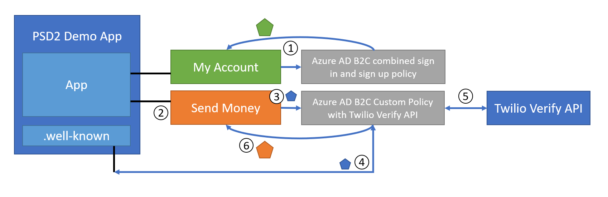

# Integrating Twilio Verify App with Azure Active Directory B2C

In this walkthrough, learn how to integrate a sample online payment app in Azure Active Directory B2C (Azure AD B2C) with the Twilio Verify API. By using Twilio Verify App, Azure AD B2C customers can comply with PSD2 (Payment Services Directive 2) transaction requirements through dynamic linking and strong customer authentication.

## Prerequisites

To get started, you'll need:

* An Azure AD subscription. If you don't have a subscription, you can get a [free account](https://azure.microsoft.com/free/).
* [An Azure AD B2C tenant](tutorial-create-tenant.md) that is linked to your Azure subscription.
* A [trial account](https://www.twilio.com/try-twilio) at Twilio.

## Scenario description

The following components make up the Twilio solution:

- .NET PSD2 demo web app, which provides the ability to sign in or sign up, and perform a dummy high risk transaction.
- Azure AD B2C combined sign-in and sign-up policy.
- Azure AD B2C policy integrated with Twilio Verify API using `id_token_hint`.
- .NET Web App, which hosts a `.well-known` OpenIdConnect endpoint to allow validation of an `id_token_hint`.


    

|      |      |
|------|------|
| 1     | The user initiates sign-in or sign-up to the PSD2 Demo app. The user is authenticated via the Azure AD B2C combined sign-in and sign-up policy. A token is returned to the application. At sign-up, the user's phone number is verified using SMS/Phone, and recorded on their Azure AD B2C account.     |
| 2     | The user initiates a high risk transaction, such as a transfer of $50.00. The user's current access token is evaluated for the PolicyId to determine if the user has already authenticated via a Step-Up custom policy.     |
| 3     | The application records the transaction value and payee, $50.00 and John Doe, and generates a signed token. This token is called an `id_token_hint` and contains the claim `amount:$500, payee:john doe`. The `id_token_hint` is sent along with the request to the Azure AD B2C custom policy, which is integrated with Twilio.     |
| 4     | Azure AD B2C verifies the signature of the id_token_hint by checking the applications `/.well-known` OpenId Connect endpoint. After verifying, it extracts the claims from this token, notably the `amount` and `payee`. The user will see a page to verify their mobile phone number via SMS message.     |
| 5     | The user requests to verify their phone number via SMS message, and Azure AD B2C makes a REST API request to Twilio's Verify API endpoint. It also sends the transaction `amount` and `payee` as part of the PSD2 process to generate the One-Time-Passcode (OTP). Twilio sends an SMS message to the user's registered phone number.     |
| 6     |  The user enters the OTP received in their SMS message and submits it to Azure AD B2C. Azure AD B2C makes an API request with this OTP to Twilio's verify API to verify that the OTP is correct. Finally a token is issued to the application, with a new PolicyId signifying the user has stepped-up their authentication.    |
|      |      |

## Onboard with Twilio

1. Obtain a [trial account](https://www.twilio.com/try-twilio) at Twilio.

2. Purchase a Phone number at Twilio as described in [this article](https://support.twilio.com/hc/articles/223135247-How-to-Search-for-and-Buy-a-Twilio-Phone-Number-from-Console)

3. Navigate to [Verify API](https://www.twilio.com/console/verify/services) at the Twilio console and follow [instructions](https://www.twilio.com/docs/verify/verifying-transactions-psd2) to create a service and enable the PSD2 option.  

## Configure the PSD2 Demo App

1. Open the B2C-WebAPI-DotNet solution and replace the following values with your own tenant-specific values in the web.config:

    ```xml
   <add key="ida:Tenant" value="yourtenant.onmicrosoft.com" />
   <add key="ida:TenantId" value="d6f33888-0000-4c1f-9b50-1590f171fc70" />
   <add key="ida:ClientId" value="6bd98cc8-0000-446a-a05e-b5716ef2651b" />
   <add key="ida:ClientSecret" value="secret" />
   <add key="ida:AadInstance" value="https://yourtenant.b2clogin.com/tfp/{0}/{1}" />
   <add key="ida:RedirectUri" value="https://your hosted psd2 demo app url/" />
   ```

2. The web app also hosts the ID token hint generator and metadata endpoint.
   - Create your signing certificate as described in this [sample description](https://github.com/azure-ad-b2c/samples/tree/master/policies/invite#creating-a-signing-certificate).
   - Update the following lines based on your certificate in the web.config:
   
   ```xml
   <add key="ida:SigningCertThumbprint" value="4F39D6014818082CBB763E5BA5F230E545212E89" />
   <add key="ida:SigningCertAlgorithm" value="RS256" />
   ```

3. Upload the demo application to your hosting provider of choice. Guidance for Azure App Service is provided in [this sample description](https://github.com/azure-ad-b2c/samples/tree/master/policies/invite#hosting-the-application-in-azure-app-service), including instructions for uploading your certificate.

4. Update your Azure AD B2C application registration by adding a Reply URL equivalent to the URL at which the application is hosted.

5. Open the policy files and replace all instances of `contoso` with your tenant name.

6. Find the Twilio REST API technical profile **Custom-SMS-Enroll**. Update the `ServiceURL` with your Twilio AccountSID and the From number to your purchased phone number.

7. Find the Twilio REST API technical profiles, **TwilioRestAPI-Verify-Step1** and **TwilioRestAPI-Verify-Step2**, and update the `ServiceURL` with your Twilio AccountSID.

## Integrate with Azure AD B2C

Add the policy files to Azure AD B2C:

1. Sign in to the [Azure portal](https://portal.azure.com/) as the global administrator of your Azure AD B2C tenant.

2. Make sure you're using the directory that contains your Azure AD B2C tenant by selecting the **Directory + subscription** filter in the top menu and choosing the directory that contains your tenant.

3. Choose **All services** in the top-left corner of the Azure portal, search for and select **Azure AD B2C**.

4. Navigate to **Azure AD B2C** > **Identity Experience Framework** > **Policy Keys**.

5. Add a new key with the name **B2cRestTwilioClientId**. Select **manual**, and provide the value of the Twilio AccountSID.

6. Add a new Key with the name **B2cRestTwilioClientSecret**. Select **manual**, and provide the value of the Twilio AUTH TOKEN.

7. Upload all the policy files to your tenant.

8. Customize the string in the GenerateOTPMessageEnrol claims transform for your sign-up SMS text.

## Test the solution

* Browse to your application and test the sign-in, sign-up, and Send Money actions.

## Next steps

For additional information, review the following articles:

- Refer to GitHub for [Twilio integration code samples](https://github.com/azure-ad-b2c/samples/tree/master/policies/twilio-mfa-psd2)  

- [Custom policies in AAD B2C](custom-policy-overview.md)

- [Get started with custom policies in AAD B2C](custom-policy-get-started.md?tabs=applications)
