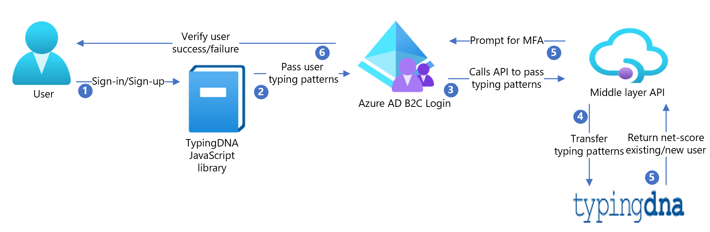

# Tutorial for configuring TypingDNA with Azure Active Directory B2C

In this walkthrough, learn how to integrate a sample online payment app in Azure Active Directory B2C with the TypingDNA  APP. By using TypingDNA App, Azure AD B2C customers can comply with [Payment Services Directive 2](https://www.typingdna.com/use-cases/sca-strong-customer-authentication) (PSD2) transaction requirements through keystroke dynamics and strong customer authentication. Find more about TypingDNA [here](https://www.typingdna.com/).

 Azure AD B2C uses TypingDNA's technologies to capture the users typing characteristics and have them recorded and analyzed for familiarity on each authentication. This adds a layer of protection related to the riskiness of an authentication and  evaluates the risk levels. Azure AD B2C can invoke other mechanisms to provide further confidence the user is who they claim to be by invoking Azure MFA, forcing email verification, or any other custom logic for your scenario.

>[!NOTE]
> This sample policy is based on [SocialAndLocalAccountsWithMfa](https://github.com/Azure-Samples/active-directory-b2c-custom-policy-starterpack/tree/master/SocialAndLocalAccountsWithMfa) starter pack.

## Scenario description



### Sign-up

1. Azure AD B2C pages use TypingDNA's JavaScript library to record the user's typing pattern. For example, the username and password are recorded at sign-up for the initial enrollment, and then on every sign-in for verification.

2. When the user submits the page, the TypingDNA library will compute the typing characteristic of the user. After that, insert the information into a hidden text field which Azure AD B2C has rendered. This field is hidden with CSS.  

    The sample contains HTML files with the JavaScript and CSS modifications, and is referenced by the `api.selfasserted.tdnasignin` and `api.selfasserted.tdnasignup` content definitions. Refer to [hosting the page content](https://docs.microsoft.com/azure/active-directory-b2c/custom-policy-ui-customization#hosting-the-page-content) to host your HTML files.

3. Azure AD B2C now has the typing pattern within the claim bag when the user submits their credentials. It must call an API (yours) to pass this data to the TypingDNA REST API endpoint. This API is included in the sample (typingDNA-API-Interface).
4. The middle layer API then passes the typing pattern data to TypingDNA REST API. At sign-up, the [check user endpoint](https://api.typingdna.com/index.html#api-API_Services-GetUser) is called to confirm the user didn't exist and then the [save pattern](https://api.typingdna.com/index.html#api-API_Services-saveUserPattern) endpoint is called to save the user's first typing pattern.

> [!NOTE]
> All calls to the TypingDNA REST API endpoint send a UserId. This must be a hashed value. Azure AD B2C uses the `HashObjectIdWithEmail` claims transformation to hash the email with a random salt and secret.  

The REST API calls are modeled with `validationTechnicalProfiles` within `LocalAccountSignUpWithLogonEmail-TDNA`:

```xml

<ValidationTechnicalProfiles>

    <ValidationTechnicalProfile ReferenceId="AAD-UserWriteUsingLogonEmail-TDNA" />
    <ValidationTechnicalProfile ReferenceId="REST-TDNA-CheckUser" ContinueOnError="true"/>

    <ValidationTechnicalProfile ReferenceId="REST-TDNA-SaveUser"/>

</ValidationTechnicalProfiles>

```

### Sign-in

At subsequent sign-in's, the user's typing pattern is computed in the same manner as at sign up using the custom HTML. Once the typing profile is within the Azure AD B2C claim bag, Azure AD B2C will call your API to call TypingDNA's REST API endpoint. The [check user](https://api.typingdna.com/index.html#api-API_Services-GetUser) endpoint is called to confirm the user exists. Next, [verify pattern](https://api.typingdna.com/index.html#api-API_Services-verifyTypingPattern) endpoint is called to return the `net_score`. This `net_score` is an indication of how close the typing pattern was to the original at sign up.

This typing pattern is modeled with `validationTechnicalProfiles` within `SelfAsserted-LocalAccountSignin-Email-TDNA`:

```xml

<ValidationTechnicalProfiles>

    <ValidationTechnicalProfile ReferenceId="login-NonInteractive"/>

    <ValidationTechnicalProfile ReferenceId="REST-TDNA-CheckUser" ContinueOnError="false"/>

    <ValidationTechnicalProfile ReferenceId="REST-TDNA-VerifyUser"/>

    <ValidationTechnicalProfile ReferenceId="REST-TDNA-SaveUser">

        <Preconditions>

            <Precondition Type="ClaimEquals" ExecuteActionsIf="true">

            <Value>saveTypingPattern</Value>

            <Value>False</Value>

            <Action>SkipThisValidationTechnicalProfile</Action>

            </Precondition>

        </Preconditions>

    </ValidationTechnicalProfile>

</ValidationTechnicalProfiles>

```

 If the user obtains a typing pattern that has a high `net_score`, you can save this using the TypingDNA [save typing pattern](https://api.typingdna.com/index.html#api-API_Services-saveUserPattern) endpoint.  

Your API must return a claim  `saveTypingPattern` if you would like the TypingDNA save typing pattern endpoint to be called by Azure AD B2C (via your API).

The example in the repo contains an API (TypingDNA-API-Interface) which is configured with the following properties.

- Training mode - If the user has fewer than two patterns saved, always prompt for MFA.

- If the user has 2-5 patterns saved, and the `net_score` is lower than 50, prompt for MFA.

- If the user has 5+ patterns saved, and the `net_score` is lower than 65, prompt for MFA.

These thresholds should be adjusted on your use case.

- After your API has evaluated the `net_score`, it should return a boolean claim to B2C - `promptMFA`.

- The `promptMFA` claim is used within a pre-condition to conditionally execute Azure MFA.

```xml

<OrchestrationStep Order="3" Type="ClaimsExchange">

    <Preconditions>

        <Precondition Type="ClaimsExist" ExecuteActionsIf="true">

            <Value>isActiveMFASession</Value>

            <Action>SkipThisOrchestrationStep</Action>

        </Precondition>

        <Precondition Type="ClaimEquals" ExecuteActionsIf="true">

            <Value>promptMFA</Value>

            <Value>False</Value>

            <Action>SkipThisOrchestrationStep</Action>

        </Precondition>

    </Preconditions>

    <ClaimsExchanges>

        <ClaimsExchange Id="PhoneFactor-Verify" TechnicalProfileReferenceId="PhoneFactor-InputOrVerify" />

    </ClaimsExchanges>

</OrchestrationStep>

```

## Onboard with TypingDNA

1. Sign up for TypingDNA [here](https://www.typingdna.com/)
2. Log in into TypingDNA dashboard and obtain **API key** and **API secret**. This will be needed in the API interface setup later

## Integrate TypingDNA with Azure AD B2C

1. Host the TypingDNA-API-Interface at your hosting provider of choice
2. Replace all instances of `apiKey` and `apiSecret` in TypingDNA-API-Interface solution with the credentials from your TypingDNA dashboard
3. Host the HTML files at your provider of choice following the CORS requirements [here](https://docs.microsoft.com/azure/active-directory-b2c/custom-policy-ui-customization#3-configure-cors)
4. Replace the LoadURI elements for the `api.selfasserted.tdnasignup` and `api.selfasserted.tdnasignin` content definitions in the `TrustFrameworkExtensions.xml` file to the URI of your hosted HTML files respectively.
5. Create a B2C policy key under identity experience framework in the Azure AD blade in the **Azure portal**. Use the `Generate` option and name this key `tdnaHashedId`.
6. Replace the TenantId's in the policy files
7. Replace the ServiceURLs in all TypingDNA REST API technical profiles (REST-TDNA-VerifyUser, REST-TDNA-SaveUser, REST-TDNA-CheckUser) with the endpoint for your TypingDNA-API-Interface API.
8. Upload policy files to your tenant.

## Test the user flow

1. Open the B2C tenant and choose identity experience framework.
2. Select your previously created **User Flow**.
3. Select **Run** user flow

    a. **Application** - select the registered app (sample is JWT)

    b. **Reply URL** - select the redirect URL

    c. Select **Run user flow**.
  
4. Go through sign-up flow and create an account
5. Sign out
6. Go through sign-in flow
7. Resulting JWT result will show the TypingDNA results

## Live version

• MFA has been disabled in this test version, but you can see the result on whether MFA would have been prompted by the claim `promptMFA` after authentication.

• Sign up [here](https://b2cprod.b2clogin.com/b2cprod.onmicrosoft.com/oauth2/v2.0/authorize?p=B2C_1A_SU_TDNA&client_id=51d907f8-db14-4460-a1fd-27eaeb2a74da&nonce=defaultNonce&redirect_uri=https://jwt.ms/&scope=openid&response_type=id_token&prompt=login) and Sign in [here](https://b2cprod.b2clogin.com/b2cprod.onmicrosoft.com/oauth2/v2.0/authorize?p=B2C_1A_SI_TDNA&client_id=51d907f8-db14-4460-a1fd-27eaeb2a74da&nonce=defaultNonce&redirect_uri=https://jwt.ms/&scope=openid&response_type=id_token&prompt=login)

## Next steps

For additional information, review the following articles:

- [Custom policies in AAD B2C](https://docs.microsoft.com/azure/active-directory-b2c/custom-policy-overview)

- [Get started with custom policies in AAD B2C](https://docs.microsoft.com/azure/active-directory-b2c/custom-policy-get-started?tabs=applications)
