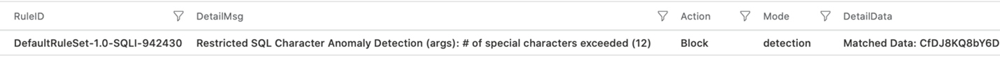
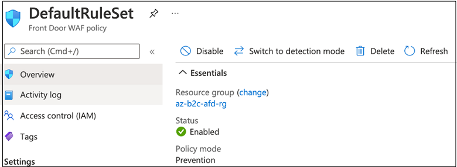

# Tutorial: Configure Azure Active Directory B2C with Azure Web Application Firewall

Learn how to enable the Azure Web Application Firewall (WAF) service for an Azure Active Directory B2C (Azure AD B2C) tenant, with a custom domain. WAF protects web applications from common exploits and vulnerabilities.

>[!NOTE]
>This feature is in public preview. 

See, [What is Azure Web Application Firewall?](../web-application-firewall/overview.md)

## Prerequisites

To get started, you need:

* An Azure subscription
* If you don't have one, get an [Azure free account](https://azure.microsoft.com/free/)
* **An Azure AD B2C tenant** – authorization server that verifies user credentials using custom policies defined in the tenant
  * Also known as the identity provider (IdP)
  * See, [Tutorial: Create an Azure Active Directory B2C tenant](tutorial-create-tenant.md) 
* **Azure Front Door (AFD)** – enables custom domains for the Azure AD B2C tenant
  * See, [Azure Front Door and CDN documentation](../frontdoor/index.yml)
* **WAF** – manages traffic sent to the authorization server
  * [Azure Web Application Firewall](https://azure.microsoft.com/services/web-application-firewall/#overview)

## Custom domains in Azure AD B2C

To use custom domains in Azure AD B2C, use the custom domain features in AFD. See, [Enable custom domains for Azure AD B2C](./custom-domain.md?pivots=b2c-user-flow).  

   > [!IMPORTANT]
   > After you configure the custom domain, see [Test your custom domain](./custom-domain.md?pivots=b2c-custom-policy#test-your-custom-domain).  

## Enable WAF

To enable WAF, configure a WAF policy and associate it with the AFD for protection.

### Create a WAF policy

Create a WAF policy with Azure-managed default rule set (DRS). See, [Web Application Firewall DRS rule groups and rules](../web-application-firewall/afds/waf-front-door-drs.md).

1. Sign in to the [Azure portal](https://portal.azure.com).
2. Select **Create a resource**.
3. Search for Azure WAF. 
4. Select **Azure Web Application Firewall (WAF)**.
5. Select **Create**.
6. Go to the **Create a WAF policy** page.
7. Select the **Basics** tab. 
8. For **Policy for**, select **Global WAF (Front Door)**.
9. For **Front Door SKU**, select between **Basic**, **Standard**, or **Premium** SKU.
10. For **Subscription**, select your Front Door subscription name.
11. For **Resource group**, select your Front Door resource group name.
12. For **Policy name**, enter a unique name for your WAF policy.
13. For **Policy state**, select **Enabled**.
14. For **Policy mode**, select **Detection**.
15. Select **Review + create**.
16. Go to the **Association** tab of the Create a WAF policy page.
17. Select **+ Associate a Front Door profile**.
18. For **Front Door**, select your Front Door name associated with Azure AD B2C custom domain.
19. For **Domains**, select the Azure AD B2C custom domains to associate the WAF policy to.
20. Select **Add**.
21. Select **Review + create**.
22. Select **Create**.

### Detection and Prevention modes

When you create WAF policy, the policy is in Detection mode. We recommend you don't disable Detection mode. In this mode, WAF doesn't block requests. Instead, requests that match the WAF rules are logged in the WAF logs. 

Learn more: [Azure Web Application Firewall monitoring and logging](../web-application-firewall/afds/waf-front-door-monitor.md)

The following query shows the requests blocked by the WAF policy in the past 24 hours. The details include, rule name, request data, action taken by the policy, and the policy mode.
   
   

   

Review the WAF logs to determine if policy rules cause false positives. Then, exclude the WAF rules based on the WAF logs.

Learn more: [Define exclusion rules based on Web Application Firewall logs](../web-application-firewall/afds/waf-front-door-exclusion.md#define-exclusion-based-on-web-application-firewall-logs)

#### Switching modes

To see WAF operating, select **Switch to prevention mode**, which changes the mode from Detection to Prevention. Requests that match the rules in the DRS are blocked and logged in the WAF logs.

  

To revert to Detection mode, select **Switch to detection mode**.

  

## Next steps

* [Azure Web Application Firewall monitoring and logging](../web-application-firewall/afds/waf-front-door-monitor.md)
* [Web Application Firewall (WAF) with Front Door exclusion lists](../web-application-firewall/afds/waf-front-door-exclusion.md)
