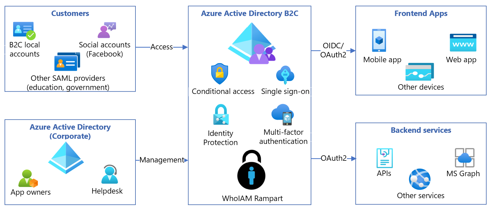
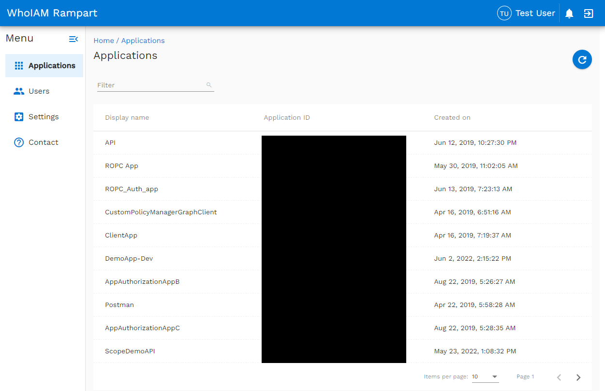
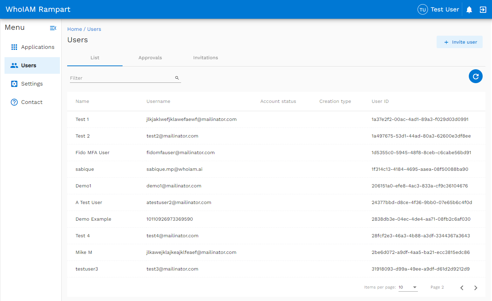

# Configure WhoIAM Rampart with Azure Active Directory B2C

In this tutorial, learn to integrate Azure Active Directory B2C (Azure AD B2C) authentication with WhoIAM Rampart. Rampart features enable an integrated helpdesk and invitation-gated user registration experience. Support specialists can reset passwords and multifactor authentication without using Azure. There are apps and role-based access control (RBAC) for Azure AD B2C users.

## Prerequisites

* An Azure subscription

  * If you don't have one, get an [Azure free account](https://azure.microsoft.com/free/)
* An Azure AD B2C tenant linked to the Azure subscription
  * See, [Tutorial: Create an Azure Active Directory B2C tenant](tutorial-create-tenant.md)
* An Azure DevOps Server instance
* A SendGrid account
  * Go to sengrid.com to [Start for Free](https://sendgrid.com/)
* A WhoIAM trial account 
  * Go to whoaim.ai [Contact us](https://www.whoiam.ai/contact-us/) to get started

## Scenario description

WhoIAM Rampart is built in Azure and runs in the Azure environment. The following components comprise the Rampart solution with Azure AD B2C:

* **a Microsoft Entra tenant** - the Azure AD B2C tenant stores users and manages access (and scope) in Rampart
* **Custom B2C policies** - to integrate with Rampart 
* **A resource group** - hosts Rampart functionality

   

## Install Rampart

Go to whoiam.ai [Contact us](https://www.whoiam.ai/contact-us/) to get started. 

Automated templates deploy Azure resources. Templates configure the DevOps instance with code and configuration.

## Configure and integrate Rampart with Azure AD B2C

The solution integration with Azure AD B2C requires custom policies. WhoIAM provides the policies and helps integrate them with applications or policies, or both.

For details about WhoIAM custom policies, go to docs.gatekeeper.whoiamdemos.com for [Set-up Guide, Authorization Policy Execution](https://docs.gatekeeper.whoiamdemos.com/#/setup-guide?id=authorization-policy-execution). 

## Test the solution

The following image is an example a list of app registrations in your Azure AD B2C tenant. WhoIAM validates the implementation by testing features and health check status endpoints.

   

A list of user-created applications in your Azure AD B2C tenant appears. Likewise, the user sees a list of users in your Azure AD B2C directory and user management functions such as invitations, approvals, and RBAC management.

   

## Next steps

- [Set-up Guide, Authorization Policy Execution](https://docs.gatekeeper.whoiamdemos.com/#/setup-guide?id=authorization-policy-execution)
- [Azure AD B2C custom policy overview](custom-policy-overview.md)
- [Tutorial: Create user flows and custom policies in Azure AD B2C](tutorial-create-user-flows.md?pivots=b2c-custom-policy)
