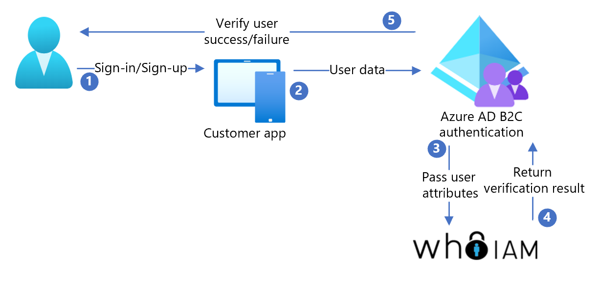

# Tutorial to configure Azure Active Directory B2C with WhoIAM

In this tutorial, learn how to configure WhoIAM Branded Identity Management System (BRIMS) in your environment and integrate it with Azure Active Directory B2C (Azure AD B2C). The BRIMS apps and services are deployed in your environment. They provide user verification with voice, SMS, and email. BRIMS works with your identity and access management solution and is platform-agnostic.

Learn more: [WhoIAM, Products and Services, Branded Identity Management System](https://www.whoiam.ai/product/branded-identity-management/)

## Prerequisites

To get started, you'll need:

* An Azure subscription

  - If you don't have one, you can get an [Azure free account](https://azure.microsoft.com/free/)
- [An Azure AD B2C tenant](./tutorial-create-tenant.md) linked to your Azure subscription
- A WhoIAM trial account
  - Go to [WhoIAM, Contact us](https://www.whoiam.ai/contact-us/) to get started

## Scenario description

The WhoIAM integration includes the following components:

- **Azure AD B2C tenant** - The authorization server that verifies user credentials, based on custom policies, know as the identity provider (IdP)
- **Administration portal** - To manage clients and their configurations
- **API service** - To expose various features through endpoints 
- **Azure Cosmos DB** - The back end for the BRIMS administration portal and API service

The following diagram shows the implementation architecture.

   

1. The user signs up or signs in to request an app that uses Azure AD B2C as IdP
2. The user requests ownership verification of their email, phone, or they use voice as biometric verification 
3. Azure AD B2C calls to the BRIMS API service and passes the user attributes
4. BRIMS interacts with the user in their own language
5. After verification, BRIMS returns a token to Azure AD B2C, which grants access, or doesn't.  

## Sign up with WhoIAM

1. Contact [WhoIAM](https://www.whoiam.ai/contact-us/) and create a BRIMS account.
2. Configure the following Azure services:

    * [Key Vault](https://azure.microsoft.com/services/key-vault/): Store passwords
    * [App Service](https://azure.microsoft.com/services/app-service/): Host the BRIMS API and admin portal services
    * [Microsoft Entra ID](https://azure.microsoft.com/services/active-directory/): Authenticate administrative users for the portal
    * [Azure Cosmos DB](https://azure.microsoft.com/services/cosmos-db/): Store and retrieve settings
    * [Application Insights overview](../azure-monitor/app/app-insights-overview.md) (optional): Sign in to the API and the portal

3. Deploy the BRIMS API and the BRIMS administration portal in your Azure environment.
4. Follow the documentation to configure your app. Use BRIMS for user identity verification. Azure AD B2C custom policy samples are in the BRIMS sign-up documentation.  
For more information about WhoIAM BRIMS, request documentation on [WhoIAM, Contact Us](https://www.whoiam.ai/product/branded-identity-management/).

## Test the user flow

1. Open the Azure AD B2C tenant. 
2. Under **Policies**, select **Identity Experience Framework**.
3. Select the created **SignUpSignIn**.
4. Select **Run user flow**.
5. For **Application**, select the registered app (example is JWT).
6. For **Reply URL**, select the **redirect URL**.
7. Select **Run user flow**.
8. Complete the sign-up flow
9. Create an account.
10. After the user attribute is created, the BRIMS service is called. 

> [!TIP]
> If the flow is incomplete, confirm the user is saved in the directory.

## Next steps

- [Azure AD B2C custom policy overview](./custom-policy-overview.md)
- [Tutorial: Create user flows and custom policies in Azure Active Directory B2C](tutorial-create-user-flows.md?pivots=b2c-custom-policy)
