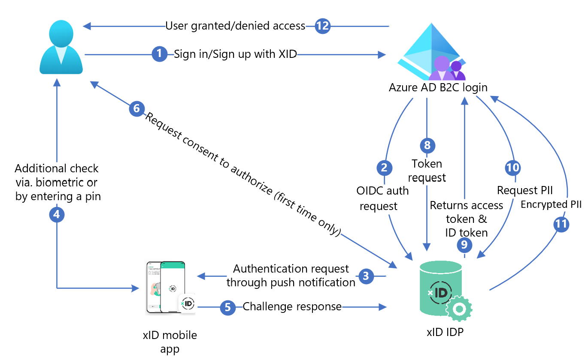

# Configure xID with Azure Active Directory B2C for passwordless authentication

In this tutorial, learn to integrate Azure Active Directory B2C (Azure AD B2C) authentication with the xID digital ID solution. The xID app provides users with passwordless, secure, multifactor authentication. The My Number Card, the digital ID card issued by the Japanese government, verifies xID-authenticated user identities. For their users, organizations can get verified Personal Identification Information (customer content) through the xID API. Furthermore, the xID app generates a private key in a secure area in user mobile devices, making them digital signing devices.

## Prerequisites

* An Azure subscription

  * If you don't have one, you can get an [Azure free account](https://azure.microsoft.com/free/)
* An Azure AD B2C tenant linked to the Azure subscription
  * See, [Tutorial: Create an Azure Active Directory B2C tenant](./tutorial-create-tenant.md)
* Your xID client information provided by xID inc. 
* Go to the xid.inc [Contact Us](https://xid.inc/contact-us) page for xID client information:
  * Client ID
  * Client Secret
  * Redirect URL
  * Scopes
* Go to x-id.me to install the [xID app](https://x-id.me/) on a mobile device:
  * My Number Card
  * If you use API UAT version, get the xID app UAT version. See, [Contact Us](https://xid.inc/contact-us)

## Scenario description

The following diagram shows the architecture.



1. At the Azure AD B2C sign-in page user signs in or signs up.
2. Azure AD B2C redirects the user to xID authorize API endpoint using an OpenID Connect (OIDC) request. An OIDC endpoint has endpoint information. xID identity provider (IdP) redirects the user to the xID authorization sign in page. User enters email address.
3. xID IdP sends push notification to user mobile device.
4. User opens the xID app, checks the request, enters a PIN, or uses biometrics. xID app activates the private key and creates an electronic signature.
5. xID app sends the signature to xID IdP for verification.
6. A consent screen appears to give personal information to the service.
7. xID IdP returns the OAuth authorization code to Azure AD B2C.
8. Azure AD B2C sends a token request using the authorization code.
9. xID IdP checks the token request. If valid, OAuth access token is returned and the ID token with user identifier and email address.
10. If user customer content is needed, Azure AD B2C calls the xID user data API.
11. The xID user data API returns encrypted customer content. Users decrypt with a private key, created when requesting xID client information.
12. User is granted or denied access to the customer application.


## Install xID

1. To request API documents, fill out the request form.  Go to [Contact Us](https://xid.inc/contact-us). 
2. In the message, indicate you're using Azure AD B2C. 
3. An xID sales representative contacts you. 
4. Follow the instructions in the xID API document.
5. Request an xID API client. 
6. xID tech team sends client information to you in 3-4 business days.
7. Supply a redirect URI in your site using the following pattern. Users return to it after authentication. 

`https://<your-b2c-domain>.b2clogin.com/<your-b2c-domain>.onmicrosoft.com/oauth2/authresp`

## Register a web application in Azure AD B2C

Register applications in a tenant you manage, then they can interact with Azure AD B2C.

Learn more: [Application types that can be used in Active Directory B2C](application-types.md)

For testing, you register `https://jwt.ms`, a Microsoft web application with decoded token contents, which don't leave your browser.

### Register a web application and enable ID token implicit grant

Complete [Tutorial: Register a web application in Azure AD B2C](tutorial-register-applications.md?tabs=app-reg-ga) 

## Create a xID policy key

Store the Client Secret from xID in your Azure AD B2C tenant. For the following instructions, use the directory with the Azure AD B2C tenant.

1. Sign in to the [Azure portal](https://portal.azure.com/).
2. In the portal toolbar, select **Directories + subscriptions**.
3. On the **Portal settings | Directories + subscriptions** page, in the Directory name list, locate your Azure AD B2C directory.
4. Select **Switch**.
5. In the top-left corner of the Azure portal, select **All services**.
6. Search for and select **Azure AD B2C**.
7. On **Overview**, select **Identity Experience Framework**.
8. Select **Policy Keys**.
9. Select **Add**.
10. For **Options**, select **Manual**.
11. Enter a policy key **Name** for the policy key. The prefix `B2C_1A_` is appended to the key name.
12. In **Secret**, enter the Client Secret from xID.
13. For **Key usage**, select **Signature**.
14. Select **Create**.

   >[!NOTE]
   >In Azure AD B2C, custom policies are for complex scenarios. 
   >
   >See, [User flows and custom policies overview](./user-flow-overview.md).


## Configure xID as identity provider

For users to sign in using xID, make xID a claims provider that Azure AD B2C communicates with through an endpoint. The endpoint provides claims Azure AD B2C uses to verify users authenticated with digital identity on their device.

### Add xID as a claims provider

Get the custom policy starter packs from GitHub, then update the XML files in the SocialAccounts starter pack with your Azure AD B2C tenant name.

1. Download the zip file [active-directory-b2c-policy-starterpack-main](https://github.com/Azure-Samples/active-directory-b2c-custom-policy-starterpack/archive/master.zip) or clone the repository. See, [Azure-Samples/active-directory-b2c-custom-policy-starterpack](https://github.com/Azure-Samples/active-directory-b2c-custom-policy-starterpack).
2. In the files in the **SocialAccounts** directory, replace the string `yourtenant` with the name of your Azure AD B2C tenant. For example, `yourtenant.onmicrosoft.com` becomes `contoso.onmicrosoft.com`. 
3. Open the **SocialAccounts/TrustFrameworkExtensions.xml**.
4. Find the **ClaimsProviders** element. If there isn't one, add it under the root element.
5. Add a new **ClaimsProvider** similar to the following example:

   ```xml

    <ClaimsProvider>
      <Domain>X-ID</Domain>
      <DisplayName>X-ID</DisplayName>
      <TechnicalProfiles>
        <TechnicalProfile Id="X-ID-OIDC">
          <DisplayName>X-ID</DisplayName>
          <Description>Login with your X-ID account</Description>
          <Protocol Name="OpenIdConnect" />
          <Metadata>
            <Item Key="METADATA">https://oidc-uat.x-id.io/.well-known/openid-configuration</Item>
            <!-- Update the Client ID below to the X-ID Application ID -->
            <Item Key="client_id">00000000-0000-0000-0000-000000000000</Item>
            <Item Key="response_types">code</Item>
            <Item Key="scope">openid verification</Item>
            <Item Key="response_mode">query</Item>
            <Item Key="HttpBinding">POST</Item>
            <Item Key="UsePolicyInRedirectUri">false</Item>
            <Item Key="DiscoverMetadataByTokenIssuer">true</Item>
            <Item Key="token_endpoint_auth_method">client_secret_basic</Item>
            <Item Key="ClaimsEndpoint">https://oidc-uat.x-id.io/userinfo</Item>
            <Item Key="ValidTokenIssuerPrefixes">https://oidc-uat.x-id.io/</Item>
          </Metadata>
          <CryptographicKeys>
            <Key Id="client_secret" StorageReferenceId="B2C_1A_XIDSecAppSecret" />
          </CryptographicKeys>
          <OutputClaims>
            <OutputClaim ClaimTypeReferenceId="issuerUserId" PartnerClaimType="sub" />
            <OutputClaim ClaimTypeReferenceId="tenantId" PartnerClaimType="tid" />
            <OutputClaim ClaimTypeReferenceId="email" />
            <OutputClaim ClaimTypeReferenceId="sid" />
            <OutputClaim ClaimTypeReferenceId="userdataid" />
            <OutputClaim ClaimTypeReferenceId="XID_verified" />
            <OutputClaim ClaimTypeReferenceId="email_verified" />
            <OutputClaim ClaimTypeReferenceId="authenticationSource" DefaultValue="socialIdpAuthentication" AlwaysUseDefaultValue="true" />
            <OutputClaim ClaimTypeReferenceId="identityProvider" PartnerClaimType="iss" DefaultValue="https://oidc-uat.x-id.io/" />
            <OutputClaim ClaimTypeReferenceId="identityProviderAccessToken" PartnerClaimType="{oauth2:access_token}" />
          </OutputClaims>
          <OutputClaimsTransformations>
            <OutputClaimsTransformation ReferenceId="CreateRandomUPNUserName" />
            <OutputClaimsTransformation ReferenceId="CreateUserPrincipalName" />
            <OutputClaimsTransformation ReferenceId="CreateAlternativeSecurityId" />
            <OutputClaimsTransformation ReferenceId="CreateSubjectClaimFromAlternativeSecurityId" />
          </OutputClaimsTransformations>
          <UseTechnicalProfileForSessionManagement ReferenceId="SM-SocialLogin" />
        </TechnicalProfile>

      <TechnicalProfile Id="X-ID-Userdata">
        <DisplayName>Userdata (Personal Information)</DisplayName>
        <Protocol Name="Proprietary" Handler="Web.TPEngine.Providers.RestfulProvider, Web.TPEngine, Version=1.0.0.0, Culture=neutral, PublicKeyToken=null" />
        <Metadata>
          <Item Key="ServiceUrl">https://api-uat.x-id.io/v4/verification/userdata</Item>
          <Item Key="SendClaimsIn">Header</Item>
          <Item Key="AuthenticationType">Bearer</Item>
          <Item Key="UseClaimAsBearerToken">identityProviderAccessToken</Item>
          <!-- <Item Key="AllowInsecureAuthInProduction">true</Item> -->
          <Item Key="DebugMode">true</Item>
          <Item Key="DefaultUserMessageIfRequestFailed">Can't process your request right now, please try again later.</Item>
        </Metadata>
        <InputClaims>
          <!-- Claims sent to your REST API -->
          <InputClaim ClaimTypeReferenceId="identityProviderAccessToken" />
        </InputClaims>
        <OutputClaims>
          <!-- Claims parsed from your REST API -->
          <OutputClaim ClaimTypeReferenceId="last_name" />
          <OutputClaim ClaimTypeReferenceId="first_name" />
          <OutputClaim ClaimTypeReferenceId="previous_name" />
          <OutputClaim ClaimTypeReferenceId="year" />
          <OutputClaim ClaimTypeReferenceId="month" />
          <OutputClaim ClaimTypeReferenceId="date" />
          <OutputClaim ClaimTypeReferenceId="prefecture" />
          <OutputClaim ClaimTypeReferenceId="city" />
          <OutputClaim ClaimTypeReferenceId="address" />
          <OutputClaim ClaimTypeReferenceId="sub_char_common_name" />
          <OutputClaim ClaimTypeReferenceId="sub_char_previous_name" />
          <OutputClaim ClaimTypeReferenceId="sub_char_address" />
          <OutputClaim ClaimTypeReferenceId="gender" />
          <OutputClaim ClaimTypeReferenceId="verified_at" />
        </OutputClaims>
        <UseTechnicalProfileForSessionManagement ReferenceId="SM-Noop" />
      </TechnicalProfile>
    </TechnicalProfiles>
    </ClaimsProvider>

   ```

6. Set **client_id** with your xID Application ID.
7. Select **Save**.

## Add a user journey

Add an identity provider to sign-in pages. 

1. If you have a custom user journey, go to **Add the identity provider to a user journey**. Otherwise, create a duplicate of a template user journey:
2. From the starter pack, open the **TrustFrameworkBase.xml**.
3. Locate and copy the contents of the **UserJourneys** element that includes `ID=SignUpOrSignIn`.
4. Open the **TrustFrameworkExtensions.xml** and locate the UserJourneys element. If there isn't one, add one.
5. Paste the contents of the UserJourney element as a child of the UserJourneys element.
6. Rename the user journey ID. For example, `ID=CustomSignUpSignIn`

## Add the identity provider to a user journey

Add the new identity provider to the user journey.

1. Locate the orchestration step element with Type=`CombinedSignInAndSignUp`, or Type=`ClaimsProviderSelection` in the user journey. It's usually the first orchestration step. The **ClaimsProviderSelections** element has an identity provider list for signing in. The order of the elements controls the order of the sign-in buttons. 
2. Add a **ClaimsProviderSelection** XML element. 
3. Set the value of **TargetClaimsExchangeId** to a friendly name.
4. Add a **ClaimsExchange** element. 
5. Set the **ID** to the value of the target claims exchange ID. This change links the xID button to `X-IDExchange` action. 
6. Update the **TechnicalProfileReferenceId** value to the technical profile ID you created (`X-ID-OIDC`).
7. Add an Orchestration step to call xID UserInfo endpoint to return claims about the authenticated user `X-ID-Userdata`.

The following XML demonstrates the user journey orchestration with xID identity provider.

   ```xml

    <UserJourney Id="CombinedSignInAndSignUp">
      <OrchestrationSteps>

        <OrchestrationStep Order="1" Type="CombinedSignInAndSignUp" ContentDefinitionReferenceId="api.signuporsignin">
          <ClaimsProviderSelections>
            <ClaimsProviderSelection TargetClaimsExchangeId="X-IDExchange" />
          </ClaimsProviderSelections>
        </OrchestrationStep>

        <OrchestrationStep Order="2" Type="ClaimsExchange">
          <ClaimsExchanges>
            <ClaimsExchange Id="X-IDExchange" TechnicalProfileReferenceId="X-ID-OIDC" />
          </ClaimsExchanges>
        </OrchestrationStep>

        <OrchestrationStep Order="3" Type="ClaimsExchange">
          <ClaimsExchanges>
            <ClaimsExchange Id="X-ID-Userdata" TechnicalProfileReferenceId="X-ID-Userdata" />
          </ClaimsExchanges>
        </OrchestrationStep>

        <!-- For social IDP authentication, attempt to find the user account in the directory. -->
        <OrchestrationStep Order="4" Type="ClaimsExchange">
          <ClaimsExchanges>
            <ClaimsExchange Id="AADUserReadUsingAlternativeSecurityId" TechnicalProfileReferenceId="AAD-UserReadUsingAlternativeSecurityId-NoError" />
          </ClaimsExchanges>
        </OrchestrationStep>

        <!-- Show self-asserted page only if the directory does not have the user account already (i.e. we do not have an objectId).  -->
        <OrchestrationStep Order="5" Type="ClaimsExchange">
          <Preconditions>
            <Precondition Type="ClaimsExist" ExecuteActionsIf="true">
              <Value>objectId</Value>
              <Action>SkipThisOrchestrationStep</Action>
            </Precondition>
          </Preconditions>
          <ClaimsExchanges>
            <ClaimsExchange Id="SelfAsserted-Social" TechnicalProfileReferenceId="SelfAsserted-Social" />
          </ClaimsExchanges>
        </OrchestrationStep>

        <!-- The previous step (SelfAsserted-Social) could have been skipped if there were no attributes to collect 
             from the user. So, in that case, create the user in the directory if one does not already exist 
             (verified using objectId which would be set from the last step if account was created in the directory. -->
        <OrchestrationStep Order="6" Type="ClaimsExchange">
          <Preconditions>
            <Precondition Type="ClaimsExist" ExecuteActionsIf="true">
              <Value>objectId</Value>
              <Action>SkipThisOrchestrationStep</Action>
            </Precondition>
          </Preconditions>
          <ClaimsExchanges>
            <ClaimsExchange Id="AADUserWrite" TechnicalProfileReferenceId="AAD-UserWriteUsingAlternativeSecurityId" />
          </ClaimsExchanges>
        </OrchestrationStep>

        <OrchestrationStep Order="7" Type="SendClaims" CpimIssuerTechnicalProfileReferenceId="JwtIssuer" />

      </OrchestrationSteps>
      <ClientDefinition ReferenceId="DefaultWeb" />
    </UserJourney>

   ```

There are identity claims xID supports referenced as part of the policy. Claims schema is where you declare the claims. The ClaimsSchema element has a ClaimType element list. The ClaimType element contains the ID attribute, which is the claim name.

1. Open the **TrustFrameworksExtension.xml**.
2. Locate the **BuildingBlocks** element.
3. Add the following ClaimType element in the **ClaimsSchema** element of the **TrustFrameworksExtension.xml** policy

```xml
 <BuildingBlocks>
    <ClaimsSchema>
      <!-- xID -->
      <ClaimType Id="sid">
        <DisplayName>sid</DisplayName>
        <DataType>string</DataType>
      </ClaimType>
      <ClaimType Id="userdataid">
        <DisplayName>userdataid</DisplayName>
        <DataType>string</DataType>
      </ClaimType>
      <ClaimType Id="xid_verified">
        <DisplayName>xid_verified</DisplayName>
        <DataType>boolean</DataType>
      </ClaimType>
      <ClaimType Id="email_verified">
        <DisplayName>email_verified</DisplayName>
        <DataType>boolean</DataType>
      </ClaimType>
      <ClaimType Id="identityProviderAccessToken">
        <DisplayName>Identity Provider Access Token</DisplayName>
        <DataType>string</DataType>
        <AdminHelpText>Stores the access token of the identity provider.</AdminHelpText>
      </ClaimType>
      <ClaimType Id="last_name">
        <DisplayName>last_name</DisplayName>
        <DataType>string</DataType>
      </ClaimType>
      <ClaimType Id="first_name">
        <DisplayName>first_name</DisplayName>
        <DataType>string</DataType>
      </ClaimType>
      <ClaimType Id="previous_name">
        <DisplayName>previous_name</DisplayName>
        <DataType>string</DataType>
      </ClaimType>
      <ClaimType Id="year">
        <DisplayName>year</DisplayName>
        <DataType>string</DataType>
      </ClaimType>
      <ClaimType Id="month">
        <DisplayName>month</DisplayName>
        <DataType>string</DataType>
      </ClaimType>
      <ClaimType Id="date">
        <DisplayName>date</DisplayName>
        <DataType>string</DataType>
      </ClaimType>
      <ClaimType Id="prefecture">
        <DisplayName>prefecture</DisplayName>
        <DataType>string</DataType>
      </ClaimType>
      <ClaimType Id="city">
        <DisplayName>city</DisplayName>
        <DataType>string</DataType>
      </ClaimType>
      <ClaimType Id="address">
        <DisplayName>address</DisplayName>
        <DataType>string</DataType>
      </ClaimType>
      <ClaimType Id="sub_char_common_name">
        <DisplayName>sub_char_common_name</DisplayName>
        <DataType>string</DataType>
      </ClaimType>
      <ClaimType Id="sub_char_previous_name">
        <DisplayName>sub_char_previous_name</DisplayName>
        <DataType>string</DataType>
      </ClaimType>
      <ClaimType Id="sub_char_address">
        <DisplayName>sub_char_address</DisplayName>
        <DataType>string</DataType>
      </ClaimType>
      <ClaimType Id="verified_at">
        <DisplayName>verified_at</DisplayName>
        <DataType>int</DataType>
      </ClaimType>
      <ClaimType Id="gender">
        <DisplayName>Gender</DisplayName>
        <DataType>string</DataType>
        <DefaultPartnerClaimTypes>
          <Protocol Name="OpenIdConnect" PartnerClaimType="gender" />
        </DefaultPartnerClaimTypes>
        <AdminHelpText>The user's gender.</AdminHelpText>
        <UserHelpText>Your gender.</UserHelpText>
        <UserInputType>TextBox</UserInputType>
      </ClaimType>
      <ClaimType Id="correlationId">
        <DisplayName>correlation ID</DisplayName>
        <DataType>string</DataType>
      </ClaimType>
      <!-- xID -->
    </ClaimsSchema>
  </BuildingBlocks>
```

## Configure the relying party policy

The relying party policy, for example [SignUpSignIn.xml](https://github.com/Azure-Samples/active-directory-b2c-custom-policy-starterpack/blob/main/LocalAccounts/SignUpOrSignin.xml), specifies the user journey the Azure AD B2C executes. 

1. In the relying party,locate the **DefaultUserJourney** element. 
2. Update the **ReferenceId** to match the user journey ID you added to the identity provider.

In the following example, for the xID user journey, the **ReferenceId** is set to `CombinedSignInAndSignUp`.

```xml
   <RelyingParty>
        <DefaultUserJourney ReferenceId="CombinedSignInAndSignUp" />
        <TechnicalProfile Id="PolicyProfile">
          <DisplayName>PolicyProfile</DisplayName>
          <Protocol Name="OpenIdConnect" />
          <OutputClaims>
          <OutputClaim ClaimTypeReferenceId="objectId" PartnerClaimType="sub" />
          <OutputClaim ClaimTypeReferenceId="tenantId" AlwaysUseDefaultValue="true" DefaultValue="{Policy:TenantObjectId}" />
          <OutputClaim ClaimTypeReferenceId="correlationId" DefaultValue="{Context:CorrelationId}" />
          <OutputClaim ClaimTypeReferenceId="issuerUserId" />
          <OutputClaim ClaimTypeReferenceId="givenName" PartnerClaimType="first_name" />
          <OutputClaim ClaimTypeReferenceId="surName" PartnerClaimType="last_name" />
          <OutputClaim ClaimTypeReferenceId="previous_name" />
          <OutputClaim ClaimTypeReferenceId="year" />
          <OutputClaim ClaimTypeReferenceId="month" />
          <OutputClaim ClaimTypeReferenceId="date" />
          <OutputClaim ClaimTypeReferenceId="prefecture" />
          <OutputClaim ClaimTypeReferenceId="city" />
          <OutputClaim ClaimTypeReferenceId="address" />
          <OutputClaim ClaimTypeReferenceId="sub_char_common_name" />
          <OutputClaim ClaimTypeReferenceId="sub_char_previous_name" />
          <OutputClaim ClaimTypeReferenceId="sub_char_address" />
          <OutputClaim ClaimTypeReferenceId="gender" />
          <OutputClaim ClaimTypeReferenceId="verified_at" />
          <OutputClaim ClaimTypeReferenceId="email" />
          <OutputClaim ClaimTypeReferenceId="sid" />
          <OutputClaim ClaimTypeReferenceId="userdataid" />
          <OutputClaim ClaimTypeReferenceId="xid_verified" />
          <OutputClaim ClaimTypeReferenceId="email_verified" />
          </OutputClaims>
          <SubjectNamingInfo ClaimType="sub" />
        </TechnicalProfile>
      </RelyingParty>

```

## Upload the custom policy

For the following instructions, use the directory with the Azure AD B2C tenant.

1. Sign in to the [Azure portal](https://portal.azure.com/#home).
2. In the portal toolbar, select the **Directories + subscriptions**.
3. On the **Portal settings | Directories + subscriptions** page, in the **Directory name** list. locate your Azure AD B2C directory.
4. Select **Switch**.
5. In the [Azure portal](https://portal.azure.com/#home), search for and select **Azure AD B2C**.
6. Under Policies, select **Identity Experience Framework**.
7. Select **Upload Custom Policy**.
8. Upload the files in the following order: 
  * Base policy file: `TrustFrameworkBase.xml`
  * Extension policy: `TrustFrameworkExtensions.xml`
  * Relying party policy: `SignUpSignIn.xml`

## Test the custom policy

1. In your Azure AD B2C tenant, and under **Policies**, select **Identity Experience Framework**.
2. Under **Custom policies**, select **CustomSignUpSignIn**.
3. For **Application**, select the web application that you registered. The **Reply URL** is `https://jwt.ms`.
4. Select **Run now**. 
5. The browser redirects to the xID sign in page.
6. The browser redirects to `https://jwt.ms`. The token contents returned by Azure AD B2C appear.

## Next steps

* [Azure AD B2C custom policy overview](custom-policy-overview.md)
* [Tutorial: Create user flows and custom policies in Azure AD B2C](tutorial-create-user-flows.md?pivots=b2c-custom-policy)
