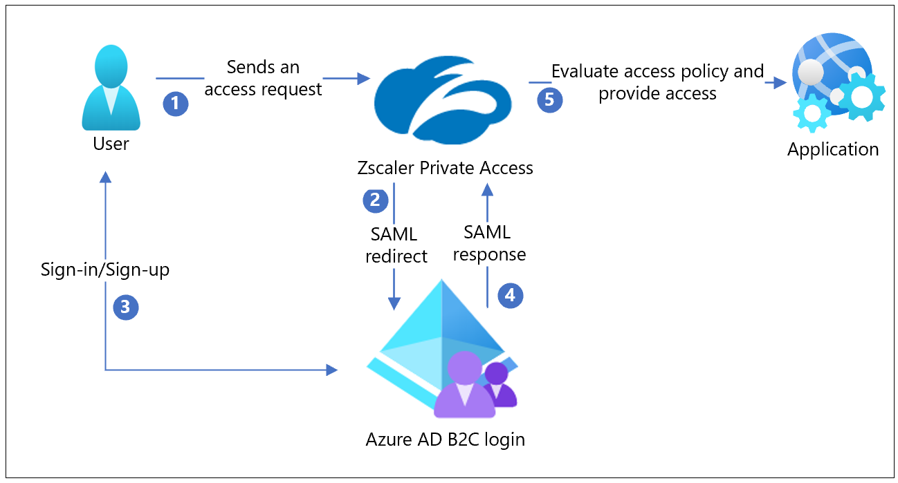
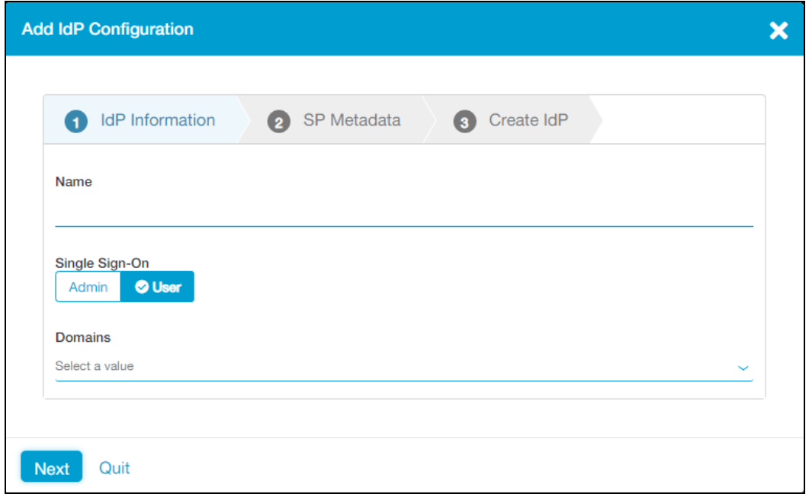
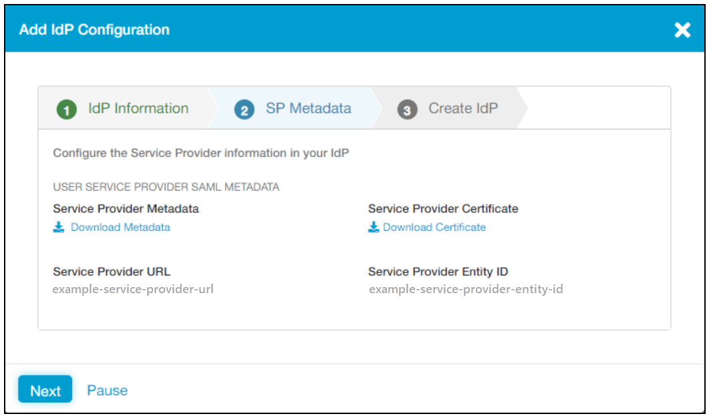
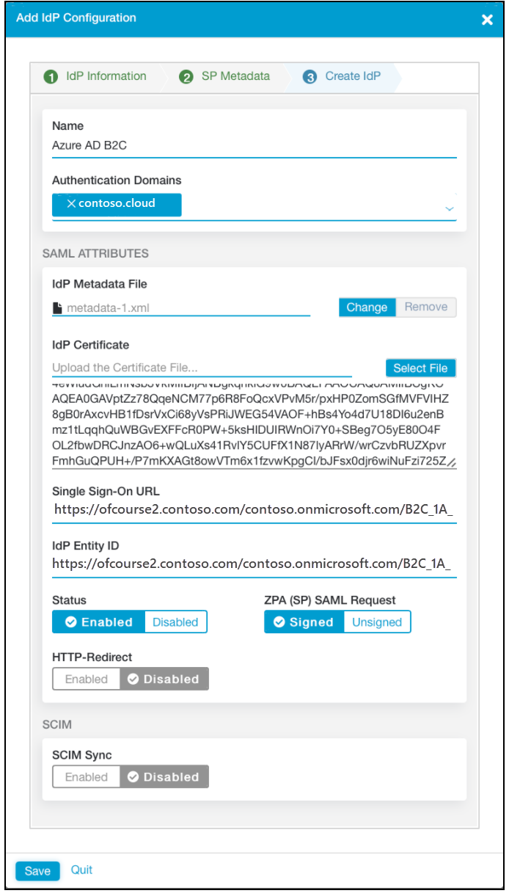

# Tutorial: Configure Zscaler Private Access with Azure Active Directory B2C

In this tutorial, learn how to integrate Azure Active Directory B2C (Azure AD B2C) authentication with Zscaler Private Access (ZPA). ZPA is policy-based, secure access to private applications and assets without the overhead or security risks of a virtual private network (VPN). Zscaler secure hybrid access reduces attack surface for consumer-facing applications when combined with Azure AD B2C.

Learn more: Go to [Zscaler](https://www.zscaler.com/products/zscaler-private-access) and select Products & Solutions, Products.

## Prerequisites

Before you begin, you’ll need:

- An Azure subscription
  - If you don't have one, you can get an [Azure free account](https://azure.microsoft.com/free/)
- [An Azure AD B2C tenant](./tutorial-create-tenant.md) linked to your Azure subscription
- A ZPA subscription
  - Go to [Azure Marketplace, Zscaler Private Access](https://azuremarketplace.microsoft.com/marketplace/apps/aad.zscalerprivateaccess?tab=Overview)

## Scenario description

ZPA integration includes the following components:

- **Azure AD B2C** - The identity provider (IdP) that verifies user credentials
- **ZPA** - Secures web applications by enforcing Zero Trust access 
  - See, [Zero Trust defined](https://www.microsoft.com/security/blog/2018/12/17/zero-trust-part-1-identity-and-access-management/#:~:text=Azure%20Active%20Directory%20%28Azure%20AD%29%20provides%20the%20strong%2C,to%20express%20their%20access%20requirements%20in%20simple%20terms)  
- **Web application** - Hosts the service users access

The following diagram shows how ZPA integrates with Azure AD B2C.

   

1. A user arrives at the ZPA portal, or a ZPA browser-access application, to request access
2. ZPA collects user attributes. ZPA performs a SAML redirect to the Azure AD B2C sign-in page.
3. New users sign up and create an account. Current users sign in with credentials. Azure AD B2C validates user identity.
4. Azure AD B2C redirects the user to ZPA with the SAML assertion, which ZPA verifies. ZPA sets the user context.
5. ZPA evaluates access policies. The request is allowed or it isn't.

## Onboard to ZPA

This tutorial assumes ZPA is installed and running. 

To get started with ZPA, go to help.zscaler.com for [Step-by-Step Configuration Guide for ZPA](https://help.zscaler.com/zpa/step-step-configuration-guide-zpa).

## Integrate ZPA with Azure AD B2C

### Configure Azure AD B2C as an IdP on ZPA

Configure Azure AD B2C as an IdP on ZPA.

For more information, see [Configuring an IdP for single sign-on](https://help.zscaler.com/zpa/configuring-idp-single-sign).

1. Sign in to the [ZPA Admin portal](https://admin.private.zscaler.com).
2. Go to **Administration** > **IdP Configuration**.
3. Select **Add IdP Configuration**.
4. The **Add IdP Configuration** pane appears.

    

5. Select the **IdP Information** tab
6. In the **Name** box, enter **Azure AD B2C**.
7. Under **Single Sign-On**, select **User**.
8. In the **Domains** drop-down list, select the authentication domains to associate with the IdP.
9. Select **Next**.
10. Select the **SP Metadata** tab.
11. Under **Service Provider URL**, copy the value to use later.
12. Under **Service Provider Entity ID**, copy the value to user later.

    

13. Select **Pause**.

### Configure custom policies in Azure AD B2C

>[!IMPORTANT]
>Configure custom policies in Azure AD B2C if you haven’t configured custom policies.

For more information, see [Tutorial: Create user flows and custom policies in Azure Active Directory B2C](./tutorial-create-user-flows.md?pivots=b2c-custom-policy).

### Register ZPA as a SAML application in Azure AD B2C

1. [Register a SAML application in Azure AD B2C](./saml-service-provider.md). 
2. During registration, in **Upload your policy**, copy the IdP SAML metadata URL used by Azure AD B2C to use later.
3. Follow the instructions until **Configure your application in Azure AD B2C**. 
4. For step 4.2, update the app manifest properties

    * For **identifierUris**, enter the Service Provider Entity ID you copied
    * For **samlMetadataUrl**, skip this entry
    * For **replyUrlsWithType**, enter the Service Provider URL you copied
    * For **logoutUrl**, skip this entry

The remaining steps aren't required.

### Extract the IdP SAML metadata from Azure AD B2C

1. Obtain a SAML metadata URL in the following format:

    `https://<tenant-name>.b2clogin.com/<tenant-name>.onmicrosoft.com/<policy-name>/Samlp/metadata`

> [!NOTE]
> `<tenant-name>` is your Azure AD B2C tenant, and `<policy-name>` is the custom SAML policy that you created.
> The URL might be:
> `https://safemarch.b2clogin.com/safemarch.onmicrosoft.com/B2C_1A_signup_signin_saml/Samlp/metadata`.

2. Open a web browser.
3. Go to the SAML metadata URL. 
4. Right-click on the page.
5. Select **Save as**.
6. Save the file to your computer to use later.

### Complete IdP configuration on ZPA

To complete the IdP configuration:

1. Go to the [ZPA Admin portal](https://admin.private.zscaler.com).
2. Select **Administration** > **IdP Configuration**.
3. Select the IdP you configured, and then select **Resume**.
4. On the **Add IdP Configuration** pane, select the **Create IdP** tab.
5. Under **IdP Metadata File**, upload the metadata file you saved.
6. Under **Status**, verify the configuration is **Enabled**.
7. Select **Save**.

    

## Test the solution

To confirm SAML authentication, go to a ZPA user portal or a browser-access application, and test the sign-up or sign-in process. 

## Next steps

- [Tutorial: Create user flows and custom policies in Azure Active Directory B2C](./tutorial-create-user-flows.md?pivots=b2c-custom-policy)
- [Register a SAML application in Azure AD B2C](./saml-service-provider.md)
- [Step-by-Step Configuration Guide for ZPA](https://help.zscaler.com/zpa/step-step-configuration-guide-zpa)
- [Configuring an IdP for single sign-on](https://help.zscaler.com/zpa/configuring-idp-single-sign)
