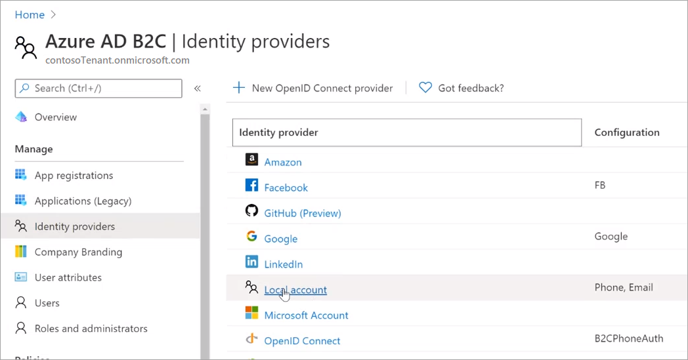
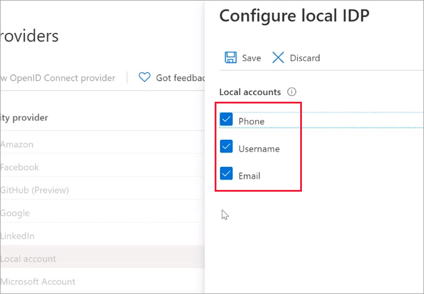
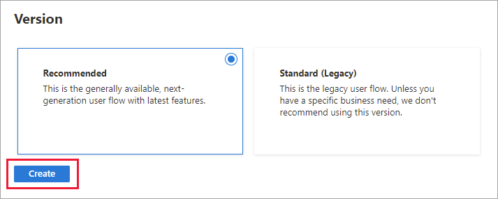
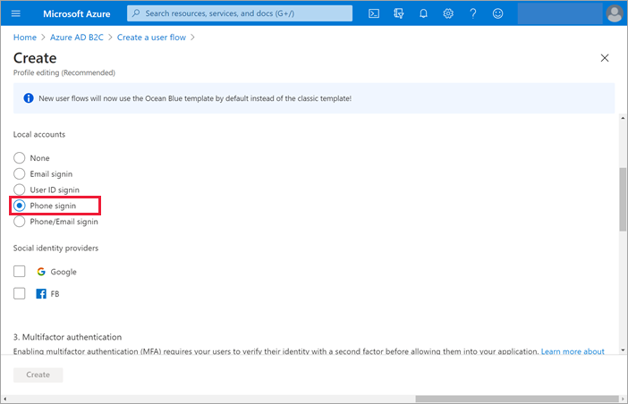
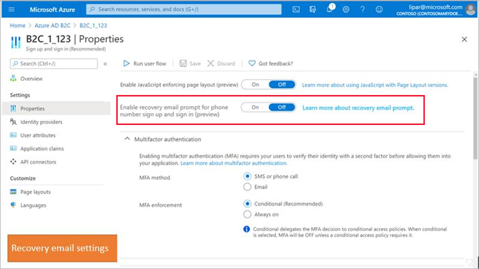
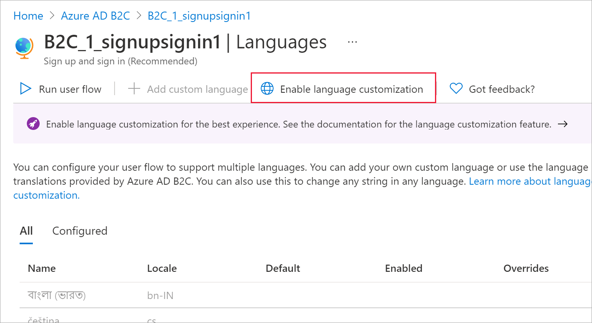
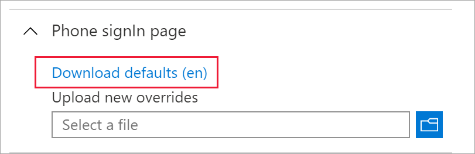

# Set up phone sign-up and sign-in for user flows

In addition to email and username, you can enable phone number as a sign-up option tenant-wide by adding phone sign-up and sign-in to your local account identity provider. After you enable phone sign-up and sign-in for local accounts, you can add phone sign-up to your user flows.

Setting up phone sign-up and sign-in in a user flow involves the following steps:

- [Configure phone sign-up and sign-in tenant-wide](#configure-phone-sign-up-and-sign-in-tenant-wide) in your local account identity provider to accept a phone number as a user's identity. 

- [Add phone sign-up to your user flow](#add-phone-sign-up-to-a-user-flow) to enable users to sign up for your application using their phone number.

- [Enable the recovery email prompt (preview)](#enable-the-recovery-email-prompt-preview) to let users specify an email that can be used to recover their account when they don't have their phone.

- [Display consent information](#enable-consent-information) to the user during the sign up or sign in flow. You can display the default consent information or customize the your own consent information.

Multi-factor authentication (MFA) is disabled by default when you configure a user flow with phone sign-up. You can enable MFA in user flows with phone sign-up, but because a phone number is used as the primary identifier, email one-time passcode is the only option available for the second authentication factor.

## Configure phone sign-up and sign-in tenant-wide

Email sign-up is enabled by default in your local account identity provider settings. You can change the identity types you'll support in your tenant by selecting or deselecting email sign-up, username, or phone number.

1. Sign in to the [Azure portal](https://portal.azure.com).
1. Make sure you're using the directory that contains your Azure AD B2C tenant. Select the **Directories + subscriptions** icon in the portal toolbar.
1. On the **Portal settings | Directories + subscriptions** page, find your Azure AD B2C directory in the **Directory name** list, and then select **Switch**.
1. Choose **All services** in the top-left corner of the Azure portal, and then search for and select **Azure AD B2C**.
1. Under **Manage**, select **Identity providers**.
1. In the identity provider list, select **Local account**.

   

1. In the **Configure local IDP** page, make sure **Phone** is selected as one of the allowable identity types consumers can use to create their local accounts in your Azure AD B2C tenant.

   

1. Select **Save**.

## Add phone sign-up to a user flow

After you've added phone sign-up as an identity option for local accounts, you can add it to user flows as long as they're the latest **Recommended** user flow versions. The following is an example showing how to add phone sign-up to new user flows. But you can also add phone sign-up to existing Recommended-version user flows (select **User Flows** > *user flow name* > **Identity providers** > **Local Account Phone signup**). 

Here's an example showing how to add phone sign-up to a new user flow.

1. Sign in to the [Azure portal](https://portal.azure.com).
1. Make sure you're using the directory that contains your Azure AD B2C tenant. Select the **Directories + subscriptions** icon in the portal toolbar.
1. On the **Portal settings | Directories + subscriptions** page, find your Azure AD B2C directory in the **Directory name** list, and then select **Switch**.
1. In the Azure portal, search for and select **Azure AD B2C**.
1. Under **Policies**, select **User flows**, and then select **New user flow**.

    

1. On the **Create a user flow** page, select the **Sign up and sign in** user flow.

    

1. Under **Select a version**, select **Recommended**, and then select **Create**. ([Learn more](user-flow-versions.md) about user flow versions.)

    

1. Enter a **Name** for the user flow, such as *signupsignin1*.
1. In the **Identity providers** section, under **Local accounts**, select **Phone signup**.

   

1. Under **Social identity providers**, select any other identity providers you want to allow for this user flow.

   > [!NOTE]
   > [Multi-factor authentication (MFA)](multi-factor-authentication.md) is disabled by default for sign-up user flows. You can enable MFA for a phone sign-up user flow, but because a phone number is used as the primary identifier, email one-time passcode and Authenticator app - TOTP (preview) are the only options available for the second authentication factor.

1. In the **User attributes and token claims** section, choose the claims and attributes that you want to collect and send from the user during sign-up. For example, select **Show more**, and then choose attributes and claims for **Country/Region**, **Display Name**, and **Postal Code**. Select **OK**.

1. Select **Create** to add the user flow. A prefix of *B2C_1* is automatically prepended to the name.

## Enable the recovery email prompt (preview)

When you enable phone sign-up and sign-in for your user flows, it's also a good idea to enable the recovery email feature. With this feature, a user can provide an email address that can be used to recover their account when they don't have their phone. This email address is used for account recovery only. It can't be used for signing in.

- When the recovery email prompt is **On**, a user signing up for the first time is asked to verify a backup email. A user who hasn't provided a recovery email before is asked to verify a backup email during next sign in.

- When recovery email is **Off**, a user signing up or signing in isn't shown the recovery email prompt.
 
You can enable the recovery email prompt in the user flow properties.

> [!NOTE]
> Before you begin, make sure you have [added phone sign-up to your user flow](#add-phone-sign-up-to-a-user-flow) as described above.

### To enable the recovery email prompt

1. Sign in to the [Azure portal](https://portal.azure.com).
1. Make sure you're using the directory that contains your Azure AD B2C tenant. Select the **Directories + subscriptions** icon in the portal toolbar.
1. On the **Portal settings | Directories + subscriptions** page, find your Azure AD B2C directory in the **Directory name** list, and then select **Switch**.
1. In the Azure portal, search for and select **Azure AD B2C**.
1. In Azure AD B2C, under **Policies**, select **User flows**.
1. Select the user flow from the list.
1. Under **Settings**, select **Properties**.
1. Next to **Enable recovery email prompt for phone number signup and sign in (preview)**, select:

   - **On** to show the recovery email prompt during both sign-up and sign-in.
   - **Off** to hide the recovery email prompt.

    

1. Select **Save**.

### To test the recovery email prompt

After you've enabled phone sign-up and sign-in and the recovery email prompt in your user flow, you can use **Run user flow** to test the user experience.

1. Select **Policies** > **User flows**, and then select the user flow you created. On the user flow overview page, select **Run user flow**.

1. For **Application**, select the web application you registered in step 1. The **Reply URL** should show `https://jwt.ms`.

1. Select **Run user flow** and verify the following behavior:

   - A user who signs up for the first time is asked to provide a recovery email. 
   - A user who has already signed up but hasn't provided a recovery email is asked to provide one upon signing in.

1. Enter an email address and then select **Send verification code**. Verify that a code is sent to the email inbox you provided. Retrieve the code and enter it in the **Verification code** box. Then select **Verify code**.

## Enable consent information

We strongly suggest you include consent information in your sign-up and sign-in flow. Sample text is provided. Please refer to the Short Code Monitoring Handbook on the [CTIA website](https://www.ctia.org/programs) and consult with your own legal or compliance experts for guidance on your final text and feature configuration to meet your own compliance needs:
>
> *By providing your phone number, you consent to receiving a one-time passcode sent by text message to help you sign in to *&lt;insert: your application name&gt;*. Standard message and data rates may apply.*
>
> *&lt;insert: a link to your Privacy Statement&gt;*<br/>*&lt;insert: a link to your Terms of Service&gt;*

To enable consent information

1. Sign in to the [Azure portal](https://portal.azure.com).
1. Make sure you're using the directory that contains your Azure AD B2C tenant. Select the **Directories + subscriptions** icon in the portal toolbar.
1. On the **Portal settings | Directories + subscriptions** page, find your Azure AD B2C directory in the **Directory name** list, and then select **Switch**.
1. In the Azure portal, search for and select **Azure AD B2C**.
1. In Azure AD B2C, under **Policies**, select **User flows**.
1. Select the user flow from the list.
1. Under **Customize**, select **Languages**.
1. To display consent text, select **Enable language customization**.
  
    

1. To customize the consent information, select a language in the list.
1. In the language panel, select **Phone signIn page**.
1. Select Download defaults.

    

1. Open the downloaded JSON file. Search for the following text and customize it:

    - **disclaimer_link_1_url**: Change **override** to "true" and add the URL for your privacy information.

    - **disclaimer_link_2_url**: Change **override** to "true" and add the URL for your terms of use.  

    - **disclaimer_msg_intro**: Change **override** to "true" and change **value** to your desired disclaimer strings.  

1. Save the file. Under **Upload new overrides**, browse for the file and select it. Confirm that you see a “Successfully uploaded overrides” notification.
1. Select **Phone signUp page**, and then repeat steps 10 through 12. 


## Get a user's phone number in your directory

1. Run the following request in Graph Explorer:

   `GET https://graph.microsoft.com/v1.0/users/{object_id}?$select=identities`

1. Find the `issuerAssignedId` property in the response returned:

   ```json
       "identities": [
           {
               "signInType": "phoneNumber",
               "issuer": "contoso.onmicrosoft.com",
               "issuerAssignedId": "+11231231234"
           }
       ]
   ```

## Next steps

- [Add external identity providers](add-identity-provider.md)
- [Create a user flow](tutorial-create-user-flows.md)
