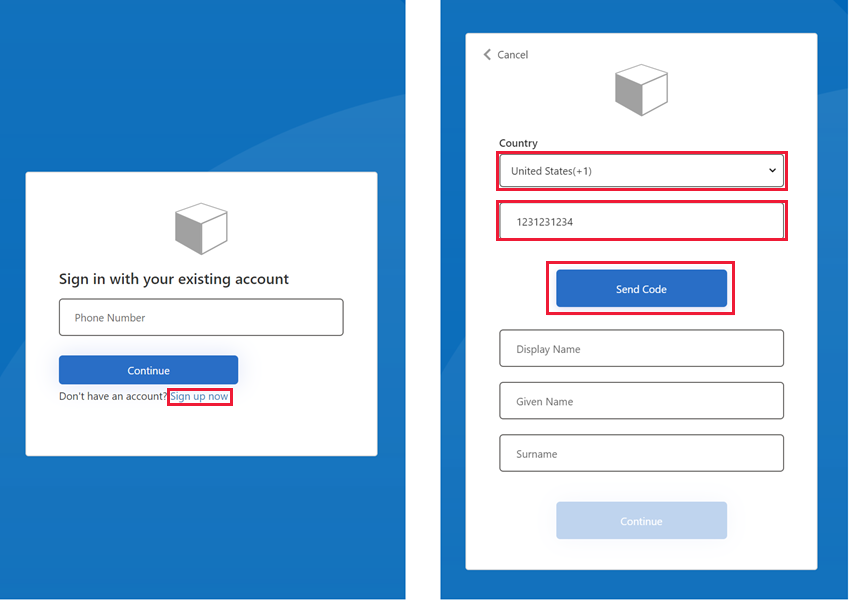
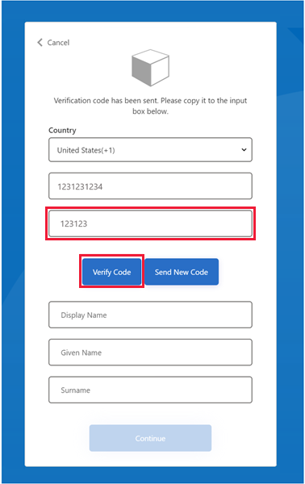
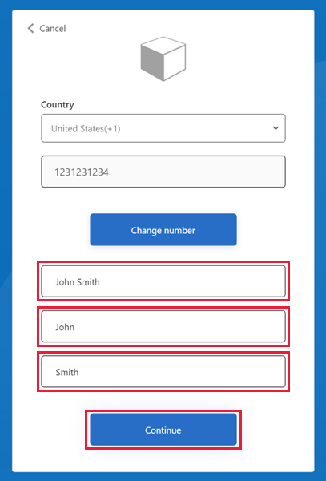
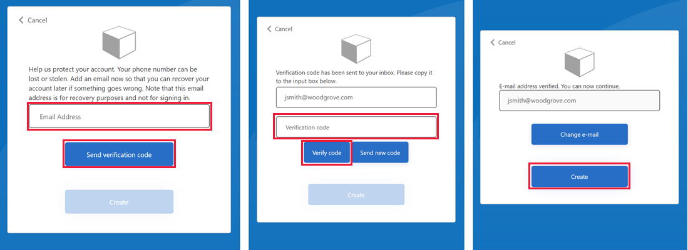
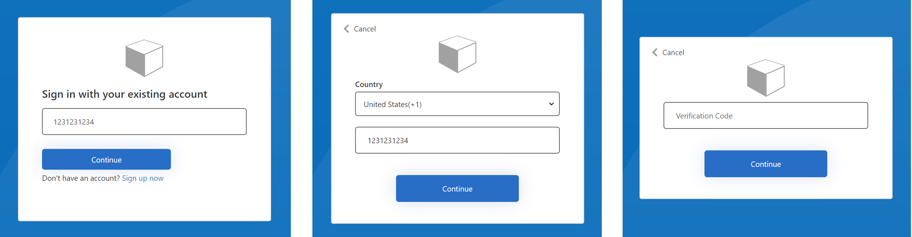

# Set up phone sign-up and sign-in with custom policies in Azure AD B2C

Phone sign-up and sign-in in Azure Active Directory B2C (Azure AD B2C) enables your users to sign up and sign in to your applications by using a one-time password (OTP) sent in a text message to their phone. One-time passwords can help minimize the risk of your users forgetting or having their passwords compromised.

Follow the steps in this article to use the custom policies to enable your customers to sign up and sign in to your applications by using a one-time password sent to their phone.

## Pricing

One-time passwords are sent to your users by using SMS text messages, and you may be charged for each message sent. For pricing information, see the **Separate Charges** section of [Azure Active Directory B2C pricing](https://azure.microsoft.com/pricing/details/active-directory-b2c/).

## User experience for phone sign-up and sign-in

With phone sign-up and sign-in, the user can sign up for the app using a phone number as their primary identifier. The end user's experience during sign-up and sign-in is described below.

> [!NOTE]
> We strongly suggest you include consent information in your sign-up and sign-in experience similar to the sample text below. This sample text is for informational purposes only. Please refer to the Short Code Monitoring Handbook on the [CTIA website](https://www.ctia.org/programs) and consult with your own legal or compliance experts for guidance on your final text and feature configuration to meet your own compliance needs:
>
> *By providing your phone number, you consent to receiving a one-time passcode sent by text message to help you sign in to *&lt;insert: your application name&gt;*. Standard message and data rates may apply.*
>
> *&lt;insert: a link to your Privacy Statement&gt;*<br/>*&lt;insert: a link to your Terms of Service&gt;*

To add your own consent information, customize the following sample. Include it in the `LocalizedResources` for the ContentDefinition used by the self-asserted page with the display control (the *Phone_Email_Base.xml* file in the [phone sign-up and sign-in starter pack][starter-pack-phone]):

```xml
<LocalizedResources Id="phoneSignUp.en">        
    <LocalizedStrings>
    <LocalizedString ElementType="DisplayControl" ElementId="phoneControl" StringId="disclaimer_msg_intro">By providing your phone number, you consent to receiving a one-time passcode sent by text message to help you sign into {insert your application name}. Standard message and data rates may apply.</LocalizedString>          
    <LocalizedString ElementType="DisplayControl" ElementId="phoneControl" StringId="disclaimer_link_1_text">Privacy Statement</LocalizedString>                
    <LocalizedString ElementType="DisplayControl" ElementId="phoneControl" StringId="disclaimer_link_1_url">{insert your privacy statement URL}</LocalizedString>          
    <LocalizedString ElementType="DisplayControl" ElementId="phoneControl" StringId="disclaimer_link_2_text">Terms and Conditions</LocalizedString>             
    <LocalizedString ElementType="DisplayControl" ElementId="phoneControl" StringId="disclaimer_link_2_url">{insert your terms and conditions URL}</LocalizedString>          
    <LocalizedString ElementType="UxElement" StringId="initial_intro">Please verify your country code and phone number</LocalizedString>        
    </LocalizedStrings>      
</LocalizedResources>
   ```

### Phone sign-up experience

If the user doesn't already have an account for your application, they can create one by choosing the **Sign up now** link. A sign-up page appears, where the user selects their **Country**, enters their phone number, and selects **Send Code**.



A one-time verification code is sent to the user's phone number. The user enters the **Verification Code** on the sign-up page, and then selects **Verify Code**. (If the user wasn't able to retrieve the code, they can select **Send New Code**.)



The user enters any other information requested on the sign-up page. For example, **Display Name**, **Given Name**, and **Surname** (Country and phone number remain populated). If the user wants to use a different phone number, they can choose **Change number** to restart sign-up. When finished, the user selects **Continue**.



Next, the user is asked to provide a recovery email. The user enters their email address, and then selects **Send verification code**. A code is sent to the user's email inbox, which they can retrieve and enter in the **Verification code** box. Then the user selects **Verify code**. 

Once the code is verified, the user selects **Create** to create their account. Or if the user wants to use a different email address, they can choose **Change e-mail**.



### Phone sign-in experience

If the user has an existing account with phone number as their identifier, the user enters their phone number and selects **Continue**. They confirm the country and phone number by selecting **Continue**, and a one-time verification code is sent to their phone. The user enters the verification code and selects **Continue** to sign in.



## Deleting a user account

In certain cases you might you need to delete a user and associated data from your Azure AD B2C directory. For details about how to delete a user account through the Azure portal, refer to [these instructions](/microsoft-365/compliance/gdpr-dsr-azure#step-5-delete). 

[!INCLUDE [GDPR-related guidance](../../includes/gdpr-dsr-and-stp-note.md)]


## Prerequisites

You need the following resources in place before setting up OTP.

* [Azure AD B2C tenant](tutorial-create-tenant.md)
* [Web application registered](tutorial-register-applications.md) in your tenant
* [Custom policies](custom-policy-get-started.md) uploaded to your tenant

## Get the phone sign-up & sign-in starter pack

Start by updating the phone sign-up and sign-in custom policy files to work with your Azure AD B2C tenant.

1. Find the [phone sign-up and sign-in custom policy files][starter-pack-phone] in your local clone of the starter pack repo, or download them directly. The XML policy files are located in the following directory:

    `active-directory-b2c-custom-policy-starterpack/scenarios/`**`phone-number-passwordless`**

1. In each file, replace the string `yourtenant` with the name of your Azure AD B2C tenant. For example, if the name of your B2C tenant is *contosob2c*, all instances of `yourtenant.onmicrosoft.com` become `contosob2c.onmicrosoft.com`.

1. Complete the steps in the [Add application IDs to the custom policy](custom-policy-get-started.md#add-application-ids-to-the-custom-policy) section of [Get started with custom policies in Azure Active Directory B2C](custom-policy-get-started.md). In this case, update `/phone-number-passwordless/`**`Phone_Email_Base.xml`** with the **Application (client) IDs** of the two applications you registered when completing the prerequisites, *IdentityExperienceFramework* and *ProxyIdentityExperienceFramework*.

## Upload the policy files

1. Sign in to the [Azure portal](https://portal.azure.com) and navigate to your Azure AD B2C tenant.
1. Under **Policies**, select **Identity Experience Framework**.
1. Select **Upload custom policy**.
1. Upload the policy files in the following order:
    1. *Phone_Email_Base.xml*
    1. *SignUpOrSignInWithPhone.xml*
    1. *SignUpOrSignInWithPhoneOrEmail.xml*
    1. *ProfileEditPhoneOnly.xml*
    1. *ProfileEditPhoneEmail.xml*
    1. *ChangePhoneNumber.xml*
    1. *PasswordResetEmail.xml*

As you upload each file, Azure adds the prefix `B2C_1A_`.

## Test the custom policy

1. Under **Custom policies**, select **B2C_1A_SignUpOrSignInWithPhone**.
1. Under **Select application**, select the *webapp1* application that you registered when completing the prerequisites.
1. For **Select reply url**, choose `https://jwt.ms`.
1. Select **Run now** and sign up using an email address or a phone number.
1. Select **Run now** once again and sign in with the same account to confirm that you have the correct configuration.

## Get user account by phone number

A user that signs up with a phone number, without a recovery email address is recorded in your Azure AD B2C directory with their phone number as their sign-in name. To change the phone number, your help desk or support team must first find their account, and then update their phone number.

You can find a user by their phone number (sign-in name) by using [Microsoft Graph](microsoft-graph-operations.md):

```http
GET https://graph.microsoft.com/v1.0/users?$filter=identities/any(c:c/issuerAssignedId eq '+{phone number}' and c/issuer eq '{tenant name}.onmicrosoft.com')
```

For example:

```http
GET https://graph.microsoft.com/v1.0/users?$filter=identities/any(c:c/issuerAssignedId eq '+450334567890' and c/issuer eq 'contosob2c.onmicrosoft.com')
```

## Next steps

You can find the phone sign-up and sign-in custom policy starter pack (and other starter packs) on GitHub:
  [Azure-Samples/active-directory-b2c-custom-policy-starterpack/scenarios/phone-number-passwordless][starter-pack-phone]
  The starter pack policy files use multi-factor authentication technical profiles and phone number claims transformations:
* [Define an Azure AD Multi-Factor Authentication technical profile](multi-factor-auth-technical-profile.md)
* [Define phone number claims transformations](phone-number-claims-transformations.md)

<!-- LINKS - External -->
[starter-pack]: https://github.com/Azure-Samples/active-directory-b2c-custom-policy-starterpack
[starter-pack-phone]: https://github.com/Azure-Samples/active-directory-b2c-custom-policy-starterpack/tree/master/scenarios/phone-number-passwordless
