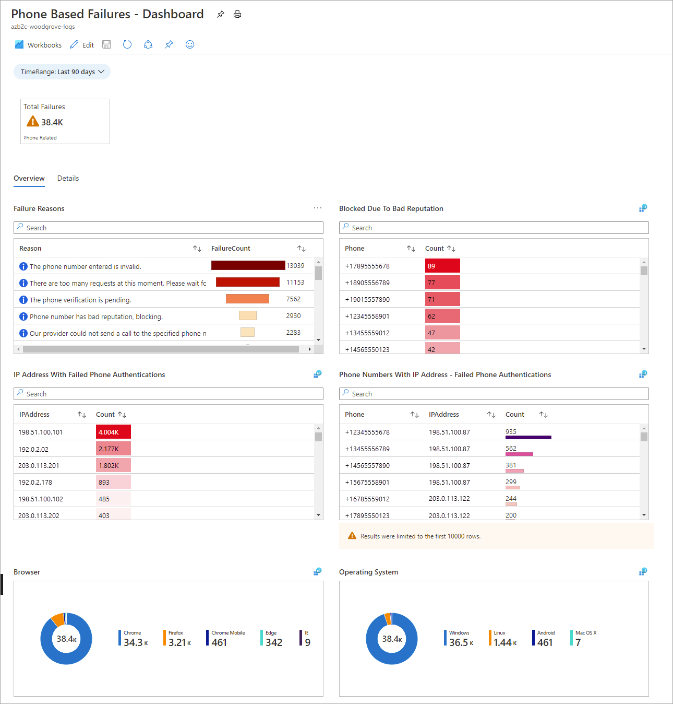
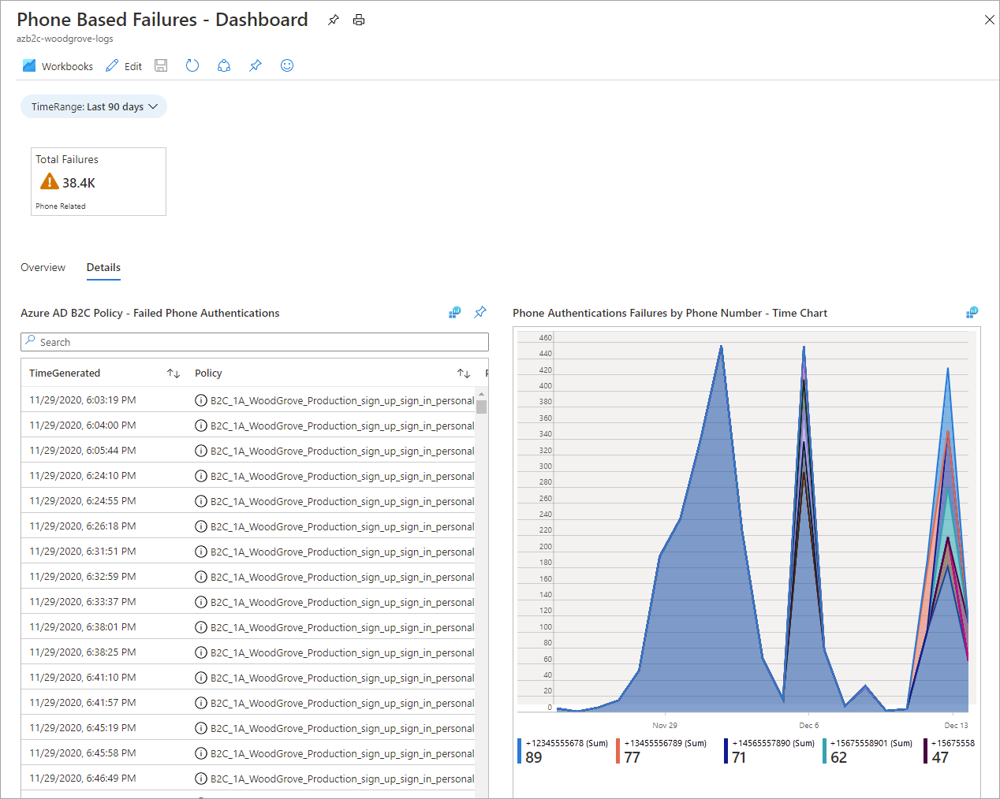
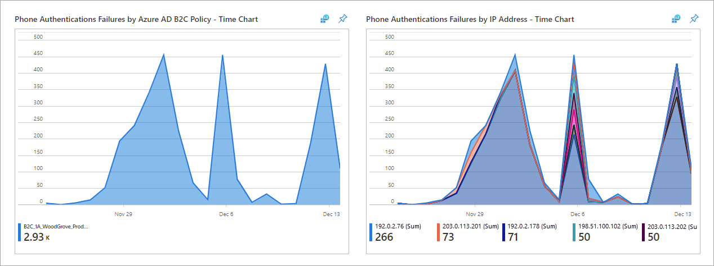
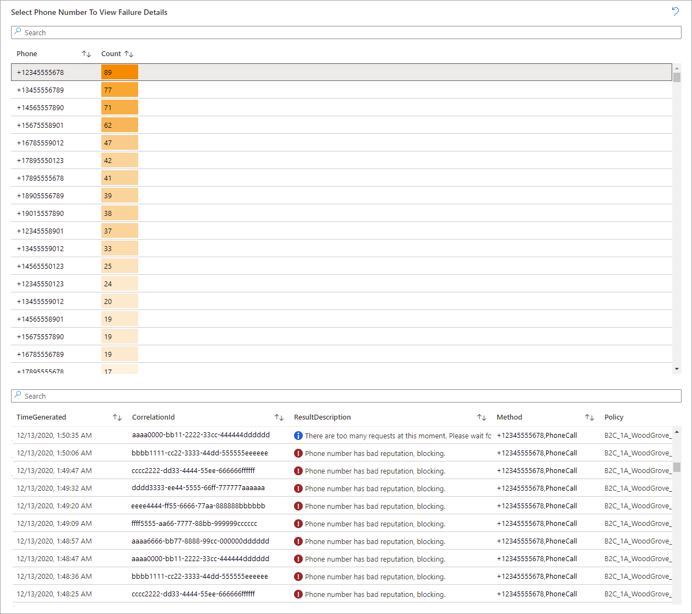

# Securing phone-based multifactor authentication

With Microsoft Entra multifactor authentication, users can choose to receive an automated voice call at a phone number they register for verification. Malicious users could take advantage of this method by creating multiple accounts and placing phone calls without completing the MFA registration process. These numerous failed sign-ups could exhaust the allowed sign-up attempts, preventing other users from signing up for new accounts in your Azure AD B2C tenant. To help protect against these attacks, you can use Azure Monitor to monitor phone authentication failures and mitigate fraudulent sign-ups.

> [!IMPORTANT]
> Authenticator app (TOTP) provides stronger security than SMS/Phone multifactor authentication. To set this up please read our instructions for [enabling multifactor authentication in Azure Active Directory B2C](multi-factor-authentication.md).

## Prerequisites

Before you begin, create a [Log Analytics workspace](azure-monitor.md).

## Create a phone-based MFA events workbook

The [Azure AD B2C Reports & Alerts](https://github.com/azure-ad-b2c/siem#phone-authentication-failures) repository in GitHub contains artifacts you can use to create and publish reports, alerts, and dashboards based on Azure AD B2C logs. The draft workbook pictured below highlights phone-related failures.

### Overview tab

The following information is shown on the **Overview** tab:

- Failure Reasons (the total number of failed phone authentications for each given reason)
- Blocked Due to Bad Reputation
- IP Address with Failed Phone Authentications (the total count of failed phone authentications for each given IP address)
- Phone Numbers With IP address - Failed Phone Authentications
- Browser (phone authentication failures per client browser)
- Operating System (phone authentication failures per client operating system)

### Details tab

The following information is reported on the **Details** tab:

- Azure AD B2C Policy - Failed Phone Authentications
- Phone Authentication Failures by Phone Number – Time Chart (adjustable timeline)
- Phone Authentication Failures by Azure AD B2C Policy – Time Chart (adjustable timeline)
- Phone Authentication Failures by IP Address – Time Chart (adjustable timeline)
- Select Phone Number to View Failure Details (select a phone number for a detailed list of failures)

## Use the workbook to identify fraudulent sign-ups

You can use the workbook to understand phone-based MFA events and identify potentially malicious use of the telephony service.

1. Understand what’s normal for your tenant by answering these questions:

   - Where are the regions from which you expect phone-based MFA?
   - Examine the reasons shown for failed phone-based MFA attempts; are they considered normal or expected?

2. Recognize the characteristics of fraudulent sign-up:

   - **Location-based**: Examine **Phone Authentication Failures by IP Address** for any accounts that are associated with locations from which you don't expect users to sign up.

   > [!NOTE]
   > The IP Address provided is an approximate region.

   - **Velocity-based**: Look at **Failed Phone Authentications Overtime (Per Day)**, which indicates phone numbers that are making an abnormal number of failed phone authentication attempts per day, ordered from highest (left) to lowest (right).

3. Mitigate fraudulent sign-ups by following the steps in the next section.
 

## Mitigate fraudulent sign-ups

Take the following actions to help mitigate fraudulent sign-ups.

- Use the **Recommended** versions of user flows to do the following:
     
   - [Enable the email one-time passcode feature (OTP)](phone-authentication-user-flows.md) for MFA (applies to both sign-up and sign-in flows).
   - [Configure a Conditional Access policy](conditional-access-user-flow.md) to block sign-ins based on location (applies to sign-in flows only, not sign-up flows).
   - Use API connectors to [integrate with an anti-bot solution like reCAPTCHA](https://github.com/Azure-Samples/active-directory-b2c-node-sign-up-user-flow-captcha) (applies to sign-up flows).

- Remove country codes that aren't relevant to your organization from the drop-down menu where the user verifies their phone number (this change will apply to future sign-ups):
    
   1. Sign in to the [Azure portal](https://portal.azure.com) as the global administrator of your Azure AD B2C tenant.
   1. If you have access to multiple tenants, select the **Settings** icon in the top menu to switch to your Azure AD B2C tenant from the **Directories + subscriptions** menu.
   1. Choose **All services** in the top-left corner of the Azure portal, search for and select **Azure AD B2C**.
   1. Select the user flow, and then select **Languages**. Select the language for your organization's geographic location to open the language details panel. (For this example, we'll select **English en** for the United States). Select **Multifactor authentication page**, and then select **Download defaults (en)**.
 
      

   1. Open the JSON file that was downloaded in the previous step. In the file, search for `DEFAULT`, and replace the line with `"Value": "{\"DEFAULT\":\"Country/Region\",\"US\":\"United States\"}"`. Be sure to set `Overrides` to `true`.

   > [!NOTE]
   > You can customize the list of allowed country codes in the `countryList` element (see the [Phone factor authentication page example](localization-string-ids.md#phone-factor-authentication-page-example)).

   1. Save the JSON file. In the language details panel, under **Upload new overrides**, select the modified JSON file to upload it.
   1. Close the panel and select **Run user flow**. For this example, confirm that **United States** is the only country code available in the dropdown:
 
      

## Next steps

- Learn about [Identity Protection and Conditional Access for Azure AD B2C](conditional-access-identity-protection-overview.md) 

- Apply [Conditional Access to user flows in Azure Active Directory B2C](conditional-access-user-flow.md)
