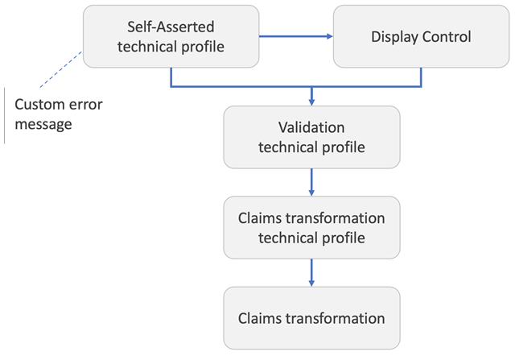

# Define phone number claims transformations in Azure AD B2C

This article provides reference and examples for using the phone number claims transformations in Azure Active Directory B2C (Azure AD B2C) custom policy. For more information about claims transformations in general, see [ClaimsTransformations](claimstransformations.md).

[!INCLUDE [b2c-public-preview-feature](../../includes/active-directory-b2c-public-preview.md)]

## ConvertPhoneNumberClaimToString

Converts a `phoneNumber` data type into a `string` data type. Check out the [Live demo](https://github.com/azure-ad-b2c/unit-tests/tree/main/claims-transformation/phoneNumber#convertphonenumberclaimtostring) of this claims transformation.

| Element | TransformationClaimType | Data Type | Notes |
| ---- | ----------------------- | --------- | ----- |
| InputClaim | phoneNumber | phoneNumber |  The claim to convert to a string. |
| OutputClaim | phoneNumberString | string | The claim that is produced after this claims transformation has been invoked. |

### Example of ConvertPhoneNumberClaimToString

In this example, the cellPhoneNumber claim with a value type of `phoneNumber` is converted to a cellPhone claim with a value type of `string`.

```xml
<ClaimsTransformation Id="PhoneNumberToString" TransformationMethod="ConvertPhoneNumberClaimToString">
  <InputClaims>
    <InputClaim ClaimTypeReferenceId="cellPhoneNumber" TransformationClaimType="phoneNumber" />
  </InputClaims>
  <OutputClaims>
    <OutputClaim ClaimTypeReferenceId="cellPhone" TransformationClaimType="phoneNumberString" />
  </OutputClaims>
</ClaimsTransformation>
```

- Input claims:
  - **phoneNumber**: +11234567890 (phoneNumber)
- Output claims:
  - **phoneNumberString**: +11234567890 (string)


## ConvertStringToPhoneNumberClaim

Validates the format of a phone number. If valid, change it to a standard format used by Azure AD B2C. If the provided phone number isn't in a valid format, an error message is returned. Check out the [Live demo](https://github.com/azure-ad-b2c/unit-tests/tree/main/claims-transformation/phoneNumber#convertstringtophonenumberclaim) of this claims transformation.

| Element | TransformationClaimType | Data Type | Notes |
| ---- | ----------------------- | --------- | ----- |
| InputClaim | phoneNumberString | string |  The string claim for the phone number. The phone number has to be in international format, complete with a leading "+" and country/region code. If input claim `country` is provided, the phone number is in local format (without the country/region code). |
| InputClaim | country | string | [Optional] The string claim for the country/region code of the phone number in ISO3166 format (the two-letter ISO-3166 country/region code). |
| OutputClaim | outputClaim | phoneNumber | The result of this claims transformation. |

The **ConvertStringToPhoneNumberClaim** claims transformation is always executed from a [validation technical profile](validation-technical-profile.md) that is called by a [self-asserted technical profile](self-asserted-technical-profile.md) or [display control](display-controls.md). The **UserMessageIfClaimsTransformationInvalidPhoneNumber** self-asserted technical profile metadata controls the error message that is presented to the user.



### Example of ConvertStringToPhoneNumberClaim

The following example checks that the **phoneString** claim is indeed a valid phone number, and then returns the phone number in the standard Azure AD B2C format. Otherwise, an error message is thrown.

```xml
<ClaimsTransformation Id="ConvertStringToPhoneNumber" TransformationMethod="ConvertStringToPhoneNumberClaim">
  <InputClaims>
    <InputClaim ClaimTypeReferenceId="phoneString" TransformationClaimType="phoneNumberString" />
    <InputClaim ClaimTypeReferenceId="countryCode" TransformationClaimType="country" />
  </InputClaims>
  <OutputClaims>
    <OutputClaim ClaimTypeReferenceId="phoneNumber" TransformationClaimType="outputClaim" />
  </OutputClaims>
</ClaimsTransformation>
```

- Input claims:
  - **phoneNumberString**: 033 456-7890
  - **country**: DK
- Output claims:
  - **outputClaim**: +450334567890

### Example of ConvertStringToPhoneNumberClaim without country code claim

Check out the [Live demo](https://github.com/azure-ad-b2c/unit-tests/tree/main/claims-transformation/phoneNumber#convertstringtophonenumberclaim-without-country-code-claim) of this mode of the claims transformation.

- Input claims:
  - **phoneNumberString**: +1 (123) 456-7890
- Output claims:
  - **outputClaim**: +11234567890

### Calling the ConvertStringToPhoneNumberClaim claims transformation

The self-asserted technical profile that calls the validation technical profile that contains this claims transformation can define the error message.

```xml
<TechnicalProfile Id="SelfAsserted-LocalAccountSignUp-Phone">
  <Metadata>
    <Item Key="UserMessageIfClaimsTransformationInvalidPhoneNumber">Custom error message if the phone number is not valid.</Item>
  </Metadata>
  ...
</TechnicalProfile>
```

## GetNationalNumberAndCountryCodeFromPhoneNumberString

Extracts the country/region code and the national number from the input claim, and optionally throws an exception if the supplied phone number isn't valid. Check out the [Live demo](https://github.com/azure-ad-b2c/unit-tests/tree/main/claims-transformation/phoneNumber#getnationalnumberandcountrycodefromphonenumberstring) of this claims transformation.

| Element | TransformationClaimType | Data Type | Notes |
| ---- | ----------------------- | --------- | ----- |
| InputClaim | phoneNumber | string | The string claim of the phone number. The phone number has to be in international format, complete with a leading "+" and country/region code. |
| InputParameter | throwExceptionOnFailure | boolean | [Optional] A parameter indicating whether an exception is thrown when the phone number isn't valid. Default value is false. |
| InputParameter | countryCodeType | string | [Optional] A parameter indicating the type of country/region code in the output claim. Available values are **CallingCode** (the international calling code for a country/region, for example +1) or **ISO3166** (the two-letter ISO-3166 country/region code). |
| OutputClaim | nationalNumber | string | The string claim for the national number of the phone number. |
| OutputClaim | countryCode | string | The string claim for the country/region code of the phone number. |


If the **GetNationalNumberAndCountryCodeFromPhoneNumberString** claims transformation is executed from a [validation technical profile](validation-technical-profile.md) that is called by a [self-asserted technical profile](self-asserted-technical-profile.md) or a [display control action](display-controls.md#display-control-actions), then the **UserMessageIfPhoneNumberParseFailure** self-asserted technical profile metadata controls the error message that is presented to the user.


You can use this claims transformation to split a full phone number into the country/region code and the national number. If the phone number provided isn't valid, you can choose to throw an error message.

### Example of GetNationalNumberAndCountryCodeFromPhoneNumberString

The following example tries to split the phone number into national number and country/region code. If the phone number is valid, the phone number will be overridden by the national number. If the phone number isn't valid, an exception won't be thrown and the phone number still has its original value.

```xml
<ClaimsTransformation Id="GetNationalNumberAndCountryCodeFromPhoneNumberString" TransformationMethod="GetNationalNumberAndCountryCodeFromPhoneNumberString">
  <InputClaims>
    <InputClaim ClaimTypeReferenceId="phoneNumber" TransformationClaimType="phoneNumber" />
  </InputClaims>
  <InputParameters>
    <InputParameter Id="throwExceptionOnFailure" DataType="boolean" Value="false" />
    <InputParameter Id="countryCodeType" DataType="string" Value="ISO3166" />
  </InputParameters>
  <OutputClaims>
    <OutputClaim ClaimTypeReferenceId="nationalNumber" TransformationClaimType="nationalNumber" />
    <OutputClaim ClaimTypeReferenceId="countryCode" TransformationClaimType="countryCode" />
  </OutputClaims>
</ClaimsTransformation>
```

- Input claims:
  - **phoneNumber**: +49 (123) 456-7890
- Input parameters:
  - **throwExceptionOnFailure**: false
  - **countryCodeType**: ISO3166
- Output claims:
  - **nationalNumber**: 1234567890
  - **countryCode**: DE

### Example of GetNationalNumberAndCountryCodeFromPhoneNumberString with CallingCode parameter

The following example tries to split the phone number into national number and country calling code.

```xml
<ClaimsTransformation Id="GetNationalNumberAndCountryCodeFromPhoneNumberString" TransformationMethod="GetNationalNumberAndCountryCodeFromPhoneNumberString">
  <InputClaims>
    <InputClaim ClaimTypeReferenceId="phoneNumber" TransformationClaimType="phoneNumber" />
  </InputClaims>
  <InputParameters>
    <InputParameter Id="throwExceptionOnFailure" DataType="boolean" Value="false" />
    <InputParameter Id="countryCodeType" DataType="string" Value="CallingCode" />
  </InputParameters>
  <OutputClaims>
    <OutputClaim ClaimTypeReferenceId="nationalNumber" TransformationClaimType="nationalNumber" />
    <OutputClaim ClaimTypeReferenceId="countryCode" TransformationClaimType="countryCode" />
  </OutputClaims>
</ClaimsTransformation>
```

- Input claims:
  - **phoneNumber**: +49 (123) 456-7890
- Input parameters
  - **throwExceptionOnFailure**: false
  - **countryCodeType**: CallingCode
- Output claims:
  - **nationalNumber**: 1234567890
  - **countryCode**: +49

### Calling the GetNationalNumberAndCountryCodeFromPhoneNumberString claims transformation

The self-asserted technical profile that calls the validation technical profile that contains this claims transformation can define the error message.

```xml
<TechnicalProfile Id="SelfAsserted-LocalAccountSignup-Phone">
  <Metadata>
    <Item Key="UserMessageIfPhoneNumberParseFailure">Custom error message if the phone number is not valid.</Item>
  </Metadata>
  ...
</TechnicalProfile>
```

## Next steps

- Find more [claims transformation samples](https://github.com/azure-ad-b2c/unit-tests/tree/main/claims-transformation/phoneNumber) on the Azure AD B2C community GitHub repo
