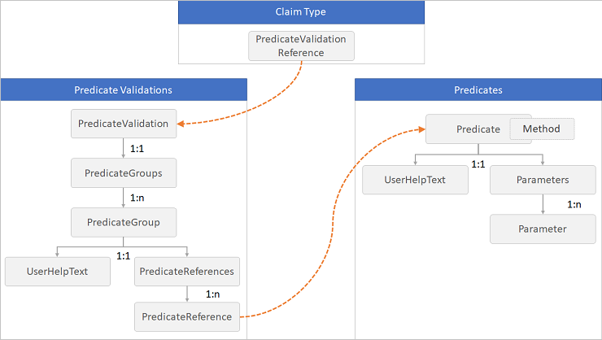
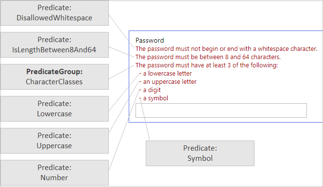

# Predicates and PredicateValidations

[!INCLUDE [active-directory-b2c-advanced-audience-warning](../../includes/active-directory-b2c-advanced-audience-warning.md)]

The **Predicates** and **PredicateValidations** elements enable you to perform a validation process to ensure that only properly formed data is entered into your Azure Active Directory (Azure AD) B2C tenant.

The following diagram shows the relationship between the elements:



## Predicates

The **Predicate** element defines a basic validation to check the value of a claim type and returns `true` or `false`. The validation is done by using a specified **Method** element and a set of **Parameter** elements relevant to the method. For example, a predicate can check whether the length of a string claim value is within the range of minimum and maximum parameters specified, or whether a string claim value contains a character set. The **UserHelpText** element provides an error message for users if the check fails. The value of **UserHelpText** element can be localized using [language customization](localization.md).

The **Predicates** element contains the following element:

| Element | Occurrences | Description |
| ------- | ----------- | ----------- |
| Predicate | 1:n | A list of predicates. |

The **Predicate** element contains the following attributes:

| Attribute | Required | Description |
| --------- | -------- | ----------- |
| Id | Yes | An identifier that's used for the predicate. Other elements can use this identifier in the policy. |
| Method | Yes | The method type to use for validation. Possible values: **IsLengthRange**, **MatchesRegex**, **IncludesCharacters**, or **IsDateRange**. The **IsLengthRange** value checks whether the length of a string claim value is within the range of minimum and maximum parameters specified. The **MatchesRegex** value checks whether a string claim value matches a regular expression. The **IncludesCharacters** value checks whether a string claim value contains a character set. The **IsDateRange** value checks whether a date claim value is between a range of minimum and maximum parameters specified. |

The **Predicate** element contains the following elements:

| Element | Occurrences | Description |
| ------- | ----------- | ----------- |
| UserHelpText | 1:1 | An error message for users if the check fails. This string can be localized using the [language customization](localization.md) |
| Parameters | 1:1 | The parameters for the method type of the string validation. |

The **Parameters** element contains the following elements:

| Element | Occurrences | Description |
| ------- | ----------- | ----------- |
| Parameter | 1:n | The parameters for the method type of the string validation. |

The **Parameter** element contains the following attributes:

| Element | Occurrences | Description |
| ------- | ----------- | ----------- |
| Id | 1:1 | The identifier of the parameter. |

The following example shows a `IsLengthRange` method with the parameters `Minimum` and `Maximum` that specify the length range of the string:

```XML
<Predicate Id="IsLengthBetween8And64" Method="IsLengthRange">
  <UserHelpText>The password must be between 8 and 64 characters.</UserHelpText>
    <Parameters>
      <Parameter Id="Minimum">8</Parameter>
      <Parameter Id="Maximum">64</Parameter>
  </Parameters>
</Predicate>
```

The following example shows a `MatchesRegex` method with the parameter `RegularExpression` that specifies a regular expression:

```XML
<Predicate Id="PIN" Method="MatchesRegex">
  <UserHelpText>The password must be numbers only.</UserHelpText>
  <Parameters>
    <Parameter Id="RegularExpression">^[0-9]+$</Parameter>
  </Parameters>
</Predicate>
```

The following example shows a `IncludesCharacters` method with the parameter `CharacterSet` that specifies the set of characters:

```XML
<Predicate Id="Lowercase" Method="IncludesCharacters">
  <UserHelpText>a lowercase letter</UserHelpText>
  <Parameters>
    <Parameter Id="CharacterSet">a-z</Parameter>
  </Parameters>
</Predicate>
```

The following example shows a `IsDateRange` method with the parameters `Minimum` and `Maximum` that specify the date range with a format of `yyyy-MM-dd` and `Today`.

```XML
<Predicate Id="DateRange" Method="IsDateRange" HelpText="The date must be between 1970-01-01 and today.">
  <Parameters>
    <Parameter Id="Minimum">1970-01-01</Parameter>
    <Parameter Id="Maximum">Today</Parameter>
  </Parameters>
</Predicate>
```

## PredicateValidations

While the predicates define the validation to check against a claim type, the **PredicateValidations** group a set of predicates to form a user input validation that can be applied to a claim type. Each **PredicateValidation** element contains a set of **PredicateGroup** elements that contain a set of **PredicateReference** elements that points to a **Predicate**. To pass the validation, the value of the claim should pass all of the tests of any predicate under all of the **PredicateGroup** with their set of **PredicateReference** elements.

```XML
<PredicateValidations>
  <PredicateValidation Id="">
    <PredicateGroups>
      <PredicateGroup Id="">
        <UserHelpText></UserHelpText>
        <PredicateReferences MatchAtLeast="">
          <PredicateReference Id="" />
          ...
        </PredicateReferences>
      </PredicateGroup>
      ...
    </PredicateGroups>
  </PredicateValidation>
...
</PredicateValidations>
```

The **PredicateValidations** element contains the following element:

| Element | Occurrences | Description |
| ------- | ----------- | ----------- |
| PredicateValidation | 1:n | A list of predicate validation. |

The **PredicateValidation** element contains the following attribute:

| Attribute | Required | Description |
| --------- | -------- | ----------- |
| Id | Yes | An identifier that's used for the predicate validation. The **ClaimType** element can use this identifier in the policy. |

The **PredicateValidation** element contains the following element:

| Element | Occurrences | Description |
| ------- | ----------- | ----------- |
| PredicateGroups | 1:n | A list of predicate groups. |

The **PredicateGroups** element contains the following element:

| Element | Occurrences | Description |
| ------- | ----------- | ----------- |
| PredicateGroup | 1:n | A list of predicates. |

The **PredicateGroup** element contains the following attribute:

| Attribute | Required | Description |
| --------- | -------- | ----------- |
| Id | Yes | An identifier that's used for the predicate group.  |

The **PredicateGroup** element contains the following elements:

| Element | Occurrences | Description |
| ------- | ----------- | ----------- |
| UserHelpText | 1:1 |  A description of the predicate that can be helpful for users to know what value they should type. |
| PredicateReferences | 1:n | A list of  predicate references. |

The **PredicateReferences** element contains the following attributes:

| Attribute | Required | Description |
| --------- | -------- | ----------- |
| MatchAtLeast | No | Specifies that the value must match at least that many predicate definitions for the input to be accepted. |

The **PredicateReferences** element contains the following elements:

| Element | Occurrences | Description |
| ------- | ----------- | ----------- |
| PredicateReference | 1:n | A reference to a predicate. |

The **PredicateReference** element contains the following attributes:

| Attribute | Required | Description |
| --------- | -------- | ----------- |
| Id | Yes | An identifier that's used for the predicate validation.  |


## Configure password complexity

With **Predicates** and **PredicateValidationsInput** you can control the complexity requirements for passwords provided by a user when creating an account. By default, Azure AD B2C uses strong passwords. Azure AD B2C also supports configuration options to control the complexity of passwords that customers can use. You can define password complexity by using these predicate elements:

- **IsLengthBetween8And64** using the `IsLengthRange` method, validates that the password must be between 8 and 64 characters.
- **Lowercase** using the `IncludesCharacters` method, validates that the password contains a lowercase letter.
- **Uppercase** using the `IncludesCharacters` method, validates that the password contains an uppercase letter.
- **Number** using the `IncludesCharacters` method, validates that the password contains a digit.
- **Symbol** using the `IncludesCharacters` method, validates that the password contains one of following symbols `@#$%^&*\-_+=[]{}|\:',?/~"();!`
- **PIN** using the `MatchesRegex` method, validates that the password contains numbers only.
- **AllowedAADCharacters** using the `MatchesRegex` method, validates that the password only invalid character was provided.
- **DisallowedWhitespace** using the `MatchesRegex` method, validates that the password doesn't begin or end with a whitespace character.

```XML
<Predicates>
  <Predicate Id="IsLengthBetween8And64" Method="IsLengthRange">
    <UserHelpText>The password must be between 8 and 64 characters.</UserHelpText>
    <Parameters>
      <Parameter Id="Minimum">8</Parameter>
      <Parameter Id="Maximum">64</Parameter>
    </Parameters>
  </Predicate>

  <Predicate Id="Lowercase" Method="IncludesCharacters">
    <UserHelpText>a lowercase letter</UserHelpText>
    <Parameters>
      <Parameter Id="CharacterSet">a-z</Parameter>
    </Parameters>
  </Predicate>

  <Predicate Id="Uppercase" Method="IncludesCharacters">
    <UserHelpText>an uppercase letter</UserHelpText>
    <Parameters>
      <Parameter Id="CharacterSet">A-Z</Parameter>
    </Parameters>
  </Predicate>

  <Predicate Id="Number" Method="IncludesCharacters">
    <UserHelpText>a digit</UserHelpText>
    <Parameters>
      <Parameter Id="CharacterSet">0-9</Parameter>
    </Parameters>
  </Predicate>

  <Predicate Id="Symbol" Method="IncludesCharacters">
    <UserHelpText>a symbol</UserHelpText>
    <Parameters>
      <Parameter Id="CharacterSet">@#$%^&amp;*\-_+=[]{}|\:',?/`~"();!</Parameter>
    </Parameters>
  </Predicate>

  <Predicate Id="PIN" Method="MatchesRegex">
    <UserHelpText>The password must be numbers only.</UserHelpText>
    <Parameters>
      <Parameter Id="RegularExpression">^[0-9]+$</Parameter>
    </Parameters>
  </Predicate>

  <Predicate Id="AllowedAADCharacters" Method="MatchesRegex">
    <UserHelpText>An invalid character was provided.</UserHelpText>
    <Parameters>
      <Parameter Id="RegularExpression">(^([0-9A-Za-z\d@#$%^&amp;*\-_+=[\]{}|\\:',?/`~"();! ]|(\.(?!@)))+$)|(^$)</Parameter>
    </Parameters>
  </Predicate>

  <Predicate Id="DisallowedWhitespace" Method="MatchesRegex">
    <UserHelpText>The password must not begin or end with a whitespace character.</UserHelpText>
    <Parameters>
      <Parameter Id="RegularExpression">(^\S.*\S$)|(^\S+$)|(^$)</Parameter>
    </Parameters>
  </Predicate>
```

After you define the basic validations, you can combine them together and create a set of password policies that you can use in your policy:

- **SimplePassword** validates the DisallowedWhitespace, AllowedAADCharacters, and IsLengthBetween8And64
- **StrongPassword** validates the DisallowedWhitespace, AllowedAADCharacters, IsLengthBetween8And64. The last group `CharacterClasses` runs an additional set of predicates with `MatchAtLeast` set to 3. The user password must be between 8 and 16 characters, and three of the following characters: Lowercase, Uppercase, Number, or Symbol.
- **CustomPassword** validates only DisallowedWhitespace, AllowedAADCharacters. So, user can provide any password with any length, as long as the characters are valid.

```XML
<PredicateValidations>
  <PredicateValidation Id="SimplePassword">
    <PredicateGroups>
      <PredicateGroup Id="DisallowedWhitespaceGroup">
        <PredicateReferences>
          <PredicateReference Id="DisallowedWhitespace" />
        </PredicateReferences>
      </PredicateGroup>
      <PredicateGroup Id="AllowedAADCharactersGroup">
        <PredicateReferences>
          <PredicateReference Id="AllowedAADCharacters" />
        </PredicateReferences>
      </PredicateGroup>
      <PredicateGroup Id="LengthGroup">
        <PredicateReferences>
          <PredicateReference Id="IsLengthBetween8And64" />
        </PredicateReferences>
      </PredicateGroup>
    </PredicateGroups>
  </PredicateValidation>

  <PredicateValidation Id="StrongPassword">
    <PredicateGroups>
      <PredicateGroup Id="DisallowedWhitespaceGroup">
        <PredicateReferences>
          <PredicateReference Id="DisallowedWhitespace" />
       </PredicateReferences>
      </PredicateGroup>
      <PredicateGroup Id="AllowedAADCharactersGroup">
        <PredicateReferences>
          <PredicateReference Id="AllowedAADCharacters" />
        </PredicateReferences>
      </PredicateGroup>
      <PredicateGroup Id="LengthGroup">
        <PredicateReferences>
          <PredicateReference Id="IsLengthBetween8And64" />
        </PredicateReferences>
      </PredicateGroup>
      <PredicateGroup Id="CharacterClasses">
        <UserHelpText>The password must have at least 3 of the following:</UserHelpText>
        <PredicateReferences MatchAtLeast="3">
          <PredicateReference Id="Lowercase" />
          <PredicateReference Id="Uppercase" />
          <PredicateReference Id="Number" />
          <PredicateReference Id="Symbol" />
        </PredicateReferences>
      </PredicateGroup>
    </PredicateGroups>
  </PredicateValidation>

  <PredicateValidation Id="CustomPassword">
    <PredicateGroups>
      <PredicateGroup Id="DisallowedWhitespaceGroup">
        <PredicateReferences>
          <PredicateReference Id="DisallowedWhitespace" />
        </PredicateReferences>
      </PredicateGroup>
      <PredicateGroup Id="AllowedAADCharactersGroup">
        <PredicateReferences>
          <PredicateReference Id="AllowedAADCharacters" />
        </PredicateReferences>
      </PredicateGroup>
    </PredicateGroups>
  </PredicateValidation>
</PredicateValidations>
```

In your claim type, add the **PredicateValidationReference** element and specify the identifier as one of the predicate validations, such as SimplePassword, StrongPassword, or CustomPassword.

```XML
<ClaimType Id="password">
  <DisplayName>Password</DisplayName>
  <DataType>string</DataType>
  <AdminHelpText>Enter password</AdminHelpText>
  <UserHelpText>Enter password</UserHelpText>
  <UserInputType>Password</UserInputType>
  <PredicateValidationReference Id="StrongPassword" />
</ClaimType>
```

The following shows how the elements are organized when Azure AD B2C displays the error message:



## Configure a date range

With the **Predicates** and **PredicateValidations** elements you can control the minimum and maximum date values of the **UserInputType** by using a `DateTimeDropdown`. To do this, create a **Predicate** with the `IsDateRange` method and provide the minimum and maximum parameters.

```XML
<Predicates>
  <Predicate Id="DateRange" Method="IsDateRange">
    <UserHelpText>The date must be between 01-01-1980 and today.</UserHelpText>
    <Parameters>
      <Parameter Id="Minimum">1980-01-01</Parameter>
      <Parameter Id="Maximum">Today</Parameter>
    </Parameters>
  </Predicate>
</Predicates>
```

Add a **PredicateValidation** with a reference to the `DateRange` predicate.

```XML
<PredicateValidations>
  <PredicateValidation Id="CustomDateRange">
    <PredicateGroups>
      <PredicateGroup Id="DateRangeGroup">
        <PredicateReferences>
          <PredicateReference Id="DateRange" />
        </PredicateReferences>
      </PredicateGroup>
    </PredicateGroups>
  </PredicateValidation>
</PredicateValidations>
```

In your claim type, add **PredicateValidationReference** element and specify the identifier as `CustomDateRange`.

```XML
<ClaimType Id="dateOfBirth">
  <DisplayName>Date of Birth</DisplayName>
  <DataType>date</DataType>
  <AdminHelpText>The user's date of birth.</AdminHelpText>
  <UserHelpText>Your date of birth.</UserHelpText>
  <UserInputType>DateTimeDropdown</UserInputType>
  <PredicateValidationReference Id="CustomDateRange" />
</ClaimType>
 ```
