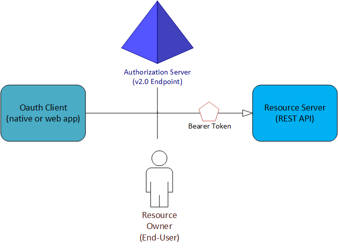

# Azure AD B2C: Authentication protocols
Azure Active Directory B2C (Azure AD B2C) provides identity as a service for your apps by supporting two industry standard protocols: OpenID Connect and OAuth 2.0. The service is standards-compliant, but any two implementations of these protocols can have subtle differences.

The information in this guide is useful if you write your code by directly sending and handling HTTP requests, rather than by using an open source library. We recommend that you read this page before you dive into the details of each specific protocol. But if you're already familiar with Azure AD B2C, you can go straight to [the protocol reference guides](#protocols).

<!-- TODO: Need link to libraries above -->

## The basics
Every app that uses Azure AD B2C needs to be registered in your B2C directory in the [Azure portal](https://portal.azure.com). The app registration process collects and assigns a few values to your app:

* An **Application ID** that uniquely identifies your app.
* A **Redirect URI** or **package identifier** that can be used to direct responses back to your app.
* A few other scenario-specific values. For more information, learn [how to register your application](tutorial-register-applications.md).

After you register your app, it communicates with Azure Active Directory (Azure AD) by sending requests to the endpoint:

```
https://{tenant}.b2clogin.com/{tenant}.onmicrosoft.com/oauth2/v2.0/authorize
https://{tenant}.b2clogin.com/{tenant}.onmicrosoft.com/oauth2/v2.0/token
```

In nearly all OAuth and OpenID Connect flows, four parties are involved in the exchange:



* The **authorization server** is the Azure AD endpoint. It securely handles anything related to user information and access. It also handles the trust relationships between the parties in a flow. It is responsible for verifying the user's identity, granting and revoking access to resources, and issuing tokens. It is also known as the identity provider.

* The **resource owner** is typically the end user. It is the party that owns the data, and it has the power to allow third parties to access that data or resource.

* The **OAuth client** is your app. It's identified by its Application ID. It's usually the party that end users interact with. It also requests tokens from the authorization server. The resource owner must grant the client permission to access the resource.

* The **resource server** is where the resource or data resides. It trusts the authorization server to securely authenticate and authorize the OAuth client. It also uses bearer access tokens to ensure that access to a resource can be granted.

## Policies and user flows
Arguably, Azure AD B2C policies are the most important features of the service. Azure AD B2C extends the standard OAuth 2.0 and OpenID Connect protocols by introducing policies. These allow Azure AD B2C to perform much more than simple authentication and authorization.

To help you set up the most common identity tasks, the Azure AD B2C portal includes predefined, configurable policies called **user flows**. User flows fully describe consumer identity experiences, including sign-up, sign-in, and profile editing. User flows can be defined in an administrative UI. They can be executed by using a special query parameter in HTTP authentication requests.

Policies and user flows are not standard features of OAuth 2.0 and OpenID Connect, so you should take the time to understand them. For more information, see the [Azure AD B2C user flow reference guide](user-flow-overview.md).

## Tokens
The Azure AD B2C implementation of OAuth 2.0 and OpenID Connect makes extensive use of bearer tokens, including bearer tokens that are represented as JSON web tokens (JWTs). A bearer token is a lightweight security token that grants the "bearer" access to a protected resource.

The bearer is any party that can present the token. Azure AD must first authenticate a party before it can receive a bearer token. But if the required steps are not taken to secure the token in transmission and storage, it can be intercepted and used by an unintended party.

Some security tokens have built-in mechanisms that prevent unauthorized parties from using them, but bearer tokens do not have this mechanism. They must be transported in a secure channel, such as a transport layer security (HTTPS).

If a bearer token is transmitted outside a secure channel, a malicious party can use a man-in-the-middle attack to acquire the token and use it to gain unauthorized access to a protected resource. The same security principles apply when bearer tokens are stored or cached for later use. Always ensure that your app transmits and stores bearer tokens in a secure manner.

For additional bearer token security considerations, see [RFC 6750 Section 5](https://tools.ietf.org/html/rfc6750).

More information about the different types of tokens that are used in Azure AD B2C are available in [the Azure AD token reference](tokens-overview.md).

## Protocols
When you're ready to review some example requests, you can start with one of the following tutorials. Each corresponds to a particular authentication scenario. If you need help determining which flow is right for you, check out [the types of apps you can build by using Azure AD B2C](application-types.md).

* [Build mobile and native applications by using OAuth 2.0](authorization-code-flow.md)
* [Build web apps by using OpenID Connect](openid-connect.md)
* [Build single-page apps using the OAuth 2.0 implicit flow](implicit-flow-single-page-application.md)

