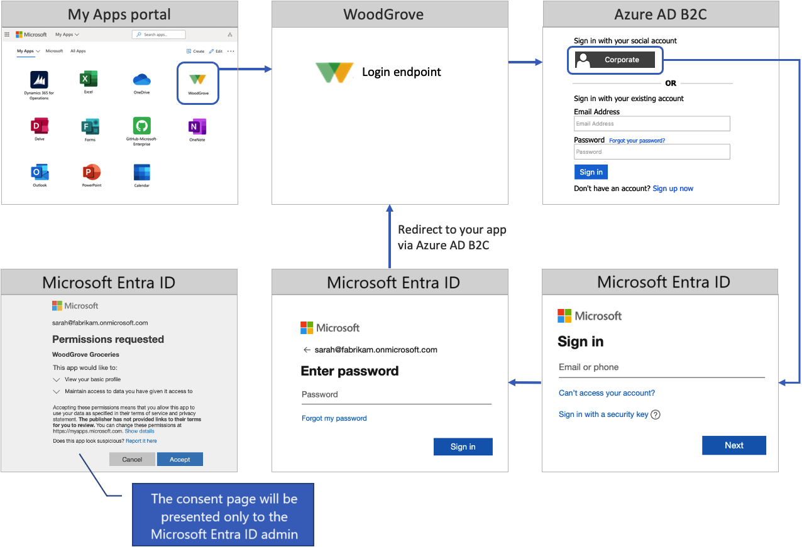

# Publish your Azure Active Directory B2C app to the Microsoft Entra app gallery

The Microsoft Entra app gallery is a catalog of thousands of apps. The app gallery makes it easy to deploy and configure single sign-on (SSO) and automate user setup. You can find popular cloud apps in the gallery, such as Workday, ServiceNow, and Zoom.

This article describes how to publish your Azure Active Directory B2C (Azure AD B2C) app in the Microsoft Entra app gallery. When you publish your app, it's listed among the options that customers can choose from when they're adding apps to their Microsoft Entra tenant.

Here are some benefits of adding your Azure AD B2C app to the app gallery:  

- Your app is a verified integration with Microsoft.
- SSO access is enabled between your app and Microsoft Entra apps.
- Customers can find your app in the gallery with a quick search.
- App configuration is simple and minimal.
- Customers get a step-by-step configuration tutorial.
- Customers can assign the app to various users and groups within their organization.
- The tenant administrator can grant tenant-wide admin consent to your app.

## Sign in flow overview

The sign-in flow involves the following steps:

1. Users go to the [My Apps portal](https://myapps.microsoft.com/) and select your app. The app opens the app sign-in URL.
1. The app sign-in URL starts an authorization request and redirects users to the Azure AD B2C authorization endpoint.
1. Users choose to sign in with their Microsoft Entra ID "Corporate" account. Azure AD B2C takes them to the Microsoft Entra authorization endpoint, where they sign in with their work account.
1. If the Microsoft Entra SSO session is active, Microsoft Entra ID issues an access token without prompting users to sign in again. Otherwise, users are prompted to sign in again.

Depending on the users' SSO session and Microsoft Entra identity settings, they might be prompted to:

- Provide their email address or phone number.

- Enter their password or sign in with the [Microsoft authenticator app](https://www.microsoft.com/p/microsoft-authenticator/9nblgggzmcj6).

- Complete multifactor authentication.

- Accept the consent page. Your customer's tenant administrator can [grant tenant-wide admin consent to an app](../active-directory/manage-apps/grant-admin-consent.md). When consent is granted, the consent page won't be presented to users.

Upon successful sign-in, Microsoft Entra ID returns a token to Azure AD B2C. Azure AD B2C validates and reads the token claims, and then returns a token to your application.

## Prerequisites

[!INCLUDE [active-directory-b2c-customization-prerequisites-custom-policy](../../includes/active-directory-b2c-customization-prerequisites-custom-policy.md)]

## Step 1: Register your application in Azure AD B2C

To enable sign in to your app with Azure AD B2C, register your app in the Azure AD B2C directory. Registering your app establishes a trust relationship between the app and Azure AD B2C. 

If you haven't already done so, [register a web application](tutorial-register-applications.md). Later, you'll register this app with the Azure app gallery.

## Step 2: Set up sign-in for multitenant Microsoft Entra ID

To allow employees and consumers from any Microsoft Entra tenant to sign in by using Azure AD B2C, follow the guidance for [setting up sign in for multitenant Microsoft Entra ID](identity-provider-azure-ad-multi-tenant.md?pivots=b2c-custom-policy).

## Step 3: Prepare your app

In your app, copy the URL of the sign-in endpoint. If you use the [web application sample](configure-authentication-sample-web-app.md), the sign-in URL is `https://localhost:5001/MicrosoftIdentity/Account/SignIn?`. This URL is where the Microsoft Entra app gallery takes users to sign in to your app.

In production environments, the app registration redirect URI is ordinarily a publicly accessible endpoint where your app is running. The reply URL must begin with `https`.

## Step 4: Publish your Azure AD B2C app

Finally, add the multitenant app to the Microsoft Entra app gallery. Follow the instructions in [Publish your app to the Microsoft Entra app gallery](../active-directory/manage-apps/v2-howto-app-gallery-listing.md). To add your app to the app gallery, use the following steps:

1. [Create and publish documentation](../active-directory/manage-apps/v2-howto-app-gallery-listing.md#create-and-publish-documentation).
1. [Submit your app](../active-directory/manage-apps/v2-howto-app-gallery-listing.md#submit-your-application) with the following information:

    |Question  |Answer you should provide  |
    |---------|---------|
    |What type of request do you want to submit?| Select **List my application in the gallery**.|
    |What feature would you like to enable when listing your application in the gallery? | Select **Federated SSO (SAML, WS-Fed & OpenID Connect)**. | 
    | Select your application federation protocol| Select **OpenID Connect & OAuth 2.0**. |
    | Application (Client) ID | Provide the ID of [your Azure AD B2C application](#step-1-register-your-application-in-azure-ad-b2c). |
    | Application sign in URL|Provide the app sign-in URL as it's configured in [Step 3. Prepare your app](#step-3-prepare-your-app).|
    | Multitenant| Select **Yes**. |

## Next steps

- Learn how to [Publish your Microsoft Entra app to the Microsoft Entra app gallery](../active-directory/manage-apps/v2-howto-app-gallery-listing.md).
