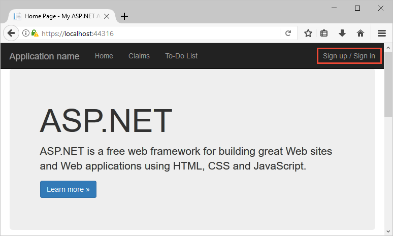
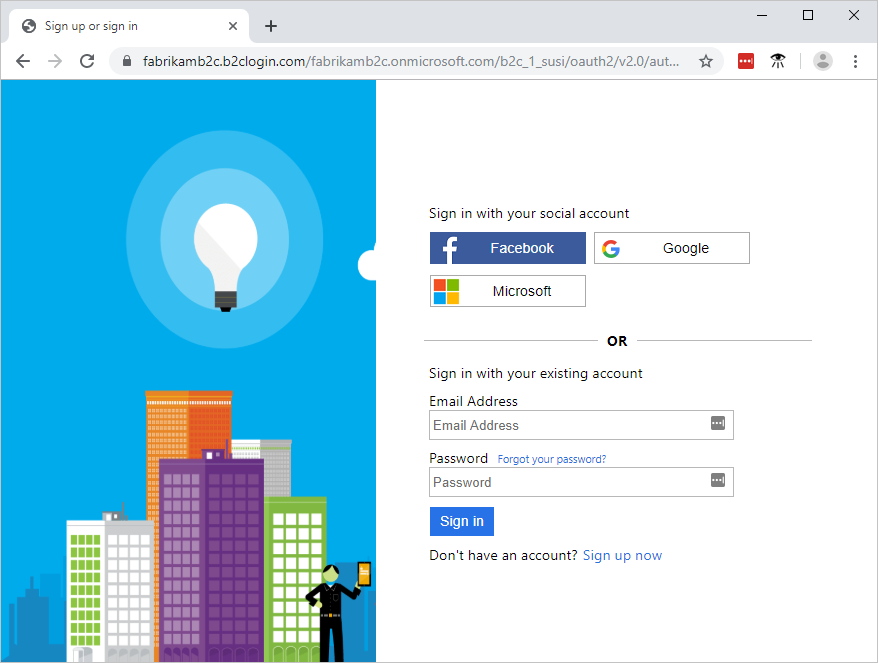
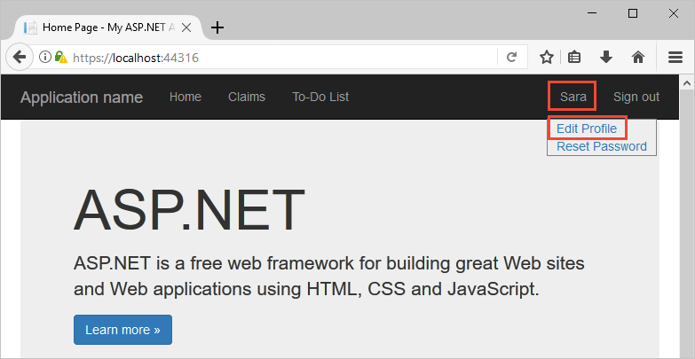
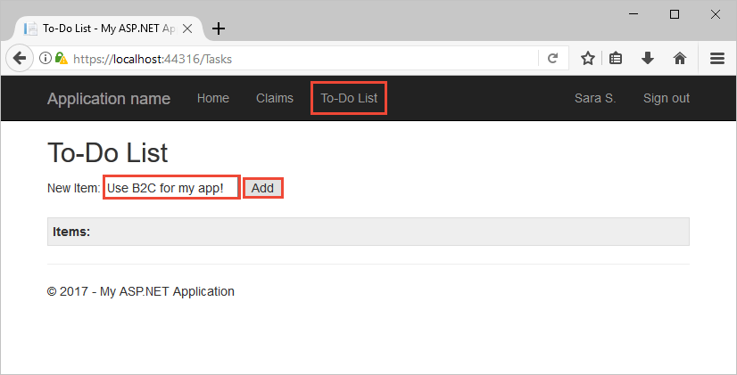

# Quickstart: Set up sign in for an ASP.NET application using Azure Active Directory B2C

Azure Active Directory B2C (Azure AD B2C) provides cloud identity management to keep your application, business, and customers protected. Azure AD B2C enables your applications to authenticate to social accounts and enterprise accounts using open standard protocols. 

In this quickstart, you use an ASP.NET application to sign in using a social identity provider and call an Azure AD B2C protected web API.


## Prerequisites

- [Visual Studio 2022](https://visualstudio.microsoft.com/downloads/) with the **ASP.NET and web development** workload.
- A social account from Facebook, Google, or Microsoft.
- [Download a zip file](https://github.com/Azure-Samples/active-directory-b2c-dotnet-webapp-and-webapi/archive/master.zip) or clone the sample web application from GitHub.

    ```
    git clone https://github.com/Azure-Samples/active-directory-b2c-dotnet-webapp-and-webapi.git
    ```

    There are two projects in the sample solution:

    - **TaskWebApp** - A web application that creates and edits a task list. The web application uses the **sign-up or sign-in** user flow to sign up or sign in users.
    - **TaskService** - A web API that supports the create, read, update, and delete task list functionality. The web API is protected by Azure AD B2C and called by the web application.

## Run the application in Visual Studio

1. In the sample application project folder, open the **B2C-WebAPI-DotNet.sln** solution in Visual Studio.
1. For this quickstart, you run both the **TaskWebApp** and **TaskService** projects at the same time. Right-click the **B2C-WebAPI-DotNet** solution in Solution Explorer, and then select **Configure StartUp Projects...**.
1. Select **Multiple startup projects** and change the **Action** for both projects to **Start**.
1. Select **OK**.
1. Press **F5** to debug both applications. Each application opens in its own browser tab:

    - `https://localhost:44316/` - The ASP.NET web application. You interact directly with this application in the quickstart.
    - `https://localhost:44332/` - The web API that's called by the ASP.NET web application.

## Sign in using your account

1. Select **Sign up / Sign in** in the ASP.NET web application to start the workflow.

    

    The sample supports several sign-up options including using a social identity provider or creating a local account using an email address. For this quickstart, use a social identity provider account from either Facebook, Google, or Microsoft.

1. Azure AD B2C presents a sign-in page for a fictitious company called Fabrikam for the sample web application. To sign up using a social identity provider, select the button of the identity provider you want to use.

    

    You authenticate (sign in) using your social account credentials and authorize the application to read information from your social account. By granting access, the application can retrieve profile information from the social account such as your name and city.

1. Finish the sign-in process for the identity provider.

## Edit your profile

Azure Active Directory B2C provides functionality to allow users to update their profiles. The sample web app uses an Azure AD B2C edit profile user flow for the workflow.

1. In the application menu bar, select your profile name, and then select **Edit profile** to edit the profile you created.

    

1. Change your **Display name** or **City**, and then select **Continue** to update your profile.

    The change is displayed in the upper right portion of the web application's home page.

## Access a protected API resource

1. Select **To-Do List** to enter and modify your to-do list items.

1. In the **New Item** text box, enter text. To call the Azure AD B2C protected web API that adds a to-do list item, select **Add**.

    

    The ASP.NET web application includes a Microsoft Entra access token in the request to the protected web API resource to perform operations on the user's to-do list items.

You've successfully used your Azure AD B2C user account to make an authorized call to an Azure AD B2C protected web API.


## Next steps

[Create an Azure Active Directory B2C tenant in the Azure portal](tutorial-create-tenant.md)
