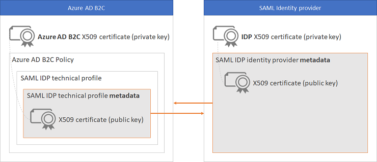

# Define a SAML identity provider technical profile in an Azure Active Directory B2C custom policy

[!INCLUDE [active-directory-b2c-advanced-audience-warning](../../includes/active-directory-b2c-advanced-audience-warning.md)]

Azure Active Directory B2C (Azure AD B2C) provides support for the SAML 2.0 identity provider. This article describes the specifics of a technical profile for interacting with a claims provider that supports this standardized protocol. With a SAML technical profile you can federate with a SAML-based identity provider, such as [ADFS](./identity-provider-adfs.md) and [Salesforce](identity-provider-salesforce-saml.md). This federation allows your users to sign in with their existing social or enterprise identities.

## Metadata exchange

Metadata is information used in the SAML protocol to expose the configuration of a SAML party, such as a service provider or identity provider. Metadata defines the location of the services, such as sign-in and sign-out, certificates, sign-in method, and more. The identity provider uses the metadata to know how to communicate with Azure AD B2C. The metadata is configured in XML format and may be signed with a digital signature so that the other party can validate the integrity of the metadata. When Azure AD B2C federates with a SAML identity provider, it acts as a service provider initiating a SAML request and waiting for a SAML response. And, in some cases, accepts unsolicited SAML authentication, which is also known as identity provider initiated.

The metadata can be configured in both parties as "Static Metadata" or "Dynamic Metadata". In static mode, you copy the entire metadata from one party and set it in the other party. In dynamic mode, you set the URL to the metadata while the other party reads the configuration dynamically. The principles are the same, you set the metadata of the Azure AD B2C technical profile in your identity provider and set the metadata of the identity provider in Azure AD B2C.

Each SAML identity provider has different steps to expose and set the service provider, in this case Azure AD B2C, and set the Azure AD B2C metadata in the identity provider. Look at your identity provider’s documentation for guidance on how to do so.

The following example shows a URL address to the SAML metadata of an Azure AD B2C technical profile:

```
https://your-tenant-name.b2clogin.com/your-tenant-name.onmicrosoft.com/your-policy/samlp/metadata?idptp=your-technical-profile
```

Replace the following values:

- **your-tenant-name** with your tenant name, such as fabrikam.b2clogin.com.
- **your-policy** with your policy name. Use the policy where you configure the SAML provider technical profile, or a policy that inherits from that policy.
- **your-technical-profile** with your SAML identity provider technical profile name.

## Digital signing certificates exchange

To build a trust between Azure AD B2C and your SAML identity provider, you need to provide a valid X509 certificate with the private key. You upload the certificate with the private key (.pfx file) to the Azure AD B2C policy key store. Azure AD B2C digitally signs the SAML sign-in request using the certificate that you provide.

The certificate is used in the following ways:

- Azure AD B2C generates and signs a SAML request, using the Azure AD B2C private key of the certificate. The SAML request is sent to the identity provider, which validates the request using Azure AD B2C public key of the certificate. The Azure AD B2C public certificate is accessible through technical profile metadata. Alternatively, you can manually upload the .cer file to your SAML identity provider.
- The identity provider signs the data sent to Azure AD B2C using the identity provider's private key of the certificate. Azure AD B2C validates the data using the identity provider's public certificate. Each identity provider has different steps for setup, look at your identity provider’s documentation for guidance on how to do so. In Azure AD B2C, your policy needs access to the certificate public key using the identity provider's metadata.

A self-signed certificate is acceptable for most scenarios. For production environments, it is recommended to use an X509 certificate that is issued by a certificate authority. Also, as described later in this document, for a non-production environment you can disable the SAML signing on both sides.

The following diagram shows the metadata and certificate exchange:



## Digital encryption

To encrypt the SAML response assertion, the identity provider always uses a public key of an encryption certificate in an Azure AD B2C technical profile. When Azure AD B2C needs to decrypt the data, it uses the private portion of the encryption certificate.

To encrypt the SAML response assertion:

1. Upload a valid X509 certificate with the private key (.pfx file) to the Azure AD B2C policy key store.
2. Add a **CryptographicKey** element with an identifier of `SamlAssertionDecryption` to the technical profile **CryptographicKeys** collection. Set the **StorageReferenceId** to the name of the policy key you created in step 1.
3. Set the technical profile metadata **WantsEncryptedAssertions** to `true`.
4. Update the identity provider with the new Azure AD B2C technical profile metadata. You should see the **KeyDescriptor** with the **use** property set to `encryption` containing the public key of your certificate.

The following example shows the Key Descriptor section of the SAML metadata used for encryption:

```xml
<KeyDescriptor use="encryption">
  <KeyInfo xmlns="https://www.w3.org/2000/09/xmldsig#">
    <X509Data>
      <X509Certificate>valid certificate</X509Certificate>
    </X509Data>
  </KeyInfo>
</KeyDescriptor>
```

## Protocol

The **Name** attribute of the Protocol element needs to be set to `SAML2`.

## Input claims

The **InputClaims** element is used to send a **NameId** within the **Subject** of the SAML AuthN Request. To achieve this add an input claim with a **PartnerClaimType** set to `subject` as shown below.

```xml
<InputClaims>
	<InputClaim ClaimTypeReferenceId="issuerUserId" PartnerClaimType="subject" />
</InputClaims>
```

## Output claims

The **OutputClaims** element contains a list of claims returned by the SAML identity provider under the `AttributeStatement` section. You may need to map the name of the claim defined in your policy to the name defined in the identity provider. You can also include claims that aren't returned by the identity provider as long as you set the `DefaultValue` attribute.

### Subject name output claim

To read the SAML assertion **NameId** in the **Subject** as a normalized claim, set the claim **PartnerClaimType** to value of the `SPNameQualifier` attribute. If the `SPNameQualifier`attribute is not presented, set the claim **PartnerClaimType** to value of the `NameQualifier` attribute. 


SAML assertion: 

```xml
<saml:Subject>
  <saml:NameID SPNameQualifier="http://your-idp.com/unique-identifier" Format="urn:oasis:names:tc:SAML:2.0:nameid-format:transient">david@contoso.com</saml:NameID>
  <SubjectConfirmation Method="urn:oasis:names:tc:SAML:2.0:cm:bearer">
    <SubjectConfirmationData InResponseTo="_cd37c3f2-6875-4308-a9db-ce2cf187f4d1" NotOnOrAfter="2020-02-15T16:23:23.137Z" Recipient="https://your-tenant.b2clogin.com/your-tenant.onmicrosoft.com/B2C_1A_TrustFrameworkBase/samlp/sso/assertionconsumer" />
    </SubjectConfirmation>
  </saml:SubjectConfirmation>
</saml:Subject>
```

Output claim:

```xml
<OutputClaim ClaimTypeReferenceId="issuerUserId" PartnerClaimType="http://your-idp.com/unique-identifier" />
```

If both `SPNameQualifier` or `NameQualifier` attributes are not presented in the SAML assertion, set the claim **PartnerClaimType** to `assertionSubjectName`. Make sure the **NameId** is the first value in assertion XML. When you define more than one assertion, Azure AD B2C picks the subject value from the last assertion.

The following example shows the claims returned by a SAML identity provider:

- The **issuerUserId** claim is mapped to the **assertionSubjectName** claim.
- The **first_name** claim is mapped to the **givenName** claim.
- The **last_name** claim is mapped to the **surname** claim.
- The **displayName** claim is mapped to the **name** claim.
- The **email** claim without name mapping.

The technical profile also returns claims that aren't returned by the identity provider:

- The **identityProvider** claim that contains the name of the identity provider.
- The **authenticationSource** claim with a default value of **socialIdpAuthentication**.

```xml
<OutputClaims>
  <OutputClaim ClaimTypeReferenceId="issuerUserId" PartnerClaimType="assertionSubjectName" />
  <OutputClaim ClaimTypeReferenceId="givenName" PartnerClaimType="first_name" />
  <OutputClaim ClaimTypeReferenceId="surname" PartnerClaimType="last_name" />
  <OutputClaim ClaimTypeReferenceId="displayName" PartnerClaimType="name" />
  <OutputClaim ClaimTypeReferenceId="email"  />
  <OutputClaim ClaimTypeReferenceId="identityProvider" DefaultValue="contoso.com" />
  <OutputClaim ClaimTypeReferenceId="authenticationSource" DefaultValue="socialIdpAuthentication" />
</OutputClaims>
```

The **OutputClaimsTransformations** element may contain a collection of **OutputClaimsTransformation** elements that are used to modify the output claims or generate new ones.

## Metadata

| Attribute | Required | Description |
| --------- | -------- | ----------- |
| PartnerEntity | Yes | URL of the metadata of the SAML identity provider. Or copy the identity provider metadata and embed it inside the CDATA element `<![CDATA[Your IDP metadata]]>`. Embedding the identity provider metadata is not recommended. The identity provider may change the settings, or update the certificate. If the identity provider metadata has been changed, get the new metadata and update your policy with the new one. |
| WantsSignedRequests | No | Indicates whether the technical profile requires all of the outgoing authentication requests to be signed. Possible values: `true` or `false`. The default value is `true`. When the value is set to `true`, the **SamlMessageSigning** cryptographic key needs to be specified and all of the outgoing authentication requests are signed. If the value is set to `false`, the **SigAlg** and **Signature** parameters (query string or post parameter) are omitted from the request. This metadata also controls the metadata **AuthnRequestsSigned** attribute, which is output in the metadata of the Azure AD B2C technical profile that is shared with the identity provider. Azure AD B2C doesn't sign the request if the value of **WantsSignedRequests** in the technical profile metadata is set to `false` and the identity provider metadata **WantAuthnRequestsSigned** is set to `false` or not specified. |
| XmlSignatureAlgorithm | No | The method that Azure AD B2C uses to sign the SAML request. This metadata controls the value of the  **SigAlg** parameter (query string or post parameter) in the SAML request. Possible values: `Sha256`, `Sha384`, `Sha512`, or `Sha1` (default). Make sure you configure the signature algorithm on both sides with same value. Use only the algorithm that your certificate supports. |
| WantsSignedAssertions | No | Indicates whether the technical profile requires all incoming assertions to be signed. Possible values: `true` or `false`. The default value is `true`. If the value is set to `true`, all assertions section `saml:Assertion` sent by the identity provider to Azure AD B2C must be signed. If the value is set to `false`,  the identity provider shouldn’t sign the assertions, but even if it does, Azure AD B2C won’t validate the signature. This metadata also controls the metadata flag **WantsAssertionsSigned**, which is output in the metadata of the Azure AD B2C technical profile that is shared with the identity provider. If you disable the assertions validation, you also may want to disable the response signature validation (for more information, see **ResponsesSigned**). |
| ResponsesSigned | No | Possible values: `true` or `false`. The default value is `true`. If the value is set to `false`, the identity provider shouldn’t sign the SAML response, but even if it does, Azure AD B2C won’t validate the signature. If the value is set to `true`, the SAML response sent by the identity provider to Azure AD B2C is signed and must be validated. If you disable the SAML response validation, you also may want to disable the assertion signature validation (for more information, see **WantsSignedAssertions**). |
| WantsEncryptedAssertions | No | Indicates whether the technical profile requires all incoming assertions to be encrypted. Possible values: `true` or `false`. The default value is `false`. If the value is set to `true`, assertions sent by the identity provider to Azure AD B2C must be signed and the **SamlAssertionDecryption** cryptographic key needs to be specified. If the value is set to `true`, the metadata of the Azure AD B2C technical profile includes the **encryption** section. The identity provider reads the metadata and encrypts the SAML response assertion with the public key that is provided in the metadata of the Azure AD B2C technical profile. If you enable the assertions encryption, you also may need to disable the response signature validation (for more information, see **ResponsesSigned**). |
| NameIdPolicyFormat | No | Specifies constraints on the name identifier to be used to represent the requested subject. If omitted, any type of identifier supported by the identity provider for the requested subject can be used. For example,  `urn:oasis:names:tc:SAML:1.1:nameid-format:unspecified`. **NameIdPolicyFormat** can be used with **NameIdPolicyAllowCreate**. Look at your identity provider’s documentation for guidance about which name ID policies are supported. |
| NameIdPolicyAllowCreate | No | When using **NameIdPolicyFormat**, you can also specify the `AllowCreate` property of **NameIDPolicy**. The value of this metadata is `true` or `false` to indicate whether the identity provider is allowed to create a new account during the sign-in flow. Look at your identity provider’s documentation for guidance on how to do so. |
| AuthenticationRequestExtensions | No | Optional protocol message extension elements that are agreed on between Azure AD B2C and the identity provider. The extension is presented in XML format. You add the XML data inside the CDATA element `<![CDATA[Your IDP metadata]]>`. Check your identity provider’s documentation to see if the extensions element is supported. |
| IncludeAuthnContextClassReferences | No | Specifies one or more URI references identifying authentication context classes. For example, to allow a user to sign in with username and password only, set the value to `urn:oasis:names:tc:SAML:2.0:ac:classes:Password`. To allow sign-in through username and password over a protected session (SSL/TLS), specify `PasswordProtectedTransport`. Look at your identity provider’s documentation for guidance about the **AuthnContextClassRef** URIs that are supported. Specify multiple URIs as a comma-delimited list. |
| IncludeKeyInfo | No | Indicates whether the SAML authentication request contains the public key of the certificate when the binding is set to `HTTP-POST`. Possible values: `true` or `false`. |
| IncludeClaimResolvingInClaimsHandling  | No | For input and output claims, specifies whether [claims resolution](claim-resolver-overview.md) is included in the technical profile. Possible values: `true`, or `false` (default). If you want to use a claims resolver in the technical profile, set this to `true`. |
|SingleLogoutEnabled| No| Indicates whether during sign-in the technical profile attempts to sign out from federated identity providers. For more information, see [Azure AD B2C session sign-out](session-behavior.md#sign-out).  Possible values: `true` (default), or `false`.|
|ForceAuthN| No| Passes the ForceAuthN value in the SAML authentication request to determine if the external SAML IDP will be forced to prompt the user for authentication. By default, Azure AD B2C sets the ForceAuthN value to false on initial login. If the session is then reset (for example by using the `prompt=login` in OIDC) then the ForceAuthN value will be set to `true`. Setting the metadata item as shown below will force the value for all requests to the external IDP.  Possible values: `true` or `false`.|
|ProviderName| No| Passes the ProviderName value in the SAML authentication request.|


## Cryptographic keys

The **CryptographicKeys** element contains the following attributes:

| Attribute |Required | Description |
| --------- | ----------- | ----------- |
| SamlMessageSigning |Yes | The X509 certificate (RSA key set) to use to sign SAML messages. Azure AD B2C uses this key to sign the requests and send them to the identity provider. |
| SamlAssertionDecryption |No* | The X509 certificate (RSA key set). A SAML identity provider uses the public portion of the certificate to encrypt the assertion of the SAML response. Azure AD B2C uses the private portion of the certificate to decrypt the assertion. <br/><br/> * Required if the external IDP encrypts SAML assertions.|
| MetadataSigning |No | The X509 certificate (RSA key set) to use to sign SAML metadata. Azure AD B2C uses this key to sign the metadata.  |

## Next steps

See the following articles for examples of working with SAML identity providers in Azure AD B2C:

- [Add ADFS as a SAML identity provider using custom policies](identity-provider-adfs.md)
- [Sign in by using Salesforce accounts via SAML](identity-provider-salesforce-saml.md)
