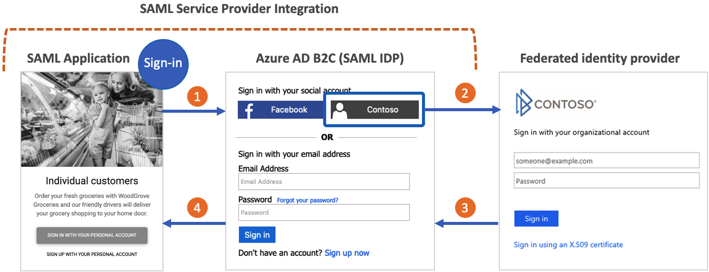

# Register a SAML application in Azure AD B2C

In this article, learn how to connect your Security Assertion Markup Language (SAML) applications (service providers) to Azure Active Directory B2C (Azure AD B2C) for authentication.

[!INCLUDE [active-directory-b2c-choose-user-flow-or-custom-policy](../../includes/active-directory-b2c-choose-user-flow-or-custom-policy.md)]

::: zone pivot="b2c-user-flow"

[!INCLUDE [active-directory-b2c-limited-to-custom-policy](../../includes/active-directory-b2c-limited-to-custom-policy.md)]

::: zone-end

::: zone pivot="b2c-custom-policy"

## Overview

Organizations that use Azure AD B2C as their customer identity and access management solution might require integration with applications that authenticate by using the SAML protocol. The following diagram shows how Azure AD B2C serves as an *identity provider* (IdP) to achieve single-sign-on (SSO) with SAML-based applications.



1. The application creates a SAML AuthN request that's sent to the SAML sign-in endpoint for Azure AD B2C.
2. The user can use an Azure AD B2C local account or any other federated identity provider (if configured) to authenticate.
3. If the user signs in by using a federated identity provider, a token response is sent to Azure AD B2C.
4. Azure AD B2C generates a SAML assertion and sends it to the application.

Watch this video to learn how to integrate SAML applications with Azure AD B2C. 

>[!Video https://www.youtube.com/embed/r2TIVBCm7v4]

## Prerequisites

For the scenario in this article, you need:

* The *SocialAndLocalAccounts* custom policy from a custom policy starter pack. Complete the steps in [Get started with custom policies in Azure AD B2C](tutorial-create-user-flows.md?pivots=b2c-custom-policy). 
* A basic understanding of the SAML protocol and familiarity with the application's SAML implementation.
* A web application configured as a SAML application. It must have the ability to send SAML AuthN requests and to receive, decode, and verify SAML responses from Azure AD B2C. The SAML application is also known as the relying party application or service provider. 
* The SAML application's publicly available SAML *metadata endpoint* or XML document.
* An [Azure AD B2C tenant](tutorial-create-tenant.md).

If you don't yet have a SAML application and an associated metadata endpoint, you can use the [SAML test application][samltest] that we've made available for testing.

[!INCLUDE [active-directory-b2c-https-cipher-tls-requirements](../../includes/active-directory-b2c-https-cipher-tls-requirements.md)]

## Set up certificates

To build a trust relationship between your application and Azure AD B2C, both services must be able to create and validate each other's signatures. Configure X509 certificates in your application and in Azure AD B2C.

**Application certificates**

| Usage | Required | Description |
| --------- | -------- | ----------- |
| SAML request signing  | No | A certificate with a private key stored in your web app. Your application uses the certificate to sign SAML requests sent to Azure AD B2C. The web app must expose the public key through its SAML metadata endpoint. Azure AD B2C validates the SAML request signature by using the public key from the application metadata.|
| SAML assertion encryption  | No | A certificate with a private key stored in your web app. The web app must expose the public key through its SAML metadata endpoint. Azure AD B2C can encrypt assertions to your application by using the public key. The application uses the private key to decrypt the assertion.|

**Azure AD B2C certificates**

| Usage | Required | Description |
| --------- | -------- | ----------- |
| SAML response signing | Yes  | A certificate with a private key stored in Azure AD B2C. Azure AD B2C uses this certificate to sign the SAML response sent to your application. Your application reads the metadata public key in Azure AD B2C to validate the signature of the SAML response. |
| SAML assertion signing | Yes | A certificate with a private key stored in Azure AD B2C. Azure AD B2C uses this certificate to sign the `<saml:Assertion>` part of the SAML response.  |

In a production environment, we recommend using certificates that a public certificate authority has issued. But you can also complete this procedure with self-signed certificates.

### Create a policy key

To have a trust relationship between your application and Azure AD B2C, create a signing certificate for the SAML response. Azure AD B2C uses this certificate to sign the SAML response sent to your application. Your application reads the metadata public key for Azure AD B2C to validate the signature of the SAML response. 

> [!TIP]
> You can use this policy key for other purposes, such as signing the [SAML assertion](saml-service-provider-options.md#check-the-saml-assertion-signature). 

### Obtain a certificate

[!INCLUDE [active-directory-b2c-create-self-signed-certificate](../../includes/active-directory-b2c-create-self-signed-certificate.md)]

### Upload the certificate

You need to store your certificate in your Azure AD B2C tenant.

1. Sign in to the [Azure portal](https://portal.azure.com/).
1. If you have access to multiple tenants, select the **Settings** icon in the top menu to switch to your Azure AD B2C tenant from the **Directories + subscriptions** menu.
1. Select **All services** in the upper-left corner of the Azure portal, and then search for and select **Azure AD B2C**.
1. On the **Overview** page, select **Identity Experience Framework**.
1. Select **Policy Keys**, and then select **Add**.
1. For **Options**, select **Upload**.
1. For **Name**, enter a name for the policy key. For example, enter **SamlIdpCert**. The prefix **B2C_1A_** is added automatically to the name of your key.
1. Browse to and select your certificate .pfx file with the private key.
1. Select **Create**.

## Enable your policy to connect with a SAML application

To connect to your SAML application, Azure AD B2C must be able to create SAML responses.

Open *SocialAndLocalAccounts\TrustFrameworkExtensions.xml* in the custom policy starter pack.

Find the `<ClaimsProviders>` section and add the following XML snippet to implement your SAML response generator:

```xml
<ClaimsProvider>
  <DisplayName>Token Issuer</DisplayName>
  <TechnicalProfiles>

    <!-- SAML Token Issuer technical profile -->
    <TechnicalProfile Id="Saml2AssertionIssuer">
      <DisplayName>Token Issuer</DisplayName>
      <Protocol Name="SAML2"/>
      <OutputTokenFormat>SAML2</OutputTokenFormat>
      <Metadata>
        <Item Key="IssuerUri">https://issuerUriMyAppExpects</Item>
      </Metadata>
      <CryptographicKeys>
        <Key Id="SamlAssertionSigning" StorageReferenceId="B2C_1A_SamlIdpCert"/>
        <Key Id="SamlMessageSigning" StorageReferenceId="B2C_1A_SamlIdpCert"/>
      </CryptographicKeys>
      <InputClaims/>
      <OutputClaims/>
      <UseTechnicalProfileForSessionManagement ReferenceId="SM-Saml-issuer"/>
    </TechnicalProfile>

    <!-- Session management technical profile for SAML-based tokens -->
    <TechnicalProfile Id="SM-Saml-issuer">
      <DisplayName>Session Management Provider</DisplayName>
      <Protocol Name="Proprietary" Handler="Web.TPEngine.SSO.SamlSSOSessionProvider, Web.TPEngine, Version=1.0.0.0, Culture=neutral, PublicKeyToken=null"/>
    </TechnicalProfile>

  </TechnicalProfiles>
</ClaimsProvider>
```

#### Configure the issuer URI of the SAML response

You can change the value of the `IssuerUri` metadata item in the SAML Token Issuer technical profile. This change will be reflected in the `issuerUri` attribute returned in the SAML response from Azure AD B2C. Configure your application to accept the same `IssuerUri` value during SAML response validation.

```xml
<ClaimsProvider>
  <DisplayName>Token Issuer</DisplayName>
  <TechnicalProfiles>
    <!-- SAML Token Issuer technical profile -->
    <TechnicalProfile Id="Saml2AssertionIssuer">
      <DisplayName>Token Issuer</DisplayName>
      <Protocol Name="SAML2"/>
      <OutputTokenFormat>SAML2</OutputTokenFormat>
      <Metadata>
        <Item Key="IssuerUri">https://issuerUriMyAppExpects</Item>
      </Metadata>
      ...
    </TechnicalProfile>
```

## Configure your policy to issue a SAML response

Now that your policy can create SAML responses, you must configure the policy to issue a SAML response instead of the default JWT response to your application.

### Create a sign-up or sign-in policy configured for SAML

1. Create a copy of the *SignUpOrSignin.xml* file in your starter pack's working directory and save it with a new name. This article uses *SignUpOrSigninSAML.xml* as an example. This file is your policy file for the relying party. It's configured to issue a JWT response by default.

1. Open the *SignUpOrSigninSAML.xml* file in your preferred editor.

1. Change the value of:
    
    1. `PolicyId` to `B2C_1A_signup_signin_saml` 
    
    1. `PublicPolicyUri` to `http://<tenant-name>.onmicrosoft.com/B2C_1A_signup_signin_saml`. Replace `<tenant-name>` placeholder with the subdomain of your Azure AD B2C tenant's domain name. For example, if your tenant primary domain is `contoso.onmicrosoft.com`, use `contoso`. If you don't have your tenant name, learn [how to read your tenant details](tenant-management-read-tenant-name.md#get-your-tenant-name).  

    ```xml
    <TrustFrameworkPolicy
    xmlns:xsi="http://www.w3.org/2001/XMLSchema-instance"
    xmlns:xsd="http://www.w3.org/2001/XMLSchema"
    xmlns="http://schemas.microsoft.com/online/cpim/schemas/2013/06"
    PolicySchemaVersion="0.3.0.0"
    TenantId="<tenant-name>.onmicrosoft.com"
    PolicyId="B2C_1A_signup_signin_saml"
    PublicPolicyUri="http://<tenant-name>.onmicrosoft.com/B2C_1A_signup_signin_saml">
    ```

1. At the end of the user journey, Azure AD B2C contains a `SendClaims` step. This step references the Token Issuer technical profile. To issue a SAML response rather than the default JWT response, modify the `SendClaims` step to reference the new SAML Token Issuer technical profile, `Saml2AssertionIssuer`.

Add the following XML snippet just before the `<RelyingParty>` element. This XML overwrites orchestration step 7 in the _SignUpOrSignIn_ user journey. 

If you started from a different folder in the starter pack or you customized the user journey by adding or removing orchestration steps, make sure the number in the `order` element corresponds to the number specified in the user journey for the token issuer step. For example, in the other starter pack folders, the corresponding step number is 4 for `LocalAccounts`, 6 for `SocialAccounts`, and 9 for `SocialAndLocalAccountsWithMfa`.

```xml
<UserJourneys>
  <UserJourney Id="SignUpOrSignIn">
    <OrchestrationSteps>
      <OrchestrationStep Order="7" Type="SendClaims" CpimIssuerTechnicalProfileReferenceId="Saml2AssertionIssuer"/>
    </OrchestrationSteps>
  </UserJourney>
</UserJourneys>
```

The relying party element determines which protocol your application uses. The default is `OpenId`. The `Protocol` element must be changed to `SAML`. The output claims will create the claims mapping to the SAML assertion.

Replace the entire `<TechnicalProfile>` element in the `<RelyingParty>` element with the following technical profile XML.

```xml
    <TechnicalProfile Id="PolicyProfile">
      <DisplayName>PolicyProfile</DisplayName>
      <Protocol Name="SAML2"/>
      <OutputClaims>
        <OutputClaim ClaimTypeReferenceId="displayName" />
        <OutputClaim ClaimTypeReferenceId="givenName" />
        <OutputClaim ClaimTypeReferenceId="surname" />
        <OutputClaim ClaimTypeReferenceId="email" DefaultValue="" />
        <OutputClaim ClaimTypeReferenceId="identityProvider" DefaultValue="" />
        <OutputClaim ClaimTypeReferenceId="objectId" PartnerClaimType="objectId"/>
      </OutputClaims>
      <SubjectNamingInfo ClaimType="objectId" ExcludeAsClaim="true"/>
    </TechnicalProfile>
```

Your final policy file for the relying party should look like the following XML code:

```xml
<?xml version="1.0" encoding="UTF-8" standalone="yes"?>
<TrustFrameworkPolicy
  xmlns:xsi="http://www.w3.org/2001/XMLSchema-instance"
  xmlns:xsd="http://www.w3.org/2001/XMLSchema"
  xmlns="http://schemas.microsoft.com/online/cpim/schemas/2013/06"
  PolicySchemaVersion="0.3.0.0"
  TenantId="contoso.onmicrosoft.com"
  PolicyId="B2C_1A_signup_signin_saml"
  PublicPolicyUri="http://contoso.onmicrosoft.com/B2C_1A_signup_signin_saml">

  <BasePolicy>
    <TenantId>contoso.onmicrosoft.com</TenantId>
    <PolicyId>B2C_1A_TrustFrameworkExtensions</PolicyId>
  </BasePolicy>

  <UserJourneys>
    <UserJourney Id="SignUpOrSignIn">
      <OrchestrationSteps>
        <OrchestrationStep Order="7" Type="SendClaims" CpimIssuerTechnicalProfileReferenceId="Saml2AssertionIssuer"/>
      </OrchestrationSteps>
    </UserJourney>
  </UserJourneys>

  <RelyingParty>
    <DefaultUserJourney ReferenceId="SignUpOrSignIn" />
    <TechnicalProfile Id="PolicyProfile">
      <DisplayName>PolicyProfile</DisplayName>
      <Protocol Name="SAML2"/>
      <OutputClaims>
        <OutputClaim ClaimTypeReferenceId="displayName" />
        <OutputClaim ClaimTypeReferenceId="givenName" />
        <OutputClaim ClaimTypeReferenceId="surname" />
        <OutputClaim ClaimTypeReferenceId="email" DefaultValue="" />
        <OutputClaim ClaimTypeReferenceId="identityProvider" DefaultValue="" />
        <OutputClaim ClaimTypeReferenceId="objectId" PartnerClaimType="objectId"/>
      </OutputClaims>
      <SubjectNamingInfo ClaimType="objectId" ExcludeAsClaim="true"/>
    </TechnicalProfile>
  </RelyingParty>
</TrustFrameworkPolicy>
```

> [!NOTE]
> You can follow this same process to implement other types of user flows (for example: sign-in, password reset, or profile editing flows).

### Upload your policy

Save your changes and upload the new *TrustFrameworkExtensions.xml* and *SignUpOrSigninSAML.xml* policy files to the Azure portal.

### Test the Azure AD B2C IdP SAML metadata

After the policy files are uploaded, Azure AD B2C uses the configuration information to generate the identity provider's SAML metadata document that the application will use. The SAML metadata document contains the locations of services, such as sign-in methods, sign out methods, and certificates.

The Azure AD B2C policy metadata is available at the following URL:

`https://<tenant-name>.b2clogin.com/<tenant-name>.onmicrosoft.com/<policy-name>/samlp/metadata`

Replace `<tenant-name>` with the name of your Azure AD B2C tenant. Replace `<policy-name>` with the name (ID) of the policy. Here's an example:

`https://contoso.b2clogin.com/contoso.onmicrosoft.com/B2C_1A_signup_signin_saml/samlp/metadata`

## Register your SAML application in Azure AD B2C

For Azure AD B2C to trust your application, you create an Azure AD B2C application registration. The registration contains configuration information, such as the application's metadata endpoint.

1. Sign in to the [Azure portal](https://portal.azure.com).
1. If you have access to multiple tenants, select the **Settings** icon in the top menu to switch to your Azure AD B2C tenant from the **Directories + subscriptions** menu.
1. On the left menu, select **Azure AD B2C**. Or, select **All services** and then search for and select **Azure AD B2C**.
1. Select **App registrations**, and then select **New registration**.
1. Enter a **Name** for the application. For example, enter **SAMLApp1**.
1. Under **Supported account types**, select **Accounts in this organizational directory only**.
1. Under **Redirect URI**, select **Web**, and then enter `https://localhost`. You'll modify this value later in the application registration's manifest.
1. Select **Register**.

### Configure your application in Azure AD B2C

For SAML apps, you need to configure several properties in the application registration's manifest.

1. In the [Azure portal](https://portal.azure.com), go to the application registration that you created in the previous section.
1. Under **Manage**, select **Manifest** to open the manifest editor. Then modify the properties described in the following sections.

#### Add the identifier

When your SAML application makes a request to Azure AD B2C, the SAML AuthN request includes an `Issuer` attribute. The value of this attribute is typically the same as the application's metadata `entityID` value. Azure AD B2C uses this value to look up the application registration in the directory and read the configuration. For this lookup to succeed, `identifierUri` in the application registration must be populated with a value that matches the `Issuer` attribute.

In the registration manifest, find the `identifierURIs` parameter and add the appropriate value. This value will be the same value that's configured in the SAML AuthN requests for `EntityId` at the application, and the `entityID` value in the application's metadata. You'll also need to find the `accessTokenAcceptedVersion` parameter and set the value to `2`.

> [!IMPORTANT]
> If you do not update the `accessTokenAcceptedVersion` to `2` you will receive an error message requiring a verified domain.

The following example shows the `entityID` value in the SAML metadata:

```xml
<EntityDescriptor ID="id123456789" entityID="https://samltestapp2.azurewebsites.net" validUntil="2099-12-31T23:59:59Z" xmlns="urn:oasis:names:tc:SAML:2.0:metadata">
```

The `identifierUris` property will accept URLs only on the domain `tenant-name.onmicrosoft.com`.

```json
"identifierUris":"https://tenant-name.onmicrosoft.com/app-name",
```

#### Share the application's metadata with Azure AD B2C

After the application registration has been loaded by its `identifierUri` value, Azure AD B2C uses the application's metadata to validate the SAML AuthN request and determine how to respond.

We recommend that your application exposes a publicly accessible metadata endpoint.

If there are properties specified in *both* the SAML metadata URL and the application registration's manifest, they're *merged*. The properties specified in the metadata URL are processed first and take precedence.

Using the SAML test application as an example, you'd use the following value for `samlMetadataUrl` in the application manifest:

```json
"samlMetadataUrl":"https://samltestapp2.azurewebsites.net/Metadata",
```

#### Override or set the assertion consumer URL (optional)

You can configure the reply URL to which Azure AD B2C sends SAML responses. Reply URLs can be configured in the application manifest. This configuration is useful when your application doesn't expose a publicly accessible metadata endpoint.

The reply URL for a SAML application is the endpoint at which the application expects to receive SAML responses. The application usually provides this URL in the metadata document as the `Location` attribute of the `AssertionConsumerService` element, as shown in this example:

```xml
<SPSSODescriptor AuthnRequestsSigned="false" WantAssertionsSigned="false" protocolSupportEnumeration="urn:oasis:names:tc:SAML:2.0:protocol">
    ...
    <AssertionConsumerService index="0" isDefault="true" Binding="urn:oasis:names:tc:SAML:2.0:bindings:HTTP-POST" Location="https://samltestapp2.azurewebsites.net/SP/AssertionConsumer" />        
</SPSSODescriptor>
```

If the application's metadata `AssertionConsumerService` element is missing, or you want to override it, configure the application registration manifest `replyUrlsWithType` property. Azure AD B2C uses the `replyUrlsWithType` to redirect users after they're signed in using the `HTTP-POST` binding type.

Using the SAML test application as an example, you'd set the `url` property of `replyUrlsWithType` to the value shown in the following JSON snippet:

```json
"replyUrlsWithType":[
  {
    "url":"https://samltestapp2.azurewebsites.net/SP/AssertionConsumer",
    "type":"Web"
  }
],
```

#### Override or set the sign-out URL (optional)

The sign-out URL defines where to redirect the user after a sign-out request. The application usually provides this URL in the metadata document as the `Location` attribute of the `SingleLogoutService` element, as shown in the following example:

```xml
<SPSSODescriptor AuthnRequestsSigned="false" WantAssertionsSigned="false" protocolSupportEnumeration="urn:oasis:names:tc:SAML:2.0:protocol">
    <SingleLogoutService Binding="urn:oasis:names:tc:SAML:2.0:bindings:HTTP-Redirect" Location="https://samltestapp2.azurewebsites.net/logout" ResponseLocation="https://samltestapp2.azurewebsites.net/logout" />

</SPSSODescriptor>
```

If the application's metadata `SingleLogoutService` element is missing, configure the application registration manifest `logoutUrl` property. Azure AD B2C uses the `logoutURL` to redirect users after they're signed out using the `HTTP-Redirect` binding type.

Using the SAML test application as an example, you'd set the `logoutUrl` property to `https://samltestapp2.azurewebsites.net/logout`:

```json
"logoutUrl": "https://samltestapp2.azurewebsites.net/logout",
```

> [!NOTE]
> If you choose to configure the reply URL and logout URL in the application manifest without populating the application's metadata endpoint via the `samlMetadataUrl` property, Azure AD B2C won't validate the SAML request signature. It won't encrypt the SAML response either.

## Configure Azure AD B2C as a SAML IdP in your SAML application

The last step is to enable Azure AD B2C as a SAML IdP in your SAML application. Each application is different and the steps vary. Consult your app's documentation for details.

The metadata can be configured in your application as *static metadata* or *dynamic metadata*. In static mode, copy all or part of the metadata from the Azure AD B2C policy metadata. In dynamic mode, provide the URL to the metadata and allow your application to read the metadata dynamically.

Some or all of the following are typically required:

* **Metadata**: Use the format `https://<tenant-name>.b2clogin.com/<tenant-name>.onmicrosoft.com/<policy-name>/Samlp/metadata`.
* **Issuer**:  The SAML request's `issuer` value must match one of the URIs configured in the `identifierUris` element of the application registration manifest. If the SAML request's `issuer` name doesn't exist in the `identifierUris` element, [add it to the application registration manifest](#add-the-identifier). For example: `https://contoso.onmicrosoft.com/app-name`. 
* **Login URL, SAML endpoint, SAML URL**: Check the value in the Azure AD B2C SAML policy metadata file for the `<SingleSignOnService>` XML element.
* **Certificate**: This certificate is *B2C_1A_SamlIdpCert*, but without the private key. To get the public key of the certificate:

    1. Go to the metadata URL specified earlier.
    1. Copy the value in the `<X509Certificate>` element.
    1. Paste it into a text file.
    1. Save the text file as a *.cer* file.

### Test with the SAML test app

You can use our [SAML test application][samltest] to test your configuration:

* Update the tenant name.
* Update the policy name. For example, use *B2C_1A_signup_signin_saml*.
* Specify the issuer URI. Use one of the URIs found in the `identifierUris` element in the application registration manifest. For example, use `https://contoso.onmicrosoft.com/app-name`.

Select **Login**, and a user sign-in screen should appear. After you sign in, a SAML response will be issued back to the sample application.

## Supported and unsupported SAML modalities

The following SAML application scenarios are supported via your own metadata endpoint:

* Specify multiple sign-out URLs or POST binding for the sign-out URL in the application or service principal object.
* Specify a signing key to verify relying party requests in the application or service principal object.
* Specify a token encryption key in the application or service principal object.
* [Specify IdP-initiated sign-on, where the identity provider is Azure AD B2C](saml-service-provider-options.md#configure-idp-initiated-flow).

## Next steps

- Get the SAML test web app from the [Azure AD B2C GitHub community repo](https://github.com/azure-ad-b2c/saml-sp-tester).
- See the [options for registering a SAML application in Azure AD B2C](saml-service-provider-options.md).
- Learn how to build [Resilience through developer best practices](../active-directory/architecture/resilience-b2c-developer-best-practices.md?bc=/azure/active-directory-b2c/bread/toc.json&toc=/azure/active-directory-b2c/TOC.json).

<!-- LINKS - External -->
[samltest]: https://aka.ms/samltestapp

::: zone-end
