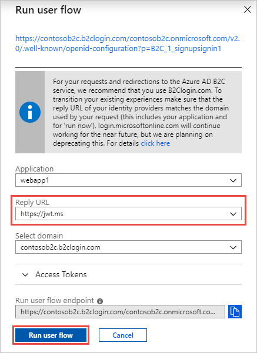
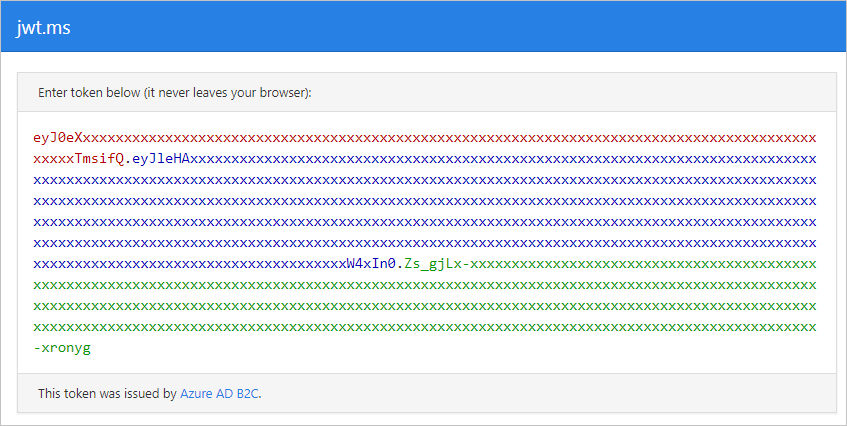
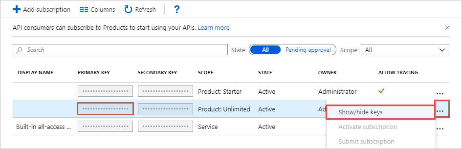
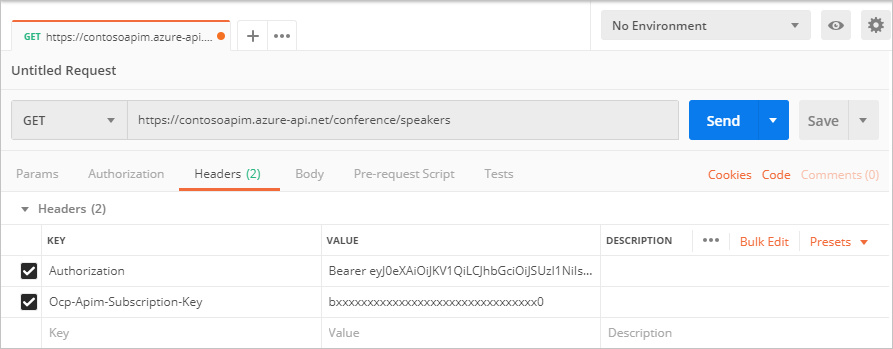
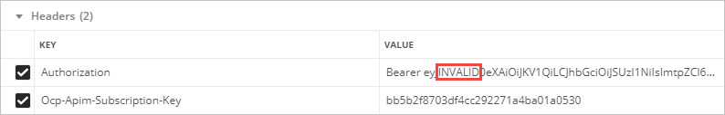

# Secure an Azure API Management API with Azure AD B2C

Learn how to restrict access to your Azure API Management API to clients that have authenticated with Azure Active Directory B2C (Azure AD B2C). Follow the instructions in this article to create and test an inbound policy in Azure API Management that restricts access to only those requests that include a valid Azure AD B2C-issued access token.

## Prerequisites

Before you begin, make sure that you have the following resources in place:

* An [Azure AD B2C tenant](tutorial-create-tenant.md)
* An [application that's registered in your tenant](tutorial-register-applications.md)
* [User flows that are created in your tenant](tutorial-create-user-flows.md)
* A [published API](../api-management/import-and-publish.md) in Azure API Management
* (Optional) A [Postman platform](https://www.postman.com/) to test secured access

## Get Azure AD B2C application ID

When you secure an API in Azure API Management with Azure AD B2C, you need several values for the [inbound policy](../api-management/api-management-howto-policies.md) that you create in Azure API Management. First, record the application ID of an application you've previously created in your Azure AD B2C tenant. If you're using the application you created to satisfy the prerequisites, use the application ID for *webapp1*.

To register an application in your Azure AD B2C tenant, you can use our new, unified *App registrations* experience or our legacy *Applications* experience. Learn more about the [new registrations experience](./app-registrations-training-guide.md).

# [App registrations](#tab/app-reg-ga/)

1. Sign in to the [Azure portal](https://portal.azure.com).
1. Make sure you're using the directory that contains your Azure AD B2C tenant. Select the **Directories + subscriptions** icon in the portal toolbar.
1. On the **Portal settings | Directories + subscriptions** page, find your Azure AD B2C directory in the **Directory name** list, and then select **Switch**.
1. On the left pane, select **Azure AD B2C**. Alternatively, you can select **All services** and then search for and select **Azure AD B2C**.
1. Select **App registrations**, and then select the **Owned applications** tab.
1. Record the value in the **Application (client) ID** column for *webapp1* or for another application you've previously created.

# [Applications (Legacy)](#tab/applications-legacy/)

1. Sign in to the [Azure portal](https://portal.azure.com).
1. Make sure you're using the directory that contains your Azure AD B2C tenant. Select the **Directories + subscriptions** icon in the portal toolbar.
1. On the **Portal settings | Directories + subscriptions** page, find your Azure AD B2C directory in the **Directory name** list, and then select **Switch**.
1. On the left pane, select **Azure AD B2C**. Alternatively, you can select **All services** and then search for and select **Azure AD B2C**.
1. Under **Manage**, select **Applications (Legacy)**.
1. Record the value in the **Application ID** column for *webapp1* or for another application you've previously created.

* * *

## Get a token issuer endpoint

Next, get the well-known config URL for one of your Azure AD B2C user flows. You also need the token issuer endpoint URI that you want to support in Azure API Management.

1. In the [Azure portal](https://portal.azure.com), go to your Azure AD B2C tenant.
1. Under **Policies**, select **User flows**.
1. Select an existing policy (for example, *B2C_1_signupsignin1*), and then select **Run user flow**.
1. Record the URL in the hyperlink that's displayed under the **Run user flow** heading near the top of the page. This URL is the OpenID Connect well-known discovery endpoint for the user flow, and you'll use it in the next section when you configure the inbound policy in Azure API Management.

    

1. Select the hyperlink to go to the OpenID Connect well-known configuration page.
1. On the page that opens in your browser, record the `issuer` value. For example:

    `https://<tenant-name>.b2clogin.com/xxxxxxxx-xxxx-xxxx-xxxx-xxxxxxxxxxxx/v2.0/`

    You'll use this value in the next section, when you configure your API in Azure API Management.

You should now have two URLs recorded for use in the next section: the OpenID Connect well-known configuration endpoint URL and the issuer URI. For example:

```
https://<tenant-name>.b2clogin.com/<tenant-name>.onmicrosoft.com/B2C_1_signupsignin1/v2.0/.well-known/openid-configuration
https://<tenant-name>.b2clogin.com/99999999-0000-0000-0000-999999999999/v2.0/
```

## Configure the inbound policy in Azure API Management

You're now ready to add the inbound policy in Azure API Management that validates API calls. By adding a [JSON web token (JWT) validation](../api-management/validate-jwt-policy.md) policy that verifies the audience and issuer in an access token, you can ensure that only API calls with a valid token are accepted.

1. In the [Azure portal](https://portal.azure.com), go to your Azure API Management instance.
1. Select **APIs**.
1. Select the API that you want to secure with Azure AD B2C.
1. Select the **Design** tab.
1. Under **Inbound processing**, select **\</\>** to open the policy code editor.
1. Place the following `<validate-jwt>` tag inside the `<inbound>` policy, and then do the following:

    a. Update the `url` value in the `<openid-config>` element with your policy's well-known configuration URL.  
    b. Update the `<audience>` element with the application ID of the application you created previously in your B2C tenant (for example, *webapp1*).  
    c. Update the `<issuer>` element with the token issuer endpoint you recorded earlier.

    ```xml
    <policies>
        <inbound>
            <validate-jwt header-name="Authorization" failed-validation-httpcode="401" failed-validation-error-message="Unauthorized. Access token is missing or invalid.">
                <openid-config url="https://<tenant-name>.b2clogin.com/<tenant-name>.onmicrosoft.com/B2C_1_signupsignin1/v2.0/.well-known/openid-configuration" />
                <audiences>
                    <audience>44444444-0000-0000-0000-444444444444</audience>
                </audiences>
                <issuers>
                    <issuer>https://<tenant-name>.b2clogin.com/99999999-0000-0000-0000-999999999999/v2.0/</issuer>
                </issuers>
            </validate-jwt>
            <base />
        </inbound>
        <backend> <base /> </backend>
        <outbound> <base /> </outbound>
        <on-error> <base /> </on-error>
    </policies>
    ```

## Validate secure API access

To ensure that only authenticated callers can access your API, you can validate your Azure API Management configuration by calling the API with [Postman](https://www.postman.com/).

To call the API, you need both an access token that's issued by Azure AD B2C and an Azure API Management subscription key.

### Get an access token

You first need a token that's issued by Azure AD B2C to use in the `Authorization` header in Postman. You can get one by using the *Run now* feature of the sign-up/sign-in user flow you that you created as one of the prerequisites.

1. In the [Azure portal](https://portal.azure.com), go to your Azure AD B2C tenant.
1. Under **Policies**, select **User flows**.
1. Select an existing sign-up/sign-in user flow (for example, *B2C_1_signupsignin1*).
1. For **Application**, select *webapp1*.
1. For **Reply URL**, select `https://jwt.ms`.
1. Select **Run user flow**.

    

1. Complete the sign-in process. You should be redirected to `https://jwt.ms`.
1. Record the encoded token value that's displayed in your browser. You use this token value for the Authorization header in Postman.

    

### Get an API subscription key

A client application (in this case, Postman) that calls a published API must include a valid API Management subscription key in its HTTP requests to the API. To get a subscription key to include in your Postman HTTP request:

1. In the [Azure portal](https://portal.azure.com), go to your Azure API Management service instance.
1. Select **Subscriptions**.
1. Select the ellipsis (**...**) next to **Product: Unlimited**, and then select **Show/hide keys**.
1. Record the **Primary Key** for the product. You use this key for the `Ocp-Apim-Subscription-Key` header in your HTTP request in Postman.



### Test a secure API call

With the access token and Azure API Management subscription key recorded, you're now ready to test whether you've correctly configured secure access to the API.

1. Create a new `GET` request in [Postman](https://www.postman.com/). For the request URL, specify the speakers list endpoint of the API you published as one of the prerequisites. For example:

    `https://contosoapim.azure-api.net/conference/speakers`

1. Next, add the following headers:

    | Key | Value |
    | --- | ----- |
    | `Authorization` | The encoded token value you recorded earlier, prefixed with `Bearer ` (include the space after "Bearer") |
    | `Ocp-Apim-Subscription-Key` | The Azure API Management subscription key you recorded earlier. |
    | | |

    Your **GET** request URL and **Headers** should appear similar to those shown in the following image:

    

1. In Postman, select the **Send** button to execute the request. If you've configured everything correctly, you should be given a JSON response with a collection of conference speakers (shown here, truncated):

    ```json
    {
      "collection": {
        "version": "1.0",
        "href": "https://conferenceapi.azurewebsites.net:443/speakers",
        "links": [],
        "items": [
          {
            "href": "https://conferenceapi.azurewebsites.net/speaker/1",
            "data": [
              {
                "name": "Name",
                "value": "Scott Guthrie"
              }
            ],
            "links": [
              {
                "rel": "http://tavis.net/rels/sessions",
                "href": "https://conferenceapi.azurewebsites.net/speaker/1/sessions"
              }
            ]
          },
    [...]
    ```

### Test an insecure API call

Now that you've made a successful request, test the failure case to ensure that calls to your API with an *invalid* token are rejected as expected. One way to perform the test is to add or change a few characters in the token value, and then run the same `GET` request as before.

1. Add several characters to the token value to simulate an invalid token. For example, you could add "INVALID" to the token value, as shown here:

    

1. Select the **Send** button to execute the request. With an invalid token, the expected result is a `401` unauthorized status code:

    ```json
    {
        "statusCode": 401,
        "message": "Unauthorized. Access token is missing or invalid."
    }
    ```

If you see a `401` status code, you've verified that only callers with a valid access token issued by Azure AD B2C can make successful requests to your Azure API Management API.

## Support multiple applications and issuers

Several applications typically interact with a single REST API. To enable your API to accept tokens intended for multiple applications, add their application IDs to the `<audiences>` element in the Azure API Management inbound policy.

```xml
<!-- Accept tokens intended for these recipient applications -->
<audiences>
    <audience>44444444-0000-0000-0000-444444444444</audience>
    <audience>66666666-0000-0000-0000-666666666666</audience>
</audiences>
```

Similarly, to support multiple token issuers, add their endpoint URIs to the `<issuers>` element in the Azure API Management inbound policy.

```xml
<!-- Accept tokens from multiple issuers -->
<issuers>
    <issuer>https://<tenant-name>.b2clogin.com/99999999-0000-0000-0000-999999999999/v2.0/</issuer>
    <issuer>https://login.microsoftonline.com/99999999-0000-0000-0000-999999999999/v2.0/</issuer>
</issuers>
```

## Migrate to b2clogin.com

If you have an Azure API ManagementM API that validates tokens issued by the legacy `login.microsoftonline.com` endpoint, you should migrate the API and the applications that call it to use tokens issued by [b2clogin.com](b2clogin.md).

You can follow this general process to perform a staged migration:

1. Add support in your Azure API Management inbound policy for tokens issued by both b2clogin.com and login.microsoftonline.com.
1. Update your applications one at a time to obtain tokens from the b2clogin.com endpoint.
1. After all your applications are correctly obtaining tokens from b2clogin.com, remove support for login.microsoftonline.com-issued tokens from the API.

The following example Azure API Management inbound policy illustrates how to accept tokens that are issued by both b2clogin.com and login.microsoftonline.com. Additionally, the policy supports API requests from two applications.

```xml
<policies>
    <inbound>
        <validate-jwt header-name="Authorization" failed-validation-httpcode="401" failed-validation-error-message="Unauthorized. Access token is missing or invalid.">
            <openid-config url="https://<tenant-name>.b2clogin.com/<tenant-name>.onmicrosoft.com/B2C_1_signupsignin1/v2.0/.well-known/openid-configuration" />
            <audiences>
                <audience>44444444-0000-0000-0000-444444444444</audience>
                <audience>66666666-0000-0000-0000-666666666666</audience>
            </audiences>
            <issuers>
                <issuer>https://login.microsoftonline.com/99999999-0000-0000-0000-999999999999/v2.0/</issuer>
                <issuer>https://<tenant-name>.b2clogin.com/99999999-0000-0000-0000-999999999999/v2.0/</issuer>
            </issuers>
        </validate-jwt>
        <base />
    </inbound>
    <backend> <base /> </backend>
    <outbound> <base /> </outbound>
    <on-error> <base /> </on-error>
</policies>
```

## Next steps

For additional information about Azure API Management policies, see the [Azure API Management policy reference index](../api-management/api-management-policies.md).

For information about migrating OWIN-based web APIs and their applications to b2clogin.com, see [Migrate an OWIN-based web API to b2clogin.com](multiple-token-endpoints.md).
