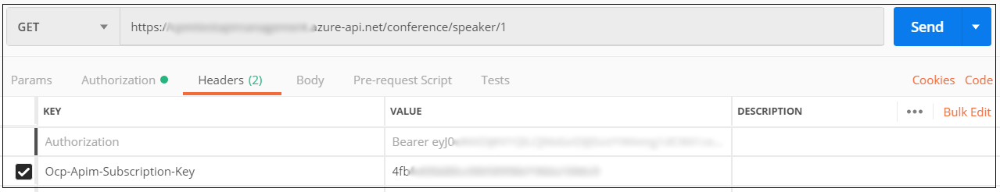
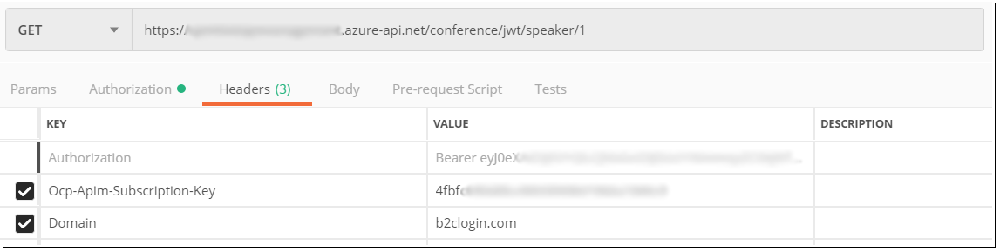

# Secure Azure API Management using B2C-generated tokens

This document outlines how we can secure Azure API Management using B2C generated tokens.

## Prerequisites

You need the following resources in place before continuing with the steps in this article:

:white_check_mark: [Azure AD B2C tenant](tutorial-create-tenant.md)

:white_check_mark: [Application registered](tutorial-register-applications.md) in your tenant

:white_check_mark: [User flows created](tutorial-create-user-flows.md) in your tenant

:white_check_mark: [Published API](../api-management/import-and-publish.md) in Azure API Management

## Get the .well-known configuration from B2C

1. Navigate to B2C tenant
1. Navigate to created policy and open Run Now blade
1. Copy .well-known URL from run now blade

## Add Validation at API Management

1. Open APIs blade in APIManagement
1. Navigate to API which you want to secure
1. Click on `</>` (code editor)
1. Place the below `<validate-jwt>` tag inside `<inbound>` policy. Update the `url` value in `<openid-config>` with your policy's `.well-known` configuration URL.

    ```xml
    <policies>
        <inbound>
            <validate-jwt header-name="Authorization" failed-validation-httpcode="401" failed-validation-error-message="Unauthorized. Access token is missing or invalid.">
                < url="https://login.microsoftonline.com/tfp/testapimanagement.onmicrosoft.com/B2C_1A_signup_signin/v2.0/.well-known/openid-configuration" />
                <required-claims>
                    <claim name="aud"><value>00000000-0000-0000-0000-000000000000</value></claim>
                </required-claims>
            </validate-jwt>
            <base />
        </inbound>
        <backend> <base /> </backend>
        <outbound> <base /> </outbound>
        <on-error> <base /> </on-error>
    </policies>
    ```

You can add multiple required claims against which Azure API Management validates the JWT.

1. Update `aud` value with Application ID from your tenant application.
1. Add the claims from the JWT token that is generated by B2C (id_token, access_token). For example:

    ```xml
    <claim name="aud"><value>00000000-0000-0000-0000-000000000000</value></claim>
    <claim name="iis"><value>https://testapimanagement.onmicrosoft.com/00000000-0000-0000-0000-000000000000/v2.0/</value></claim>
    ```

## Validate Azure API Management

You can validate the API using a tool like Postman. Get the B2C-generated token, then add it to Authorization header when calling the Azure API.

For example, in Postman:



## Multiple JWT validations in Azure API Management

You can add multiple JWT validations in Azure API Management. This is useful when you generate tokens using multiple issuer URLs for B2C (for example, `logn.microsoftonline.com` and `b2clogin.com`) to validate against a single API in Azure API Management.

To enable multiple domains, use the `<choose>` tag to enable branching flow within the policy. To inform the API which condition to validate, modify the `Authorization` header.

For example, this policy **[EXPLANATION HERE]**...

```xml
<policies>
    <inbound>
        <choose>
            <when condition="@(context.Request.Headers.GetValueOrDefault("Domain", "") == "b2clogin.com")">
                <validate-jwt header-name="Authorization" failed-validation-httpcode="401" failed-validation-error-message="Unauthorized. Access token is missing or invalid.">
                    <openid-config url="https://testapimanagement.b2clogin.com/testapimanagement.onmicrosoft.com/v2.0/.well-known/openid-configuration?p=B2C_1A_signup_signin" />
                    <required-claims>
                        <claim name="aud">
                            <value>40000000-0000-0000-0000-000000000000</value>
                        </claim>
                        <claim name="iss">
                            <value>https://testapimanagement.b2clogin.com/80000000-0000-0000-0000-000000000000/v2.0/</value>
                        </claim>
                    </required-claims>
                </validate-jwt>
            </when>
            <when condition="@(context.Request.Headers.GetValueOrDefault("Domain", "") == "microsoftonline.com")">
                <validate-jwt header-name="Authorization" failed-validation-httpcode="401" failed-validation-error-message="Unauthorized. Access token is missing or invalid.">
                    <openid-config url="https://login.microsoftonline.com/testapimanagement.onmicrosoft.com/v2.0/.well-known/openid-configuration?p=B2C_1A_signup_signin" />
                    <required-claims>
                        <claim name="aud">
                            <value>40000000-0000-0000-0000-000000000000</value>
                        </claim>
                        <claim name="iss">
                            <value>https://login.microsoftonline.com/80000000-0000-0000-0000-000000000000/v2.0/</value>
                        </claim>
                    </required-claims>
                </validate-jwt>
            </when>
            <otherwise>
                <validate-jwt header-name="Authorization" failed-validation-httpcode="401" failed-validation-error-message="Unauthorized. Access token is missing or invalid.">
                    <openid-config url="https://login.microsoftonline.com/tfp/testapimanagement.onmicrosoft.com/B2C_1A_signup_signin/v2.0/.well-known/openid-configuration" />
                    <required-claims>
                        <claim name="aud">
                            <value>40000000-0000-0000-0000-000000000000</value>
                        </claim>
                    </required-claims>
                </validate-jwt>
            </otherwise>
        </choose>
        <base />
    </inbound>
    <backend> <base /> </backend>
    <outbound> <base /> </outbound>
    <on-error> <base /> </on-error>
</policies>
```

## Validate Azure API Management in multiple config URLs case

Example request:


