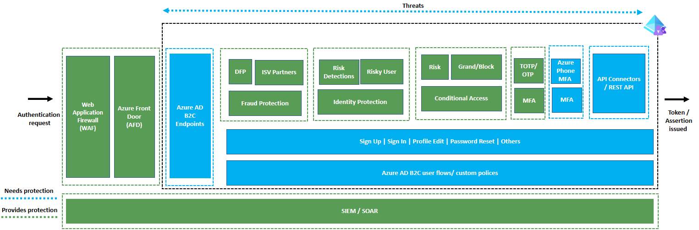
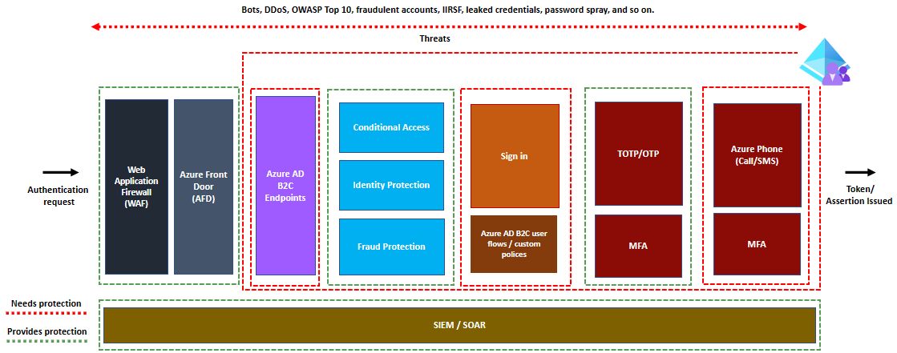

# How to secure your Azure Active Directory B2C identity solution

This article provides the best practices in securing your Azure Active Directory B2C (Azure AD B2C) solution. To build your identity solution using Azure AD B2C involves many components that you should consider protecting and monitoring.  

Depending on your solution, you have one or more of the following components in scope:

- [Azure AD B2C authentication endpoints](./protocols-overview.md)
- [Azure AD B2C user flows or custom policies](./user-flow-overview.md)
  - Sign in
  - Sign up
- Email One-time-password (OTP)
- Multifactor authentication controls
- External REST APIs

You must protect and monitor all these components to ensure your users can sign in to applications without disruption. Follow the guidance in this article to protect your solution from bot attacks, fraudulent account creation, international revenue share fraud (ISRF), and password spray.

## How to secure your solution

Your identity solution uses multiple components to provide a smooth sign in experience. The following table shows protection mechanisms we recommend for each component.

|Component |Endpoint|Why|How to protect|
|----|----|----|----|
|Azure AD B2C authentication endpoints|`/authorize`, `/token`, `/.well-known/openid-configuration`, `/discovery/v2.0/keys`|Prevent resource exhaustion|[Web Application Firewall (WAF)](./partner-web-application-firewall.md) and [Azure Front Door (AFD)](https://azure.microsoft.com/products/frontdoor/?ef_id=_k_53b0ace78faa14e3c3b1c8b385bf944d_k_&OCID=AIDcmm5edswduu_SEM__k_53b0ace78faa14e3c3b1c8b385bf944d_k_&msclkid=53b0ace78faa14e3c3b1c8b385bf944d)|
|Sign-in|NA|Malicious sign-in's may try to brute force accounts or use leaked credentials|[Identity Protection](../active-directory/identity-protection/overview-identity-protection.md)|
|Sign-up|NA|Fraudulent sign-up's that may try to exhaust resources.|[Endpoint protection](https://www.microsoft.com/security/business/endpoint-security/microsoft-defender-business-b?ef_id=_k_22063a2ad7b719a498ec5e7edc5d6500_k_&OCID=AIDcmm7ol8ekjr_SEM__k_22063a2ad7b719a498ec5e7edc5d6500_k_&msclkid=22063a2ad7b719a498ec5e7edc5d6500)  Fraud prevention technologies, such as [Dynamics Fraud Protection](./partner-dynamics-365-fraud-protection.md)|
|Email OTP|NA|Fraudulent attempts to brute force or exhaust resources|[Endpoint protection](https://www.microsoft.com/security/business/endpoint-security/microsoft-defender-business-b?ef_id=_k_22063a2ad7b719a498ec5e7edc5d6500_k_&OCID=AIDcmm7ol8ekjr_SEM__k_22063a2ad7b719a498ec5e7edc5d6500_k_&msclkid=22063a2ad7b719a498ec5e7edc5d6500) and  [Authenticator App](../active-directory/authentication/concept-authentication-authenticator-app.md)|
|Multifactor authentication controls|NA|Unsolicited phone calls or SMS messages or resource exhaustion.|[Endpoint protection](https://www.microsoft.com/security/business/endpoint-security/microsoft-defender-business-b?ef_id=_k_22063a2ad7b719a498ec5e7edc5d6500_k_&OCID=AIDcmm7ol8ekjr_SEM__k_22063a2ad7b719a498ec5e7edc5d6500_k_&msclkid=22063a2ad7b719a498ec5e7edc5d6500) and  [Authenticator App](../active-directory/authentication/concept-authentication-authenticator-app.md)|
|External REST APIs|Your REST API endpoints|Malicious usage of user flows or custom policies can lead to resource exhaustion at your API endpoints.|[WAF](./partner-web-application-firewall.md) and [AFD](https://azure.microsoft.com/products/frontdoor/?ef_id=_k_921daffd3bd81af80dd9cba9348858c4_k_&OCID=AIDcmm5edswduu_SEM__k_921daffd3bd81af80dd9cba9348858c4_k_&msclkid=921daffd3bd81af80dd9cba9348858c4)|

### Protection mechanisms

The following table provides an overview of the different protection mechanisms you can use to protect different components.

|What |Why |How|
|----|----|----|
|Web Application Firewall (WAF)|WAF serves as the first layer of defense against malicious requests made to Azure AD B2C endpoints. It provides a centralized protection against common exploits and vulnerabilities such as DDoS, bots, OWASP Top 10, and so on. It's advised that you use WAF to ensure that malicious requests are stopped even before they reach Azure AD B2C endpoints.    To enable WAF, you must first [enable custom domains in Azure AD B2C using AFD](custom-domain.md?pivots=b2c-custom-policy).|<ul><li>[Configure Cloudflare WAF](./partner-cloudflare.md)</li> <li>[Configure Akamai WAF](./partner-akamai.md)</li></ul>|
|Azure Front Door (AFD)| AFD is a global, scalable entry-point that uses the Microsoft global edge network to create fast, secure, and widely scalable web applications. The key capabilities of AFD are:<ul><li>You can add or remove custom domains in a self-service fashion </li><li>Streamlined certificate management experience</li><li>You can bring your own certificate and get alert for certificate expiry with good rotation experience via [Azure Key Vault](https://azure.microsoft.com/products/key-vault/)</li><li>AFD-provisioned certificate for quicker provisioning and autorotation on expiry </li> </ul>|<ul><li> [Enable custom domains for Azure Active Directory B2C](./custom-domain.md)</li><ul>| 
|Identity Verification & Proofing / Fraud Protection|Identity verification and proofing are critical for creating a trusted user experience and protecting against account takeover and fraudulent account creation. It also contributes to tenant hygiene by ensuring that user objects reflect the actual users, which align with business scenarios.   Azure AD B2C allows the integration of identity verification and proofing, and fraud protection from various software-vendor partners.| <ul><li> [Integrate with identity verification and proofing partners](./identity-verification-proofing.md)</li><li>[Configure Microsoft Dynamics 365 Fraud Protection](./partner-dynamics-365-fraud-protection.md)  </li><li> [Configure with Arkose Labs platform](./partner-arkose-labs.md)</li><li> [Mitigate fraudulent MFA usage](phone-based-mfa.md#mitigate-fraudulent-sign-ups)</li></ul>|
|Identity Protection|Identity Protection provides ongoing risk detection. When a risk is detected during sign-in, you can configure Azure AD B2C conditional policy to allow the user to remediate the risk before proceeding with the sign-in. Administrators can also use identity protection reports to review risky users who are at risk and review detection details. The risk detections report includes information about each risk detection, such as its type and the location of the sign-in attempt, and more. Administrators can also confirm or deny that the user is compromised.|<ul><li>[Investigate risk with Identity Protection](./identity-protection-investigate-risk.md)</li><ul> | 
|Conditional Access (CA)|When a user attempts to sign in, CA gathers various signals such as risks from identity protection, to make decisions and enforce organizational policies. CA can assist administrators to develop policies that are consistent with their organization's security posture. The policies can include the ability to completely block user access or provide access after the user has completed another authentication like MFA.|<ul><li>[Add Conditional Access policies to user flows](./conditional-access-user-flow.md)</li></ul>| 
|Multifactor authentication|MFA adds a second layer of security to the sign-up and sign-in process and is an essential component of improving the security posture of user authentication in Azure AD B2C. The Authenticator app - TOTP is the recommended MFA method in Azure AD B2C. | <ul><li>[Enable multifactor authentication](./multi-factor-authentication.md)</li></ul> | 
|Security Information and Event management (SIEM)/ Security Orchestration, Automation and Response (SOAR) |You need a reliable monitoring and alerting system for analyzing usage patterns such as sign-ins and sign-ups, and detect any anomalous behavior that may be indicative of a cyberattack. It's an important step that adds an extra layer of security. It also you to understand patterns and trends that can only be captured and built upon over time. Alerting assists in determining factors such as the rate of change in overall sign-ins, an increase in failed sign-ins, and failed sign-up journeys, phone-based frauds such as IRSF attacks, and so on. All of these can be indicators of an ongoing cyberattack that requires immediate attention. Azure AD B2C supports both high level and fine grain logging, as well as the generation of reports and alerts. It's advised that you implement monitoring and alerting in all production tenants. | <ul><li>[Monitor using Azure Monitor](./azure-monitor.md)</li><li>[Use reports & alerts](https://github.com/azure-ad-b2c/siem)</li><li> [Monitor for fraudulent MFA usage](./phone-based-mfa.md)</li><li>[Collect Azure AD B2C logs with Application Insights](troubleshoot-with-application-insights.md?pivots=b2c-user-flow)</li><li>[Configure security analytics for Azure AD B2C data with Microsoft Sentinel](./configure-security-analytics-sentinel.md)</li></ul>| 
  

## Protecting your REST APIs
Azure AD B2C allows you to connect to external systems by using the [API Connectors](./api-connectors-overview.md?pivots=b2c-custom-policy), or the [REST API technical profile](restful-technical-profile.md). You need to protect these interfaces. You can prevent malicious requests to your REST APIs by protecting the Azure AD B2C authentication endpoints. You can protect these endpoints with a WAF and AFD.
  
## Scenario 1: How to secure your sign-in experience
After you create a sign-in experience, or user flow, you'll need to protect specific components of your flow from malicious activity. For example, if your sign in flow involves the following, then the table shows the components you need to protect, and associated protection technique:

- Local account email and password authentication
- Microsoft Entra multifactor authentication using SMS or phone call

|Component |Endpoint|How to protect|
|----|----|----|
|Azure AD B2C authentication endpoints|`/authorize`, `/token`, `/.well-known/openid-configuration`, `/discovery/v2.0/keys`|WAP and AFD|
|Sign in|NA|Identity Protection|
|Multifactor authentication controls|NA|Authenticator app|
|External REST API|Your API endpoint.|Authenticator app, WAF and AFD|
  

  
## Scenario 2: How to secure your sign-up experience
After you create a sign-up experience, or user flow, you need to protect specific components of your flow from malicious activity. If your sign in flow involves the following, then the table shows the components you need to protect, and associated protection technique:

- Local account email and password sign-up
- Email verification using email OTP
- Microsoft Entra multifactor authentication using SMS or phone call

|Component |Endpoint|How to protect|
|----|----|----|
|Azure AD B2C authentication endpoints|`/authorize`, `/token`, `/.well-known/openid-configuration`, `/discovery/v2.0/keys`|WAF and AFD|
|sign up|NA|Dynamics Fraud Protection|
|Email OTP|NA|WAF and AFD|
|Multifactor authentication controls|NA|Authenticator app|

In this scenario, the use of the WAF and AFD protection mechanisms protects both the Azure AD B2C authentication endpoints and the Email OTP components.
  

## Next steps 

- [Configure a Web application firewall](./partner-akamai.md) to protect Azure AD B2C authentication endpoints.
- [Configure Fraud prevention with Dynamics](./partner-dynamics-365-fraud-protection.md) to protect your authentication experiences.
- [Investigate risk with Identity Protection in Azure AD B2C](./identity-protection-investigate-risk.md) to discover, investigate, and remediate identity-based risks.
- [Securing phone-based multifactor authentication](./phone-based-mfa.md) to protect your phone based multifactor authentication.
- [Configure Identity Protection](./conditional-access-user-flow.md) to protect your sign in experience.
- [Configure Monitoring and alerting](./azure-monitor.md) to be alerted to any threats.
