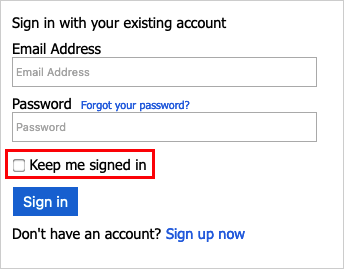
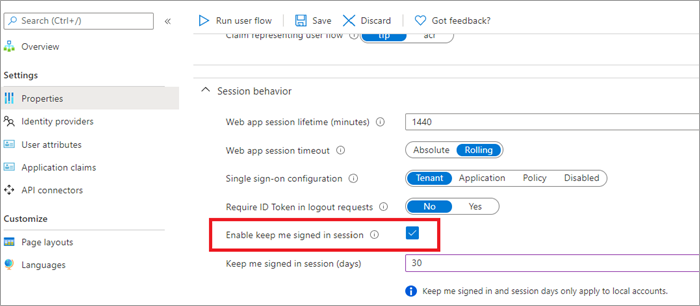

# Configure session behavior in Azure Active Directory B2C

[!INCLUDE [active-directory-b2c-choose-user-flow-or-custom-policy](../../includes/active-directory-b2c-choose-user-flow-or-custom-policy.md)]

Single sign-on (SSO) adds security and convenience when users sign in across applications in Azure Active Directory B2C (Azure AD B2C). This article describes the single sign-on methods used in Azure AD B2C and helps you choose the most appropriate SSO method when configuring your policy.

With single sign-on, users sign in once with a single account and get access to multiple applications. The application can be a web, mobile, or single page application, regardless of platform or domain name.

When the user initially signs in to an application, Azure AD B2C persists a cookie-based session. Upon subsequent authentication requests, Azure AD B2C reads and validates the cookie-based session, and issues an access token without prompting the user to sign in again. If the cookie-based session expires or becomes invalid, the user is prompted to sign-in again.  

## Prerequisites

[!INCLUDE [active-directory-b2c-customization-prerequisites](../../includes/active-directory-b2c-customization-prerequisites.md)]

## Azure AD B2C session overview

Integration with Azure AD B2C involves three types of SSO sessions:

- **Azure AD B2C** - Session managed by Azure AD B2C
- **Federated identity provider** - Session managed by the identity provider, for example Facebook, Salesforce, or Microsoft account
- **Application** - Session managed by the web, mobile, or single page application


### Azure AD B2C session 

When a user successfully authenticates with a local or social account, Azure AD B2C stores a cookie-based session on the user's browser. The cookie is stored under the Azure AD B2C tenant domain name, such as `https://contoso.b2clogin.com`.

If a user initially signs in with a federated account, and then during the session time window (time-to-live, or TTL) signs in to the same app or a different app, Azure AD B2C tries to acquire a new access token from the federated identity provider. If the federated identity provider session is expired or invalid, the federated identity provider prompts the user for their credentials. If the session is still active (or if the user has signed in with a local account instead of a federated account), Azure AD B2C authorizes the user and eliminates further prompts.

You can configure the session behavior, including the session TTL and how Azure AD B2C shares the session across policies and applications.

### Federated identity provider session

A social or enterprise identity provider manages its own session. The cookie is stored under the identity provider's domain name, such as `https://login.salesforce.com`. Azure AD B2C doesn't control the federated identity provider session. Instead, session behavior is determined by the federated identity provider. 

Consider the following scenario:

1. A user signs into Facebook to check their feed.
2. Later, the user opens your application and starts the sign-in process. The application redirects the user to Azure AD B2C to complete the sign-in process.
3. On the Azure AD B2C sign-up or sign-in page, the user chooses to sign-in with their Facebook account. The user is redirected to Facebook. If there is an active session at Facebook, the user is not prompted to provide their credentials and is immediately redirected to Azure AD B2C with a Facebook token.

### Application session

A web, mobile, or single page application can be protected by an OAuth2 access token, ID token, or SAML token. When a user tries to access a protected resource on the app, the app checks whether there is an active session on the application side. If there is no app session or the session has expired, the app will take the user to the Azure AD B2C sign-in page.

The application session can be a cookie-based session stored under the application domain name, such as `https://contoso.com`. Mobile applications might store the session in a different way but using a similar approach.

## Configure Azure AD B2C session behavior

You can configure the Azure AD B2C session behavior, including:

- **Web app session lifetime (minutes)** - The amount of time the Azure AD B2C session cookie is stored on the user's browser after successful authentication. You can set the session lifetime up to 24 hours.

- **Web app session timeout** - Indicates how a session is extended by the session lifetime setting or the Keep me signed in (KMSI) setting.
  - **Rolling** - Indicates that the session is extended every time the user performs a cookie-based authentication (default).
  - **Absolute** - Indicates that the user is forced to re-authenticate after the time period specified.

- **Single sign-on configuration** - The Azure AD B2C session can be configured with the following scopes:
  - **Tenant** - This setting is the default. Using this setting allows multiple applications and user flows in your B2C tenant to share the same user session. For example, once a user signs into an application, the user can also seamlessly sign into another one upon accessing it.
  - **Application** - This setting allows you to maintain a user session exclusively for an application, independent of other applications. For example, you can use this setting if you want the user to sign in to Contoso Pharmacy regardless of whether the user is already signed into Contoso Groceries.
  - **Policy** - This setting allows you to maintain a user session exclusively for a user flow, independent of the applications using it. For example, if the user has already signed in and completed a multi-factor authentication (MFA) step, the user can be given access to higher-security parts of multiple applications, as long as the session tied to the user flow doesn't expire.
  - **Suppressed** - This setting forces the user to run through the entire user flow upon every execution of the policy.

::: zone pivot="b2c-user-flow"

### Configure the user flow

To configure the session behavior in your user flow, follow these steps:

1. Sign in to the [Azure portal](https://portal.azure.com).
1. If you have access to multiple tenants, select the **Settings** icon in the top menu to switch to your Azure AD B2C tenant from the **Directories + subscriptions** menu.
1. Choose **All services** in the top-left corner of the Azure portal, and then search for and select **Azure AD B2C**.
1. Select **User flows**.
1. Open the user flow that you previously created.
1. Select **Properties**.
1. Configure **Web app session lifetime (minutes)**, **Web app session timeout**, **Single sign-on configuration**, and **Require ID Token in logout requests** as needed.
1. Click **Save**.

::: zone-end

::: zone pivot="b2c-custom-policy"

### Configure the custom policy

To configure the session behavior in your custom policy, follow these steps:

1. Open the relying party (RP) file, for example *SignUpOrSignin.xml*
1. If it doesn't already exist, add the following `<UserJourneyBehaviors>` element to the `<RelyingParty>` element. It must be located immediately after `<DefaultUserJourney ReferenceId="UserJourney Id"/>`.

    ```xml
    <UserJourneyBehaviors>
      <SingleSignOn Scope="Application" />
      <SessionExpiryType>Absolute</SessionExpiryType>
      <SessionExpiryInSeconds>86400</SessionExpiryInSeconds>
    </UserJourneyBehaviors>
    ```
    
    After you add the user journey behavior elements, the `RelyingParty` element should look like the following example:
    
    ```xml
    <RelyingParty>
      <DefaultUserJourney ReferenceId="SignUpOrSignIn" />
      <UserJourneyBehaviors>
        <SingleSignOn Scope="Application" />
        <SessionExpiryType>Absolute</SessionExpiryType>
        <SessionExpiryInSeconds>86400</SessionExpiryInSeconds>
      </UserJourneyBehaviors>
      <TechnicalProfile Id="PolicyProfile">
        <DisplayName>PolicyProfile</DisplayName>
        <Protocol Name="OpenIdConnect" />
        <OutputClaims>
          <OutputClaim ClaimTypeReferenceId="displayName" />
          <OutputClaim ClaimTypeReferenceId="givenName" />
          ...
        </OutputClaims>
        <SubjectNamingInfo ClaimType="sub" />
      </TechnicalProfile>
    </RelyingParty>
    ```
    

1. Change the value of the `Scope` attribute to one of the possible value: `Suppressed`, `Tenant`, `Application`, or `Policy`. For more information, check out the [RelyingParty](relyingparty.md) reference article.
1. Set the `SessionExpiryType` element to `Rolling` or `Absolute`. For more information, check out the [RelyingParty](relyingparty.md) reference article.
1. Set the `SessionExpiryInSeconds` element to a numeric value  between 900 seconds (15 minutes) and 86,400 seconds(24 hours). For more information, check out the [RelyingParty](relyingparty.md) reference article.

::: zone-end

## Enable Keep me signed in (KMSI)

You can enable the KMSI feature for users of your web and native applications who have local accounts in your Azure AD B2C directory. When you enable the feature, users can opt to stay signed in so the session remains active after they close the browser. The session is maintained by setting a [persistent cookie](cookie-definitions.md). Users who select KMSI, can reopen the browser without being prompted to reenter their username and password. This access (persistent cookie) is revoked when a user signs out. For more information, check out the [Live demo](https://github.com/azure-ad-b2c/unit-tests/tree/main/session#enable-keep-me-signed-in-kmsi).




::: zone pivot="b2c-user-flow"

KMSI is configurable at the individual user flow level. Before enabling KMSI for your user flows, consider the following:

- KMSI is supported only for the **Recommended** versions of sign-up and sign-in (SUSI), sign-in, and profile editing user flows. If you currently have **Standard (Legacy)** or **Legacy preview - v2** versions of these user flows and want to enable KMSI, you'll need to create new, **Recommended** versions of these user flows.
- KMSI is not supported with password reset or sign-up user flows.
- If you want to enable KMSI for all applications in your tenant, we recommend that you enable KMSI for all user flows in your tenant. Because a user can be presented with multiple policies during a session, it's possible they could encounter one that doesn't have KMSI enabled, which would remove the KMSI cookie from the session.
- KMSI should not be enabled on public computers.

### Configure KMSI for a user flow

To enable KMSI for your user flow:

1. Sign in to the [Azure portal](https://portal.azure.com).
1. If you have access to multiple tenants, select the **Settings** icon in the top menu to switch to your Azure AD B2C tenant from the **Directories + subscriptions** menu.
1. Choose **All services** in the top-left corner of the Azure portal, and then search for and select **Azure AD B2C**.
1. Select **User flows (policies)**.
1. Open the user flow that you previously created.
1. Select **Properties**.

1. Under **Session behavior**, select **Enable keep me signed in session**. Next to **Keep me signed in session (days)**, enter a value from 1 to 90 to specify the number of days a session can remain open.

   

::: zone-end

::: zone pivot="b2c-custom-policy"

Users should not enable this option on public computers.

### Configure the page identifier

To enable KMSI, set the content definition `DataUri` element to [page identifier](contentdefinitions.md#datauri) `unifiedssp` and [page version](page-layout.md) *1.1.0* or above.

1. Open the extension file of your policy. For example, <em>`SocialAndLocalAccounts/`**`TrustFrameworkExtensions.xml`**</em>. This extension file is one of the policy files included in the custom policy starter pack, which you should have obtained in the prerequisite, [Get started with custom policies](tutorial-create-user-flows.md?pivots=b2c-custom-policy).
1. Search for the **BuildingBlocks** element. If the element doesn't exist, add it.
1. Add the **ContentDefinitions** element to the **BuildingBlocks** element of the policy.

    Your custom policy should look like the following code snippet:

    ```xml
    <BuildingBlocks>
      <ContentDefinitions>
        <ContentDefinition Id="api.signuporsignin">
          <DataUri>urn:com:microsoft:aad:b2c:elements:unifiedssp:1.1.0</DataUri>
        </ContentDefinition>
      </ContentDefinitions>
    </BuildingBlocks>
    ```

### Add the metadata to the self-asserted technical profile

To add the KMSI checkbox to the sign-up and sign-in page, set the `setting.enableRememberMe` metadata to true. Override the SelfAsserted-LocalAccountSignin-Email technical profiles in the extension file.

1. Find the ClaimsProviders element. If the element doesn't exist, add it.
1. Add the following claims provider to the ClaimsProviders element:

```xml
<ClaimsProvider>
  <DisplayName>Local Account</DisplayName>
  <TechnicalProfiles>
    <TechnicalProfile Id="SelfAsserted-LocalAccountSignin-Email">
      <Metadata>
        <Item Key="setting.enableRememberMe">True</Item>
      </Metadata>
    </TechnicalProfile>
  </TechnicalProfiles>
</ClaimsProvider>
```

1. Save the extensions file.

### Configure a relying party file

Update the relying party (RP) file that initiates the user journey that you created. The keepAliveInDays parameter allows you to configure how the long the keep me signed in (KMSI) session cookie should persist. For example, if you set the value to 30, then KMSI session cookie will persist for 30 days. The range for the value is from 1 to 90 days. Setting the value to 0 turns off KMSI functionality.

1. Open your custom policy file. For example, *SignUpOrSignin.xml*.
1. If it doesn't already exist, add a `<UserJourneyBehaviors>` child node to the `<RelyingParty>` node. It must be located immediately after `<DefaultUserJourney ReferenceId="User journey Id" />`, for example: `<DefaultUserJourney ReferenceId="SignUpOrSignIn" />`.
1. Add the following node as a child of the `<UserJourneyBehaviors>` element.

    ```xml
    <UserJourneyBehaviors>
      <SingleSignOn Scope="Tenant" KeepAliveInDays="30" />
      <SessionExpiryType>Absolute</SessionExpiryType>
      <SessionExpiryInSeconds>1200</SessionExpiryInSeconds>
    </UserJourneyBehaviors>
    ```

You set both KeepAliveInDays and SessionExpiryInSeconds so that during a sign-in, if a user enables KMSI, the KeepAliveInDays is used to set the cookies, otherwise the value specified in the SessionExpiryInSeconds parameter is used.  We recommend that you set the value of SessionExpiryInSeconds to be a short period (1200 seconds), while the value of KeepAliveInDays can be set to a relatively long period (30 days), as shown in the following example:

```xml
<RelyingParty>
  <DefaultUserJourney ReferenceId="SignUpOrSignIn" />
  <UserJourneyBehaviors>
    <SingleSignOn Scope="Tenant" KeepAliveInDays="30" />
    <SessionExpiryType>Absolute</SessionExpiryType>
    <SessionExpiryInSeconds>1200</SessionExpiryInSeconds>
  </UserJourneyBehaviors>
  <TechnicalProfile Id="PolicyProfile">
    <DisplayName>PolicyProfile</DisplayName>
    <Protocol Name="OpenIdConnect" />
    <OutputClaims>
      <OutputClaim ClaimTypeReferenceId="displayName" />
      <OutputClaim ClaimTypeReferenceId="givenName" />
      <OutputClaim ClaimTypeReferenceId="surname" />
      <OutputClaim ClaimTypeReferenceId="email" />
      <OutputClaim ClaimTypeReferenceId="objectId" PartnerClaimType="sub"/>
      <OutputClaim ClaimTypeReferenceId="identityProvider" />
      <OutputClaim ClaimTypeReferenceId="tenantId" AlwaysUseDefaultValue="true" DefaultValue="{Policy:TenantObjectId}" />
    </OutputClaims>
    <SubjectNamingInfo ClaimType="sub" />
  </TechnicalProfile>
</RelyingParty>
```

::: zone-end

## Sign-out

When you want to sign the user out of the application, it isn't enough to clear the application's cookies or otherwise end the session with the user. You must redirect the user to Azure AD B2C to sign out. Otherwise, the user might be able to re-authenticate to your applications without entering their credentials again.

Upon a sign-out request, Azure AD B2C:

::: zone pivot="b2c-user-flow"

1. Invalidates the Azure AD B2C cookie-based session.
1. Attempts to sign out from federated identity providers.
::: zone-end

::: zone pivot="b2c-custom-policy"

1. Invalidates the Azure AD B2C cookie-based session.
1. Attempts to sign out from federated identity providers:
   - OpenId Connect - If the identity provider well-known configuration endpoint specifies an `end_session_endpoint` location. The sign-out request doesn't pass the `id_token_hint` parameter. If the federated identity provider requires this parameter, the sign-out request will fail.
   - OAuth2 - If the [identity provider metadata](oauth2-technical-profile.md#end-session-endpoint) contains the `end_session_endpoint` location.
   - SAML - If the [identity provider metadata](identity-provider-generic-saml.md) contains the `SingleLogoutService` location.
1. Optionally, signs-out from other applications. For more information, see the [Single sign-out](#single-sign-out) section.

> [!NOTE]
> You can disable the sign out from federated identity providers, by setting the identity provider technical profile metadata `SingleLogoutEnabled` to `false`.
::: zone-end

The sign-out clears the user's single sign-on state with Azure AD B2C, but it might not sign the user out of their social identity provider session. If the user selects the same identity provider during a subsequent sign-in, they might reauthenticate without entering their credentials. If a user wants to sign out of the application, it doesn't necessarily mean they want to sign out of their Facebook account. However, if local accounts are used, the user's session ends properly.

::: zone pivot="b2c-custom-policy"

## Single sign-out 

When you redirect the user to the [Azure AD B2C sign-out endpoint](openid-connect.md#send-a-sign-out-request) (for both OAuth2 and OpenID Connect) or send a `LogoutRequest` (for SAML), Azure AD B2C clears the user's session from the browser. However, the user might still be signed in to other applications that use Azure AD B2C for authentication. To sign the user out of all applications which have an active session, Azure AD B2C supports *single sign-out*, also known as *Single Log-Out (SLO)*.

During the sign-out, Azure AD B2C simultaneously sends an HTTP request to the registered logout URL of all the applications that the user is currently signed in to.

### Configure your custom policy

To support single sign-out, the token issuer technical profiles for both JWT and SAML must specify:

- The protocol name, such as `<Protocol Name="OpenIdConnect" />`
- The reference  to the session technical profile, such as `UseTechnicalProfileForSessionManagement ReferenceId="SM-jwt-issuer" />`.

The following example illustrates the JWT and SAML token issuers with single sign-out:

```xml
<ClaimsProvider>
  <DisplayName>Local Account SignIn</DisplayName>
  <TechnicalProfiles>
    <!-- JWT Token Issuer -->
    <TechnicalProfile Id="JwtIssuer">
      <DisplayName>JWT token Issuer</DisplayName>
      <Protocol Name="OpenIdConnect" />
      <OutputTokenFormat>JWT</OutputTokenFormat>
      ...    
      <UseTechnicalProfileForSessionManagement ReferenceId="SM-jwt-issuer" />
    </TechnicalProfile>

    <!-- Session management technical profile for OIDC based tokens -->
    <TechnicalProfile Id="SM-jwt-issuer">
      <DisplayName>Session Management Provider</DisplayName>
      <Protocol Name="Proprietary" Handler="Web.TPEngine.SSO.OAuthSSOSessionProvider, Web.TPEngine, Version=1.0.0.0, Culture=neutral, PublicKeyToken=null" />
    </TechnicalProfile>

    <!--SAML token issuer-->
    <TechnicalProfile Id="Saml2AssertionIssuer">
      <DisplayName>SAML token issuer</DisplayName>
      <Protocol Name="SAML2" />
      <OutputTokenFormat>SAML2</OutputTokenFormat>
      ...
      <UseTechnicalProfileForSessionManagement ReferenceId="SM-Saml-issuer" />
    </TechnicalProfile>

    <!-- Session management technical profile for SAML based tokens -->
    <TechnicalProfile Id="SM-Saml-issuer">
      <DisplayName>Session Management Provider</DisplayName>
      <Protocol Name="Proprietary" Handler="Web.TPEngine.SSO.SamlSSOSessionProvider, Web.TPEngine, Version=1.0.0.0, Culture=neutral, PublicKeyToken=null" />
    </TechnicalProfile>
  </TechnicalProfiles>
</ClaimsProvider>
```

### Configure your application

In order for an application to participate in single sign-out:

- For [SAML service providers](saml-service-provider.md), configure the application with the [SingleLogoutService location in its SAML metadata document](saml-service-provider.md#override-or-set-the-sign-out-url-optional). You can also configure the app registration `logoutUrl`. For more information, see [set the logout URL](saml-service-provider.md#override-or-set-the-sign-out-url-optional).
- For OpenID Connect or OAuth2 applications, set the `logoutUrl` attribute of your app registration manifest. To configure the logout URL:
    1. From the Azure AD B2C menu, select **App registrations**.
    1. Select your application registration.
    1. Under **Manage**, select **Authentication**.
    1. Under the **Front-channel logout URL**, configure your logout URL.

### Handling single sign-out requests

When Azure AD B2C receives the logout request, it uses a front-channel HTML iframe to send an HTTP request to the registered logout URL of each participating application that the user is currently signed in to. Note, the application that triggers the sign-out request will not get this log-out message. Your applications must respond to the sign-out request by clearing the application session that identifies the user.

- For OpenID Connect and OAuth2 applications, Azure AD B2C sends an HTTP GET request to the registered logout URL.
- For SAML applications, Azure AD B2C sends a SAML logout request to the registered logout URL.

When all applications have been notified of the log-out, Azure AD B2C will do one of the following:

- For OpenID Connect or OAuth2 applications, the user is redirected to the requested `post_logout_redirect_uri` including the (optional) `state` parameter specified in the initial request. For example `https://contoso.com/logout?state=foo`.
- For SAML applications, a SAML logout response is sent via HTTP POST to the application that initially sent the logout request.

::: zone-end

### Secure your logout redirect

After logout, the user is redirected to the URI specified in the `post_logout_redirect_uri` parameter, regardless of the reply URLs that have been specified for the application. However, if a valid `id_token_hint` is passed and the **Require ID Token in logout requests** is turned on, Azure AD B2C verifies that the value of `post_logout_redirect_uri` matches one of the application's configured redirect URIs before performing the redirect. If no matching reply URL was configured for the application, an error message is displayed and the user is not redirected. 

::: zone pivot="b2c-user-flow"

To require an ID Token in logout requests:

1. Sign in to the [Azure portal](https://portal.azure.com).
1. If you have access to multiple tenants, select the **Settings** icon in the top menu to switch to your Azure AD B2C tenant from the **Directories + subscriptions** menu.
1. Choose **All services** in the top-left corner of the Azure portal, and then search for and select **Azure AD B2C**.
1. Select **User flows**.
1. Open the user flow that you previously created.
1. Select **Properties**.
1. Enable the **Require ID Token in logout requests**.
1. Go back to  **Azure AD B2C**.
1. Select **App registrations**, and then select your application.
1. Select **Authentication**.
1. In the **Logout URL** text box, type your post logout redirect URI, and then select **Save**.

::: zone-end

::: zone pivot="b2c-custom-policy"

To require an ID Token in logout requests, add a **UserJourneyBehaviors** element inside of the [RelyingParty](relyingparty.md) element. Then set the **EnforceIdTokenHintOnLogout** of the **SingleSignOn** element to `true`. For more information, check out the [Live demo](https://github.com/azure-ad-b2c/unit-tests/tree/main/session#enforce-id-token-hint-on-logout). Your **UserJourneyBehaviors** element should look like this example:

```xml
<UserJourneyBehaviors>
  <SingleSignOn Scope="Tenant" EnforceIdTokenHintOnLogout="true"/>
</UserJourneyBehaviors>
```

::: zone-end

To configure your application Logout URL:

1. Sign in to the [Azure portal](https://portal.azure.com).
1. If you have access to multiple tenants, select the **Settings** icon in the top menu to switch to your Azure AD B2C tenant from the **Directories + subscriptions** menu.
1. Choose **All services** in the top-left corner of the Azure portal, and then search for and select **Azure AD B2C**.
1. Select **App registrations**, and then select your application.
1. Select **Authentication**.
1. In the **Logout URL** text box, type your post logout redirect URI, and then select **Save**.

## Next steps

- Learn how to [configure tokens in Azure AD B2C](configure-tokens.md).
