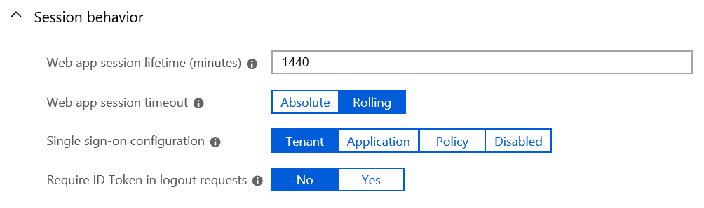

# Configure session behavior in Azure Active Directory B2C

[Single sign-on (SSO) session](session-overview.md) management in Azure Active Directory B2C (Azure AD B2C) enables an administrator to control interaction with a user after the user has already authenticated. For example, the administrator can control whether the selection of identity providers is displayed, or whether account details need to be entered again. This article describes how to configure the SSO settings for Azure AD B2C.

## Session behavior properties

You can use the following properties to manage web application sessions:

- **Web app session lifetime (minutes)** - The lifetime of Azure AD B2C's session cookie stored on the user's browser upon successful authentication.
    - Default = 1440 minutes.
    - Minimum (inclusive) = 15 minutes.
    - Maximum (inclusive) = 1440 minutes.
- **Web app session timeout** - The [session expiry type](session-overview.md#session-expiry-type), *Rolling*, or *Absolute*. 
- **Single sign-on configuration** - The [session scope](session-overview.md#session-scope) of the single sign-on (SSO) behavior across multiple apps and user flows in your Azure AD B2C tenant.

## Configure the properties

1. Sign in to the [Azure portal](https://portal.azure.com).
2. Make sure you're using the directory that contains your Azure AD B2C tenant by selecting the **Directory + subscription** filter in the top menu and choosing the directory that contains your Azure AD B2C tenant.
3. Choose **All services** in the top-left corner of the Azure portal, and then search for and select **Azure AD B2C**.
4. Select **User flows**.
5. Open the user flow that you previously created.
6. Select **Properties**.
7. Configure **Web app session lifetime (minutes)**, **Web app session timeout**, **Single sign-on configuration**, and **Require ID Token in logout requests** as needed.

    

8. Click **Save**.

## Configure sign-out behavior

### Require ID Token in logout requests

When you redirect the user to the Azure AD B2C sign-out endpoint, Azure AD B2C clears the user's session from the browser and redirect the user back to the the application as specifies in the `post_logout_redirect_uri`. With the **Require ID Token in logout requests** you can enforce a previously issued ID token to pass to the logout endpoint as a hint about the end user's current authenticated session with the client. The id_token_hint ensures that the post_logout_redirect_uri is a registered reply URL in your Azure AD B2C application settings. 

1. Sign in to the [Azure portal](https://portal.azure.com).
1. Make sure you're using the directory that contains your Azure AD B2C tenant by selecting the **Directory + subscription** filter in the top menu and choosing the directory that contains your Azure AD B2C tenant.
1. Choose **All services** in the top-left corner of the Azure portal, and then search for and select **Azure AD B2C**.
1. Select **User flows**.
1. Open the user flow that you previously created.
1. Select **Properties**.
1. Enable the **Require ID Token in logout requests**.
1. Go back to  **Azure AD B2C**.
1. Select **App registrations**, and then select your application.
1. Select **Settings**, select **Properties**, and then find the **Logout URL** text box. 

## Next steps

- Learn more about [Azure AD B2C session](session-overview.md).
