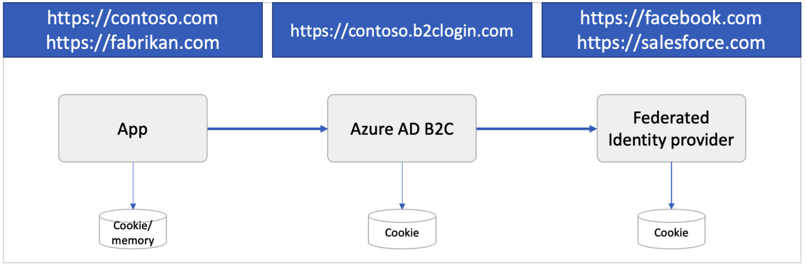

# Azure AD B2C session

Single sign-on (SSO) adds security and convenience when users sign in across applications in Azure Active Directory B2C (Azure AD B2C). This article describes the single sign-on methods used in Azure AD B2C and helps you choose the most appropriate SSO method when configuring your policy.

With single sign-on, users sign in once with a single account and get access to multiple applications. The application can be a web, mobile, or single page application, regardless of platform or domain name.

When the user initially signs in to an application, Azure AD B2C persists a cookie-based session. Upon subsequent authentication requests, Azure AD B2C reads and validates the cookie-based session, and issues an access token without prompting the user to sign in again. If the cookie-based session expires or becomes invalid, the user is prompted to sign-in again.  

## SSO session types

Integration with Azure AD B2C involves three types of SSO sessions:

- **Azure AD B2C** - Session managed by Azure AD B2C
- **Federated identity provider** - Session managed by the identity provider, for example Facebook, Salesforce, or Microsoft account
- **Application** - Session managed by the web, mobile, or single page application

### Azure AD B2C SSO 

When a user successfully authenticates with a local or social account, Azure AD B2C stores a cookie-based session on the user's browser. The cookie is stored under the Azure AD B2C tenant domain name, such as `https://contoso.b2clogin.com`.

If a user initially signs in with a federated account, and then during the session time window (time-to-live, or TTL) signs in to the same app or a different app, Azure AD B2C tries to acquire a new access token from the federated identity provider. If the federated identity provider session is expired or invalid, the federated identity provider prompts the user for their credentials. If the session is still active (or if the user has signed in with a local account instead of a federated account), Azure AD B2C authorizes the user and eliminates further prompts.

You can configure the session behavior, including the session TTL and how Azure AD B2C shares the session across policies and applications.

### Federated identity provider SSO

A social or enterprise identity provider manages its own session. The cookie is stored under the identity provider's domain name, such as `https://login.salesforce.com`. Azure AD B2C doesn't control the federated identity provider session. Instead, session behavior is determined by the federated identity provider. 

Consider the following scenario:

1. A user signs into Facebook to check their feed.
2. Later, the user opens your application and starts the sign-in process. The application redirects the user to Azure AD B2C to complete the sign-in process.
3. On the Azure AD B2C sign-up or sign-in page, the user chooses to sign-in with their Facebook account. The user is redirected to Facebook. If there is an active session at Facebook, the user is not prompted to provide their credentials and is immediately redirected to Azure AD B2C with a Facebook token.

### Application SSO

A web, mobile, or single page application can be protected by OAuth access, ID tokens, or SAML tokens. When a user tries to access a protected resource on the app, the app checks whether there is an active session on the application side. If there is no app session or the session has expired, the app will take the user to Azure AD B2C to sign-in page.

The application session can be a cookie-based session stored under the application domain name, such as `https://contoso.com`. Mobile applications might store the session in a different way but using a similar approach.

## Azure AD B2C session configuration

### Session scope

The Azure AD B2C session can be configured with the following scopes:

- **Tenant** - This setting is the default. Using this setting allows multiple applications and user flows in your B2C tenant to share the same user session. For example, once a user signs into an application, the user can also seamlessly sign into another one upon accessing it.
- **Application** - This setting allows you to maintain a user session exclusively for an application, independent of other applications. For example, you can use this setting if you want the user to sign in to Contoso Pharmacy regardless of whether the user is already signed into Contoso Groceries.
- **Policy** - This setting allows you to maintain a user session exclusively for a user flow, independent of the applications using it. For example, if the user has already signed in and completed a multi-factor authentication (MFA) step, the user can be given access to higher-security parts of multiple applications, as long as the session tied to the user flow doesn't expire.
- **Disabled** - This setting forces the user to run through the entire user flow upon every execution of the policy.

### Session life time

The **session life time** is the amount of time the Azure AD B2C session cookie is stored on the user's browser after successful authentication. You can set the session life time to a value from 15 to 720 minutes.

### Keep me signed-in

The [Keep me signed-in](custom-policy-keep-me-signed-in.md) feature extends the session life time through the use of a persistent cookie. The session remains active after the user closes and reopens the browser. The session is revoked only when a user signs out. The Keep me signed-in feature only applies to sign-in with local accounts.

The Keep me signed-in feature takes precedence over the session life time. If the Keep me signed-in feature is enabled and the user selects it, this feature dictates when the session will expire. 

### Session expiry type

The **session expiry type** indicates how a session is extended by the session life time setting or the keep me signed-in setting.

- **Rolling** - Indicates that the session is extended every time the user performs a cookie-based authentication (default).
- **Absolute** - Indicates that the user is forced to re-authenticate after the time period specified.

## Sign-out

When you want to sign the user out of the application, it isn't enough to clear the application's cookies or otherwise end the session with the user. You must redirect the user to Azure AD B2C to sign out. Otherwise, the user might be able to re-authenticate to your applications without entering their credentials again.

Upon a sign-out request, Azure AD B2C:

1. Invalidates the Azure AD B2C cookie-based session.
1. Attempts to sign out from federated identity providers:
   - OpenId Connect - If the identity provider well-known configuration endpoint specifies an `end_session_endpoint` location.
   - SAML - If the identity provider metadata contains the `SingleLogoutService` location.
1. Optionally, signs-out from other applications. For more information, see the [Single sign-out](#single-sign-out) section.

The sign-out clears the user's single sign-on state with Azure AD B2C, but it might not sign the user out of their social identity provider session. If the user selects the same identity provider during a subsequent sign-in, they might reauthenticate without entering their credentials. If a user wants to sign out of the application, it doesn't necessarily mean they want to sign out of their Facebook account. However, if local accounts are used, the user's session ends properly.

### Single sign-out 

> [!NOTE]
> This feature is limited to [custom policies](custom-policy-overview.md).

When you redirect the user to the Azure AD B2C sign-out endpoint (for both OAuth2 and SAML protocols), Azure AD B2C clears the user's session from the browser. However, the user might still be signed in to other applications that use Azure AD B2C for authentication. To enable those applications to sign the user out simultaneously, Azure AD B2C sends an HTTP GET request to the registered `LogoutUrl` of all the applications that the user is currently signed in to.

Applications must respond to this request by clearing any session that identifies the user and returning a `200` response. If you want to support single sign-out in your application, you must implement a `LogoutUrl` in your application's code. 

## Next steps

- Learn how to [configure session behavior in user flow](session-behavior.md).
- Learn how to [configure session behavior in custom policies](session-behavior-custom-policy.md).