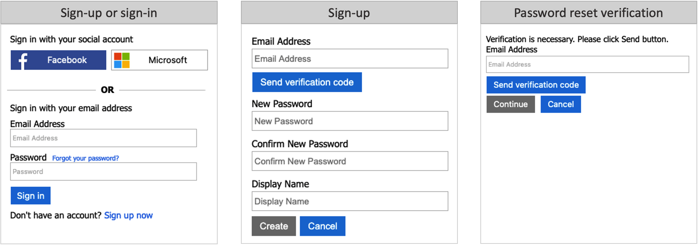
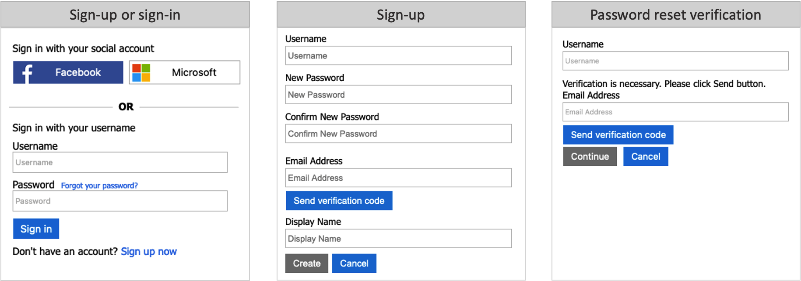
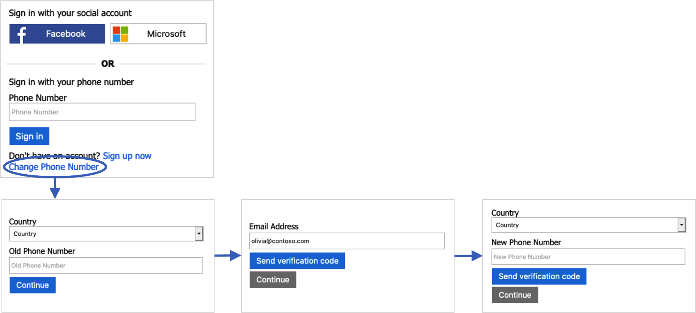
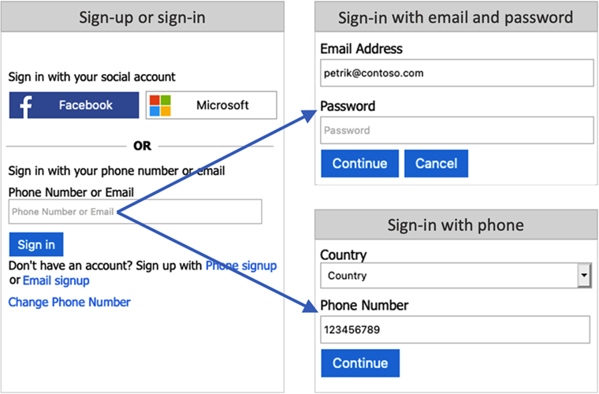

# Sign-in options in Azure AD B2C

Azure AD B2C provides various ways in which users can authenticate a user. Users can sign-in to a local account, by using username and password, phone verification (also known as password less authentication), or social identity providers. Email sign-up is enabled by default in your local account identity provider settings.

## Email sign-in

With the email option, users can sign in and sign up with their email address and password:

- **Sign-in**: Users are prompted to provide their email and password.
- **Sign-up**: users will be prompted for an email address, which will be verified at sign-up (optional) and become their login ID. The user then enters any other information requested on the sign-up page, for example, Display Name, Given Name, and Surname. Then select Continue to create the account.
- **Password reset**: Users must enter and verify their email, after which, the user can reset the password

## Username sign-in

With the user option, users can sign in/up with a username and password:

- **Sign-in**: Users are prompted to provide their username and password.
- **Sign-up**: Users will be prompted for a username, which will become their login ID. Users will also be prompted for an email address, which will be verified at sign-up. The email address will be used during a password reset flow. The user enters any other information requested on the sign-up page, for example, Display Name, Given Name, and Surname. The user then selects Continue to create the account.
- **Password reset**: Users must enter their username and the associated email address. The email address must be verified, after which, the user can reset the password.

## Phone sign-in

Passwordless authentication is a type of authentication where a user doesn't need to sign-in with their password. With phone sign-up and sign-in, the user can sign up for the app using a phone number as their primary login identifier. The user will have the following experience during sign-up and sign-in:

- **Sign-in**: If the user has an existing account with phone number as their identifier, the user enters their phone number and selects *Sign in*. They confirm the country and phone number by selecting *Continue*, and a one-time verification code is sent to their phone. The user enters the verification code and selects *Continue* to sign in.
- **Sign-up**: If the user doesn't already have an account for your application, they can create one by clicking on the *Sign up now* link. 
    1. A sign-up page appears, where the user selects their *Country*, enters their phone number, and selects *Send Code*. 
    1. A one-time verification code is sent to the user's phone number. The user enters the *Verification Code* on the sign-up page, and then selects *Verify Code*. (If the user can't retrieve the code, they can select *Send New Code*).
    1. The user enters any other information requested on the sign-up page, for example, Display Name, Given Name, and Surname. Then select Continue.
    1. Next, the user is asked to provide a **recovery email**. The user enters their email address, and then selects *Send verification code*. A code is sent to the user's email inbox, which they can retrieve and enter in the Verification code box. Then the user selects Verify code.
    1. Once the code is verified, the user selects *Create* to create their account.

### Pricing

One-time passwords are sent to your users by using SMS text messages. Depending on your mobile network operator, you may be charged for each message sent. For pricing information, see the **Separate Charges** section of [Azure Active Directory B2C pricing](https://azure.microsoft.com/pricing/details/active-directory-b2c/).

> [!NOTE]
> Multi-factor authentication (MFA) is disabled by default when you configure a user flow with phone sign-up. You can enable MFA in user flows with phone sign-up, but because a phone number is used as the primary identifier, email one-time passcode is the only option available for the second authentication factor.
### Phone recovery

When you enable phone sign-up and sign-in for your user flows, it's also a good idea to enable the recovery email feature. With this feature, a user can provide an email address that can be used to recover their account when they don't have their phone. This email address is used for account recovery only. It can't be used for signing in.

- When the recovery email prompt is **On**, a user signing up for the first time is prompted to verify a backup email. A user who hasn't provided a recovery email before is asked to verify a backup email during next sign in.

- When recovery email is **Off**, a user signing up or signing in isn't shown the recovery email prompt.

The following screenshots demonstrate the phone recovery flow:

## Phone or email sign-in

You can choose to combine the [phone sign-in](#phone-sign-in), and the [email sign-in](#email-sign-in). In the sign-up or sign-in page, user can type a phone number, or email address. Based on the user input, Azure AD B2C takes the user to the corresponding flow.

## Next steps

- Find out more about the built-in policies provided by [User flows in Azure Active Directory B2C](user-flow-overview.md).
- [Configure your local account identity provider](identity-provider-local.md).