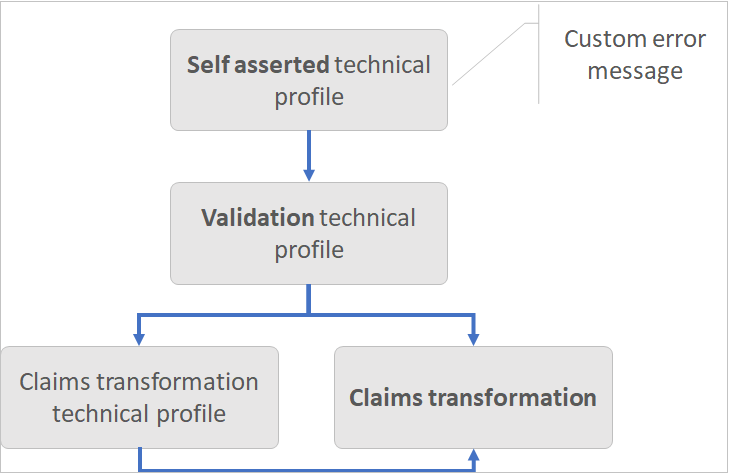
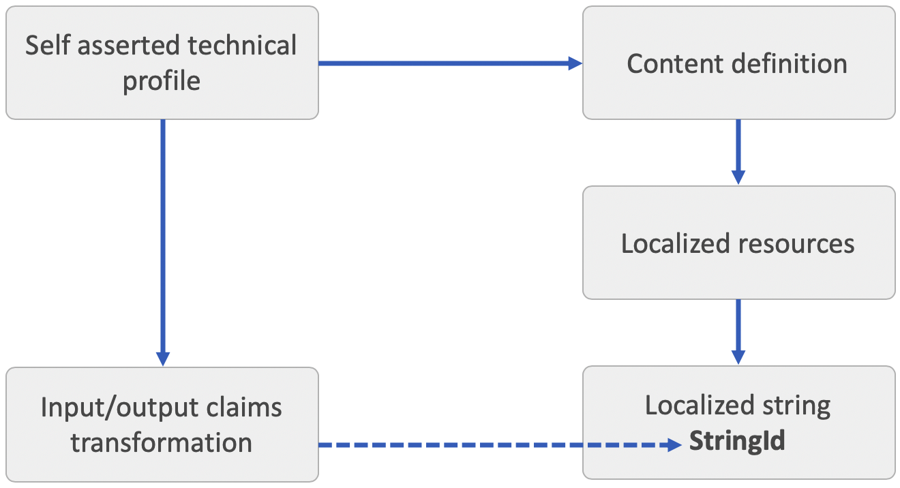

# String claims transformations

This article provides examples for using the string claims transformations of the Identity Experience Framework  schema in Azure Active Directory B2C (Azure AD B2C). For more information, see [claims transformations](claimstransformations.md).

## AssertStringClaimsAreEqual

Compares two claims, and throw an exception if they aren't equal according to the specified comparison inputClaim1, inputClaim2 and stringComparison. 

Check out the [Live demo](https://github.com/azure-ad-b2c/unit-tests/tree/main/claims-transformation/string#assertstringclaimsareequal) of this claims transformation.

| Element | TransformationClaimType | Data Type | Notes |
| ---- | ----------------------- | --------- | ----- |
| InputClaim | inputClaim1 | string | First claim's type, which is to be compared. |
| InputClaim | inputClaim2 | string | Second claim's type, which is to be compared. |
| InputParameter | stringComparison | string | string comparison, one of the values: Ordinal, OrdinalIgnoreCase. |

The **AssertStringClaimsAreEqual** claims transformation is always executed from a [validation technical profile](validation-technical-profile.md) that is called by a [self-asserted technical profile](self-asserted-technical-profile.md), or a [DisplayControl](display-controls.md). The `UserMessageIfClaimsTransformationStringsAreNotEqual` metadata of a self-asserted technical profile controls the error message that is presented to the user. The error messages can be [localized](localization-string-ids.md#claims-transformations-error-messages).



### Example of AssertStringClaimsAreEqual

You can use this claims transformation to make sure, two claims have the same value. If not, an error message is thrown. The following example checks that the **strongAuthenticationEmailAddress** claim is equal to **email** claim. Otherwise an error message is thrown. 

```xml
<ClaimsTransformation Id="AssertEmailAndStrongAuthenticationEmailAddressAreEqual" TransformationMethod="AssertStringClaimsAreEqual">
  <InputClaims>
    <InputClaim ClaimTypeReferenceId="strongAuthenticationEmailAddress" TransformationClaimType="inputClaim1" />
    <InputClaim ClaimTypeReferenceId="email" TransformationClaimType="inputClaim2" />
  </InputClaims>
  <InputParameters>
    <InputParameter Id="stringComparison" DataType="string" Value="ordinalIgnoreCase" />
  </InputParameters>
</ClaimsTransformation>
```

- Input claims:
  - **inputClaim1**: someone@contoso.com
  - **inputClaim2**: someone@outlook.com
- Input parameters:
  - **stringComparison**:  ordinalIgnoreCase
- Result: Error thrown

### Calling the AssertStringClaimsAreEqual claims transformation

The **login-NonInteractive** validation technical profile calls the **AssertEmailAndStrongAuthenticationEmailAddressAreEqual** claims transformation.

```xml
<TechnicalProfile Id="login-NonInteractive">
  ...
  <OutputClaimsTransformations>
    <OutputClaimsTransformation ReferenceId="AssertEmailAndStrongAuthenticationEmailAddressAreEqual" />
  </OutputClaimsTransformations>
</TechnicalProfile>
```

The self-asserted technical profile calls the validation **login-NonInteractive** technical profile.

```xml
<TechnicalProfile Id="SelfAsserted-LocalAccountSignin-Email">
  <Metadata>
    <Item Key="UserMessageIfClaimsTransformationStringsAreNotEqual">Custom error message the email addresses you provided are not the same.</Item>
  </Metadata>
  <ValidationTechnicalProfiles>
    <ValidationTechnicalProfile ReferenceId="login-NonInteractive" />
  </ValidationTechnicalProfiles>
</TechnicalProfile>
```

## BuildUri

Creates a time based on time password (TOTP) URI. The URI is a combination of the user's unique identifier, such as email address, and a secret key. The URI is later converted into a QR code that is presented to the user. Check out the [Live demo](https://github.com/azure-ad-b2c/unit-tests/tree/main/claims-transformation/string#builduri) of this claims transformation.

| Element | TransformationClaimType | Data Type | Notes |
| ---- | ----------------------- | --------- | ----- |
| InputClaim | path | string | The user's unique identifier, such as email address, username, or phone number. |
| InputClaim|  query.secret| string | The TOTP secret key. |
|InputParameter | scheme| string| The scheme part of the URI. For example, `otpauth`.| 
|InputParameter | host| string| The scheme part of the URI. For example, `totp`.|
|InputParameter | query.issuer| string| The issuer part of the URI. For example, `{AuthenticatorIssuer}`.|
| OutputClaim | outputClaim | string | The claim that is produced after this claims transformation has been invoked. |

### Example of BuildUri

The following claims transformation generates a TOTP URI that will be displayed in the QR Code, or deep link.

```xml
<ClaimsTransformation Id="CreateUriString" TransformationMethod="BuildUri">
  <InputClaims>
    <InputClaim ClaimTypeReferenceId="uriLabel" TransformationClaimType="path" />
    <InputClaim ClaimTypeReferenceId="secretKey" TransformationClaimType="query.secret" />
  </InputClaims>
  <InputParameters>
    <InputParameter Id="scheme" DataType="string" Value="otpauth" />
    <InputParameter Id="host" DataType="string" Value="totp" />
    <InputParameter Id="query.issuer" DataType="string" Value="{AuthenticatorIssuer}" />
  </InputParameters>
  <OutputClaims>
    <OutputClaim ClaimTypeReferenceId="qrCodeContent" TransformationClaimType="outputClaim" />
  </OutputClaims>
</ClaimsTransformation>
```

- Input claims:
  - **path**: emily@fabrikam.com
  - **query.secret**: `fay2lj7ynpntjgqa`
- Input parameters:
  - **scheme**: `otpauth`
  - **host**: `totp`
  - **query.issuer**: `{AuthenticatorIssuer}`
- Output claims:
  - **outputClaim**: `otpauth://totp/Contoso%20demo:emily@fabrikam.com?secret=fay2lj7ynpntjgqa&issuer=Contoso+demo`

## ChangeCase

Changes the case of the provided claim to lower or upper case depending on the operator. Check out the [Live demo](https://github.com/azure-ad-b2c/unit-tests/tree/main/claims-transformation/string#changecase) of this claims transformation.

| Element | TransformationClaimType | Data Type | Notes |
| ---- | ----------------------- | --------- | ----- |
| InputClaim | inputClaim1 | string | The claim to be changed. |
| InputParameter | toCase | string | One of the following values: `LOWER` or `UPPER`. |
| OutputClaim | outputClaim | string | The claim that is produced after this claims transformation has been invoked. |

### Example of ChangeCase

The following claim transformation changes the email claim to lower case.

```xml
<ClaimsTransformation Id="ChangeToLower" TransformationMethod="ChangeCase">
  <InputClaims>
    <InputClaim ClaimTypeReferenceId="email" TransformationClaimType="inputClaim1" />
  </InputClaims>
<InputParameters>
  <InputParameter Id="toCase" DataType="string" Value="LOWER" />
</InputParameters>
  <OutputClaims>
    <OutputClaim ClaimTypeReferenceId="email" TransformationClaimType="outputClaim" />
  </OutputClaims>
</ClaimsTransformation>
```

- Input claims:
  - **email**: SomeOne@contoso.com
- Input parameters:
  - **toCase**: LOWER
- Output claims:
  - **email**: someone@contoso.com

## CompareClaims

Determines whether one string claim is equal to another. The result is a new boolean claim with a value of `true` or `false`. Check out the [Live demo](https://github.com/azure-ad-b2c/unit-tests/tree/main/claims-transformation/string#compareclaims) of this claims transformation.

| Element | TransformationClaimType | Data Type | Notes |
| ---- | ----------------------- | --------- | ----- |
| InputClaim | inputClaim1 | string | First claim type, which is to be compared. |
| InputClaim | inputClaim2 | string | Second claim type, which is to be compared. |
| InputParameter | operator | string | Possible values: `EQUAL` or `NOT EQUAL`. |
| InputParameter | ignoreCase | string | Specifies whether this comparison should ignore the case of the strings being compared. |
| OutputClaim | outputClaim | boolean | The claim that is produced after this claims transformation has been invoked. |

### Example of CompareClaims

Use this claims transformation to check if a claim is equal to another claim.  The following claims transformation checks if the value of the **email** claim is identical to the **Verified.Email** claim.

```xml
<ClaimsTransformation Id="CheckEmail" TransformationMethod="CompareClaims">
  <InputClaims>
    <InputClaim ClaimTypeReferenceId="Email" TransformationClaimType="inputClaim1" />
    <InputClaim ClaimTypeReferenceId="Verified.Email" TransformationClaimType="inputClaim2" />
  </InputClaims>
  <InputParameters>
    <InputParameter Id="operator" DataType="string" Value="NOT EQUAL" />
    <InputParameter Id="ignoreCase" DataType="string" Value="true" />
  </InputParameters>
  <OutputClaims>
    <OutputClaim ClaimTypeReferenceId="SameEmailAddress" TransformationClaimType="outputClaim" />
  </OutputClaims>
</ClaimsTransformation>
```

- Input claims:
  - **inputClaim1**: someone@contoso.com
  - **inputClaim2**: someone@outlook.com
- Input parameters:
  - **operator**:  NOT EQUAL
  - **ignoreCase**: true
- Output claims:
  - **outputClaim**: true

## CompareClaimToValue

Determines whether a claim value is equal to the input parameter value. Check out the [Live demo](https://github.com/azure-ad-b2c/unit-tests/tree/main/claims-transformation/string#compareclaimtovalue) of this claims transformation.

| Element | TransformationClaimType | Data Type | Notes |
| ---- | ----------------------- | --------- | ----- |
| InputClaim | inputClaim1 | string | The claim's type, which is to be compared. |
| InputParameter | operator | string | Possible values: `EQUAL` or `NOT EQUAL`. |
| InputParameter | compareTo | string | String comparison, one of the values: Ordinal, OrdinalIgnoreCase. |
| InputParameter | ignoreCase | string | Specifies whether this comparison should ignore the case of the strings being compared. |
| OutputClaim | outputClaim | boolean | The claim that is produced after this claims transformation has been invoked. |

### Example of CompareClaimToValue

Use this claims transformation to check if a claim is equal to a value you specified. For example, the following claims transformation checks if the value of the **termsOfUseConsentVersion** claim is equal to `v1`.

```xml
<ClaimsTransformation Id="IsTermsOfUseConsentRequiredForVersion" TransformationMethod="CompareClaimToValue">
  <InputClaims>
    <InputClaim ClaimTypeReferenceId="termsOfUseConsentVersion" TransformationClaimType="inputClaim1" />
  </InputClaims>
  <InputParameters>
    <InputParameter Id="compareTo" DataType="string" Value="V1" />
    <InputParameter Id="operator" DataType="string" Value="not equal" />
    <InputParameter Id="ignoreCase" DataType="string" Value="true" />
  </InputParameters>
  <OutputClaims>
    <OutputClaim ClaimTypeReferenceId="termsOfUseConsentRequired" TransformationClaimType="outputClaim" />
  </OutputClaims>
</ClaimsTransformation>
```

- Input claims:
  - **inputClaim1**: v1
- Input parameters:
  - **compareTo**: V1
  - **operator**: EQUAL
  - **ignoreCase**:  true
- Output claims:
  - **outputClaim**: true

## CopyClaimIfPredicateMatch

Copies value of a claim to another if the value of the input claim matches the output claim predicate. Check out the [Live demo](https://github.com/azure-ad-b2c/unit-tests/tree/main/claims-transformation/string#copyclaimifpredicatematch) of this claims transformation.

| Element | TransformationClaimType | Data Type | Notes |
| ---- | ----------------------- | --------- | ----- |
| InputClaim | inputClaim | string | The claim type, which is to be copied. |
| OutputClaim | outputClaim | string | The claim type that is produced after this claims transformation has been invoked. The value of the input claim is checked against this claim predicate. |

### Example of CopyClaimIfPredicateMatch

The following example tries to copy the signInName claim value to phoneNumber claim. In this example, the value won't be copied.  The signInName claim isn't in the expected format, phone number. For the complete sample, see [Phone number or email sign-in](https://github.com/Azure-Samples/active-directory-b2c-custom-policy-starterpack/blob/master/scenarios/phone-number-passwordless/Phone_Email_Base.xml) starter pack policy.

```xml
<ClaimsTransformation Id="SetPhoneNumberIfPredicateMatch" TransformationMethod="CopyClaimIfPredicateMatch">
  <InputClaims>
    <InputClaim ClaimTypeReferenceId="signInName" TransformationClaimType="inputClaim" />
  </InputClaims>
  <OutputClaims>
    <OutputClaim ClaimTypeReferenceId="phoneNumber" TransformationClaimType="outputClaim" />
  </OutputClaims>
</ClaimsTransformation>
```

- Input claims:
  - **inputClaim**: bob@contoso.com
- Output claims:
  - **outputClaim**: The output claim won't be changed from its original value.

### Example of CopyClaimIfPredicateMatch that muches the predicate

In this example, the claims transformation will copy the value. The signInName claim is in the correct format, phone number.

- Input claims:
  - **inputClaim**: +11234567890
- Output claims:
  - **outputClaim**: +11234567890

## CreateOtpSecret

Creates a TOTP string claim. The output of this claims transformation is a TOTP secret that is later stored in the Azure AD B2C user's account and shared with the Microsoft Authenticator app. The authenticator app uses the key to generate TOTP codes when the user needs to go through MFA. Your policy uses the key to validate the TOTP code provided by the user. 

Check out the [Live demo](https://github.com/azure-ad-b2c/unit-tests/tree/main/claims-transformation/string#createotpsecret) of this claims transformation.

| Element | TransformationClaimType | Data Type | Notes |
|----- | ----------------------- | --------- | ----- |
| OutputClaim | outputClaim | string | The claim that is produced after this claims transformation has been invoked, with the generated TOTP code. |

### Example of CreateOtpSecret

The following claims transformation creates a secret for the TOTP multi-factor authenticator.

```xml
<ClaimsTransformation Id="CreateSecret" TransformationMethod="CreateOtpSecret">
  <OutputClaims>
    <OutputClaim ClaimTypeReferenceId="secretKey" TransformationClaimType="outputClaim" />
  </OutputClaims>
</ClaimsTransformation>
```

- Output claims:
  - **outputClaim**: `hmlcmd4ph6fph64c`

## CreateRandomString

Creates a random string using the random number generator. If the random number generator is of type `integer`, optionally a seed parameter and a maximum number may be provided. An optional string format parameter allows the output to be formatted using it, and an optional base64 parameter specifies whether the output is base64 encoded randomGeneratorType [guid, integer] outputClaim (String).

Check out the [Live demo](https://github.com/azure-ad-b2c/unit-tests/tree/main/claims-transformation/string#createrandomstring) of this claims transformation.

| Element | TransformationClaimType | Data Type | Notes |
| ---- | ----------------------- | --------- | ----- |
| InputParameter | randomGeneratorType | string | Specifies the random value to be generated, `GUID` (global unique ID) or `INTEGER` (a number). |
| InputParameter | stringFormat | string | [Optional] Format the random value. |
| InputParameter | base64 | boolean | [Optional] Convert the random value to base64. If string format is applied, the value after string format is encoded to base64. |
| InputParameter | maximumNumber | int | [Optional] For `INTEGER` randomGeneratorType only. Specify the maximum number. |
| InputParameter | seed  | int | [Optional] For `INTEGER` randomGeneratorType only. Specify the seed for the random value. Note: same seed yields same sequence of random numbers. |
| OutputClaim | outputClaim | string | The claims that will be produced after this claims transformation has been invoked. The random value. |

### Example of CreateRandomString

Following example generates a global unique ID. This claims transformation is used to create the random UPN (user principle name).

```xml
<ClaimsTransformation Id="CreateRandomUPNUserName" TransformationMethod="CreateRandomString">
  <InputParameters>
    <InputParameter Id="randomGeneratorType" DataType="string" Value="GUID" />
  </InputParameters>
  <OutputClaims>
    <OutputClaim ClaimTypeReferenceId="upnUserName" TransformationClaimType="outputClaim" />
  </OutputClaims>
</ClaimsTransformation>
```

- Input parameters:
  - **randomGeneratorType**: GUID
- Output claims:
  - **outputClaim**: bc8bedd2-aaa3-411e-bdee-2f1810b73dfc

### Example of CreateRandomString the create a numeric value

Following example generates an integer random value between 0 and 1000. The value is formatted to OTP_{random value}.

```xml
<ClaimsTransformation Id="SetRandomNumber" TransformationMethod="CreateRandomString">
  <InputParameters>
    <InputParameter Id="randomGeneratorType" DataType="string" Value="INTEGER" />
    <InputParameter Id="maximumNumber" DataType="int" Value="1000" />
    <InputParameter Id="stringFormat" DataType="string" Value="OTP_{0}" />
    <InputParameter Id="base64" DataType="boolean" Value="false" />
  </InputParameters>
  <OutputClaims>
    <OutputClaim ClaimTypeReferenceId="randomNumber" TransformationClaimType="outputClaim" />
  </OutputClaims>
</ClaimsTransformation>
```

- Input parameters:
  - **randomGeneratorType**: INTEGER
  - **maximumNumber**: 1000
  - **stringFormat**: OTP_{0}
  - **base64**: false
- Output claims:
  - **outputClaim**: OTP_853

## CreateStringClaim

Creates a string claim from the provided input parameter in the transformation. Check out the [Live demo](https://github.com/azure-ad-b2c/unit-tests/tree/main/claims-transformation/string#createstringclaim) of this claims transformation.

| Element | TransformationClaimType | Data Type | Notes |
|----- | ----------------------- | --------- | ----- |
| InputParameter | value | string | The string to be set. This input parameter supports [string claims transformation expressions](string-transformations.md#string-claim-transformations-expressions). |
| OutputClaim | createdClaim | string | The claim that is produced after this claims transformation has been invoked, with the value specified in the input parameter. |

### Example of CreateStringClaim

The following claims transformation creates a string value with terms of service.

```xml
<ClaimsTransformation Id="CreateTermsOfService" TransformationMethod="CreateStringClaim">
  <InputParameters>
    <InputParameter Id="value" DataType="string" Value="Contoso terms of service..." />
  </InputParameters>
  <OutputClaims>
    <OutputClaim ClaimTypeReferenceId="TOS" TransformationClaimType="createdClaim" />
  </OutputClaims>
</ClaimsTransformation>
```

- Input parameter:
  - **value**: Contoso terms of service...
- Output claims:
  - **createdClaim**: The TOS claim contains the "Contoso terms of service..." value.

## FormatLocalizedString

Formats multiple claims according to a provided localized format string. This transformation uses the C# `String.Format` method. Check out the [Live demo](https://github.com/azure-ad-b2c/unit-tests/tree/main/claims-transformation/string#formatlocalizedstring) of this claims transformation.

| Element | TransformationClaimType | Data Type | Notes |
| ---- | ----------------------- | --------- | ----- |
| InputClaims |  |string | The collection of input claims that acts as string format {0}, {1}, {2} parameters. |
| InputParameter | stringFormatId | string |  The `StringId` of a [localized string](localization.md).   |
| OutputClaim | outputClaim | string | The claim that is produced after this claims transformation has been invoked. |

> [!NOTE]
> There is no limit to the number of input claims that you can specify, but the maximum length of the formatted string is 4000.

To use the FormatLocalizedString claims transformation:

1. Define a [localization string](localization.md), and associate it with a [self-asserted-technical-profile](self-asserted-technical-profile.md).
1. The `ElementType` of the `LocalizedString` element must be set to `FormatLocalizedStringTransformationClaimType`.
1. The `StringId` is a unique identifier that you define, and use it later in your claims transformation `stringFormatId`.
1. In the claims transformation, specify the list of claims to be set with the localized string. Then set the `stringFormatId` to the `StringId` of the localized string element. 
1. In a [self-asserted technical profile](self-asserted-technical-profile.md), or a [display control](display-controls.md) input or output claims transformation, make a reference to your claims transformation.

### Example of FormatLocalizedString

The following example generates an error message when an account is already in the directory. The example defines localized strings for English (default) and Spanish.

```xml
<Localization Enabled="true">
  <SupportedLanguages DefaultLanguage="en" MergeBehavior="Append">
    <SupportedLanguage>en</SupportedLanguage>
    <SupportedLanguage>es</SupportedLanguage>
   </SupportedLanguages>

  <LocalizedResources Id="api.localaccountsignup.en">
    <LocalizedStrings>
      <LocalizedString ElementType="FormatLocalizedStringTransformationClaimType" StringId="ResponseMessge_EmailExists">The email '{0}' is already an account in this organization. Click Next to sign in with that account.</LocalizedString>
      </LocalizedStrings>
    </LocalizedResources>
  <LocalizedResources Id="api.localaccountsignup.es">
    <LocalizedStrings>
      <LocalizedString ElementType="FormatLocalizedStringTransformationClaimType" StringId="ResponseMessge_EmailExists">Este correo electrónico "{0}" ya es una cuenta de esta organización. Haga clic en Siguiente para iniciar sesión con esa cuenta.</LocalizedString>
    </LocalizedStrings>
  </LocalizedResources>
</Localization>
```

The claims transformation creates a response message based on the localized string. The message contains the user's email address embedded into the localized sting *ResponseMessge_EmailExists*.

```xml
<ClaimsTransformation Id="SetResponseMessageForEmailAlreadyExists" TransformationMethod="FormatLocalizedString">
  <InputClaims>
    <InputClaim ClaimTypeReferenceId="email" />
  </InputClaims>
  <InputParameters>
    <InputParameter Id="stringFormatId" DataType="string" Value="ResponseMessge_EmailExists" />
  </InputParameters>
  <OutputClaims>
    <OutputClaim ClaimTypeReferenceId="responseMsg" TransformationClaimType="outputClaim" />
  </OutputClaims>
</ClaimsTransformation>
```

- Input claims:
  - **inputClaim**: sarah@contoso.com
- Input parameters:
  - **stringFormat**:  ResponseMessge_EmailExists
- Output claims:
  - **outputClaim**: The email 'sarah@contoso.com' is already an account in this organization. Select Next to sign in with that account.

## FormatStringClaim

Formats a claim according to the provided format string. This transformation uses the C# `String.Format` method. Check out the [Live demo](https://github.com/azure-ad-b2c/unit-tests/tree/main/claims-transformation/string#formatstringclaim) of this claims transformation.

| Element | TransformationClaimType | Data Type | Notes |
| ---- | ----------------------- | --------- | ----- |
| InputClaim | inputClaim |string |The claim that acts as string format {0} parameter. |
| InputParameter | stringFormat | string | The string format, including the {0}  parameter. This input parameter supports [string claims transformation expressions](string-transformations.md#string-claim-transformations-expressions).  |
| OutputClaim | outputClaim | string | The claim that is produced after this claims transformation has been invoked. |

> [!NOTE]
> String format maximum allowed size is 4000.

### Example of FormatStringClaim

Use this claims transformation to format any string with one parameter {0}. The following example creates a **userPrincipalName**. All social identity provider technical profiles, such as `Facebook-OAUTH` calls the **CreateUserPrincipalName** to generate a **userPrincipalName**.

```xml
<ClaimsTransformation Id="CreateUserPrincipalName" TransformationMethod="FormatStringClaim">
  <InputClaims>
    <InputClaim ClaimTypeReferenceId="upnUserName" TransformationClaimType="inputClaim" />
  </InputClaims>
  <InputParameters>
    <InputParameter Id="stringFormat" DataType="string" Value="cpim_{0}@{RelyingPartyTenantId}" />
  </InputParameters>
  <OutputClaims>
    <OutputClaim ClaimTypeReferenceId="userPrincipalName" TransformationClaimType="outputClaim" />
  </OutputClaims>
</ClaimsTransformation>
```

- Input claims:
  - **inputClaim**: 5164db16-3eee-4629-bfda-dcc3326790e9
- Input parameters:
  - **stringFormat**:  cpim_{0}@{RelyingPartyTenantId}
- Output claims:
  - **outputClaim**: cpim_5164db16-3eee-4629-bfda-dcc3326790e9@b2cdemo.onmicrosoft.com

## FormatStringMultipleClaims

Formats two claims according to the provided format string. This transformation uses the C# `String.Format` method. Check out the [Live demo](https://github.com/azure-ad-b2c/unit-tests/tree/main/claims-transformation/string#formatstringmultipleclaims) of this claims transformation.

| Element | TransformationClaimType | Data Type | Notes |
| ---- | ----------------------- | --------- | ----- |
| InputClaim | inputClaim1 |string | The claim that acts as string format {0} parameter. |
| InputClaim | inputClaim2 | string | The claim that acts as string format {1} parameter. |
| InputParameter | stringFormat | string | The string format, including the {0} and {1} parameters. This input parameter supports [string claims transformation expressions](string-transformations.md#string-claim-transformations-expressions).   |
| OutputClaim | outputClaim | string | The claim that is produced after this claims transformation has been invoked. |

> [!NOTE]
> String format maximum allowed size is 4000.

### Example of FormatStringMultipleClaims

Use this claims transformation to format any string with two parameters, {0} and {1}. The following example creates a **displayName** with the specified format:

```xml
<ClaimsTransformation Id="CreateDisplayNameFromFirstNameAndLastName" TransformationMethod="FormatStringMultipleClaims">
  <InputClaims>
    <InputClaim ClaimTypeReferenceId="givenName" TransformationClaimType="inputClaim1" />
    <InputClaim ClaimTypeReferenceId="surName" TransformationClaimType="inputClaim2" />
  </InputClaims>
  <InputParameters>
    <InputParameter Id="stringFormat" DataType="string" Value="{0} {1}" />
  </InputParameters>
  <OutputClaims>
    <OutputClaim ClaimTypeReferenceId="displayName" TransformationClaimType="outputClaim" />
  </OutputClaims>
</ClaimsTransformation>
```

- Input claims:
  - **inputClaim1**: Joe
  - **inputClaim2**: Fernando
- Input parameters:
  - **stringFormat**: {0} {1}
- Output claims:
  - **outputClaim**: Joe Fernando

## GetLocalizedStringsTransformation

Copies localized strings into claims. Check out the [Live demo](https://github.com/azure-ad-b2c/unit-tests/tree/main/claims-transformation/string#getlocalizedstringstransformation) of this claims transformation.

| Element | TransformationClaimType | Data Type | Notes |
| ---- | ----------------------- | --------- | ----- |
| OutputClaim | The name of the localized string | string | List of claim types that are produced after this claims transformation has been invoked. |

To use the GetLocalizedStringsTransformation claims transformation:

1. Define a [localization string](localization.md) for your [content definition](contentdefinitions.md), such as `api.selfasserted`.
2. The `ElementType` of the `LocalizedString` element must be set to `GetLocalizedStringsTransformationClaimType`.
3. The `StringId` is a unique identifier that you define, and use it later in your claims transformation.
4. In the claims transformation, specify the list of claims to be set with the localized string. The `ClaimTypeReferenceId` is a reference to a claim already defined in the ClaimsSchema section in the policy. The `TransformationClaimType` is the name of the localized string as defined in the `StringId` of the `LocalizedString` element.
5. In a [self-asserted](self-asserted-technical-profile.md), or [claims transformation](claims-transformation-technical-profile.md) technical profile's claims transformation, make a reference to your claims transformation.
6. Associate the technical profile with the content definition, such as `api.selfasserted`. The following example shows how to associate a technical profile to the `api.selfasserted` content definition.

    ```xml
    <Metadata>
      <Item Key="ContentDefinitionReferenceId">api.selfasserted</Item>
    </Metadata>
    ```

The following diagram shows how to configure the claims transformation with the localization elements:



### Example of GetLocalizedStringsTransformation

The following example looks up the email subject, body, your code message, and the signature of the email, from localized strings. The claims later used by custom email verification template.

Define localized strings for English (default) and Spanish.

```xml
<Localization Enabled="true">
  <SupportedLanguages DefaultLanguage="en" MergeBehavior="Append">
    <SupportedLanguage>en</SupportedLanguage>
    <SupportedLanguage>es</SupportedLanguage>
   </SupportedLanguages>

  <LocalizedResources Id="api.localaccountsignup.en">
    <LocalizedStrings>
      <LocalizedString ElementType="GetLocalizedStringsTransformationClaimType" StringId="email_subject">Contoso account email verification code</LocalizedString>
      <LocalizedString ElementType="GetLocalizedStringsTransformationClaimType" StringId="email_message">Thanks for verifying your account!</LocalizedString>
      <LocalizedString ElementType="GetLocalizedStringsTransformationClaimType" StringId="email_code">Your code is</LocalizedString>
      <LocalizedString ElementType="GetLocalizedStringsTransformationClaimType" StringId="email_signature">Sincerely</LocalizedString>
     </LocalizedStrings>
   </LocalizedResources>
   <LocalizedResources Id="api.localaccountsignup.es">
     <LocalizedStrings>
      <LocalizedString ElementType="GetLocalizedStringsTransformationClaimType" StringId="email_subject">Código de verificación del correo electrónico de la cuenta de Contoso</LocalizedString>
      <LocalizedString ElementType="GetLocalizedStringsTransformationClaimType" StringId="email_message">Gracias por comprobar la cuenta de </LocalizedString>
      <LocalizedString ElementType="GetLocalizedStringsTransformationClaimType" StringId="email_code">Su código es</LocalizedString>
      <LocalizedString ElementType="GetLocalizedStringsTransformationClaimType" StringId="email_signature">Atentamente</LocalizedString>
    </LocalizedStrings>
  </LocalizedResources>
</Localization>
```

The claims transformation sets the value of the claim type *subject* with the value of the `StringId` *email_subject*.

```xml
<ClaimsTransformation Id="GetLocalizedStringsForEmail" TransformationMethod="GetLocalizedStringsTransformation">
  <OutputClaims>
    <OutputClaim ClaimTypeReferenceId="subject" TransformationClaimType="email_subject" />
    <OutputClaim ClaimTypeReferenceId="message" TransformationClaimType="email_message" />
    <OutputClaim ClaimTypeReferenceId="codeIntro" TransformationClaimType="email_code" />
    <OutputClaim ClaimTypeReferenceId="signature" TransformationClaimType="email_signature" />
   </OutputClaims>
</ClaimsTransformation>
```

- Output claims:
  - **subject**: Contoso account email verification code
  - **message**: Thanks for verifying your account!
  - **codeIntro**: Your code is
  - **signature**: Sincerely


## GetMappedValueFromLocalizedCollection

Maps an element from the input claim's **Restriction** collection. Check out the [Live demo](https://github.com/azure-ad-b2c/unit-tests/tree/main/claims-transformation/string#getmappedvaluefromlocalizedcollection) of this claims transformation.

| Element | TransformationClaimType | Data Type | Notes |
| ---- | ----------------------- | --------- | ----- |
| InputClaim | mapFromClaim | string | The claim that contains the text to be looked up in the **restrictionValueClaim** claims with the **Restriction** collection.  |
| OutputClaim | restrictionValueClaim | string | The claim that contains the **Restriction** collection. After the claims transformation has been invoked, the value of this claim contains the value of the selected item. |

### Example of GetMappedValueFromLocalizedCollection

The following example looks up the error message description based on the error key. The **responseMsg** claim contains a collection of error messages to present to the end user or to be sent to the relying party.

```xml
<ClaimType Id="responseMsg">
  <DisplayName>Error message: </DisplayName>
  <DataType>string</DataType>
  <UserInputType>Paragraph</UserInputType>
  <Restriction>
    <Enumeration Text="B2C_V1_90001" Value="You cannot sign in because you are a minor" />
    <Enumeration Text="B2C_V1_90002" Value="This action can only be performed by gold members" />
    <Enumeration Text="B2C_V1_90003" Value="You have not been enabled for this operation" />
  </Restriction>
</ClaimType>
```

The claims transformation looks up the text of the item and returns its value. If the restriction is localized using `<LocalizedCollection>`, the claims transformation returns the localized value.

```xml
<ClaimsTransformation Id="GetResponseMsgMappedToResponseCode" TransformationMethod="GetMappedValueFromLocalizedCollection">
  <InputClaims>
    <InputClaim ClaimTypeReferenceId="responseCode" TransformationClaimType="mapFromClaim" />
  </InputClaims>
  <OutputClaims>
    <OutputClaim ClaimTypeReferenceId="responseMsg" TransformationClaimType="restrictionValueClaim" />        
  </OutputClaims>
</ClaimsTransformation>
```

- Input claims:
  - **mapFromClaim**: B2C_V1_90001
- Output claims:
  - **restrictionValueClaim**: You can’t sign in because you're a minor.

## LookupValue

Looks up a claim value from a list of values based on the value of another claim. Check out the [Live demo](https://github.com/azure-ad-b2c/unit-tests/tree/main/claims-transformation/string#lookupvalue) of this claims transformation.

| Element | TransformationClaimType | Data Type | Notes |
| ---- | ----------------------- | --------- | ----- |
| InputClaim | inputParameterId | string | The claim that contains the lookup value |
| InputParameter | |string | Collection of inputParameters. |
| InputParameter | errorOnFailedLookup | boolean | Controlling whether an error is returned when no matching lookup. |
| OutputClaim | outputClaim | string | The claim that will be produced after this claims transformation has been invoked. The value of the matching `Id`. |

### Example of LookupValue

The following example looks up the domain name in one of the inputParameters collections. The claims transformation looks up the domain name in the identifier and returns its value (an application ID).

```xml
 <ClaimsTransformation Id="DomainToClientId" TransformationMethod="LookupValue">
  <InputClaims>
    <InputClaim ClaimTypeReferenceId="domainName" TransformationClaimType="inputParameterId" />
  </InputClaims>
  <InputParameters>
    <InputParameter Id="contoso.com" DataType="string" Value="13c15f79-8fb1-4e29-a6c9-be0d36ff19f1" />
    <InputParameter Id="microsoft.com" DataType="string" Value="0213308f-17cb-4398-b97e-01da7bd4804e" />
    <InputParameter Id="test.com" DataType="string" Value="c7026f88-4299-4cdb-965d-3f166464b8a9" />
    <InputParameter Id="errorOnFailedLookup" DataType="boolean" Value="false" />
  </InputParameters>
  <OutputClaims>
    <OutputClaim ClaimTypeReferenceId="domainAppId" TransformationClaimType="outputClaim" />
  </OutputClaims>
</ClaimsTransformation>
```

- Input claims:
  - **inputParameterId**: test.com
- Input parameters:
  - **contoso.com**: 13c15f79-8fb1-4e29-a6c9-be0d36ff19f1
  - **microsoft.com**: 0213308f-17cb-4398-b97e-01da7bd4804e
  - **test.com**: c7026f88-4299-4cdb-965d-3f166464b8a9
  - **errorOnFailedLookup**: false
- Output claims:
  - **outputClaim**:    c7026f88-4299-4cdb-965d-3f166464b8a9

### Example of LookupValue with error

When `errorOnFailedLookup` input parameter is set to `true`, the **LookupValue** claims transformation is always executed from a [validation technical profile](validation-technical-profile.md) that is called by a [self-asserted technical profile](self-asserted-technical-profile.md), or a [DisplayConrtol](display-controls.md). The `LookupNotFound` metadata of a self-asserted technical profile controls the error message that is presented to the user.


The following example looks up the domain name in one of the inputParameters collections. The claims transformation looks up the domain name in the identifier and returns its value (an application ID), or raises an error message.

```xml
 <ClaimsTransformation Id="DomainToClientId" TransformationMethod="LookupValue">
  <InputClaims>
    <InputClaim ClaimTypeReferenceId="domainName" TransformationClaimType="inputParameterId" />
  </InputClaims>
  <InputParameters>
    <InputParameter Id="contoso.com" DataType="string" Value="13c15f79-8fb1-4e29-a6c9-be0d36ff19f1" />
    <InputParameter Id="microsoft.com" DataType="string" Value="0213308f-17cb-4398-b97e-01da7bd4804e" />
    <InputParameter Id="test.com" DataType="string" Value="c7026f88-4299-4cdb-965d-3f166464b8a9" />
    <InputParameter Id="errorOnFailedLookup" DataType="boolean" Value="true" />
  </InputParameters>
  <OutputClaims>
    <OutputClaim ClaimTypeReferenceId="domainAppId" TransformationClaimType="outputClaim" />
  </OutputClaims>
</ClaimsTransformation>
```

- Input claims:
  - **inputParameterId**: live.com
- Input parameters:
  - **contoso.com**: 13c15f79-8fb1-4e29-a6c9-be0d36ff19f1
  - **microsoft.com**: 0213308f-17cb-4398-b97e-01da7bd4804e
  - **test.com**: c7026f88-4299-4cdb-965d-3f166464b8a9
  - **errorOnFailedLookup**: true
- Error:
  - No match found for the input claim value in the list of input parameter IDs and errorOnFailedLookup is true.


## NullClaim

Cleans the value of a given claim. Check out the [Live demo](https://github.com/azure-ad-b2c/unit-tests/tree/main/claims-transformation/string#nullclaim) of this claims transformation.

| Element | TransformationClaimType | Data Type | Notes |
| ---- | ----------------------- | --------- | ----- |
| OutputClaim | claim_to_null | string | The claim's value is set to NULL. |

### Example of NullClaim

Use this claim transformation to remove unnecessary data from the claims property bag so the session cookie will be smaller. The following example removes the value of the `TermsOfService` claim type.

```xml
<ClaimsTransformation Id="SetTOSToNull" TransformationMethod="NullClaim">
  <OutputClaims>
  <OutputClaim ClaimTypeReferenceId="TermsOfService" TransformationClaimType="claim_to_null" />
  </OutputClaims>
</ClaimsTransformation>
```

- Input claims:
  - **outputClaim**: Welcome to Contoso App. If you continue to browse and use this website, you're agreeing to comply with and be bound by the following terms and conditions...
- Output claims:
  - **outputClaim**: NULL

## ParseDomain

Gets the domain portion of an email address. Check out the [Live demo](https://github.com/azure-ad-b2c/unit-tests/tree/main/claims-transformation/string#parsedomain) of this claims transformation.

| Element | TransformationClaimType | Data Type | Notes |
| ---- | ----------------------- | --------- | ----- |
| InputClaim | emailAddress | string | The claim that contains the email address. |
| OutputClaim | domain | string | The claim that is produced after this claims transformation has been invoked - the domain. |

### Example of ParseDomain

Use this claims transformation to parse the domain name after the @ symbol of the user. The following claims transformation demonstrates how to parse the domain name from an **email** claim.

```xml
<ClaimsTransformation Id="SetDomainName" TransformationMethod="ParseDomain">
  <InputClaims>
    <InputClaim ClaimTypeReferenceId="email" TransformationClaimType="emailAddress" />
  </InputClaims>
  <OutputClaims>
    <OutputClaim ClaimTypeReferenceId="domainName" TransformationClaimType="domain" />
  </OutputClaims>
</ClaimsTransformation>
```

- Input claims:
  - **emailAddress**: joe@outlook.com
- Output claims:
  - **domain**: outlook.com

## SetClaimIfBooleansMatch

Checks that a boolean claim is `true`, or `false`. If yes, sets the output claims with the value present in `outputClaimIfMatched` input parameter. Check out the [Live demo](https://github.com/azure-ad-b2c/unit-tests/tree/main/claims-transformation/string#setclaimifbooleansmatch) of this claims transformation.

| Element | TransformationClaimType | Data Type | Notes |
| ---- | ----------------------- | --------- | ----- |
| InputClaim | claimToMatch | string | The claim type, which is to be checked. Null value throws an exception. |
| InputParameter | matchTo | string | The value to be compared with `claimToMatch` input claim. Possible values: `true`, or `false`.  |
| InputParameter | outputClaimIfMatched | string | The value to be set if input claim equals to the `matchTo` input parameter. |
| OutputClaim | outputClaim | string | If the `claimToMatch` input claim equals to the `matchTo` input parameter, this output claim contains the value of `outputClaimIfMatched` input parameter. |

### Example of SetClaimIfBooleansMatch

For example, the following claims transformation checks if the value of **hasPromotionCode** claim is equal to `true`. If yes, return the value to *Promotion code not found*.

```xml
<ClaimsTransformation Id="GeneratePromotionCodeError" TransformationMethod="SetClaimIfBooleansMatch">
  <InputClaims>
    <InputClaim ClaimTypeReferenceId="hasPromotionCode" TransformationClaimType="claimToMatch" />
  </InputClaims>
  <InputParameters>
    <InputParameter Id="matchTo" DataType="string" Value="true" />
    <InputParameter Id="outputClaimIfMatched" DataType="string" Value="Promotion code not found." />
  </InputParameters>
  <OutputClaims>
    <OutputClaim ClaimTypeReferenceId="promotionCode" TransformationClaimType="outputClaim" />
  </OutputClaims>
</ClaimsTransformation>
```

- Input claims:
  - **claimToMatch**: true
- Input parameters:
  - **matchTo**: true
  - **outputClaimIfMatched**: "Promotion code not found."
- Output claims:
  - **outputClaim**: "Promotion code not found."

## SetClaimsIfRegexMatch

Checks that a string claim `claimToMatch` and `matchTo` input parameter are equal, and sets the output claims with the value present in `outputClaimIfMatched` input parameter, along with  compare result output claim, which is to be set as `true` or `false` based on the result of comparison.

Check out the [Live demo](https://github.com/azure-ad-b2c/unit-tests/tree/main/claims-transformation/string#setclaimsifregexmatch) of this claims transformation.

| Element | TransformationClaimType | Data Type | Notes |
| ---- | ----------------------- | --------- | ----- |
| inputClaim | claimToMatch | string | The claim type, which is to be compared. |
| InputParameter | matchTo | string | The regular expression to match. |
| InputParameter | outputClaimIfMatched | string | The value to be set if strings are equal. |
| InputParameter | extractGroups | boolean | [Optional] Specifies whether the Regex match should extract groups values. Possible values: `true`, or `false` (default). | 
| OutputClaim | outputClaim | string | If regular expression is match, this output claim contains the value of `outputClaimIfMatched` input parameter. Or null, if no match. |
| OutputClaim | regexCompareResultClaim | boolean | The regular expression match result output claim type, which is to be set as `true` or `false` based on the result of matching. |
| OutputClaim| The name of the claim| string | If the extractGroups input parameter set to true, list of claim types that are produced after this claims transformation has been invoked. The name of the claim must match the Regex group name. | 

### Example of SetClaimsIfRegexMatch

Checks whether the provided phone number is valid, based on phone number regular expression pattern.

```xml
<ClaimsTransformation Id="SetIsPhoneRegex" TransformationMethod="SetClaimsIfRegexMatch">
  <InputClaims>
    <InputClaim ClaimTypeReferenceId="phone" TransformationClaimType="claimToMatch" />
  </InputClaims>
  <InputParameters>
    <InputParameter Id="matchTo" DataType="string" Value="^[0-9]{4,16}$" />
    <InputParameter Id="outputClaimIfMatched" DataType="string" Value="iPhone" />
  </InputParameters>
  <OutputClaims>
    <OutputClaim ClaimTypeReferenceId="validationResult" TransformationClaimType="outputClaim" />
    <OutputClaim ClaimTypeReferenceId="isPhoneBoolean" TransformationClaimType="regexCompareResultClaim" />
  </OutputClaims>
</ClaimsTransformation>
```

- Input claims:
  - **claimToMatch**: "64854114520"
- Input parameters:
  - **matchTo**: "^[0-9]{4,16}$"
  - **outputClaimIfMatched**:  "Phone"
- Output claims:
  - **outputClaim**: "iPhone"
  - **regexCompareResultClaim**: true

### Example of SetClaimsIfRegexMatch with extract groups

Checks whether the provided email address is valid, and return the email alias. Check out the [Live demo](https://github.com/azure-ad-b2c/unit-tests/tree/main/claims-transformation/string#setclaimsifregexmatch-with-groups) of this claims transformation with extract groups.

```xml
<ClaimsTransformation Id="GetAliasFromEmail" TransformationMethod="SetClaimsIfRegexMatch">
  <InputClaims>
    <InputClaim ClaimTypeReferenceId="email" TransformationClaimType="claimToMatch" />
  </InputClaims>
  <InputParameters>
    <InputParameter Id="matchTo" DataType="string" Value="(?&lt;mailAlias&gt;.*)@(.*)$" />
    <InputParameter Id="outputClaimIfMatched" DataType="string" Value="isEmail" />
    <InputParameter Id="extractGroups" DataType="boolean" Value="true" />
  </InputParameters>
  <OutputClaims>
    <OutputClaim ClaimTypeReferenceId="validationResult" TransformationClaimType="outputClaim" />
    <OutputClaim ClaimTypeReferenceId="isEmailString" TransformationClaimType="regexCompareResultClaim" />
    <OutputClaim ClaimTypeReferenceId="mailAlias" />
  </OutputClaims>
</ClaimsTransformation>
```

- Input claims:
  - **claimToMatch**: "emily@contoso.com"
- Input parameters:
  - **matchTo**: `(?&lt;mailAlias&gt;.*)@(.*)$`
  - **outputClaimIfMatched**:  "isEmail"
  - **extractGroups**: true
- Output claims:
  - **outputClaim**: "isEmail"
  - **regexCompareResultClaim**: true
  - **mailAlias**: emily

## SetClaimsIfStringsAreEqual

Checks that a string claim and `matchTo` input parameter are equal, and sets the output claims with the value present in `stringMatchMsg` and `stringMatchMsgCode` input parameters, along with  compare result output claim, which is to be set as `true` or `false` based on the result of comparison.

Check out the [Live demo](https://github.com/azure-ad-b2c/unit-tests/tree/main/claims-transformation/string#setclaimsifstringsareequal) of this claims transformation.

| Element | TransformationClaimType | Data Type | Notes |
| ---- | ----------------------- | --------- | ----- |
| InputClaim | inputClaim | string | The claim type, which is to be compared. |
| InputParameter | matchTo | string | The string to be compared with `inputClaim`. |
| InputParameter | stringComparison | string | Possible values: `Ordinal` or `OrdinalIgnoreCase`. |
| InputParameter | stringMatchMsg | string | First value to be set if strings are equal. |
| InputParameter | stringMatchMsgCode | string | Second value to be set if strings are equal. |
| OutputClaim | outputClaim1 | string | If strings are equals, this output claim contains the value of `stringMatchMsg` input parameter. |
| OutputClaim | outputClaim2 | string | If strings are equals, this output claim contains the value of `stringMatchMsgCode` input parameter. |
| OutputClaim | stringCompareResultClaim | boolean | The compare result output claim type, which is to be set as `true` or `false` based on the result of comparison. |

### Example of SetClaimsIfStringsAreEqual

You can use this claims transformation to check if a claim is equal to value you specified. For example, the following claims transformation checks if the value of the **termsOfUseConsentVersion** claim is equal to `v1`. If yes, change the value to `v2`.

```xml
<ClaimsTransformation Id="CheckTheTOS" TransformationMethod="SetClaimsIfStringsAreEqual">
  <InputClaims>
    <InputClaim ClaimTypeReferenceId="termsOfUseConsentVersion" TransformationClaimType="inputClaim" />
  </InputClaims>
  <InputParameters>
    <InputParameter Id="matchTo" DataType="string" Value="v1" />
    <InputParameter Id="stringComparison" DataType="string" Value="ordinalIgnoreCase" />
    <InputParameter Id="stringMatchMsgCode" DataType="string" Value="B2C_V1_90005" />
    <InputParameter Id="stringMatchMsg" DataType="string" Value="The TOS is upgraded to v2" />
  </InputParameters>
  <OutputClaims>
    <OutputClaim ClaimTypeReferenceId="termsOfUseConsentVersion" TransformationClaimType="outputClaim1" />
    <OutputClaim ClaimTypeReferenceId="termsOfUseConsentVersionUpgradeCode" TransformationClaimType="outputClaim2" />
    <OutputClaim ClaimTypeReferenceId="termsOfUseConsentVersionUpgradeResult" TransformationClaimType="stringCompareResultClaim" />
  </OutputClaims>
</ClaimsTransformation>
```

- Input claims:
  - **inputClaim**: v1
- Input parameters:
  - **matchTo**: V1
  - **stringComparison**: ordinalIgnoreCase
  - **stringMatchMsgCode**:  B2C_V1_90005
  - **stringMatchMsg**:  The TOS is upgraded to v2
- Output claims:
  - **outputClaim1**: B2C_V1_90005
  - **outputClaim2**: The TOS is upgraded to v2
  - **stringCompareResultClaim**: true

## SetClaimsIfStringsMatch

Checks that a string claim and `matchTo` input parameter are equal, and sets the output claims with the value present in `outputClaimIfMatched` input parameter, along with  compare result output claim, which is to be set as `true` or `false` based on the result of comparison.

Check out the [Live demo](https://github.com/azure-ad-b2c/unit-tests/tree/main/claims-transformation/string#setclaimsifstringsmatch) of this claims transformation.

| Element | TransformationClaimType | Data Type | Notes |
| ---- | ----------------------- | --------- | ----- |
| InputClaim | claimToMatch | string | The claim type, which is to be compared. |
| InputParameter | matchTo | string | The string to be compared with inputClaim. |
| InputParameter | stringComparison | string | Possible values: `Ordinal` or `OrdinalIgnoreCase`. |
| InputParameter | outputClaimIfMatched | string | The value to be set if strings are equal. |
| OutputClaim | outputClaim | string | If strings are equals, this output claim contains the value of `outputClaimIfMatched` input parameter. Or null, if the strings aren't match. |
| OutputClaim | stringCompareResultClaim | boolean | The compare result output claim type, which is to be set as `true` or `false` based on the result of comparison. |

### Example of SetClaimsIfStringsMatch

For example, the following claims transformation checks if the value of **ageGroup** claim is equal to `Minor`. If yes, return the value to `B2C_V1_90001`.

```xml
<ClaimsTransformation Id="SetIsMinor" TransformationMethod="SetClaimsIfStringsMatch">
  <InputClaims>
    <InputClaim ClaimTypeReferenceId="ageGroup" TransformationClaimType="claimToMatch" />
  </InputClaims>
  <InputParameters>
    <InputParameter Id="matchTo" DataType="string" Value="Minor" />
    <InputParameter Id="stringComparison" DataType="string" Value="ordinalIgnoreCase" />
    <InputParameter Id="outputClaimIfMatched" DataType="string" Value="B2C_V1_90001" />
  </InputParameters>
  <OutputClaims>
    <OutputClaim ClaimTypeReferenceId="isMinor" TransformationClaimType="outputClaim" />
    <OutputClaim ClaimTypeReferenceId="isMinorResponseCode" TransformationClaimType="stringCompareResultClaim" />
  </OutputClaims>
</ClaimsTransformation>
```

- Input claims:
  - **claimToMatch**: Minor
- Input parameters:
  - **matchTo**: Minor
  - **stringComparison**: ordinalIgnoreCase
  - **outputClaimIfMatched**:  B2C_V1_90001
- Output claims:
  - **isMinorResponseCode**: true
  - **isMinor**: B2C_V1_90001

## StringContains

Determines whether a specified substring occurs within the input claim. The result is a new boolean claim with a value of `true` or `false`. `true` if the value parameter occurs within this string,  otherwise, `false`.

Check out the [Live demo](https://github.com/azure-ad-b2c/unit-tests/tree/main/claims-transformation/string#stringcontains) of this claims transformation.

| Element | TransformationClaimType | Data Type | Notes |
| ---- | ----------------------- | --------- | ----- |
| InputClaim | inputClaim | string | The claim type, which is to be searched. |
|InputParameter|contains|string|The value to search.|
|InputParameter|ignoreCase|string|Specifies whether this comparison should ignore the case of the string being compared.|
| OutputClaim | outputClaim | string | The claim that is produced after this claims transformation has been invoked. A boolean indicator if the substring occurs within the input claim. |

### Example of StringContains

Use this claims transformation to check if a string claim type contains a substring. Following example, checks whether the `roles` string claim type contains the value of **admin**.

```xml
<ClaimsTransformation Id="CheckIsAdmin" TransformationMethod="StringContains">
  <InputClaims>
    <InputClaim ClaimTypeReferenceId="roles" TransformationClaimType="inputClaim"/>
  </InputClaims>
  <InputParameters>
    <InputParameter  Id="contains" DataType="string" Value="admin"/>
    <InputParameter  Id="ignoreCase" DataType="string" Value="true"/>
  </InputParameters>
  <OutputClaims>
    <OutputClaim ClaimTypeReferenceId="isAdmin" TransformationClaimType="outputClaim"/>
  </OutputClaims>
</ClaimsTransformation>
```

- Input claims:
  - **inputClaim**: "Admin, Approver, Editor"
- Input parameters:
  - **contains**: "admin,"
  - **ignoreCase**: true
- Output claims:
  - **outputClaim**: true

## StringSubstring

Extracts parts of a string claim type, beginning at the character at the specified position, and returns the specified number of characters. Check out the [Live demo](https://github.com/azure-ad-b2c/unit-tests/tree/main/claims-transformation/string#stringjoin) of this claims transformation.

| Element | TransformationClaimType | Data Type | Notes |
| ---- | ----------------------- | --------- | ----- |
| InputClaim | inputClaim | string | The claim type, which contains the string. |
| InputParameter | startIndex | int | The zero-based starting character position of a substring in this instance. |
| InputParameter | length | int | The number of characters in the substring. |
| OutputClaim | outputClaim | string | A string that is equivalent to the substring of length that begins at startIndex in this instance, or Empty if startIndex is equal to the length of this instance and length is zero. |

### Example of StringSubstring

For example, get the phone number country/region prefix.

```xml
<ClaimsTransformation Id="GetPhonePrefix" TransformationMethod="StringSubstring">
  <InputClaims>
    <InputClaim ClaimTypeReferenceId="phoneNumber" TransformationClaimType="inputClaim" />
  </InputClaims>
<InputParameters>
  <InputParameter Id="startIndex" DataType="int" Value="0" />
  <InputParameter Id="length" DataType="int" Value="2" />
</InputParameters>
  <OutputClaims>
    <OutputClaim ClaimTypeReferenceId="phonePrefix" TransformationClaimType="outputClaim" />
  </OutputClaims>
</ClaimsTransformation>
```

- Input claims:
  - **inputClaim**: "+1644114520"
- Input parameters:
  - **startIndex**: 0
  - **length**:  2
- Output claims:
  - **outputClaim**: "+1"

## StringReplace

Searches a claim type string for a specified value, and returns a new claim type string in which all occurrences of a specified string in the current string are replaced with another specified string.

Check out the [Live demo](https://github.com/azure-ad-b2c/unit-tests/tree/main/claims-transformation/string#stringreplace) of this claims transformation.

| Element | TransformationClaimType | Data Type | Notes |
| ---- | ----------------------- | --------- | ----- |
| InputClaim | inputClaim | string | The claim type, which contains the string. |
| InputParameter | oldValue | string | The string to be searched. |
| InputParameter | newValue | string | The string to replace all occurrences of `oldValue` |
| OutputClaim | outputClaim | boolean | A string that is equivalent to the current string except that all instances of oldValue are replaced with newValue. If oldValue isn't found in the current instance, the method returns the current instance unchanged. |

### Example of StringReplace

For example, normalize a phone number, by removing the `-` characters

```xml
<ClaimsTransformation Id="NormalizePhoneNumber" TransformationMethod="StringReplace">
  <InputClaims>
    <InputClaim ClaimTypeReferenceId="phoneNumber" TransformationClaimType="inputClaim" />
  </InputClaims>
<InputParameters>
  <InputParameter Id="oldValue" DataType="string" Value="-" />
  <InputParameter Id="newValue" DataType="string" Value="" />
</InputParameters>
  <OutputClaims>
    <OutputClaim ClaimTypeReferenceId="phoneNumber" TransformationClaimType="outputClaim" />
  </OutputClaims>
</ClaimsTransformation>
```

- Input claims:
  - **inputClaim**: "+164-411-452-054"
- Input parameters:
  - **oldValue**: "-"
  - **newValue**:  ""
- Output claims:
  - **outputClaim**: "+164411452054"

## StringJoin

Concatenates the elements of a specified string collection claim type, using the specified separator between each element or member.

Check out the [Live demo](https://github.com/azure-ad-b2c/unit-tests/tree/main/claims-transformation/string#stringsplit) of this claims transformation.

| Element | TransformationClaimType | Data Type | Notes |
| ---- | ----------------------- | --------- | ----- |
| InputClaim | inputClaim | stringCollection | A collection that contains the strings to concatenate. |
| InputParameter | delimiter | string | The string to use as a separator, such as comma `,`. |
| OutputClaim | outputClaim | string | A string that consists of the members of the `inputClaim` string collection, delimited by the `delimiter` input parameter. |

### Example of StringJoin

The following example takes a string collection of user roles, and converts it to a comma delimiter string. You can use this method to store a string collection in an Azure AD B2C user account. Later, when you read the account from the directory, use the `StringSplit` to convert the comma delimiter string back to string collection.

```xml
<ClaimsTransformation Id="ConvertRolesStringCollectionToCommaDelimiterString" TransformationMethod="StringJoin">
  <InputClaims>
   <InputClaim ClaimTypeReferenceId="roles" TransformationClaimType="inputClaim" />
  </InputClaims>
  <InputParameters>
    <InputParameter DataType="string" Id="delimiter" Value="," />
  </InputParameters>
  <OutputClaims>
    <OutputClaim ClaimTypeReferenceId="rolesCommaDelimiterConverted" TransformationClaimType="outputClaim" />
  </OutputClaims>
</ClaimsTransformation>
```

- Input claims:
  - **inputClaim**: `[ "Admin", "Author", "Reader" ]`
- Input parameters:
  - **delimiter**: ","
- Output claims:
  - **outputClaim**: `"Admin,Author,Reader"`

## StringSplit

Returns a string array that contains the substrings in this instance that are delimited by elements of a specified string. Check out the [Live demo](https://github.com/azure-ad-b2c/unit-tests/tree/main/claims-transformation/string#stringsubstring) of this claims transformation.

| Element | TransformationClaimType | Data Type | Notes |
| ---- | ----------------------- | --------- | ----- |
| InputClaim | inputClaim | string | A string claim type that contains the sub strings to split. |
| InputParameter | delimiter | string | The string to use as a separator, such as comma `,`. |
| OutputClaim | outputClaim | stringCollection | A string collection whose elements contain the substrings in this string that are delimited by the `delimiter` input parameter. |

> [!NOTE]
> Any existing elements in the `OutputClaim` stringCollection will be removed.

### Example of StringSplit

The following example takes a comma delimiter string of user roles, and converts it to a string collection.

```xml
<ClaimsTransformation Id="ConvertRolesToStringCollection" TransformationMethod="StringSplit">
  <InputClaims>
    <InputClaim ClaimTypeReferenceId="rolesCommaDelimiter" TransformationClaimType="inputClaim" />
  </InputClaims>
  <InputParameters>
  <InputParameter DataType="string" Id="delimiter" Value="," />
    </InputParameters>
  <OutputClaims>
    <OutputClaim ClaimTypeReferenceId="roles" TransformationClaimType="outputClaim" />
  </OutputClaims>
</ClaimsTransformation>
```

- Input claims:
  - **inputClaim**: `Admin,Author,Reader`
- Input parameters:
  - **delimiter**: ","
- Output claims:
  - **outputClaim**: `[ "Admin", "Author", "Reader" ]`

## String claim transformations expressions

Claim transformations expressions in Azure AD B2C custom policies provide context information about the tenant ID and technical profile ID.

  | Expression | Description | Example |
 | ----- | ----------- | --------|
 | `{TechnicalProfileId}` | The technical profileId name. | Facebook-OAUTH |
 | `{RelyingPartyTenantId}` | The tenant ID of the relying party policy. | your-tenant.onmicrosoft.com |
 | `{TrustFrameworkTenantId}` | The tenant ID of the trust framework. | your-tenant.onmicrosoft.com |

## Next steps

- Find more [claims transformation samples](https://github.com/azure-ad-b2c/unit-tests/tree/main/claims-transformation/string) on the Azure AD B2C community GitHub repo
