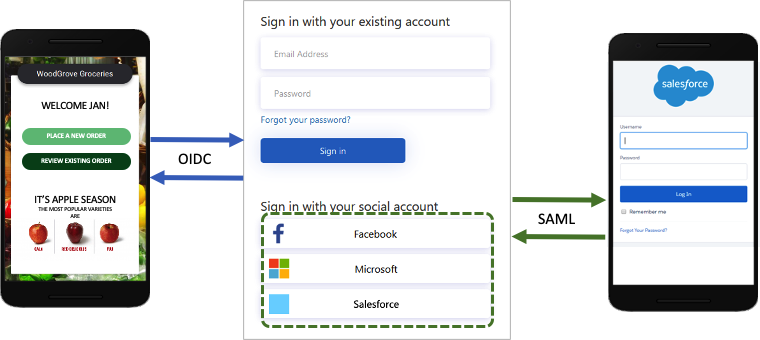
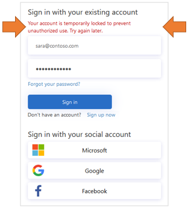

# Technical and feature overview of Azure Active Directory B2C

A companion to [About Azure Active Directory B2C](overview.md), this article provides a more in-depth introduction to the service. Discussed here are the primary resources you work with in the service, its features. Learn how these features enable you to provide a fully custom identity experience for your customers in your applications.

## Azure AD B2C tenant

In Azure Active Directory B2C (Azure AD B2C), a *tenant* represents your organization and is a directory of users. Each Azure AD B2C tenant is distinct and separate from other Azure AD B2C tenants. An Azure AD B2C tenant is different than a Microsoft Entra tenant, which you may already have.

The primary resources you work with in an Azure AD B2C tenant are:

* **Directory** - The *directory* is where Azure AD B2C stores your users' credentials, profile data, and your application registrations.
* **Application registrations** - Register your web, mobile, and native applications with Azure AD B2C to enable identity management. You can also register any APIs you want to protect with Azure AD B2C.
* **User flows** and **custom policies** - Create identity experiences for your applications with built-in user flows and fully configurable custom policies:
  * **User flows** help you quickly enable common identity tasks like sign-up, sign-in, and profile editing.
  * **Custom policies** let you build complex identity workflows unique to your organization, customers, employees, partners, and citizens.
* **Sign-in options** - Azure AD B2C offers various [sign-up and sign-in options](sign-in-options.md) for users of your applications:
  * **Username, email, and phone sign-in** - Configure your Azure AD B2C local accounts to allow sign-up and sign-in with a username, email address, phone number, or a combination of methods.
  * **Social identity providers** - Federate with social providers like Facebook, LinkedIn, or Twitter.
  * **External identity providers** - Federate with standard identity protocols like OAuth 2.0, OpenID Connect, and more.
* **Keys** - Add and manage encryption keys for signing and validating tokens, client secrets, certificates, and passwords.

An Azure AD B2C tenant is the first resource you need to create to get started with Azure AD B2C. Learn how to:

* [Create an Azure Active Directory B2C tenant](tutorial-create-tenant.md).
* [Manage your Azure AD B2C tenant](tenant-management-manage-administrator.md)

## Accounts in Azure AD B2C

Azure AD B2C defines several types of user accounts. Microsoft Entra ID, Microsoft Entra B2B, and Azure Active Directory B2C share these account types.

* **Work account** - Users with work accounts can manage resources in a tenant, and with an administrator role, can also manage tenants. Users with work accounts can create new consumer accounts, reset passwords, block/unblock accounts, and set permissions or assign an account to a security group.
* **Guest account** - External users you invite to your tenant as guests. A typical scenario for inviting a guest user to your Azure AD B2C tenant is to share administration responsibilities.
* **Consumer account** - Accounts that are managed by Azure AD B2C user flows and custom policies.

:::image type="content" source="media/technical-overview/portal-01-users.png" alt-text="Screenshot of the Azure AD B2C user management page in the Azure portal."::: *Figure: User directory within an Azure AD B2C tenant in the Azure portal.*

### Consumer accounts

With a *consumer* account, users can sign in to the applications that you've secured with Azure AD B2C. Users with consumer accounts can't, however, access Azure resources, for example the Azure portal.

A consumer account can be associated with these identity types:

* **Local** identity, with the username and password stored locally in the Azure AD B2C directory. We often refer to these identities as "local accounts."
* **Social** or **enterprise** identities, where the identity of the user is managed by a federated identity provider. For example, Facebook, Google, Microsoft, ADFS, or Salesforce.

A user with a consumer account can sign in with multiple identities. For example username, email, employee ID, government ID, and others. A single account can have multiple identities, both local and social.

:::image type="content" source="media/technical-overview/identities.png" alt-text="Consumer account identities."::: *Figure: A single consumer account with multiple identities in Azure AD B2C*

For more information, see [Overview of user accounts in Azure Active Directory B2C](user-overview.md).

## Local account sign-in options

Azure AD B2C provides various ways in which you can authenticate a user. Users can sign-in to a local account, by using username and password, phone verification (also known as password-less authentication). Email sign-up is enabled by default in your local account identity provider settings.

Learn more about [sign-in options](sign-in-options.md) or how to [set up the local account identity provider](identity-provider-local.md).

## User profile attributes

Azure AD B2C lets you manage common attributes of consumer account profiles. For example display name, surname, given name, city, and others.

You can also extend the Microsoft Entra schema to store additional information about your users. For example, their country/region of residency, preferred language, and preferences like whether they want to subscribe to a newsletter or enable multifactor authentication. For more information, see:

* [User profile attributes](user-profile-attributes.md)
* [Add user attributes and customize user input in](configure-user-input.md)

## Sign-in with external identity providers

You can configure Azure AD B2C to allow users to sign in to your application with credentials from social and enterprise identity providers. Azure AD B2C can federate with identity providers that support OAuth 1.0, OAuth 2.0, OpenID Connect, and SAML protocols. For example, Facebook, Microsoft account, Google, Twitter, and AD-FS.

:::image type="content" source="media/technical-overview/external-idps.png" alt-text="Diagram showing company logos for a sample of external identity providers.":::

With external identity providers, you can offer your consumers the ability to sign in with their existing social or enterprise accounts, without having to create a new account just for your application.

On the sign-up or sign-in page, Azure AD B2C presents a list of external identity providers the user can choose for sign-in. Once they select one of the external identity providers, they're redirected to the selected provider's website to complete the sign in process. After the user successfully signs in, they're returned to Azure AD B2C for authentication of the account in your application.

:::image type="content" source="media/technical-overview/external-idp.png" alt-text="Diagram showing a mobile sign-in example with a social account (Facebook).":::

To see how to add identity providers in Azure AD B2C, see [Add identity providers to your applications in Azure Active Directory B2C](add-identity-provider.md).

## Identity experiences: user flows or custom policies

In Azure AD B2C, you can define the business logic that users follow to gain access to your application. For example, you can determine the sequence of steps users follow when they sign in, sign up, edit a profile, or reset a password. After completing the sequence, the user acquires a token and gains access to your application.

In Azure AD B2C, there are two ways to provide identity user experiences:

* **User flows** are predefined, built-in, configurable policies that we provide so you can create sign-up, sign-in, and policy editing experiences in minutes.

* **Custom policies** enable you to create your own user journeys for complex identity experience scenarios.

The following screenshot shows the user flow settings UI, versus custom policy configuration files.

:::image type="content" source="media/technical-overview/user-flow-vs-custom-policy.png" alt-text="Screenshot showing the user flow settings UI versus a custom policy configuration file.":::

Read the [User flows and custom policies overview](user-flow-overview.md) article. It gives an overview of user flows and custom policies, and helps you decide which method will work best for your business needs.

## User interface

In Azure AD B2C, you can craft your users' identity experiences so that the pages shown blend seamlessly with the look and feel of your brand. You get nearly full control of the HTML and CSS content presented to your users when they proceed through your application's identity journeys. With this flexibility, you can maintain brand and visual consistency between your application and Azure AD B2C.

> [!NOTE]
> Customizing the pages rendered by third parties when using social accounts is limited to the options provided by that identity provider, and are outside the control of Azure AD B2C.

For information on UI customization, see:

* [Customize the user interface](customize-ui.md)
* [Customize the user interface with HTML templates](customize-ui-with-html.md)
* [Enable JavaScript and select a page layout version](javascript-and-page-layout.md)

## Custom domain

You can customize your Azure AD B2C domain in the redirect URIs for your application. Custom domain allows you to create a seamless experience so that the pages that are shown blend seamlessly with the domain name of your application. From the user's perspective, they remain in your domain during the sign-in process rather than redirecting to the Azure AD B2C default domain .b2clogin.com. 

For more information, see [Enable custom domains](custom-domain.md).
 
## Localization

Language customization in Azure AD B2C allows you to accommodate different languages to suit your customer needs. Microsoft provides the translations for 36 languages, but you can also provide your own translations for any language. 

:::image type="content" source="media/technical-overview/localization.png" alt-text="Screenshot of three sign in pages showing UI text in different languages.":::

See how localization works in [Language customization in Azure Active Directory B2C](language-customization.md).

## Email verification

Azure AD B2C ensures valid email addresses by requiring customers to verify them during the sign-up, and password reset flows. It also prevents malicious actors from using automated processes to generate fraudulent accounts in your applications.

:::image type="content" source="media/technical-overview/email-verification.png" alt-text="Screenshots showing the process for email verification.":::

You can customize the email to users that sign up to use your applications. By using the third-party email provider, you can use your own email template and From: address and subject, as well as support localization and custom one-time password (OTP) settings. For more information, see:

* [Custom email verification with Mailjet](custom-email-mailjet.md)
* [Custom email verification with SendGrid](custom-email-sendgrid.md)

## Add your own business logic and call RESTful APIs

You can integrate with a RESTful API in both user flows and custom policies. The difference is, in user flows, you make calls at specified places, whereas in custom policies, you add your own business logic to the journey. This feature allows you to retrieve and use data from external identity sources. Azure AD B2C can exchange data with a RESTful service to:

* Display custom user-friendly error messages.
* Validate user input to prevent malformed data from persisting in your user directory. For example, you can modify the data entered by the user, such as capitalizing their first name if they entered it in all lowercase.
* Enrich user data by further integrating with your corporate line-of-business application.
* Using RESTful calls, you can send push notifications, update corporate databases, run a user migration process, manage permissions, audit databases, and more.

Loyalty programs are another scenario enabled by Azure AD B2C's support for calling REST APIs. For example, your RESTful service can receive a user's email address, query your customer database, then return the user's loyalty number to Azure AD B2C. 

The return data can be stored in the user's directory account in Azure AD B2C. The data then can be further evaluated in subsequent steps in the policy, or be included in the access token.

:::image type="content" source="media/technical-overview/lob-integration.png" alt-text="Diagram showing line-of-business integration in a mobile application.":::

You can add a REST API call at any step in a user journey defined by a custom policy. For example, you can call a REST API:

* During sign-in, just before Azure AD B2C validates the credentials
* Immediately after sign-in
* Before Azure AD B2C creates a new account in the directory
* After Azure AD B2C creates a new account in the directory
* Before Azure AD B2C issues an access token

For more information, see [Integrate REST API claims exchanges in your Azure AD B2C custom policy](api-connectors-overview.md).

## Protocols and tokens

- For applications, Azure AD B2C supports the [OAuth 2.0](protocols-overview.md), [OpenID Connect](openid-connect.md), and [SAML protocols](saml-service-provider.md) for user journeys. Your application starts the user journey by issuing authentication requests to Azure AD B2C. The result of a request to Azure AD B2C is a security token, such as an [ID token, access token](tokens-overview.md), or SAML token. This security token defines the user's identity within the application.

- For external identities, Azure AD B2C supports federation with any OAuth 1.0, OAuth 2.0, OpenID Connect, and SAML identity providers.

The following diagram shows how Azure AD B2C can communicate using various protocols within the same authentication flow:

:::image type="content" source="media/technical-overview/protocols.png" alt-text="Diagram of OIDC-based client app federating with a SAML-based IdP.":::

1. The relying party application starts an authorization request to Azure AD B2C using OpenID Connect.
1. When a user of the application chooses to sign in using an external identity provider that uses the SAML protocol, Azure AD B2C invokes the SAML protocol to communicate with that identity provider.
1. After the user completes the sign-in operation with the external identity provider, Azure AD B2C then returns the token to the relying party application using OpenID Connect.

## Application integration

When a user wants to sign in to your application, the application initiates an authorization request to a user-flow or custom policy-provided endpoint. The user flow or custom policy defines and controls the user's experience. When they complete a user flow, for example the *sign up or sign in* flow, Azure AD B2C generates a token, then redirects the user back to your application. This token is specific to Azure AD B2C and is not to be confused with the token issued by third-party identity providers when using social accounts. For information about how to use third-party tokens, see [Pass an identity provider access token to your application in Azure Active Directory B2C](idp-pass-through-user-flow.md).

:::image type="content" source="media/technical-overview/app-integration.png" alt-text="Mobile app with arrows showing flow between Azure AD B2C sign-in page.":::

Multiple applications can use the same user flow or custom policy. A single application can use multiple user flows or custom policies.

For example, to sign in to an application, the application uses the *sign up or sign in* user flow. After the user has signed in, they may want to edit their profile, so the application initiates another authorization request, this time using the *profile edit* user flow.

## Multifactor authentication (MFA)

Azure AD B2C Multi-Factor Authentication (MFA) helps safeguard access to data and applications while maintaining simplicity for your users. It provides extra security by requiring a second form of authentication, and delivers strong authentication by offering a range of easy-to-use authentication methods. 

Your users may or may not be challenged for MFA based on configuration decisions that you can make as an administrator.

For more information, see [Enable multifactor authentication in Azure Active Directory B2C](multi-factor-authentication.md).

## Conditional Access

Microsoft Entra ID Protection risk-detection features, including risky users and risky sign-ins, are automatically detected and displayed in your Azure AD B2C tenant. You can create Conditional Access policies that use these risk detections to determine remediation actions and enforce organizational policies. 

:::image type="content" source="media/technical-overview/conditional-access-flow.png" alt-text="Diagram showing conditional access flow.":::

Azure AD B2C evaluates each sign-in event and ensures that all policy requirements are met before granting the user access. Risky users or sign-ins may be blocked, or challenged with a specific remediation like multifactor authentication (MFA). For more information, see [Identity Protection and Conditional Access](conditional-access-identity-protection-overview.md).

## Password complexity

During sign up or password reset, your users must supply a password that meets complexity rules. By default, Azure AD B2C enforces a strong password policy. Azure AD B2C also provides configuration options for specifying the complexity requirements of the passwords your customers use when they use local accounts.

:::image type="content" source="media/technical-overview/password-complexity.png" alt-text="Screenshot of UI for password complexity experience.":::

For more information, see [Configure complexity requirements for passwords in Azure AD B2C](password-complexity.md).

## Force password reset

As an Azure AD B2C tenant administrator, you can [reset a user's password](manage-users-portal.md#reset-a-users-password) if the user forgets their password. Or you would like to force them to reset the password periodically. For more information, see [Set up a force password reset flow](force-password-reset.md).

:::image type="content" source="media/technical-overview/force-password-reset-flow.png" alt-text="Force password reset flow.":::

## Smart account lockout

To prevent brute-force password guessing attempts, Azure AD B2C uses a sophisticated strategy to lock accounts based on the IP of the request, the passwords entered, and several other factors. The duration of the lockout is automatically increased based on risk and the number of attempts.

:::image type="content" source="media/technical-overview/smart-lockout1.png" alt-text="Screenshot of UI for account lockout with arrows highlighting the lockout notification.":::

For more information about managing password protection settings, see [Mitigate credential attacks in Azure AD B2C](threat-management.md).

## Protect resources and customer identities

Azure AD B2C complies with the security, privacy, and other commitments described in the [Microsoft Azure Trust Center](https://www.microsoft.com/trustcenter/cloudservices/azure).

Sessions are modeled as encrypted data, with the decryption key known only to the Azure AD B2C Security Token Service. A strong encryption algorithm, AES-192, is used. All communication paths are protected with TLS for confidentiality and integrity. Our Security Token Service uses an Extended Validation (EV) certificate for TLS. In general, the Security Token Service mitigates cross-site scripting (XSS) attacks by not rendering untrusted input.

:::image type="content" source="media/technical-overview/user-data.png" alt-text="Diagram of secure data in transit and at rest.":::

### Access to user data

Azure AD B2C tenants share many characteristics with enterprise Microsoft Entra tenants used for employees and partners. Shared aspects include mechanisms for viewing administrative roles, assigning roles, and auditing activities. 

You can assign roles to control who can perform certain administrative actions in Azure AD B2C, including:

* Create and manage all aspects of user flows
* Create and manage the attribute schema available to all user flows
* Configure identity providers for use in direct federation
* Create and manage trust framework policies in the Identity Experience Framework (custom policies)
* Manage secrets for federation and encryption in the Identity Experience Framework (custom policies)

For more information about Microsoft Entra roles, including Azure AD B2C administration role support, see [Administrator role permissions in Microsoft Entra ID](../active-directory/roles/permissions-reference.md).

## Auditing and logs

Azure AD B2C emits audit logs containing activity information about its resources, issued tokens, and administrator access. You can use the audit logs to understand platform activity and  diagnose issues. Audit log entries are available soon after the activity that generated the event occurs.

In an audit log, which is available for your Azure AD B2C tenant or for a particular user, you can find information including:

* Activities concerning the authorization of a user to access B2C resources (for example, an administrator accessing a list of B2C policies)
* Activities related to directory attributes retrieved when an administrator signs in using the Azure portal
* Create, read, update, and delete (CRUD) operations on B2C applications
* CRUD operations on keys stored in a B2C key container
* CRUD operations on B2C resources (for example, policies and identity providers)
* Validation of user credentials and token issuance

:::image type="content" source="media/technical-overview/audit-log.png" alt-text="Individual user audit log shown in the Azure portal.":::

For more information on audit logs, see [Accessing Azure AD B2C audit logs](view-audit-logs.md).

## Usage analytics

Azure AD B2C allows you to discover when people sign up or sign in to your app, where the users are located, and what browsers and operating systems they use. 

By integrating Azure Application Insights into Azure AD B2C custom policies, you can gain insight into how people sign up, sign in, reset their password or edit their profile. With such knowledge, you can make data-driven decisions for your upcoming development cycles.

For more information, see [Track user behavior in Azure Active Directory B2C using Application Insights](analytics-with-application-insights.md).

## Region availability and data residency
Azure AD B2C service is generally available worldwide with the option for data residency in regions as specified in [Products available by region](https://azure.microsoft.com/regions/services/). Data residency is determined by the country/region you select when you [create your tenant](tutorial-create-tenant.md). 

Learn more about [Azure Active Directory B2C service Region availability & data residency](data-residency.md) and [Service Level Agreement (SLA) for Azure Active Directory B2C](https://azure.microsoft.com/support/legal/sla/active-directory-b2c/v1_1).

## Automation using Microsoft Graph API

Use MS graph API to manage your Azure AD B2C directory. You can also create the Azure AD B2C directory itself. You can manage users, identity providers, user flows, custom policies and many more. 

Learn more about how to [Manage Azure AD B2C with Microsoft Graph](microsoft-graph-operations.md). 

## Azure AD B2C service limits and restrictions
Learn more about [Azure AD B2C service limits and restrictions](service-limits.md)

## Next steps

Now that you have deeper view into the features and technical aspects of Azure Active Directory B2C:
- Get started with our [tutorial for creating an Azure Active Directory B2C tenant](tutorial-create-tenant.md).
- [Set up sign in for a single-page app using Azure Active Directory B2C](quickstart-single-page-app.md)
- [Azure Active Directory B2C concepts](application-types.md) 
