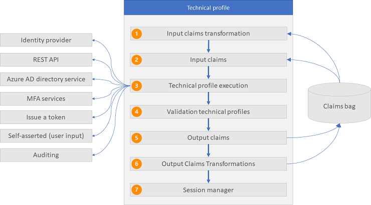

# About technical profiles in Azure Active Directory B2C custom policies

[!INCLUDE [active-directory-b2c-advanced-audience-warning](../../includes/active-directory-b2c-advanced-audience-warning.md)]

A technical profile provides a framework with a built-in mechanism to communicate with different type of parties using a custom policy in Azure Active Directory B2C (Azure AD B2C). Technical profiles are used to communicate with your Azure AD B2C tenant, to create a user, or read a user profile. A technical profile can be self-asserted to enable interaction with the user. For example, collect the user's credential to sign in and then render the sign-up page or password reset page.

## Type of technical profiles

A technical profile enables these types of scenarios:

- [Application Insights](application-insights-technical-profile.md) - Sending event data to [Application Insights](../azure-monitor/app/app-insights-overview.md).
- [Azure Active Directory](active-directory-technical-profile.md) - Provides support for the Azure Active Directory B2C user management.
- [Azure Multi-Factor Authentication](multi-factor-auth-technical-profile.md) -  provides support for verifying a phone number by using Azure Multi-Factor Authentication (MFA). 
- [Claims transformation](claims-transformation-technical-profile.md) - Call output claims transformations to manipulate claims values, validate claims, or set default values for a set of output claims.
- [JWT token issuer](jwt-issuer-technical-profile.md) -  Emits a JWT token that is returned back to the relying party application.
- [OAuth1](oauth1-technical-profile.md) - Federation with any OAuth 1.0 protocol identity provider.
- [OAuth2](oauth2-technical-profile.md) - Federation with any OAuth 2.0 protocol identity provider.
- [One time password](one-time-password-technical-profile.md) - Provides support for managing the generation and verification of a one-time password.
- [OpenID Connect](openid-connect-technical-profile.md) - Federation with any OpenID Connect protocol identity provider.
- [Phone factor](phone-factor-technical-profile.md) - Support for enrolling and verifying phone numbers.
- [RESTful provider](restful-technical-profile.md) - Call to REST API services, such as validate user input, enrich user data, or integrate with line-of-business applications.
- [SAML identity provider](saml-identity-provider-technical-profile.md) - Federation with any SAML protocol identity provider.
- [SAML token issuer](saml-issuer-technical-profile.md) - Emits a SAML token that is returned back to the relying party application.
- [Self-Asserted](self-asserted-technical-profile.md) - Interact with the user. For example, collect the user's credential to sign in, render the sign-up page, or password reset.
- [Session management](custom-policy-reference-sso.md) - Handle different types of sessions.

## Technical profile flow

All types of technical profiles share the same concept. You send input claims, run claims transformation, and communicate with the configured party, such as an identity provider, REST API, or Azure AD directory services. After the process is completed, the technical profile returns the output claims and may run output claims transformation. The following diagram shows how the transformations and mappings referenced in the technical profile are processed. Regardless of the party the technical profile interacts with, after any claims transformation is executed, the output claims from the technical profile are immediately stored in the claims bag.



1. **Single sign-on (SSO) session management** - Restores technical profile's session state, using [SSO session management](custom-policy-reference-sso.md).
1. **Input claims transformation** - Input claims of every  input [claims transformation](claimstransformations.md) are picked up from the claims bag.  The output claims of an input claims transformation can be input claims of a subsequent input claims transformation.
1. **Input claims** - Claims are picked up from the claims bag and are used for the technical profile. For example, a [self-asserted technical profile](self-asserted-technical-profile.md) uses the input claims to prepopulate the output claims that the user provides. A REST API technical profile uses the input claims to send input parameters to the REST API endpoint. Azure Active Directory uses input claim as a unique identifier to read, update, or delete an account.
1. **Technical profile execution** - The technical profile exchanges the claims with the configured party. For example:
    - Redirect the user to the identity provider to complete the sign-in. After successful sign-in, the user returns back and the technical profile execution continues.
    - Call a REST API while sending parameters as InputClaims and getting information back as OutputClaims.
    - Create or update the user account.
    - Sends and verifies the MFA text message.
1. **Validation technical profiles** - A [self-asserted technical profile](self-asserted-technical-profile.md) can call [validation technical profiles](validation-technical-profile.md). The validation technical profile validates the data profiled by the user and returns an error message or Ok, with or without output claims. For example, before Azure AD B2C creates a new account, it checks whether the user already exists in the directory services. You can call a REST API technical profile to add your own business logic.<p>The scope of the output claims of a validation technical profile is limited to the technical profile that invokes the validation technical profile. and other validation technical profiles under same technical profile. If you want to use the output claims in the next orchestration step, you need to add the output claims to the technical profile that invokes the validation technical profile.
1. **Output claims** - Claims are returned back to the claims bag. You can use those claims in the next orchestrations step, or output claims transformations.
1. **Output claims transformations** - Input claims of every output [claims transformation](claimstransformations.md) are picked up from the claims bag. The output claims of the technical profile from the previous steps can be input claims of an output claims transformation. After execution, the output claims are put back in the claims bag. The output claims of an output claims transformation can also be input claims of a subsequent output claims transformation.
1. **Single sign-on (SSO) session management** - Persists technical profile's data to the session, using [SSO session management](custom-policy-reference-sso.md).


## Technical profile inclusion

A technical profile can include another technical profile to change settings or add new functionality.  The `IncludeTechnicalProfile` element is a reference to the base technical profile from which a technical profile is derived. There is no limit on the number of levels.

For example, the **AAD-UserReadUsingAlternativeSecurityId-NoError** technical profile includes the **AAD-UserReadUsingAlternativeSecurityId**. This technical profile sets the `RaiseErrorIfClaimsPrincipalDoesNotExist` metadata item to `true`, and raises an error if a social account does not exist in the directory. **AAD-UserReadUsingAlternativeSecurityId-NoError** overrides this behavior, and disables that error message.

```XML
<TechnicalProfile Id="AAD-UserReadUsingAlternativeSecurityId-NoError">
  <Metadata>
    <Item Key="RaiseErrorIfClaimsPrincipalDoesNotExist">false</Item>
  </Metadata>
  <IncludeTechnicalProfile ReferenceId="AAD-UserReadUsingAlternativeSecurityId" />
</TechnicalProfile>
```

**AAD-UserReadUsingAlternativeSecurityId** includes the `AAD-Common` technical profile.

```XML
<TechnicalProfile Id="AAD-UserReadUsingAlternativeSecurityId">
  <Metadata>
    <Item Key="Operation">Read</Item>
    <Item Key="RaiseErrorIfClaimsPrincipalDoesNotExist">true</Item>
    <Item Key="UserMessageIfClaimsPrincipalDoesNotExist">User does not exist. Please sign up before you can sign in.</Item>
  </Metadata>
  <InputClaims>
    <InputClaim ClaimTypeReferenceId="AlternativeSecurityId" PartnerClaimType="alternativeSecurityId" Required="true" />
  </InputClaims>
  <OutputClaims>
    <OutputClaim ClaimTypeReferenceId="objectId" />
    <OutputClaim ClaimTypeReferenceId="userPrincipalName" />
    <OutputClaim ClaimTypeReferenceId="displayName" />
    <OutputClaim ClaimTypeReferenceId="otherMails" />
    <OutputClaim ClaimTypeReferenceId="givenName" />
    <OutputClaim ClaimTypeReferenceId="surname" />
  </OutputClaims>
  <IncludeTechnicalProfile ReferenceId="AAD-Common" />
</TechnicalProfile>
```

Both **AAD-UserReadUsingAlternativeSecurityId-NoError** and  **AAD-UserReadUsingAlternativeSecurityId** don't specify the required **Protocol** element, because it's specified in the **AAD-Common** technical profile.

```XML
<TechnicalProfile Id="AAD-Common">
  <DisplayName>Azure Active Directory</DisplayName>
  <Protocol Name="Proprietary" Handler="Web.TPEngine.Providers.AzureActiveDirectoryProvider, Web.TPEngine, Version=1.0.0.0, Culture=neutral, PublicKeyToken=null" />
  ...
</TechnicalProfile>
```
