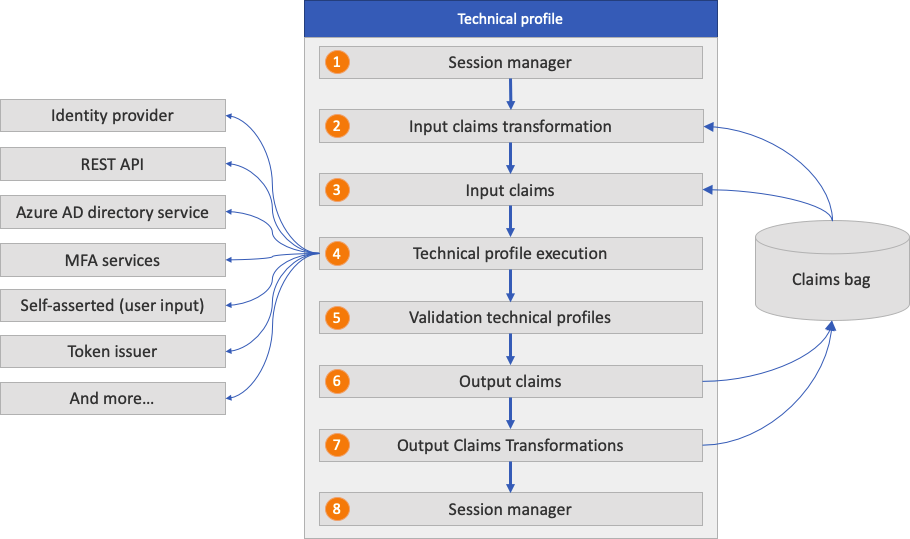
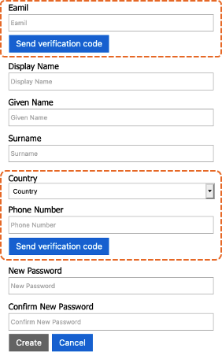
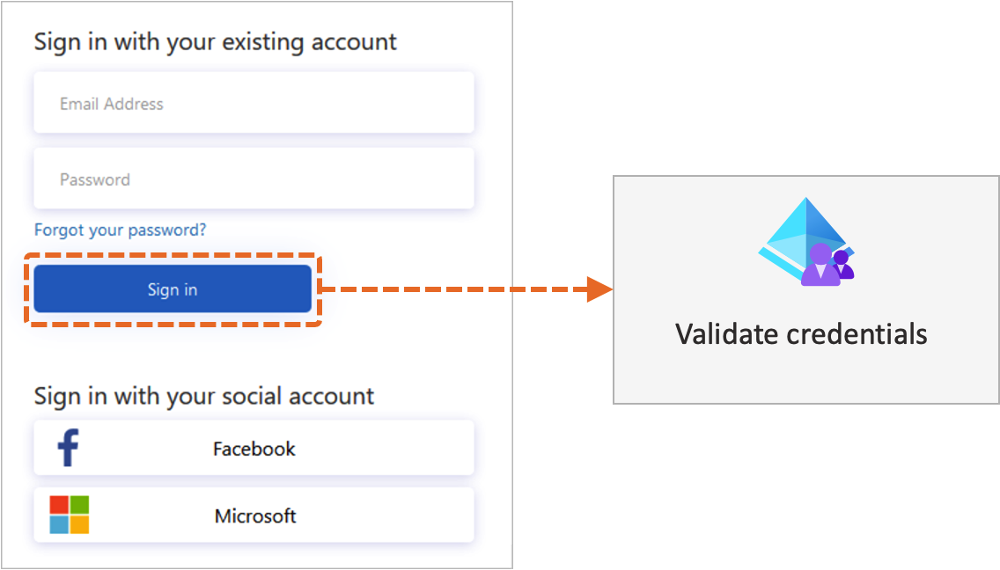

# Technical profiles

[!INCLUDE [active-directory-b2c-advanced-audience-warning](../../includes/active-directory-b2c-advanced-audience-warning.md)]

A *technical profile* provides a framework with a built-in mechanism to communicate with different types of parties. Technical profiles are used to communicate with your Azure Active Directory B2C (Azure AD B2C) tenant to create a user or read a user profile. A technical profile can be self-asserted to enable interaction with the user. For example, a technical profile can collect the user's credential to sign in and then render the sign-up page or password reset page.

## Types of technical profiles

A technical profile enables these types of scenarios:

- [Application Insights](analytics-with-application-insights.md): Sends event data to [Application Insights](../azure-monitor/app/app-insights-overview.md).
- [Microsoft Entra ID](active-directory-technical-profile.md): Provides support for the Azure AD B2C user management.
- [Microsoft Entra multifactor authentication](multi-factor-auth-technical-profile.md): Provides support for verifying a phone number by using Microsoft Entra multifactor authentication.
- [Claims transformation](claims-transformation-technical-profile.md): Calls output claims transformations to manipulate claims values, validate claims, or set default values for a set of output claims.
- [ID token hint](id-token-hint.md): Validates the `id_token_hint` JWT token signature, the issuer name, and the token audience, and extracts the claim from the inbound token.
- [JWT token issuer](jwt-issuer-technical-profile.md): Emits a JWT token that's returned back to the relying party application.
- [OAuth1](oauth1-technical-profile.md): Federation with any OAuth 1.0 protocol identity provider.
- [OAuth2](oauth2-technical-profile.md): Federation with any OAuth 2.0 protocol identity provider.
- [One-time password](one-time-password-technical-profile.md): Provides support for managing the generation and verification of a one-time password.
- [OpenID Connect](openid-connect-technical-profile.md): Federation with any OpenID Connect protocol identity provider.
- [Phone factor](phone-factor-technical-profile.md): Supports enrolling and verifying phone numbers.
- [RESTful provider](restful-technical-profile.md): Calls REST API services, such as validating user input, enriching user data, or integrating with line-of-business applications.
- [SAML identity provider](identity-provider-generic-saml.md): Federation with any SAML protocol identity provider.
- [SAML token issuer](saml-service-provider.md): Emits a SAML token that's returned back to the relying party application.
- [Self-asserted](self-asserted-technical-profile.md): Interacts with the user. For example, collects the user's credential to sign in, render the sign-up page, or reset password.
- [Session management](custom-policy-reference-sso.md): Handles different types of sessions.

## Technical profile flow

All types of technical profiles share the same concept. They start by reading the input claims and run claims transformations. Then they communicate with the configured party, such as an identity provider, REST API, or Microsoft Entra directory services. After the process is completed, the technical profile returns the output claims and might run output claims transformations. The following diagram shows how the transformations and mappings referenced in the technical profile are processed. After the claims transformation is executed, the output claims are immediately stored in the claims bag, regardless of the party the technical profile interacts with.



1. **Single sign-on (SSO) session management**: Restores the technical profile's session state by using [SSO session management](custom-policy-reference-sso.md).
1. **Input claims transformation**: Before the technical profile is started, Azure AD B2C runs input [claims transformation](claimstransformations.md).
1. **Input claims**: Claims are picked up from the claims bag that are used for the technical profile.
1. **Technical profile execution**: The technical profile exchanges the claims with the configured party. For example:
    - Redirects the user to the identity provider to complete the sign-in. After successful sign-in, the user returns back and the technical profile execution continues.
    - Calls a REST API while sending parameters as InputClaims and getting information back as OutputClaims.
    - Creates or updates the user account.
    - Sends and verifies the multifactor authentication text message.
1. **Validation technical profiles**: A [self-asserted technical profile](self-asserted-technical-profile.md) can call [validation technical profiles](validation-technical-profile.md) to validate the data profiled by the user.
1. **Output claims**: Claims are returned back to the claims bag. You can use those claims in the next orchestrations step or output claims transformations.
1. **Output claims transformations**: After the technical profile is completed, Azure AD B2C runs output [claims transformations](claimstransformations.md).
1. **SSO session management**: Persists the technical profile's data to the session by using [SSO session management](custom-policy-reference-sso.md).

A **TechnicalProfiles** element contains a set of technical profiles supported by the claims provider. Every claims provider must have at least one technical profile. The technical profile determines the endpoints and the protocols needed to communicate with the claims provider. A claims provider can have multiple technical profiles.

```xml
<ClaimsProvider>
  <DisplayName>Display name</DisplayName>
  <TechnicalProfiles>
    <TechnicalProfile Id="Technical profile identifier">
      <DisplayName>Display name of technical profile</DisplayName>
      <Protocol Name="Proprietary" Handler="Web.TPEngine.Providers.RestfulProvider, Web.TPEngine, Version=1.0.0.0, Culture=neutral, PublicKeyToken=null" />
      <Metadata>
        ...
      </Metadata>
      ...
    </TechnicalProfile>
  </TechnicalProfiles>
</ClaimsProvider>
```

The **TechnicalProfile** element contains the following attribute:

| Attribute | Required | Description |
|---------|---------|---------|
| Id | Yes | A unique identifier of the technical profile. The technical profile can be referenced by using this identifier from other elements in the policy file. Examples are **OrchestrationSteps** and **ValidationTechnicalProfile**. |

The **TechnicalProfile** element contains the following elements:

| Element | Occurrences | Description |
| ------- | ----------- | ----------- |
| Domain | 0:1 | The domain name for the technical profile. For example, if your technical profile specifies the Facebook identity provider, the domain name is Facebook.com. |
| DisplayName | 1:1 | The display name of the technical profile. |
| Description | 0:1 | The description of the technical profile. |
| Protocol | 1:1 | The protocol used for the communication with the other party. |
| Metadata | 0:1 | A set of keys and values that controls the behavior of the technical profile. |
| InputTokenFormat | 0:1 | The format of the input token. Possible values are `JSON`, `JWT`, `SAML11`, or `SAML2`. The `JWT` value represents a JSON Web Token per the IETF specification. The `SAML11` value represents a SAML 1.1 security token per the OASIS specification. The `SAML2` value represents a SAML 2.0 security token per the OASIS specification. |
| OutputTokenFormat | 0:1 | The format of the output token. Possible values are `JSON`, `JWT`, `SAML11`, or `SAML2`. |
| CryptographicKeys | 0:1 | A list of cryptographic keys that are used in the technical profile. |
| InputClaimsTransformations | 0:1 | A list of previously defined references to claims transformations that should be executed before any claims are sent to the claims provider or the relying party. |
| InputClaims | 0:1 | A list of previously defined references to claim types that are taken as input in the technical profile. |
| PersistedClaims | 0:1 | A list of previously defined references to claim types that will be persisted by the technical profile. |
| DisplayClaims | 0:1 | A list of previously defined references to claim types that are presented by the [self-asserted technical profile](self-asserted-technical-profile.md). The DisplayClaims feature is currently in preview. |
| OutputClaims | 0:1 | A list of previously defined references to claim types that are taken as output in the technical profile. |
| OutputClaimsTransformations | 0:1 | A list of previously defined references to claims transformations that should be executed after the claims are received from the claims provider. |
| ValidationTechnicalProfiles | 0:n | A list of references to other technical profiles that the technical profile uses for validation purposes. For more information, see [Validation technical profile](validation-technical-profile.md).|
| SubjectNamingInfo | 0:1 | Controls the production of the subject name in tokens where the subject name is specified separately from claims. Examples are OAuth or SAML. |
| IncludeInSso | 0:1 | Whether usage of this technical profile should apply SSO behavior for the session or instead require explicit interaction. This element is valid only in SelfAsserted profiles used within a validation technical profile. Possible values are `true` (default) or `false`. |
| IncludeClaimsFromTechnicalProfile | 0:1 | An identifier of a technical profile from which you want all of the input and output claims to be added to this technical profile. The referenced technical profile must be defined in the same policy file. |
| IncludeTechnicalProfile |0:1 | An identifier of a technical profile from which you want all data to be added to this technical profile. |
| UseTechnicalProfileForSessionManagement | 0:1 | A different technical profile to be used for session management. |
|EnabledForUserJourneys| 0:1 |Controls if the technical profile is executed in a user journey. |

## Protocol

The **Protocol** element specifies the protocol to be used for the communication with the other party. The **Protocol** element contains the following attributes:

| Attribute | Required | Description |
| --------- | -------- | ----------- |
| Name | Yes | The name of a valid protocol supported by Azure AD B2C that's used as part of the technical profile. Possible values are `OAuth1`, `OAuth2`, `SAML2`, `OpenIdConnect`, `Proprietary`, or `None`. |
| Handler | No | When the protocol name is set to `Proprietary`, specifies the name of the assembly that's used by Azure AD B2C to determine the protocol handler. If you set the protocol *Name* attribute to `None`, do not include the *Handler* attribute.|

## Metadata

The **Metadata** element contains the relevant configuration options to a specific protocol. The list of supported metadata is documented in the corresponding [technical profile](#types-of-technical-profiles) specification. A **Metadata** element contains the following element:

| Element | Occurrences | Description |
| ------- | ----------- | ----------- |
| Item | 0:n | The metadata that relates to the technical profile. Each type of technical profile has a different set of metadata items. For more information, see the technical profile types section. |

### Item

The **Item** element of the **Metadata** element contains the following attribute:

| Attribute | Required | Description |
| --------- | -------- | ----------- |
| Key | Yes | The metadata key. See each [technical profile type](#types-of-technical-profiles) for the list of metadata items. |

The following example illustrates the use of metadata relevant to the [OAuth2 technical profile](oauth2-technical-profile.md).

```xml
<TechnicalProfile Id="Facebook-OAUTH">
  ...
  <Metadata>
    <Item Key="ProviderName">facebook</Item>
    <Item Key="authorization_endpoint">https://www.facebook.com/dialog/oauth</Item>
    <Item Key="AccessTokenEndpoint">https://graph.facebook.com/oauth/access_token</Item>
    <Item Key="HttpBinding">GET</Item>
    <Item Key="UsePolicyInRedirectUri">0</Item>
    ...
  </Metadata>
  ...
</TechnicalProfile>
```

The following example illustrates the use of metadata relevant to the [REST API technical profile](restful-technical-profile.md#metadata).

```xml
<TechnicalProfile Id="REST-Validate-Email">
  ...
  <Metadata>
    <Item Key="ServiceUrl">https://api.sendgrid.com/v3/mail/send</Item>
    <Item Key="AuthenticationType">Bearer</Item>
    <Item Key="SendClaimsIn">Body</Item>
    ...
  </Metadata>
  ...
</TechnicalProfile>
```

## Cryptographic keys

To establish trust with the services it integrates with, Azure AD B2C stores secrets and certificates in the form of [policy keys](policy-keys-overview.md). During the technical profile execution, Azure AD B2C retrieves the cryptographic keys from Azure AD B2C policy keys. Then Azure AD B2C uses the keys to establish trust or encrypt or sign a token. These trusts consist of:

- Federation with [OAuth1](oauth1-technical-profile.md#cryptographic-keys), [OAuth2](oauth2-technical-profile.md#cryptographic-keys), and [SAML](identity-provider-generic-saml.md) identity providers.
- Securing the connection with [REST API services](secure-rest-api.md).
- Signing and encrypting the [JWT](jwt-issuer-technical-profile.md#cryptographic-keys) and [SAML](saml-service-provider.md) tokens.

The **CryptographicKeys** element contains the following element:

| Element | Occurrences | Description |
| ------- | ----------- | ----------- |
| Key | 1:n | A cryptographic key used in this technical profile. |

### Key

The **Key** element contains the following attribute:

| Attribute | Required | Description |
| --------- | -------- | ----------- |
| Id | No | A unique identifier of a particular key pair referenced from other elements in the policy file. |
| StorageReferenceId | Yes | An identifier of a storage key container referenced from other elements in the policy file. |

## Input claims transformations

The **InputClaimsTransformations** element might contain a collection of input claims transformation elements that are used to modify input claims or generate new ones.

The output claims of a previous claims transformation in the claims transformation collection can be input claims of a subsequent input claims transformation. In this way, you can have a sequence of claims transformations that depend on each other.

The **InputClaimsTransformations** element contains the following element:

| Element | Occurrences | Description |
| ------- | ----------- | ----------- |
| InputClaimsTransformation | 1:n | The identifier of a claims transformation that should be executed before any claims are sent to the claims provider or the relying party. A claims transformation can be used to modify existing ClaimsSchema claims or generate new ones. |

### InputClaimsTransformation

The **InputClaimsTransformation** element contains the following attribute:

| Attribute | Required | Description |
| --------- | -------- | ----------- |
| ReferenceId | Yes | An identifier of a claims transformation already defined in the policy file or parent policy file. |

The following technical profiles reference the **CreateOtherMailsFromEmail** claims transformation. The claims transformation adds the value of the `email` claim to the `otherMails` collection before persisting the data to the directory.

```xml
<TechnicalProfile Id="AAD-UserWriteUsingAlternativeSecurityId">
  ...
  <InputClaimsTransformations>
    <InputClaimsTransformation ReferenceId="CreateOtherMailsFromEmail" />
  </InputClaimsTransformations>
  <PersistedClaims>
    <PersistedClaim ClaimTypeReferenceId="alternativeSecurityId" />
    <PersistedClaim ClaimTypeReferenceId="userPrincipalName" />
    <PersistedClaim ClaimTypeReferenceId="mailNickName" DefaultValue="unknown" />
    <PersistedClaim ClaimTypeReferenceId="displayName" DefaultValue="unknown" />
    <PersistedClaim ClaimTypeReferenceId="otherMails" />
    <PersistedClaim ClaimTypeReferenceId="givenName" />
    <PersistedClaim ClaimTypeReferenceId="surname" />
  </PersistedClaims>
  ...
</TechnicalProfile>
```

## Input claims

The **InputClaims** element picks up claims from the claims bag that are used for the technical profile. For example, a [self-asserted technical profile](self-asserted-technical-profile.md) uses the input claims to prepopulate the output claims that the user provides. A REST API technical profile uses the input claims to send input parameters to the REST API endpoint. Azure AD B2C uses an input claim as a unique identifier to read, update, or delete an account.

The **InputClaims** element contains the following element:

| Element | Occurrences | Description |
| ------- | ----------- | ----------- |
| InputClaim | 1:n | An expected input claim type. |

### InputClaim

The **InputClaim** element contains the following attributes:

| Attribute | Required | Description |
| --------- | -------- | ----------- |
| ClaimTypeReferenceId | Yes | The identifier of a claim type. The claim is already defined in the claims schema section in the policy file or parent policy file. |
| DefaultValue | No | A default value to use to create a claim if the claim indicated by ClaimTypeReferenceId doesn't exist so that the resulting claim can be used as an InputClaim element by the technical profile. |
|AlwaysUseDefaultValue |No |Forces the use of the default value. |
| PartnerClaimType | No | The identifier of the claim type of the external partner that the specified policy claim type maps to. If the PartnerClaimType attribute isn't specified, the specified policy claim type is mapped to the partner claim type of the same name. Use this property when your claim type name is different from the other party. An example is if the first claim name is *givenName*, while the partner uses a claim named *first_name*. |

## Display claims

The **DisplayClaims** element contains a list of claims to be presented on the screen to collect data from the user. In the display claims collection, you can include a reference to a [claim type](claimsschema.md) or a [display control](display-controls.md) that you've created.

- A claim type is a reference to a claim to be displayed on the screen.
  - To force the user to provide a value for a specific claim, set the **Required** attribute of the **DisplayClaim** element to `true`.
  - To prepopulate the values of display claims, use the input claims that were previously described. The element might also contain a default value.
  - The **ClaimType** element in the **DisplayClaims** collection needs to set the **UserInputType** element to any user input type supported by Azure AD B2C. Examples are `TextBox` or `DropdownSingleSelect`.
- A display control is a user interface element that has special functionality and interacts with the Azure AD B2C back-end service. It allows the user to perform actions on the page that invoke a validation technical profile at the back end. An example is verifying an email address, phone number, or customer loyalty number.

The order of the elements in **DisplayClaims** specifies the order in which Azure AD B2C renders the claims on the screen.

The **DisplayClaims** element contains the following element:

| Element | Occurrences | Description |
| ------- | ----------- | ----------- |
| DisplayClaim | 1:n | An expected input claim type. |

### DisplayClaim

The **DisplayClaim** element contains the following attributes:

| Attribute | Required | Description |
| --------- | -------- | ----------- |
| ClaimTypeReferenceId | No | The identifier of a claim type already defined in the ClaimsSchema section in the policy file or parent policy file. |
| DisplayControlReferenceId | No | The identifier of a [display control](display-controls.md) already defined in the ClaimsSchema section in the policy file or parent policy file. |
| Required | No | Indicates whether the display claim is required. |

The following example illustrates the use of display claims and display controls in a self-asserted technical profile.



In the following technical profile:

- The first display claim makes a reference to the `emailVerificationControl` display control, which collects and verifies the email address.
- The fifth display claim makes a reference to the `phoneVerificationControl` display control, which collects and verifies a phone number.
- The other display claims are ClaimType elements to be collected from the user.

```xml
<TechnicalProfile Id="Id">
  <DisplayClaims>
    <DisplayClaim DisplayControlReferenceId="emailVerificationControl" />
    <DisplayClaim ClaimTypeReferenceId="displayName" Required="true" />
    <DisplayClaim ClaimTypeReferenceId="givenName" Required="true" />
    <DisplayClaim ClaimTypeReferenceId="surName" Required="true" />
    <DisplayClaim DisplayControlReferenceId="phoneVerificationControl" />
    <DisplayClaim ClaimTypeReferenceId="newPassword" Required="true" />
    <DisplayClaim ClaimTypeReferenceId="reenterPassword" Required="true" />
  </DisplayClaims>
</TechnicalProfile>
```

## Persisted claims

The **PersistedClaims** element contains all of the values that should be persisted by an [Microsoft Entra technical profile](active-directory-technical-profile.md) with possible mapping information between a claim type already defined in the [ClaimsSchema](claimsschema.md) section in the policy and the Microsoft Entra attribute name.

The name of the claim is the name of the [Microsoft Entra attribute](user-profile-attributes.md) unless the **PartnerClaimType** attribute is specified, which contains the Microsoft Entra attribute name.

The **PersistedClaims** element contains the following element:

| Element | Occurrences | Description |
| ------- | ----------- | ----------- |
| PersistedClaim | 1:n | The claim type to persist. |

### PersistedClaim

The **PersistedClaim** element contains the following attributes:

| Attribute | Required | Description |
| --------- | -------- | ----------- |
| ClaimTypeReferenceId | Yes | The identifier of a claim type already defined in the ClaimsSchema section in the policy file or parent policy file. |
| DefaultValue | No | A default value to use to create a claim if the claim doesn't exist. |
| PartnerClaimType | No | The identifier of the claim type of the external partner that the specified policy claim type maps to. If the PartnerClaimType attribute isn't specified, the specified policy claim type is mapped to the partner claim type of the same name. Use this property when your claim type name is different from the other party. An example is if the first claim name is *givenName*, while the partner uses a claim named *first_name*. |

In the following example, the **AAD-UserWriteUsingLogonEmail** technical profile or the [starter pack](https://github.com/Azure-Samples/active-directory-b2c-custom-policy-starterpack/tree/master/SocialAndLocalAccounts), which creates new local account, persists the following claims:

```xml
<PersistedClaims>
  <PersistedClaim ClaimTypeReferenceId="email" PartnerClaimType="signInNames.emailAddress" />
  <PersistedClaim ClaimTypeReferenceId="newPassword" PartnerClaimType="password"/>
  <PersistedClaim ClaimTypeReferenceId="displayName" DefaultValue="unknown" />
  <PersistedClaim ClaimTypeReferenceId="passwordPolicies" DefaultValue="DisablePasswordExpiration" />
  <PersistedClaim ClaimTypeReferenceId="givenName" />
  <PersistedClaim ClaimTypeReferenceId="surname" />
</PersistedClaims>
```

## Output claims

The **OutputClaims** element is a collection of claims that are returned back to the claims bag after the technical profile is completed. You can use those claims in the next orchestrations step or output claims transformations. The **OutputClaims** element contains the following element:

| Element | Occurrences | Description |
| ------- | ----------- | ----------- |
| OutputClaim | 1:n | An expected output claim type. |

### OutputClaim

The **OutputClaim** element contains the following attributes:

| Attribute | Required | Description |
| --------- | -------- | ----------- |
| ClaimTypeReferenceId | Yes | The identifier of a claim type already defined in the ClaimsSchema section in the policy file or parent policy file. |
| DefaultValue | No | A default value to use to create a claim if the claim doesn't exist. |
|AlwaysUseDefaultValue |No |Forces the use of the default value. |
| PartnerClaimType | No | The identifier of the claim type of the external partner that the specified policy claim type maps to. If the partner claim type attribute isn't specified, the specified policy claim type is mapped to the partner claim type of the same name. Use this property when your claim type name is different from the other party. An example is if the first claim name is *givenName*, while the partner uses a claim named *first_name*. |

## Output claims transformations

The **OutputClaimsTransformations** element might contain a collection of **OutputClaimsTransformation** elements. The output claims transformations are used to modify the output claims or generate new ones. After execution, the output claims are put back in the claims bag. You can use those claims in the next orchestrations step.

The output claims of a previous claims transformation in the claims transformation collection can be input claims of a subsequent input claims transformation. In this way, you can have a sequence of claims transformations that depend on each other.

The **OutputClaimsTransformations** element contains the following element:

| Element | Occurrences | Description |
| ------- | ----------- | ----------- |
| OutputClaimsTransformation | 1:n | The identifiers of claims transformations that should be executed before any claims are sent to the claims provider or the relying party. A claims transformation can be used to modify existing ClaimsSchema claims or generate new ones. |

### OutputClaimsTransformation

The **OutputClaimsTransformation** element contains the following attribute:

| Attribute | Required | Description |
| --------- | -------- | ----------- |
| ReferenceId | Yes | An identifier of a claims transformation already defined in the policy file or parent policy file. |

The following technical profile references the AssertAccountEnabledIsTrue claims transformation to evaluate whether the account is enabled or not after reading the `accountEnabled` claim from the directory.

```xml
<TechnicalProfile Id="AAD-UserReadUsingEmailAddress">
  ...
  <OutputClaims>
    <OutputClaim ClaimTypeReferenceId="objectId" />
    <OutputClaim ClaimTypeReferenceId="authenticationSource" DefaultValue="localAccountAuthentication" />
    <OutputClaim ClaimTypeReferenceId="userPrincipalName" />
    <OutputClaim ClaimTypeReferenceId="displayName" />
    <OutputClaim ClaimTypeReferenceId="accountEnabled" />
    <OutputClaim ClaimTypeReferenceId="otherMails" />
    <OutputClaim ClaimTypeReferenceId="signInNames.emailAddress" />
  </OutputClaims>
  <OutputClaimsTransformations>
    <OutputClaimsTransformation ReferenceId="AssertAccountEnabledIsTrue" />
  </OutputClaimsTransformations>
  ...
</TechnicalProfile>
```

## Validation technical profiles

A validation technical profile is used for validating output claims in a [self-asserted technical profile](self-asserted-technical-profile.md#validation-technical-profiles). A validation technical profile is an ordinary technical profile from any protocol, such as [Microsoft Entra ID](active-directory-technical-profile.md) or a [REST API](restful-technical-profile.md). The validation technical profile returns output claims or returns error code. The error message is rendered to the user on the screen, which allows the user to retry.

The following diagram illustrates how Azure AD B2C uses a validation technical profile to validate the user credentials.



The **ValidationTechnicalProfiles** element contains the following element:

| Element | Occurrences | Description |
| ------- | ----------- | ----------- |
| ValidationTechnicalProfile | 1:n | The identifiers of technical profiles that are used validate some or all of the output claims of the referencing technical profile. All of the input claims of the referenced technical profile must appear in the output claims of the referencing technical profile. |

### ValidationTechnicalProfile

The **ValidationTechnicalProfile** element contains the following attribute:

| Attribute | Required | Description |
| --------- | -------- | ----------- |
| ReferenceId | Yes | An identifier of a technical profile already defined in the policy file or parent policy file. |

## SubjectNamingInfo

The **SubjectNamingInfo** element defines the subject name used in tokens in a [relying party policy](relyingparty.md#subjectnaminginfo). The **SubjectNamingInfo** element contains the following attribute:

| Attribute | Required | Description |
| --------- | -------- | ----------- |
| ClaimType | Yes | An identifier of a claim type already defined in the ClaimsSchema section in the policy file. |

## Include technical profile

A technical profile can include another technical profile to change settings or add new functionality. The **IncludeTechnicalProfile** element is a reference to the common technical profile from which a technical profile is derived. To reduce redundancy and complexity of your policy elements, use inclusion when you have multiple technical profiles that share the core elements. Use a common technical profile with the common set of configuration, along with specific task technical profiles that include the common technical profile.

Suppose you have a [REST API technical profile](restful-technical-profile.md) with a single endpoint where you need to send different sets of claims for different scenarios. Create a common technical profile with the shared functionality, such as the REST API endpoint URI, metadata, authentication type, and cryptographic keys. Create specific task technical profiles that include the common technical profile. Then add the input and output claims, or overwrite the REST API endpoint URI relevant to that technical profile.

The **IncludeTechnicalProfile** element contains the following attribute:

| Attribute | Required | Description |
| --------- | -------- | ----------- |
| ReferenceId | Yes | An identifier of a technical profile already defined in the policy file or parent policy file. |

The following example illustrates the use of the inclusion:

- **REST-API-Common**: A common technical profile with the basic configuration.
- **REST-ValidateProfile**: Includes the **REST-API-Common** technical profile and specifies the input and output claims.
- **REST-UpdateProfile**: Includes the **REST-API-Common** technical profile, specifies the input claims, and overwrites the `ServiceUrl` metadata.

```xml
<ClaimsProvider>
  <DisplayName>REST APIs</DisplayName>
  <TechnicalProfiles>
    <TechnicalProfile Id="REST-API-Common">
      <DisplayName>Base REST API configuration</DisplayName>
      <Protocol Name="Proprietary" Handler="Web.TPEngine.Providers.RestfulProvider, Web.TPEngine, Version=1.0.0.0, Culture=neutral, PublicKeyToken=null" />
      <Metadata>
        <Item Key="ServiceUrl">https://your-app-name.azurewebsites.NET/api/identity</Item>
        <Item Key="AuthenticationType">Basic</Item>
        <Item Key="SendClaimsIn">Body</Item>
      </Metadata>
      <CryptographicKeys>
        <Key Id="BasicAuthenticationUsername" StorageReferenceId="B2C_1A_B2cRestClientId" />
        <Key Id="BasicAuthenticationPassword" StorageReferenceId="B2C_1A_B2cRestClientSecret" />
      </CryptographicKeys>
      <UseTechnicalProfileForSessionManagement ReferenceId="SM-Noop" />
    </TechnicalProfile>

    <TechnicalProfile Id="REST-ValidateProfile">
      <DisplayName>Validate the account and return promo code</DisplayName>
      <InputClaims>
        <InputClaim ClaimTypeReferenceId="objectId" />
        <InputClaim ClaimTypeReferenceId="email" />
        <InputClaim ClaimTypeReferenceId="userLanguage" PartnerClaimType="lang" DefaultValue="{Culture:LCID}" AlwaysUseDefaultValue="true" />
      </InputClaims>
      <OutputClaims>
        <OutputClaim ClaimTypeReferenceId="promoCode" />
      </OutputClaims>
      <IncludeTechnicalProfile ReferenceId="REST-API-Common" />
    </TechnicalProfile>

    <TechnicalProfile Id="REST-UpdateProfile">
      <DisplayName>Update the user profile</DisplayName>  
      <Metadata>
        <Item Key="ServiceUrl">https://your-app-name.azurewebsites.NET/api/identity/update</Item>
      </Metadata>
      <InputClaims>
        <InputClaim ClaimTypeReferenceId="objectId" />
        <InputClaim ClaimTypeReferenceId="email" />
      </InputClaims>
      <IncludeTechnicalProfile ReferenceId="REST-API-Common" />
    </TechnicalProfile>
  </TechnicalProfiles>
</ClaimsProvider>
```

### Multilevel inclusion

A technical profile can include a single technical profile. There's no limit on the number of levels of inclusion. For example, the **AAD-UserReadUsingAlternativeSecurityId-NoError** technical profile includes **AAD-UserReadUsingAlternativeSecurityId**. This technical profile sets the `RaiseErrorIfClaimsPrincipalDoesNotExist` metadata item to `true` and raises an error if a social account doesn't exist in the directory. **AAD-UserReadUsingAlternativeSecurityId-NoError** overrides this behavior and disables that error message.

```xml
<TechnicalProfile Id="AAD-UserReadUsingAlternativeSecurityId-NoError">
  <Metadata>
    <Item Key="RaiseErrorIfClaimsPrincipalDoesNotExist">false</Item>
  </Metadata>
  <IncludeTechnicalProfile ReferenceId="AAD-UserReadUsingAlternativeSecurityId" />
</TechnicalProfile>
```

**AAD-UserReadUsingAlternativeSecurityId** includes the `AAD-Common` technical profile.

```xml
<TechnicalProfile Id="AAD-UserReadUsingAlternativeSecurityId">
  <Metadata>
    <Item Key="Operation">Read</Item>
    <Item Key="RaiseErrorIfClaimsPrincipalDoesNotExist">true</Item>
    <Item Key="UserMessageIfClaimsPrincipalDoesNotExist">User does not exist. Please sign up before you can sign in.</Item>
  </Metadata>
  <InputClaims>
    <InputClaim ClaimTypeReferenceId="AlternativeSecurityId" PartnerClaimType="alternativeSecurityId" Required="true" />
  </InputClaims>
  <OutputClaims>
    <OutputClaim ClaimTypeReferenceId="objectId" />
    <OutputClaim ClaimTypeReferenceId="userPrincipalName" />
    <OutputClaim ClaimTypeReferenceId="displayName" />
    <OutputClaim ClaimTypeReferenceId="otherMails" />
    <OutputClaim ClaimTypeReferenceId="givenName" />
    <OutputClaim ClaimTypeReferenceId="surname" />
  </OutputClaims>
  <IncludeTechnicalProfile ReferenceId="AAD-Common" />
</TechnicalProfile>
```

Both **AAD-UserReadUsingAlternativeSecurityId-NoError** and **AAD-UserReadUsingAlternativeSecurityId** don't specify the required **Protocol** element because it's specified in the **AAD-Common** technical profile.

```xml
<TechnicalProfile Id="AAD-Common">
  <DisplayName>Azure Active Directory</DisplayName>
  <Protocol Name="Proprietary" Handler="Web.TPEngine.Providers.AzureActiveDirectoryProvider, Web.TPEngine, Version=1.0.0.0, Culture=neutral, PublicKeyToken=null" />
  ...
</TechnicalProfile>
```

## Use technical profile for session management

The **UseTechnicalProfileForSessionManagement** element references the [SSO session technical profile](custom-policy-reference-sso.md). The **UseTechnicalProfileForSessionManagement** element contains the following attribute:

| Attribute | Required | Description |
| --------- | -------- | ----------- |
| ReferenceId | Yes | An identifier of a technical profile already defined in the policy file or parent policy file. |

## Enabled for user journeys

The [ClaimsProviderSelections](userjourneys.md#claims-provider-selection) in a user journey defines the list of claims provider selection options and their order. With the **EnabledForUserJourneys** element, you filter which claims provider is available to the user. The **EnabledForUserJourneys** element contains one of the following values:

- **Always**: Executes the technical profile.
- **Never**: Skips the technical profile.
- **OnClaimsExistence**: Executes only when a certain claim specified in the technical profile exists.
- **OnItemExistenceInStringCollectionClaim**: Executes only when an item exists in a string collection claim.
- **OnItemAbsenceInStringCollectionClaim**: Executes only when an item doesn't exist in a string collection claim.

Using **OnClaimsExistence**, **OnItemExistenceInStringCollectionClaim**, or **OnItemAbsenceInStringCollectionClaim** requires you to provide the following metadata:

- **ClaimTypeOnWhichToEnable**: Specifies the claim's type that's to be evaluated.
- **ClaimValueOnWhichToEnable**: Specifies the value that's to be compared.

The following technical profile is executed only if the **identityProviders** string collection contains the value of `facebook.com`:

```xml
<TechnicalProfile Id="UnLink-Facebook-OAUTH">
  <DisplayName>Unlink Facebook</DisplayName>
...
    <Metadata>
      <Item Key="ClaimTypeOnWhichToEnable">identityProviders</Item>
      <Item Key="ClaimValueOnWhichToEnable">facebook.com</Item>
    </Metadata>
...
  <EnabledForUserJourneys>OnItemExistenceInStringCollectionClaim</EnabledForUserJourneys>
</TechnicalProfile>
```
