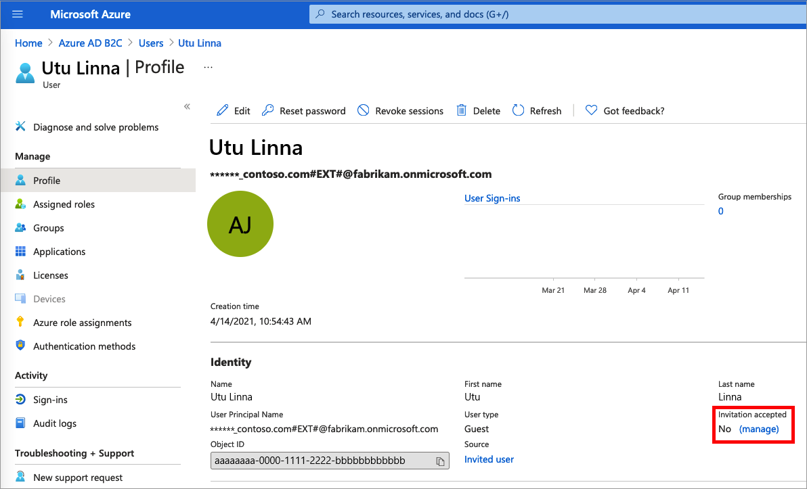
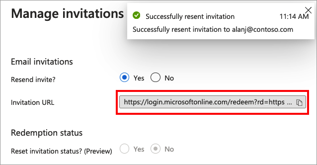
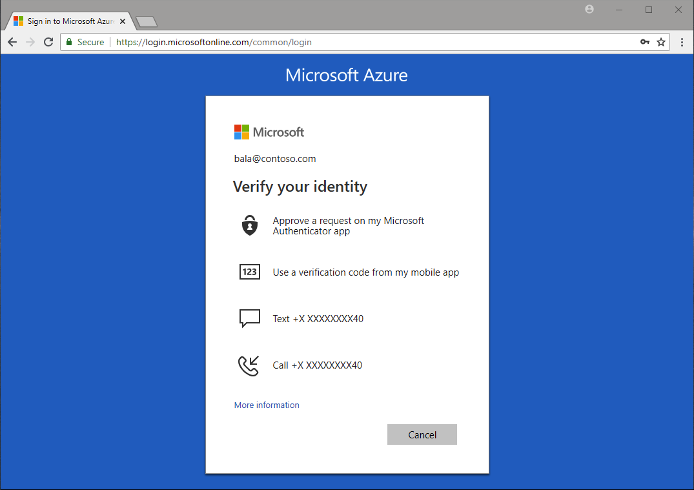

# Manage administrator accounts in Azure Active Directory B2C

In Azure Active Directory B2C (Azure AD B2C), a tenant represents your directory of consumer, work and guest accounts. With an administrator role, work and guest accounts can manage the tenant.  

In this article, you learn how to:

> [!div class="checklist"]
> * Add an administrator (work account) 
> * Invite an administrator (guest account)
> * Add role assignment to a user account 
> * Remove a role assignment from a user account
> * Delete an administrator account
> * Protect administrative accounts

## Prerequisites
- If you haven't already created your own [Azure AD B2C Tenant](tutorial-create-tenant.md), create one now. You can use an existing Azure AD B2C tenant.
- Understand [user accounts in Azure AD B2C](user-overview.md).
- Understand [user roles to control resource access](roles-resource-access-control.md).

## Add an administrator (work account)

To create a new administrative account, follow these steps:

1. Sign in to the [Azure portal](https://portal.azure.com/) with Global Administrator or Privileged Role Administrator permissions.
1. If you have access to multiple tenants, select the **Settings** icon in the top menu to switch to your Azure AD B2C tenant from the **Directories + subscriptions** menu.
1. Under **Azure services**, select **Azure AD B2C**. Or use the search box to find and select **Azure AD B2C**.
1. Under **Manage**, select **Users**.
1. Select **New user**.
1. Select **Create user** (you can create many users at once by selecting **I want to create users in bulk**).
1. On the **User** page, enter information for this user:

  
   - **User name**. *Required*. The user name of the new user. For example, `mary@contoso.com`.
     The domain part of the user name must use either the initial default domain name, *\<tenant name>.onmicrosoft.com* or your [custom domain](custom-domain.md) such as `contoso.com`.
   - **Name**. *Required*. The first and last name of the new user. For example, *Mary Parker*.
   - **Groups**. *Optional*. You can add the user to one or more existing groups. You can also add the user to groups at a later time. 
   - **Directory role**: If you require Microsoft Entra administrative permissions for the user, you can add them to a Microsoft Entra role. You can assign the user to be a Global administrator or one or more of the limited administrator roles in Microsoft Entra ID. For more information about assigning roles, see [Use roles to control resource access](roles-resource-access-control.md).
   - **Job info**: You can add more information about the user here, or do it later. 

1. Copy the autogenerated password provided in the **Password** box. You'll need to give this password to the user to sign in for the first time.
1. Select **Create**.

The user is created and added to your Azure AD B2C tenant. It's preferable to have at least one work account native to your Azure AD B2C tenant assigned the Global Administrator role. This account can be considered a *break-glass account* or *[emergency access accounts](tenant-management-emergency-access-account.md)*.

## Invite an administrator (guest account)

You can also invite a new guest user to manage your tenant. The guest account is the preferred option when your organization also has Microsoft Entra ID because the lifecycle of this identity can be managed externally. 

To invite a user, follow these steps:

1. Sign in to the [Azure portal](https://portal.azure.com/) with Global Administrator or Privileged Role Administrator permissions.
1. If you have access to multiple tenants, select the **Settings** icon in the top menu to switch to your Azure AD B2C tenant from the **Directories + subscriptions** menu.
1. Under **Azure services**, select **Azure AD B2C**. Or use the search box to find and select **Azure AD B2C**.
1. Under **Manage**, select **Users**.
1. Select **New guest account**.
1. On the **User** page, enter information for this user:

   - **Name**. *Required*. The first and last name of the new user. For example, *Mary Parker*.
   - **Email address**. *Required*. The email address of the user you would like to invite, which must be a Microsoft account. For example, `mary@contoso.com`.   
   - **Personal message**: You add a personal message that will be included in the invite email.
   - **Groups**. *Optional*. You can add the user to one or more existing groups. You can also add the user to groups at a later time.
   - **Directory role**: If you require Microsoft Entra administrative permissions for the user, you can add them to a Microsoft Entra role. You can assign the user to be a Global administrator or one or more of the limited administrator roles in Microsoft Entra ID. For more information about assigning roles, see [Use roles to control resource access](roles-resource-access-control.md).
   - **Job info**: You can add more information about the user here, or do it later.

1. Select **Create**.

An invitation email is sent to the user. The user needs to accept the invitation to be able to sign in. 

### Resend the invitation email

If the guest didn't receive the invitation email, or the invitation expired, you can resend the invite. As an alternative to the invitation email, you can give a guest a direct link to accept the invitation. To resend the invitation and get the direct link:

1. Sign in to the [Azure portal](https://portal.azure.com).
1. If you have access to multiple tenants, select the **Settings** icon in the top menu to switch to your Azure AD B2C tenant from the **Directories + subscriptions** menu.
1. Under **Azure services**, select **Azure AD B2C**. Or use the search box to find and select **Azure AD B2C**.
1. Under **Manage**, select **Users**.
1. Search for and select the user you want to resend the invite to.
1. In the **User | Profile** page, under **Identity**, select **(Manage)**.
        

1. For **Resend invite?**, select **Yes**. When **Are you sure you want to resend an invitation?** appears, select **Yes**.
1. Azure AD B2C sends the invitation. You can also copy the invitation URL and provide it directly to the guest.
    
      
 
## Add a role assignment

You can assign a role when you [create a user](#add-an-administrator-work-account) or [invite a guest user](#invite-an-administrator-guest-account). You can add a role, change the role, or remove a role for a user:

1. Sign in to the [Azure portal](https://portal.azure.com/) with Global Administrator or Privileged Role Administrator permissions.
1. If you have access to multiple tenants, select the **Settings** icon in the top menu to switch to your Azure AD B2C tenant from the **Directories + subscriptions** menu.
1. Under **Azure services**, select **Azure AD B2C**. Or use the search box to find and select **Azure AD B2C**.
1. Under **Manage**, select **Users**.
1. Select the user you want to change the roles for. Then select **Assigned roles**.
1. Select **Add assignments**, select the role to assign (for example, *Application administrator*), and then choose **Add**.

## Remove a role assignment

If you need to remove a role assignment from a user, follow these steps:

1. Select **Azure AD B2C**, select **Users**, and then search for and select the user.
1. Select **Assigned roles**. Select the role you want to remove, for example *Application administrator*, and then select **Remove assignment**.

## Review administrator account role assignments

As part of an auditing process, you typically review which users are assigned to specific roles in the Azure AD B2C directory. Use the following steps to audit which users are currently assigned privileged roles.

1. Sign in to the [Azure portal](https://portal.azure.com/) with Global Administrator or Privileged Role Administrator permissions.
1. If you have access to multiple tenants, select the **Settings** icon in the top menu to switch to your Azure AD B2C tenant from the **Directories + subscriptions** menu.
1. Under **Azure services**, select **Azure AD B2C**. Or use the search box to find and select **Azure AD B2C**.
1. Under **Manage**, select **Roles and administrators**.
1. Select a role, such as **Global administrator**. The **Role | Assignments** page lists the users with that role.

## Delete an administrator account

To delete an existing user, you must have a *Global administrator* role assignment. Global admins can delete any user, including other admins. *User administrators* can delete any non-admin user.

1. In your Azure AD B2C directory, select **Users**, and then select the user you want to delete.
1. Select **Delete**, and then **Yes** to confirm the deletion.

The user is deleted and no longer appears on the **Users - All users** page. The user can be seen on the **Deleted users** page for the next 30 days and can be restored during that time. For more information about restoring a user, see [Restore or remove a recently deleted user using Microsoft Entra ID](../active-directory/fundamentals/users-restore.md).

## Protect administrative accounts

It's recommended that you protect all administrator accounts with multifactor authentication (MFA) for more security. MFA is an identity verification process during sign in that prompts the user for a more form of identification, such as a verification code on their mobile device or a request in their Microsoft Authenticator app.

If you're not using [Conditional Access](conditional-access-user-flow.md), you can enable [Microsoft Entra security defaults](../active-directory/fundamentals/security-defaults.md) to force all administrative accounts to use MFA.

## Next steps

- [Manage emergency access accounts in Azure Active Directory B2C](tenant-management-emergency-access-account.md)
