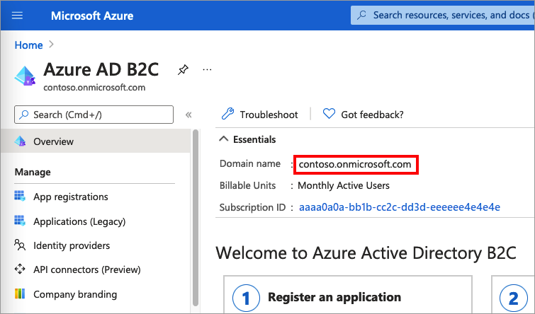
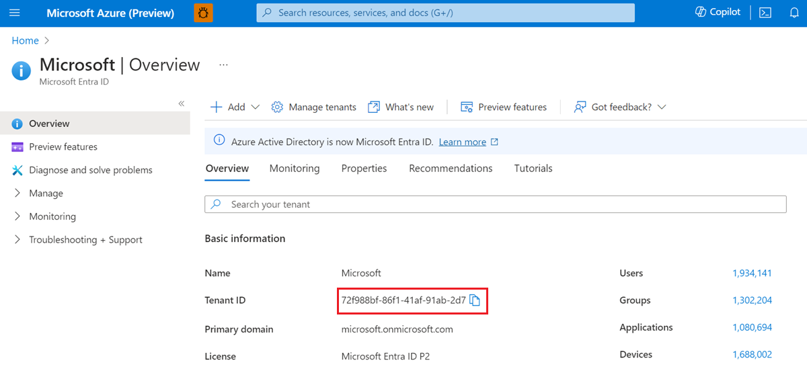

# Find tenant name and tenant ID in Azure Active Directory B2C

When you create an Azure Active Directory B2C (Azure AD B2C) for your organization, it's assigned a default domain name (name) and an ID. The tenant ID is same as the organization ID. 

In this article, you learn how to:

> [!div class="checklist"]
> * Find and copy your tenant name
> * Find and copy your tenant ID

## Prerequisites 

- If you haven't already created your own [Azure AD B2C Tenant](tutorial-create-tenant.md), create one now. You can use an existing Azure AD B2C tenant.

## Get your tenant name

To get your Azure AD B2C tenant name, follow these steps:

1. Sign in to the [Azure portal](https://portal.azure.com).
1. If you have access to multiple tenants, select the **Settings** icon in the top menu to switch to your Azure AD B2C tenant from the **Directories + subscriptions** menu.
1. In the Azure portal, search for and select **Azure AD B2C**.
1. In the **Overview**, copy the **Domain name**.

  

## Get your tenant ID

To get your Azure AD B2C tenant ID, follow these steps:

1. Sign in to the [Azure portal](https://portal.azure.com).
1. If you have access to multiple tenants, select the **Settings** icon in the top menu to switch to your Azure AD B2C tenant from the **Directories + subscriptions** menu.
1. In the Azure portal, search for and select **Microsoft Entra ID**.
1. In the **Overview**, copy the **Tenant ID**.

  

## Next steps

- [Clean up resources and delete tenant](tutorial-delete-tenant.md)
