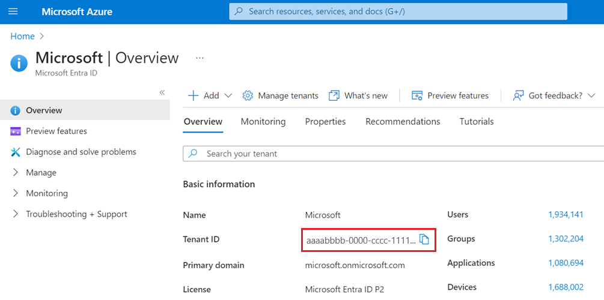

# Manage your Azure Active Directory B2C tenant

In Azure Active Directory B2C (Azure AD B2C), a tenant represents your directory of consumer users. Each Azure AD B2C tenant is distinct and separate from any other Azure AD B2C tenant. An Azure AD B2C tenant is different than an Azure Active Directory (Azure AD) tenant, which you may already have. In this article, you learn how to manage your Azure AD B2C tenant.

## Prerequisites
- If you haven't already created your own [Azure AD B2C Tenant](tutorial-create-tenant.md), create one now. You can use an existing Azure AD B2C tenant.
- Understand [user accounts in Azure AD B2C](user-overview.md).
- Understand [user roles to control resource access](roles-resource-access-control.md).

## Add an administrator (work account)

To create a new administrative account, follow these steps:

1. Sign in to the [Azure portal](https://portal.azure.com/) with Global Administrator or Privileged Role Administrator permissions.
1. Make sure you're using the directory that contains your Azure AD B2C tenant. Select the **Directories + subscriptions** icon in the portal toolbar.
1. On the **Portal settings | Directories + subscriptions** page, find your Azure AD B2C directory in the **Directory name** list, and then select **Switch**.
1. Under **Azure services**, select **Azure AD B2C**. Or use the search box to find and select **Azure AD B2C**.
1. Under **Manage**, select **Users**.
1. Select **New user**.
1. Select **Create user** (you can create many users at once by selecting **I want to create users in bulk**).
1. On the **User** page, enter information for this user:

  
   - **User name**. *Required*. The user name of the new user. For example, `mary@contoso.com`.
     The domain part of the user name must use either the initial default domain name, *\<tenant name>.onmicrosoft.com* or your [custom domain](custom-domain.md) such as `contoso.com`.
   - **Name**. *Required*. The first and last name of the new user. For example, *Mary Parker*.
   - **Groups**. *Optional*. You can add the user to one or more existing groups. You can also add the user to groups at a later time. 
   - **Directory role**: If you require Azure AD administrative permissions for the user, you can add them to an Azure AD role. You can assign the user to be a Global administrator or one or more of the limited administrator roles in Azure AD. For more information about assigning roles, see [Use roles to control resource access](roles-resource-access-control.md).
   - **Job info**: You can add more information about the user here, or do it later. 

1. Copy the autogenerated password provided in the **Password** box. You'll need to give this password to the user to sign in for the first time.
1. Select **Create**.

The user is created and added to your Azure AD B2C tenant. It's preferable to have at least one work account native to your Azure AD B2C tenant assigned the Global Administrator role. This account can be considered a *break-glass account* or *[emergency access accounts](#manage-emergency-access-accounts-in-azure-ad-b2c)*.

## Manage emergency access accounts in Azure AD B2C

It's important that you prevent being accidentally locked out of your Azure Active Directory B2C (Azure AD B2C) organization because you can't sign in or activate another user's account as an administrator. You can mitigate the impact of accidental lack of administrative access by creating two or more *emergency access accounts* in your organization.

When configuring these accounts, the following requirements need to be met:

- The emergency access accounts shouldn't be associated with any individual user in the organization. Make sure that your accounts aren't connected with any employee-supplied mobile phones, hardware tokens that travel with individual employees, or other employee-specific credentials. This precaution covers instances where an individual employee is unreachable when the credential is needed. It's important to ensure that any registered devices are kept in a known, secure location that has multiple means of communicating with Azure AD B2C. 

- Use strong authentication for your emergency access accounts and make sure it doesn’t use the same authentication methods as your other administrative accounts. For example, if your normal administrator account uses the Microsoft Authenticator app for strong authentication, use a FIDO2 security key for your emergency accounts.

- The device or credential must not expire or be in scope of automated cleanup due to lack of use.

### Create emergency access account

Create two or more emergency access accounts. These accounts should be cloud-only accounts that use the *.onmicrosoft.com domain and that aren't federated or synchronized from an on-premises environment.

Use the following steps to create an emergency access account:

1. Sign in to the [Azure portal](https://portal.azure.com) as an existing Global Administrator. If you use your Azure AD account, make sure you're using the directory that contains your Azure AD B2C tenant:

    1. Select the **Directories + subscriptions** icon in the portal toolbar.
    
    1. On the **Portal settings | Directories + subscriptions** page, find your Azure AD B2C directory in the **Directory name** list, and then select **Switch**.
    
1. Under **Azure services**, select **Azure AD B2C**. Or in the Azure portal, search for and select **Azure AD B2C**.

1. In the left menu, under **Manage**, select **Users**. 

1. Select **+ New user**.

1. Select **Create user**.

1. Under **Identity**:

    1. For **User name**, enter a unique user name such as *emergency account*. 
    
    1. For **Name**, enter a name such as *Emergency Account*
    
1. Under **Password**, enter your unique password. 
    
1. Under **Groups and roles** 
 
    1. Select **User**.

    1. In the pane that shows up, search for and select **Global administrator**, and then select **Select** button. 

1. Under **Settings**, select the appropriate **Usage location**.

1. Select **Create**.

1. [Store account credentials safely](../active-directory/roles/security-emergency-access.md#store-account-credentials-safely).

1. [Monitor sign in and audit logs](../active-directory/roles/security-emergency-access.md#monitor-sign-in-and-audit-logs).

1. [Validate accounts regularly](../active-directory/roles/security-emergency-access.md#validate-accounts-regularly).

Once you create your emergency accounts, you need to do the following: 

- Make sure you [exclude at least one account from phone-based multi-factor authentication](../active-directory/roles/security-emergency-access.md#exclude-at-least-one-account-from-phone-based-multi-factor-authentication)

- If you use [Conditional Access](conditional-access-user-flow.md), at least one emergency access account needs to be excluded from all Conditional Access policies.

## Invite an administrator (guest account)

You can also invite a new guest user to manage your tenant. The guest account is the preferred option when your organization also has Azure AD because the lifecycle of this identity can be managed externally. 

To invite a user, follow these steps:

1. Sign in to the [Azure portal](https://portal.azure.com/) with Global Administrator or Privileged Role Administrator permissions.
1. Make sure you're using the directory that contains your Azure AD B2C tenant. Select the **Directories + subscriptions** icon in the portal toolbar.
1. On the **Portal settings | Directories + subscriptions** page, find your Azure AD B2C directory in the **Directory name** list, and then select **Switch**.
1. Under **Azure services**, select **Azure AD B2C**. Or use the search box to find and select **Azure AD B2C**.
1. Under **Manage**, select **Users**.
1. Select **New guest account**.
1. On the **User** page, enter information for this user:

   - **Name**. *Required*. The first and last name of the new user. For example, *Mary Parker*.
   - **Email address**. *Required*. The email address of the user you would like to invite, which must be a Microsoft account. For example, `mary@contoso.com`.   
   - **Personal message**: You add a personal message that will be included in the invite email.
   - **Groups**. *Optional*. You can add the user to one or more existing groups. You can also add the user to groups at a later time.
   - **Directory role**: If you require Azure AD administrative permissions for the user, you can add them to an Azure AD role. You can assign the user to be a Global administrator or one or more of the limited administrator roles in Azure AD. For more information about assigning roles, see [Use roles to control resource access](roles-resource-access-control.md).
   - **Job info**: You can add more information about the user here, or do it later.

1. Select **Create**.

An invitation email is sent to the user. The user needs to accept the invitation to be able to sign in. 

### Resend the invitation email

If the guest didn't receive the invitation email, or the invitation expired, you can resend the invite. As an alternative to the invitation email, you can give a guest a direct link to accept the invitation. To resend the invitation and get the direct link:

1. Sign in to the [Azure portal](https://portal.azure.com).
1. Make sure you're using the directory that contains your Azure AD B2C tenant. Select the **Directories + subscriptions** icon in the portal toolbar.
1. On the **Portal settings | Directories + subscriptions** page, find your Azure AD B2C directory in the **Directory name** list, and then select **Switch**.
1. Under **Azure services**, select **Azure AD B2C**. Or use the search box to find and select **Azure AD B2C**.
1. Under **Manage**, select **Users**.
1. Search for and select the user you want to resend the invite to.
1. In the **User | Profile** page, under **Identity**, select **(Manage)**.
        

1. For **Resend invite?**, select **Yes**. When **Are you sure you want to resend an invitation?** appears, select **Yes**.
1. Azure AD B2C sends the invitation. You can also copy the invitation URL and provide it directly to the guest.
    
      
 
## Add a role assignment

You can assign a role when you [create a user](#add-an-administrator-work-account) or [invite a guest user](#invite-an-administrator-guest-account). You can add a role, change the role, or remove a role for a user:

1. Sign in to the [Azure portal](https://portal.azure.com/) with Global Administrator or Privileged Role Administrator permissions.
1. Make sure you're using the directory that contains your Azure AD B2C tenant. Select the **Directories + subscriptions** icon in the portal toolbar.
1. On the **Portal settings | Directories + subscriptions** page, find your Azure AD B2C directory in the **Directory name** list, and then select **Switch**.
1. Under **Azure services**, select **Azure AD B2C**. Or use the search box to find and select **Azure AD B2C**.
1. Under **Manage**, select **Users**.
1. Select the user you want to change the roles for. Then select **Assigned roles**.
1. Select **Add assignments**, select the role to assign (for example, *Application administrator*), and then choose **Add**.

## Remove a role assignment

If you need to remove a role assignment from a user, follow these steps:

1. Select **Azure AD B2C**, select **Users**, and then search for and select the user.
1. Select **Assigned roles**. Select the role you want to remove, for example *Application administrator*, and then select **Remove assignment**.

## Review administrator account role assignments

As part of an auditing process, you typically review which users are assigned to specific roles in the Azure AD B2C directory. Use the following steps to audit which users are currently assigned privileged roles.

1. Sign in to the [Azure portal](https://portal.azure.com/) with Global Administrator or Privileged Role Administrator permissions.
1. Make sure you're using the directory that contains your Azure AD B2C tenant. Select the **Directories + subscriptions** icon in the portal toolbar.
1. On the **Portal settings | Directories + subscriptions** page, find your Azure AD B2C directory in the **Directory name** list, and then select **Switch**.
1. Under **Azure services**, select **Azure AD B2C**. Or use the search box to find and select **Azure AD B2C**.
1. Under **Manage**, select **Roles and administrators**.
1. Select a role, such as **Global administrator**. The **Role | Assignments** page lists the users with that role.

## Delete an administrator account

To delete an existing user, you must have a *Global administrator* role assignment. Global admins can delete any user, including other admins. *User administrators* can delete any non-admin user.

1. In your Azure AD B2C directory, select **Users**, and then select the user you want to delete.
1. Select **Delete**, and then **Yes** to confirm the deletion.

The user is deleted and no longer appears on the **Users - All users** page. The user can be seen on the **Deleted users** page for the next 30 days and can be restored during that time. For more information about restoring a user, see [Restore or remove a recently deleted user using Azure Active Directory](../active-directory/fundamentals/active-directory-users-restore.md).

## Protect administrative accounts

It's recommended that you protect all administrator accounts with multifactor authentication (MFA) for more security. MFA is an identity verification process during sign in that prompts the user for a more form of identification, such as a verification code on their mobile device or a request in their Microsoft Authenticator app.

If you're not using [Conditional Access](conditional-access-user-flow.md), you can enable [Azure AD security defaults](../active-directory/fundamentals/concept-fundamentals-security-defaults.md) to force all administrative accounts to use MFA.

## Get your tenant name

To get your Azure AD B2C tenant name, follow these steps:

1. Sign in to the [Azure portal](https://portal.azure.com).
1. Make sure you're using the directory that contains your Azure AD B2C tenant. Select the **Directories + subscriptions** icon in the portal toolbar.
1. On the **Portal settings | Directories + subscriptions** page, find your Azure AD B2C directory in the **Directory name** list, and then select **Switch**.
1. In the Azure portal, search for and select **Azure AD B2C**.
1. In the **Overview**, copy the **Domain name**.

  

## Get your tenant ID

To get your Azure AD B2C tenant ID, follow these steps:

1. Sign in to the [Azure portal](https://portal.azure.com).
1. Make sure you're using the directory that contains your Azure AD B2C tenant. Select the **Directories + subscriptions** icon in the portal toolbar.
1. On the **Portal settings | Directories + subscriptions** page, find your Azure AD B2C directory in the **Directory name** list, and then select **Switch**.
1. In the Azure portal, search for and select **Azure Active Directory**.
1. In the **Overview**, copy the **Tenant ID**.

  

## Enable local data residency 

[For already created tenants and have local data residency available for their country]

## Next steps

- [Clean up resources and delete tenant](tutorial-delete-tenant.md)
