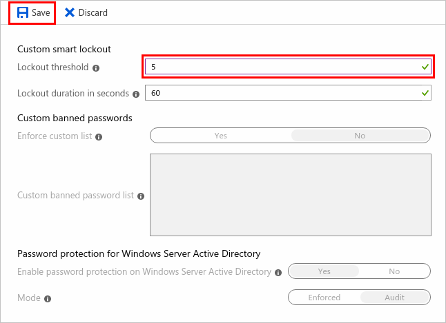

# Mitigate credential attacks in Azure AD B2C with smart lockout

Credential attacks lead to unauthorized access to resources. Passwords that are set by users are required to be reasonably complex. Azure AD B2C has mitigation techniques in place for credential attacks. Mitigation includes detection of brute-force credential attacks and dictionary credential attacks. By using various signals, Azure Active Directory B2C (Azure AD B2C) analyzes the integrity of requests. Azure AD B2C is designed to intelligently differentiate intended users from hackers and botnets.

## How smart lockout works

Azure AD B2C uses a sophisticated strategy to lock accounts. The accounts are locked based on the IP of the request and the passwords entered. The duration of the lockout also increases based on the likelihood that it's an attack. After a password is tried 10 times unsuccessfully (the default attempt threshold), a one-minute lockout occurs. The next time a login is unsuccessful after the account is unlocked (that is, after the account has been automatically unlocked by the service once the lockout period expires), another one-minute lockout occurs and continues for each unsuccessful login. Entering the same, or similar password repeatedly doesn't count as multiple unsuccessful logins.

> [!NOTE]
> This feature is supported by [user flows, custom policies](user-flow-overview.md), and [ROPC](add-ropc-policy.md) flows. It’s activated by default so you don’t need to configure it in your user flows or custom policies.

## Unlock accounts

The first 10 lockout periods are one minute long. The next 10 lockout periods are slightly longer and increase in duration after every 10 lockout periods. The lockout counter resets to zero after a successful login when the account isn’t locked. Lockout periods can last up to five hours. Users must wait for the lockout duration to expire. However, the user can unlock by using self-service [password user flow](add-password-reset-policy.md).

## Manage smart lockout settings

To manage smart lockout settings, including the lockout threshold:

1. Sign in to the [Azure portal](https://portal.azure.com).
1. If you have access to multiple tenants, select the **Settings** icon in the top menu to switch to your Azure AD B2C tenant from the **Directories + subscriptions** menu.
1. In the left menu, select **Azure AD B2C**. Or, select **All services** and search for and select **Azure AD B2C**.
1. Under **Security**, select **Authentication methods (Preview)**, then select **Password protection**.
1. Under **Custom smart lockout**, enter your desired smart lockout settings:

   - **Lockout threshold**: The number of failed sign-in tries that are allowed before the account is first locked out. If the first sign-in after a lockout also fails, the account locks again.
   - **Lockout duration in seconds**: The minimum duration of each lockout in seconds. If an account locks repeatedly, this duration increases.

       
     *Setting the lockout threshold to 5 in **Password protection** settings*.

1. Select **Save**.

## Testing smart lockout

The smart lockout feature uses many factors to determine when an account should be locked, but the primary factor is the password pattern. The smart lockout feature considers slight variations of a password as a set, and they’re counted as a single try. For example:

- Passwords such as 12456! and 1234567! (or newAccount1234 and newaccount1234) are so similar that the algorithm interprets them as human error and counts them as a single try.
- Larger variations in pattern, such as 12456! and ABCD2!, are counted as separate tries.

When testing the smart lockout feature, use a distinctive pattern for each password you enter. Consider using password generation web apps, such as `https://password-gen.com/`.

When the smart lockout threshold is reached, you'll see the following message while the account is locked: **Your account is temporarily locked to prevent unauthorized use. Try again later**. The error messages can be [localized](localization-string-ids.md#sign-up-or-sign-in-error-messages).

> [!NOTE]
> When you test smart lockout, your sign-in requests might be handled by different datacenters due to the geo-distributed and load-balanced nature of the Microsoft Entra authentication service. In that scenario, because each Microsoft Entra datacenter tracks lockout independently, it might take more than your defined lockout threshold number of attempts to cause a lockout. A user has a maximum of (threshold_limit * datacenter_count) number of bad attempts before being completely locked out. For more information, see [Azure global infrastructure](https://azure.microsoft.com/global-infrastructure/).

## Viewing locked-out accounts

To obtain information about locked-out accounts, you can check the Active Directory [sign-in activity report](../active-directory/reports-monitoring/concept-sign-ins.md). Under **Status**, select **Failure**. Failed sign-in attempts with a **Sign-in error code** of `50053` indicate a locked account:

To learn about viewing the sign-in activity report in Microsoft Entra ID, see [Sign-in activity report error codes](../active-directory/reports-monitoring/concept-sign-ins.md).
