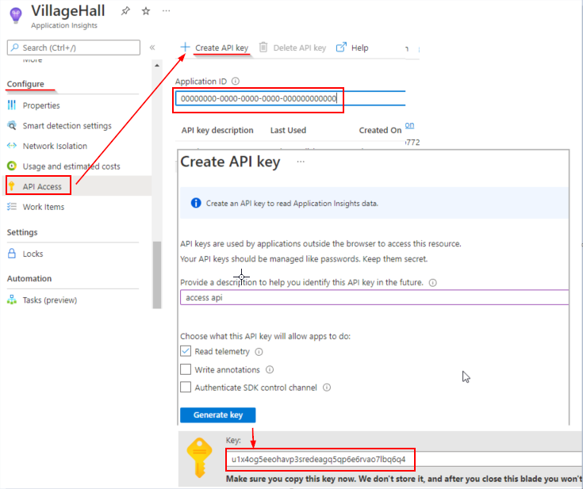
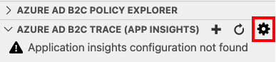
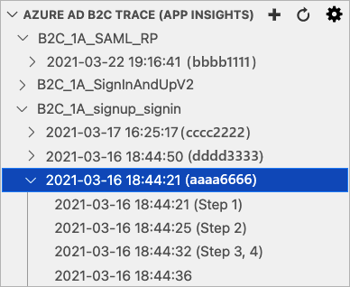

# Collect Azure Active Directory B2C logs with Application Insights

[!INCLUDE [active-directory-b2c-choose-user-flow-or-custom-policy](../../includes/active-directory-b2c-choose-user-flow-or-custom-policy.md)]

::: zone pivot="b2c-user-flow"

[!INCLUDE [active-directory-b2c-limited-to-custom-policy](../../includes/active-directory-b2c-limited-to-custom-policy.md)]

::: zone-end

::: zone pivot="b2c-custom-policy"

This article provides steps for collecting logs from Active Directory B2C (Azure AD B2C) so that you can diagnose problems with your custom policies. Application Insights provides a way to diagnose exceptions and visualize application performance issues. Azure AD B2C includes a feature for sending data to Application Insights.

The detailed activity logs described here should be enabled **ONLY** during the development of your custom policies.

> [!WARNING]
> Do not set the `DeploymentMode` to `Development` in production environments. Logs collect all claims sent to and from identity providers. You as the developer assume responsibility for any personal data collected in your Application Insights logs. These detailed logs are collected only when the policy is placed in **DEVELOPER MODE**.

## Set up Application Insights

If you don't already have one, create an instance of Application Insights in your subscription.

> [!TIP]
> A single instance of Application Insights can be used for multiple Azure AD B2C tenants. Then in your query, you can filter by the tenant, or policy name. For more information, [see the logs in Application Insights](#see-the-logs-in-application-insights) samples.

To use an existing instance of Application Insights in your subscription, follow these steps:

1. Sign in to the [Azure portal](https://portal.azure.com).
1. Make sure you're using the Microsoft Entra directory that has your Azure subscription, and not your Azure AD B2C directory. Select the **Directories + subscriptions** icon in the portal toolbar.
1. On the **Portal settings | Directories + subscriptions** page, find your Microsoft Entra directory in the **Directory name** list, and then select **Switch**.
1. Open the Application Insights resource that you created earlier.
1. On the **Overview** page, and record the **Instrumentation Key**

To create an instance of Application Insights in your subscription, follow these steps:

1. Sign in to the [Azure portal](https://portal.azure.com).
1. Make sure you're using the Microsoft Entra directory that has your Azure subscription, and not your Azure AD B2C directory. Select the **Directories + subscriptions** icon in the portal toolbar.
1. On the **Portal settings | Directories + subscriptions** page, find your Microsoft Entra directory in the **Directory name** list, and then select **Switch**.
1. Select **Create a resource** in the left-hand navigation menu.
1. Search for and select **Application Insights**, then select **Create**.
1. Complete the form, select **Review + create**, and then select **Create**.
1. Once the deployment completes, select **Go to resource**.
1. Under **Configure** in Application Insights menu, select **Properties**.
1. Record the **INSTRUMENTATION KEY** for use in a later step.

## Configure the custom policy

1. Open the relying party (RP) file, for example *SignUpOrSignin.xml*.
1. Add the following attributes to the `<TrustFrameworkPolicy>` element:

   ```xml
   DeploymentMode="Development"
   UserJourneyRecorderEndpoint="urn:journeyrecorder:applicationinsights"
   ```

1. If it doesn't already exist, add a `<UserJourneyBehaviors>` child node to the `<RelyingParty>` node. It must be located after `<DefaultUserJourney ReferenceId="UserJourney Id" from your extensions policy, or equivalent (for example:SignUpOrSigninWithAAD" />`. See [RelyingParty schema reference](./relyingparty.md) for a complete order of the **RelyingParty** child elements.
1. Add the following node as a child of the `<UserJourneyBehaviors>` element. Make sure to replace `{Your Application Insights Key}` with the Application Insights **Instrumentation Key** that you recorded earlier.

    ```xml
    <JourneyInsights TelemetryEngine="ApplicationInsights" InstrumentationKey="{Your Application Insights Key}" DeveloperMode="true" ClientEnabled="false" ServerEnabled="true" TelemetryVersion="1.0.0" />
    ```

    * `DeveloperMode="true"` tells ApplicationInsights to expedite the telemetry through the processing pipeline. Good for development, but constrained at high volumes. In production, set the `DeveloperMode` to `false`.
    * `ClientEnabled="true"` sends the ApplicationInsights client-side script for tracking page view and client-side errors. You can view this in the **browserTimings** table in the Application Insights portal. By setting `ClientEnabled= "true"`, you add Application Insights to your page script and you get timings of page loads and AJAX calls, counts, details of browser exceptions and AJAX failures, and user and session counts. This field is **optional**, and is set to `false` by default.
    * `ServerEnabled="true"` sends the existing UserJourneyRecorder JSON as a custom event to Application Insights.

    For example:

    ```xml
    <TrustFrameworkPolicy
      ...
      TenantId="fabrikamb2c.onmicrosoft.com"
      PolicyId="SignUpOrSignInWithAAD"
      DeploymentMode="Development"
      UserJourneyRecorderEndpoint="urn:journeyrecorder:applicationinsights"
    >
    ...
    <RelyingParty>
      <DefaultUserJourney ReferenceId="UserJourney ID from your extensions policy, or equivalent (for example: SignUpOrSigninWithAzureAD)" />
      <Endpoints>
         <!--points to refresh token journey when app makes refresh token request-->
         <Endpoint Id="Token" UserJourneyReferenceId="RedeemRefreshToken" />
      </Endpoints>
      <UserJourneyBehaviors>
        <JourneyInsights TelemetryEngine="ApplicationInsights" InstrumentationKey="{Your Application Insights Key}" DeveloperMode="true" ClientEnabled="false" ServerEnabled="true" TelemetryVersion="1.0.0" />
      </UserJourneyBehaviors>
      ...
    </TrustFrameworkPolicy>
    ```

1. Upload the policy.

## See the logs in Application Insights

There's a short delay, typically less than five minutes, before you can see new logs in Application Insights.

1. Open the Application Insights resource that you created in the [Azure portal](https://portal.azure.com).
1. On the **Overview** page, select **Logs**.
1. Open a new tab in Application Insights.

Here's a list of queries you can use to see the logs:

| Query | Description |
|---------------------|--------------------|
| `traces` | Get all of the logs generated by Azure AD B2C |
| `traces | where timestamp > ago(1d)` | Get all of the logs generated by Azure AD B2C for the last day.|
| `traces | where message contains "exception" | where timestamp > ago(2h)`|  Get all of the logs with errors from the last two hours.|
| `traces | where customDimensions.Tenant == "contoso.onmicrosoft.com" and customDimensions.UserJourney  == "b2c_1a_signinandup"` | Get all of the logs generated by Azure AD B2C *contoso.onmicrosoft.com* tenant, and user journey is *b2c_1a_signinandup*. |
| `traces | where customDimensions.CorrelationId == "00000000-0000-0000-0000-000000000000"`| Get all of the logs generated by Azure AD B2C for a correlation ID. Replace the correlation ID with your correlation ID. | 

The entries may be long. Export to CSV for a closer look.

For more information about querying, see [Overview of log queries in Azure Monitor](../azure-monitor/logs/log-query-overview.md).

## See the logs in VS Code extension

We recommend you to install the [Azure AD B2C extension](https://marketplace.visualstudio.com/items?itemName=AzureADB2CTools.aadb2c) for [VS Code](https://code.visualstudio.com/). With the Azure AD B2C extension, the logs are organized for you by the policy name, correlation ID (the application insights presents the first digit of the correlation ID), and the log timestamp. This feature helps you to find the relevant log based on the local timestamp and see the user journey as executed by Azure AD B2C.

> [!NOTE]
> The community has developed the VS Code extension to help people implementing and maintaining Azure AD B2C solutions. The extension is not supported by Microsoft, and is made available strictly as-is.

### Set Application Insights API access

After you set up the Application Insights, and configure the custom policy, you need to get your Application Insights **API ID**, and create **API Key**. Both the API ID and API key are used by Azure AD B2C extension to read the Application Insights events (telemetries). Your API keys should be managed like passwords. Keep it secret.

> [!NOTE]
> Application Insights instrumentation key that your create earlier is used by Azure AD B2C to send telemetries to Application Insights. You use the instrumentation key only in your Azure AD B2C policy, not in the VS Code extension.

To get Application Insights ID and key:

1. In Azure portal, open the Application Insights resource for your application.
1. Select **Configure**, then select **API Access**.
1. Copy the **Application ID**
1. Select **Create API Key**
1. Check the **Read telemetry** box.
1. Copy the **Key** before closing the Create API key blade and save it somewhere secure. If you lose the key, you need to create another.

    

### Set up Azure AD B2C VS Code extension

Now the you have Azure Application insights API ID and Key, you can configure the VS Code extension to read the logs. Azure AD B2C VS Code extension provides two scopes for settings:

- **User Global Settings** - Settings that apply globally to any instance of VS Code you open.
- **Workspace Settings** - Settings stored inside your workspace and only apply when the workspace is opened (using VS Code **open folder**).

1. From the **Azure AD B2C Trace** explorer, click on the **Settings** icon.

    

1. Provide the Azure Application Insights **ID** and **key**.
1. Click **Save**

After you save the settings, the Application insights logs appear on the **Azure AD B2C Trace (App Insights)** window.




## Configure Application Insights in Production

To improve your production environment performance and better user experience, it's important to configure your policy to ignore messages that are unimportant. Use the following configuration in production environments and no logs are sent to your application insights.

1. Set the `DeploymentMode` attribute of the [TrustFrameworkPolicy](trustframeworkpolicy.md) to `Production`. 

   ```xml
   <TrustFrameworkPolicy xmlns:xsi="http://www.w3.org/2001/XMLSchema-instance" xmlns:xsd="http://www.w3.org/2001/XMLSchema" xmlns="http://schemas.microsoft.com/online/cpim/schemas/2013/06" PolicySchemaVersion="0.3.0.0"
   TenantId="yourtenant.onmicrosoft.com"
   PolicyId="B2C_1A_signup_signin"
   PublicPolicyUri="http://yourtenant.onmicrosoft.com/B2C_1A_signup_signin"
   DeploymentMode="Production"
   UserJourneyRecorderEndpoint="urn:journeyrecorder:applicationinsights">
   ```

1. Set the `DeveloperMode` of the [JourneyInsights](relyingparty.md#journeyinsights) to `false`.

   ```xml
   <UserJourneyBehaviors>
     <JourneyInsights TelemetryEngine="ApplicationInsights" InstrumentationKey="{Your Application Insights Key}" DeveloperMode="false" ClientEnabled="false" ServerEnabled="true" TelemetryVersion="1.0.0" />
   </UserJourneyBehaviors>
   ```
   
1. Upload and test your policy.


## Next steps

- Learn how to [troubleshoot Azure AD B2C custom policies](troubleshoot.md)

::: zone-end
