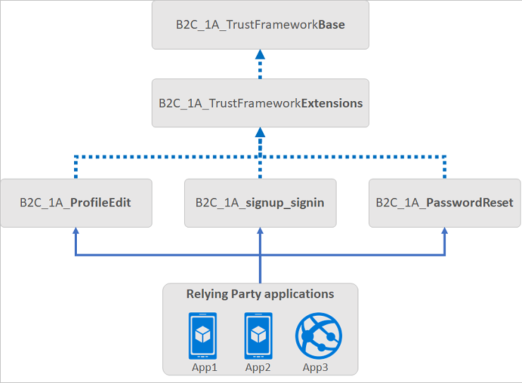
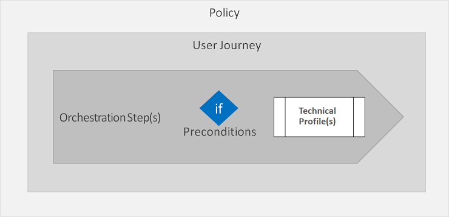

# TrustFrameworkPolicy

[!INCLUDE [active-directory-b2c-advanced-audience-warning](../../includes/active-directory-b2c-advanced-audience-warning.md)]

A custom policy is represented as one or more XML-formatted files, which refer to each other in a hierarchical chain. The XML elements define elements of the policy, such as the claims schema, claims transformations, content definitions, claims providers, technical profiles, user journey, and orchestration steps. Each policy file is defined within the top-level **TrustFrameworkPolicy** element of a policy file.

```XML
<TrustFrameworkPolicy
  xmlns:xsi="https://www.w3.org/2001/XMLSchema-instance"
  xmlns:xsd="https://www.w3.org/2001/XMLSchema"
  xmlns="http://schemas.microsoft.com/online/cpim/schemas/2013/06"
  PolicySchemaVersion="0.3.0.0"
  TenantId="mytenant.onmicrosoft.com"
  PolicyId="B2C_1A_TrustFrameworkBase"
  PublicPolicyUri="http://mytenant.onmicrosoft.com/B2C_1A_TrustFrameworkBase">
  ...
```


The **TrustFrameworkPolicy** element contains the following attributes:

| Attribute | Required | Description |
|---------- | -------- | ----------- |
| PolicySchemaVersion | Yes | The schema version that is to be used to execute the policy. The value must be `0.3.0.0` |
| TenantObjectId | No | The unique object identifier of the Azure Active Directory B2C (Azure AD B2C) tenant. |
| TenantId | Yes | The unique identifier of the tenant to which this policy belongs. |
| PolicyId | Yes | The unique identifier for the policy. This identifier must be prefixed by *B2C_1A_* |
| PublicPolicyUri | Yes | The URI for the policy, which is combination of the tenant ID and the policy ID. |
| DeploymentMode | No | Possible values: `Production`, or `Development`. `Production` is the default. Use this property to debug your policy. For more information, see [Collecting Logs](troubleshoot-with-application-insights.md). |
| UserJourneyRecorderEndpoint | No | The endpoint that is used when **DeploymentMode** is set to `Development`. The value must be `urn:journeyrecorder:applicationinsights`. For more information, see [Collecting Logs](troubleshoot-with-application-insights.md). |


The following example shows how to specify the **TrustFrameworkPolicy** element:

``` XML
<TrustFrameworkPolicy
   xmlns:xsi="https://www.w3.org/2001/XMLSchema-instance"
   xmlns:xsd="https://www.w3.org/2001/XMLSchema"
   xmlns="http://schemas.microsoft.com/online/cpim/schemas/2013/06"
   PolicySchemaVersion="0.3.0.0"
   TenantId="mytenant.onmicrosoft.com"
   PolicyId="B2C_1A_TrustFrameworkBase"
   PublicPolicyUri="http://mytenant.onmicrosoft.com/B2C_1A_TrustFrameworkBase">
```

## Inheritance model

These types of policy files are typically used in a user journey:

- A **Base** file that contains most of the definitions. To help with troubleshooting and long-term maintenance of your policies, it is recommended that you make a minimum number of changes to this file.
- An **Extensions** file that holds the unique configuration changes for your tenant. This policy file is derived from the Base file. Use this file to add new functionality or override existing functionality. For example, use this file to federate with new identity providers.
- A **Relying Party (RP)** file that is the single task-focused file that is invoked directly by the relying party application, such as your web, mobile, or desktop applications. Each unique task such as sign-up or sign-in, password reset, or profile edit, requires its own RP policy file. This policy file is derived from the Extensions file.

A relying party application calls the RP policy file to execute a specific task. For example, to initiate the sign-in flow. The Identity Experience Framework in Azure AD B2C adds all of the elements first from the Base file, and then from the Extensions file, and finally from the RP policy file to assemble the current policy in effect. Elements of the same type and name in the RP file override those elements in the Extensions, and Extensions overrides Base. The following diagram shows the relationship between the policy files and the relying party applications.



The inheritance model is as follows:

- The parent policy and child policy are of the same schema.
- The child policy at any level can inherit from the parent policy and extend it by adding new elements.
- There is no limit on the number of levels.

For more information, see [Get started with custom policies](custom-policy-get-started.md).

## Base policy

To inherit a policy from another policy, a **BasePolicy** element must be declared under the **TrustFrameworkPolicy** element of the policy file. The **BasePolicy** element is a reference to the base policy from which this policy is derived.

The **BasePolicy** element contains the following elements:

| Element | Occurrences | Description |
| ------- | ----------- | --------|
| TenantId | 1:1 | The identifier of your Azure AD B2C tenant. |
| PolicyId | 1:1 | The identifier of the parent policy. |


The following example shows how to specify a base policy. This **B2C_1A_TrustFrameworkExtensions** policy is derived from the **B2C_1A_TrustFrameworkBase** policy.

``` XML
<TrustFrameworkPolicy
   xmlns:xsi="https://www.w3.org/2001/XMLSchema-instance"
   xmlns:xsd="https://www.w3.org/2001/XMLSchema"
   xmlns="http://schemas.microsoft.com/online/cpim/schemas/2013/06"
   PolicySchemaVersion="0.3.0.0"
   TenantId="mytenant.onmicrosoft.com"
   PolicyId="B2C_1A_TrustFrameworkExtensions"
   PublicPolicyUri="http://mytenant.onmicrosoft.com/B2C_1A_TrustFrameworkExtensions">

  <BasePolicy>
    <TenantId>yourtenant.onmicrosoft.com</TenantId>
    <PolicyId>B2C_1A_TrustFrameworkBase</PolicyId>
  </BasePolicy>
  ...
</TrustFrameworkPolicy>
```

## Policy execution

A relying party application, such as a web, mobile, or desktop application, calls the [relying party (RP) policy](relyingparty.md). The RP policy file executes a specific task, such as signing in, resetting a password, or editing a profile. The RP policy configures the list of claims the relying party application receives as part of the token that is issued. Multiple applications can use the same policy. All applications receive the same token with claims, and the user goes through the same user journey. A single application can use multiple policies.

Inside the RP policy file, you specify the **DefaultUserJourney** element, which points to the [UserJourney](userjourneys.md). The user journey usually is defined in the Base or Extensions policy.

B2C_1A_signup_signin policy:

```XML
<RelyingParty>
  <DefaultUserJourney ReferenceId="SignUpOrSignIn">
  ...
```

B2C_1A_TrustFrameWorkBase or B2C_1A_TrustFrameworkExtensionPolicy:

```XML
<UserJourneys>
  <UserJourney Id="SignUpOrSignIn">
  ...
```

A user journey defines the business logic of what a user goes through. Each user journey is a set of orchestration steps that performs a series of actions, in sequence in terms of authentication and information collection.

The **SocialAndLocalAccounts** policy file in the [starter pack](custom-policy-get-started.md#custom-policy-starter-pack) contains the SignUpOrSignIn, ProfileEdit, PasswordReset user journeys. You can add more user journeys for other scenarios, such as changing an email address or linking and unlinking a social account.

The orchestration steps may call a [Technical Profile](technicalprofiles.md). A technical profile provides a framework with a built-in mechanism to communicate with different types of parties. For example, a technical profile can perform these actions among others:

- Render a user experience.
- Allow users to sign in with social or an enterprise account, such as Facebook, Microsoft account, Google, Salesforce or any other identity provider.
- Set up phone verification for MFA.
- Read and write data to and from an Azure AD B2C identity store.
- Call a custom Restful API service.



 The **TrustFrameworkPolicy** element contains the following elements:

- BasePolicy as specified above
- [BuildingBlocks](buildingblocks.md)
- [ClaimsProviders](claimsproviders.md)
- [UserJourneys](userjourneys.md)
- [RelyingParty](relyingparty.md)
