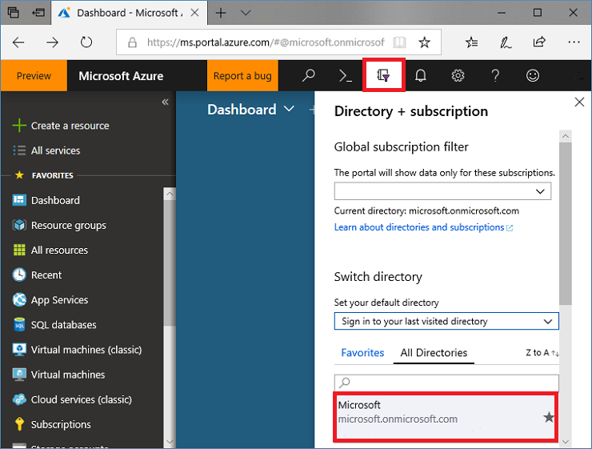
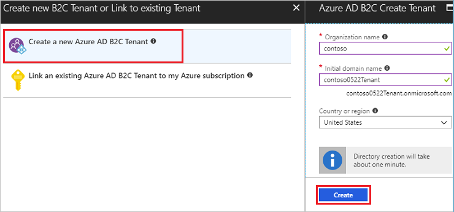
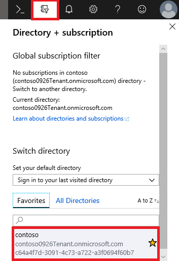

# Tutorial: Create an Azure Active Directory B2C tenant

Before your applications can interact with Azure Active Directory (Azure AD) B2C, they must be registered in a tenant that you manage.

In this article, you learn how to:

> [!div class="checklist"]
> * Create an Azure AD B2C tenant
> * Link your tenant to your subscription

You learn how to register an application in the next tutorial.

If you don't have an Azure subscription, create a [free account](https://azure.microsoft.com/free/?WT.mc_id=A261C142F) before you begin.

## Create an Azure AD B2C tenant

1. Sign in to the [Azure portal](https://portal.azure.com/).
2. Make sure you're using the directory that contains your subscription. Click the **Directory and subscription filter** in the top menu, then select the directory that contains your subscription. This directory is different from the one that will contain your Azure AD B2C tenant.

    

3. Choose **Create a resource** in the top-left corner of the Azure portal.
4. Search for and select **Active Directory B2C**, and then click **Create**.
5. Choose **Create a new Azure AD B2C Tenant** and enter an organization name and initial domain name. Select the country/region (it can't be changed later), and then click **Create**.

    The initial domain name is used as part of your tenant name. In this example, the tenant name is *contoso0926Tenant.onmicrosoft.com*:

    

6. On the **Create new B2C Tenant or Link to existing Tenant** page, choose **Link an existing Azure AD B2C Tenant to my Azure subscription**.

    Select the tenant that you created, and select your subscription.

    For resource group, select **Create new**. Enter a name for the resource group that will contain the tenant, select the location, and then click **Create**.
1. To start using your new tenant, make sure you're using the directory that contains your Azure AD B2C tenant by clicking the **Directory and subscription filter** in the top menu and choosing the directory that contains it.

    If at first you don't see your new Azure B2C tenant in the list, refresh your browser window, then select the **Directory and subscription filter** again in the top menu.

    

## Next steps

In this article, you learned how to:

> [!div class="checklist"]
> * Create an Azure AD B2C tenant
> * Link your tenant to your subscription

Next, learn how to register a web application in your new tenant.

> [!div class="nextstepaction"]
> [Register your applications >](tutorial-register-applications.md)
