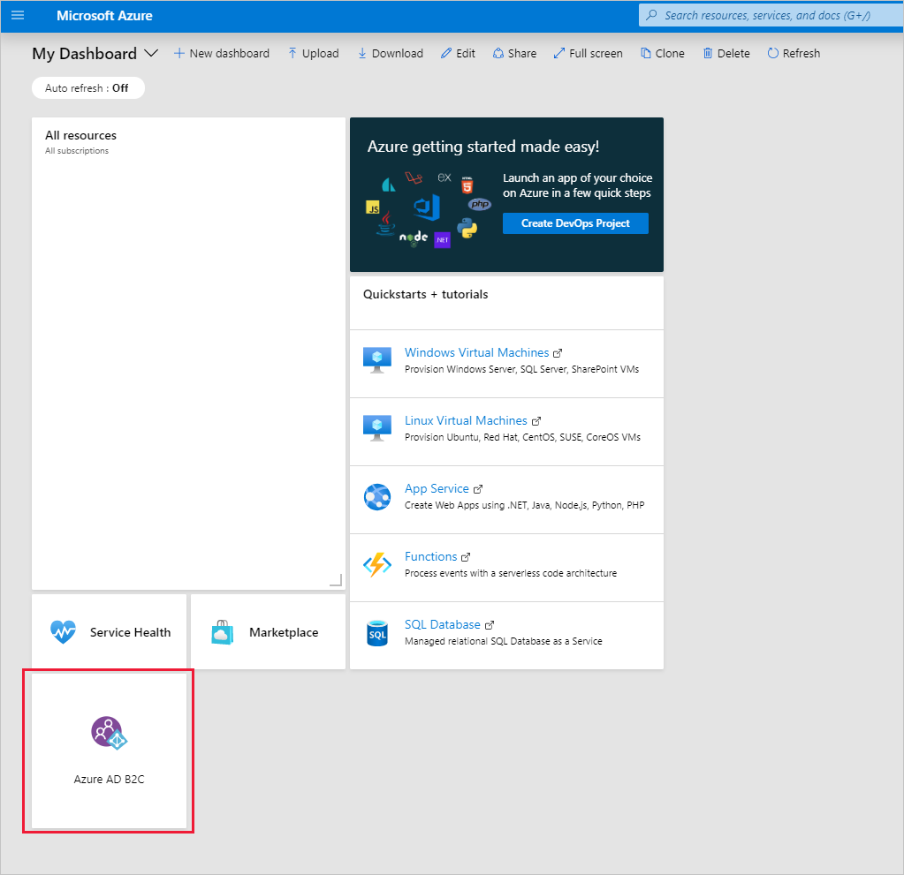

# Tutorial: Create an Azure Active Directory B2C tenant

Before your applications can interact with Azure Active Directory B2C (Azure AD B2C), they must be registered in a tenant that you manage.

In this article, you learn how to:

> [!div class="checklist"]
> * Create an Azure AD B2C tenant
> * Link your tenant to your subscription
> * Switch to the directory containing your Azure AD B2C tenant
> * Add the Azure AD B2C resource to your Azure portal dashboard

You learn how to register an application in the next tutorial.

If you don't have an Azure subscription, create a [free account](https://azure.microsoft.com/free/?WT.mc_id=A261C142F) before you begin.

## Create an Azure AD B2C tenant

1. Sign in to the [Azure portal](https://portal.azure.com/).
1. Make sure you're using the directory that contains your subscription.

    In the Azure portal toolbar, select the **Directory + Subscription** icon, and then select the directory that contains your subscription. This directory is different from the one that will contain your Azure AD B2C tenant.

    

1. On the Azure portal menu or from the **Home** page, select **Create a resource**. 
1. Search for **Azure Active Directory B2C**, and then select **Create**.
1. Select **Create a new Azure AD B2C Tenant**.

    

1. Enter an **Organization name** and **Initial domain name**. Select the **Country or region** (it can't be changed later), and then select **Create**.

    The domain name is used as part of your full tenant domain name. In this example, the tenant name is *contosob2c.onmicrosoft.com*:

    

1. Once the tenant creation is complete, select the **Create new B2C Tenant or Link to existing Tenant** link at the top of the tenant creation page.

    

1. Select **Link an existing Azure AD B2C Tenant to my Azure subscription**.

   

1. Select the **Azure AD B2C Tenant** that you created, then select your **Subscription**.

    For **Resource group**, select **Create new**. Enter a **Name** for the resource group that will contain the tenant, select the **Resource group location**, and then select **Create**.

    

## Select your B2C tenant directory

To start using your new Azure AD B2C tenant, you need to switch to the directory that contains the tenant.

Select the **Directory + subscription** filter in the top menu of the Azure portal, then select the directory that contains your Azure AD B2C tenant.

If at first you don't see your new Azure B2C tenant in the list, refresh your browser window, then select the **Directory + subscription** filter again in the top menu.

## Add Azure AD B2C to the dashboard (optional)

This optional step makes it easier to select your Azure AD B2C tenant in the following and all subsequent tutorials.

Instead of searching the Azure portal for *Azure AD B2C* every time you want to work with your tenant, you can instead add it to the dashboard. Then, you can select it from your **Home** page to quickly browse to your Azure AD B2C tenant.

You only need to perform this operation once. Before performing these steps, make sure you've switched to the directory containing your Azure AD B2C tenant as described in the previous section, [Select your B2C tenant directory](#select-your-b2c-tenant-directory).

1. Sign in to the [Azure portal](https://portal.azure.com).
1. In the Azure portal, search for and select **Azure AD B2C**.
1. Select the pin icon to add Azure AD B2C to the dashboard.
1. On the Azure portal menu or from the **Home** page, select **Dashboard**. **Azure AD B2C** now appears as a tile in your **My Dashboard** page.

    

    You can also change the location of the tile. First hover over the tile and select the tile's context menu. Then choose **Customize** and drag the tile to the desired location. Finally, select the tile's context menu again and choose **Done customizing**.

## Next steps

In this article, you learned how to:

> [!div class="checklist"]
> * Create an Azure AD B2C tenant
> * Link your tenant to your subscription
> * Switch to the directory containing your Azure AD B2C tenant
> * Add the Azure AD B2C resource to your Azure portal dashboard

Next, learn how to register a web application in your new tenant.

> [!div class="nextstepaction"]
> [Register your applications >](tutorial-register-applications.md)
