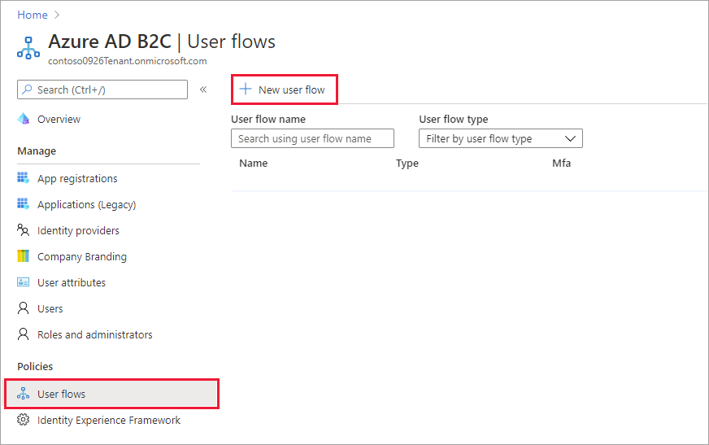
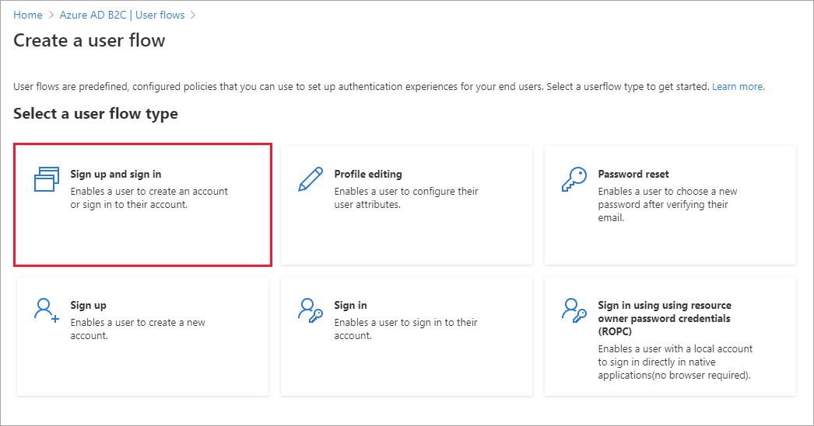
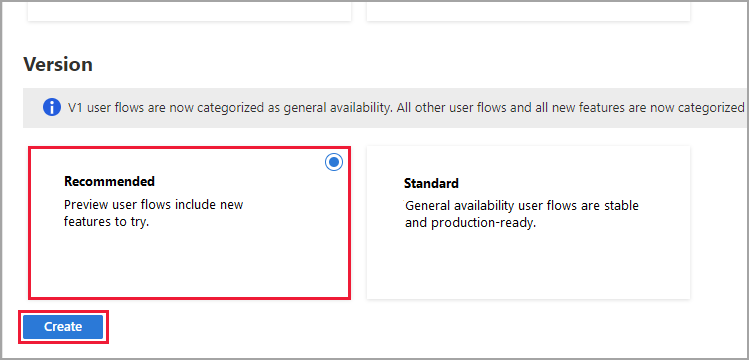

# Tutorial: Create user flows and custom policies in Azure Active Directory B2C

[!INCLUDE [active-directory-b2c-choose-user-flow-or-custom-policy](../../includes/active-directory-b2c-choose-user-flow-or-custom-policy.md)]

In your applications you may have user flows that enable users to sign up, sign in, or manage their profile. You can create multiple user flows of different types in your Azure Active Directory B2C (Azure AD B2C) tenant and use them in your applications as needed. User flows can be reused across applications.

::: zone pivot="b2c-user-flow"
A user flow lets you determine how users interact with your application when they do things like sign-in, sign-up, edit a profile, or reset a password. In this article, you learn how to:
::: zone-end

::: zone pivot="b2c-custom-policy"
[Custom policies](custom-policy-overview.md) are configuration files that define the behavior of your Azure Active Directory B2C (Azure AD B2C) tenant. In this article, you learn how to:
::: zone-end

> [!div class="checklist"]
> * Create a sign-up and sign-in user flow
> * Enable self-service password reset
> * Create a profile editing user flow

::: zone pivot="b2c-user-flow"
> [!IMPORTANT]
> We've changed the way we reference user flow versions. Previously, we offered V1 (production-ready) versions, and V1.1 and V2 (preview) versions. Now, we've consolidated user flows into two versions: **Recommended** user flows with the latest features, and **Standard (Legacy)** user flows. All legacy preview user flows (V1.1 and V2) are deprecated. For details, see [User flow versions in Azure AD B2C](user-flow-versions.md). *These changes apply to the Azure public cloud only. Other environments will continue to use [legacy user flow versioning](user-flow-versions-legacy.md).* 
::: zone-end

## Prerequisites

::: zone pivot="b2c-user-flow"
- If you don't have one already, [create an Azure AD B2C tenant](tutorial-create-tenant.md) that is linked to your Azure subscription.
- [Register a web application](tutorial-register-applications.md), and [enable ID token implicit grant](tutorial-register-applications.md#enable-id-token-implicit-grant).
::: zone-end

::: zone pivot="b2c-custom-policy"

- If you don't have one already, [create an Azure AD B2C tenant](tutorial-create-tenant.md) that is linked to your Azure subscription.
- [Register a web application](tutorial-register-applications.md), and [enable ID token implicit grant](tutorial-register-applications.md#enable-id-token-implicit-grant).


::: zone-end

::: zone pivot="b2c-user-flow"
## Create a sign-up and sign-in user flow

The sign-up and sign-in user flow handles both sign-up and sign-in experiences with a single configuration. Users of your application are led down the right path depending on the context.

1. Sign in to the [Azure portal](https://portal.azure.com).
1. Make sure you're using the directory that contains your Azure AD B2C tenant. Select the **Directories + subscriptions** icon in the portal toolbar.
1. On the **Portal settings | Directories + subscriptions** page, find your Azure AD B2C directory in the **Directory name** list, and then select **Switch**.
1. In the Azure portal, search for and select **Azure AD B2C**.
1. Under **Policies**, select **User flows**, and then select **New user flow**.

    

1. On the **Create a user flow** page, select the **Sign up and sign in** user flow.

    

1. Under **Select a version**, select **Recommended**, and then select **Create**. ([Learn more](user-flow-versions.md) about user flow versions.)

    

1. Enter a **Name** for the user flow. For example, *signupsignin1*.
1. For **Identity providers**, select **Email signup**.
1. For **User attributes and token claims**, choose the claims and attributes that you want to collect and send from the user during sign-up. For example, select **Show more**, and then choose attributes and claims for **Country/Region**, **Display Name**, and **Postal Code**. Select **OK**.

    

1. Select **Create** to add the user flow. A prefix of *B2C_1_* is automatically prepended to the name.

### Test the user flow

1. Select the user flow you created to open its overview page.
1. At the top of the user flow overview page, select **Run user flow**. A pane opens at the right side of the page. 
1. For **Application**, select the web application you wish to test, such as the one named *webapp1*. The **Reply URL** should show `https://jwt.ms`.
1. Select **Run user flow**, and then select **Sign up now**.

    

1. Enter a valid email address, select **Send verification code**, enter the verification code that you receive, then select **Verify code**.
1. Enter a new password and confirm the password.
1. Select your country and region, enter the name that you want displayed, enter a postal code, and then select **Create**. The token is returned to `https://jwt.ms` and should be displayed to you.
1. You can now run the user flow again and you should be able to sign in with the account that you created. The returned token includes the claims that you selected of country/region, name, and postal code.

> [!NOTE]
> The "Run user flow" experience is not currently compatible with the SPA reply URL type using authorization code flow. To use the "Run user flow" experience with these kinds of apps, register a reply URL of type "Web" and enable the implicit flow as described [here](tutorial-register-spa.md).

## Enable self-service password reset

To enable [self-service password reset](add-password-reset-policy.md) for the sign-up or sign-in user flow:

1. Select the sign-up or sign-in user flow  you created.
1. Under **Settings** in the left menu, select **Properties**.
1. Under **Password configuration**, select **Self-service password reset**.
1. Select **Save**.

### Test the user flow

1. Select the user flow you created to open its overview page, then select **Run user flow**.
1. For **Application**, select the web application you wish to test, such as the one named *webapp1*. The **Reply URL** should show `https://jwt.ms`.
1. Select **Run user flow**.
1. From the sign-up or sign-in page, select **Forgot your password?**.
1. Verify the email address of the account that you previously created, and then select **Continue**.
1. You now have the opportunity to change the password for the user. Change the password and select **Continue**. The token is returned to `https://jwt.ms` and should be displayed to you.

## Create a profile editing user flow

If you want to enable users to edit their profile in your application, you use a profile editing user flow.

1. In the menu of the Azure AD B2C tenant overview page, select **User flows**, and then select **New user flow**.
1. On the **Create a user flow** page, select the **Profile editing** user flow. 
1. Under **Select a version**, select **Recommended**, and then select **Create**.
1. Enter a **Name** for the user flow. For example, *profileediting1*.
1. For **Identity providers**, under **Local accounts**, select **Email signup**.
2. For **User attributes**, choose the attributes that you want the customer to be able to edit in their profile. For example, select **Show more**, and then choose both attributes and claims for **Display name** and **Job title**. Select **OK**.
3. Select **Create** to add the user flow. A prefix of *B2C_1_* is automatically appended to the name.

### Test the user flow

1. Select the user flow you created to open its overview page.
1. At the top of the user flow overview page, select **Run user flow**. A pane opens at the right side of the page. 
1. For **Application**, select the web application you wish to test, such as the one named *webapp1*. The **Reply URL** should show `https://jwt.ms`.
1. Select **Run user flow**, and then sign in with the account that you previously created.
1. You now have the opportunity to change the display name and job title for the user. Select **Continue**. The token is returned to `https://jwt.ms` and should be displayed to you.
::: zone-end

::: zone pivot="b2c-custom-policy"
> [!TIP]
> This article explains how to set up your tenant manually. You can automate the entire process from this article. Automating will deploy the Azure AD B2C [SocialAndLocalAccountsWithMFA starter pack](https://github.com/Azure-Samples/active-directory-b2c-custom-policy-starterpack), which will provide Sign Up and Sign In, Password Reset and Profile Edit journeys. To automate the walkthrough below, visit the [IEF Setup App](https://aka.ms/iefsetup) and follow the instructions.


## Add signing and encryption keys for Identity Experience Framework applications

1. Sign in to the [Azure portal](https://portal.azure.com).
1. Make sure you're using the directory that contains your Azure AD B2C tenant. Select the **Directories + subscriptions** icon in the portal toolbar.
1. On the **Portal settings | Directories + subscriptions** page, find your Azure AD B2C directory in the **Directory name** list, and then select **Switch**.
1. In the Azure portal, search for and select **Azure AD B2C**.
1. On the overview page, under **Policies**, select **Identity Experience Framework**.

### Create the signing key

1. Select **Policy Keys** and then select **Add**.
1. For **Options**, choose `Generate`.
1. In **Name**, enter `TokenSigningKeyContainer`. The prefix `B2C_1A_` might be added automatically.
1. For **Key type**, select **RSA**.
1. For **Key usage**, select **Signature**.
1. Select **Create**.

### Create the encryption key

1. Select **Policy Keys** and then select **Add**.
1. For **Options**, choose `Generate`.
1. In **Name**, enter `TokenEncryptionKeyContainer`. The prefix `B2C_1A`_ might be added automatically.
1. For **Key type**, select **RSA**.
1. For **Key usage**, select **Encryption**.
1. Select **Create**.


## Register Identity Experience Framework applications

Azure AD B2C requires you to register two applications that it uses to sign up and sign in users with local accounts: *IdentityExperienceFramework*, a web API, and *ProxyIdentityExperienceFramework*, a native app with delegated permission to the IdentityExperienceFramework app. Your users can sign up with an email address or username and a password to access your tenant-registered applications, which creates a "local account." Local accounts exist only in your Azure AD B2C tenant.

You need to register these two applications in your Azure AD B2C tenant only once.

### Register the IdentityExperienceFramework application

To register an application in your Azure AD B2C tenant, you can use the **App registrations** experience.

1. Select **App registrations**, and then select **New registration**.
1. For **Name**, enter `IdentityExperienceFramework`.
1. Under **Supported account types**, select **Accounts in this organizational directory only**.
1. Under **Redirect URI**, select **Web**, and then enter `https://your-tenant-name.b2clogin.com/your-tenant-name.onmicrosoft.com`, where `your-tenant-name` is your Azure AD B2C tenant domain name.
1. Under **Permissions**, select the *Grant admin consent to openid and offline_access permissions* check box.
1. Select **Register**.
1. Record the **Application (client) ID** for use in a later step.

Next, expose the API by adding a scope:

1. In the left menu, under **Manage**, select **Expose an API**.
1. Select **Add a scope**, then select **Save and continue** to accept the default application ID URI.
1. Enter the following values to create a scope that allows custom policy execution in your Azure AD B2C tenant:
    * **Scope name**: `user_impersonation`
    * **Admin consent display name**: `Access IdentityExperienceFramework`
    * **Admin consent description**: `Allow the application to access IdentityExperienceFramework on behalf of the signed-in user.`
1. Select **Add scope**

* * *

### Register the ProxyIdentityExperienceFramework application

1. Select **App registrations**, and then select **New registration**.
1. For **Name**, enter `ProxyIdentityExperienceFramework`.
1. Under **Supported account types**, select **Accounts in this organizational directory only**.
1. Under **Redirect URI**, use the drop-down to select **Public client/native (mobile & desktop)**.
1. For **Redirect URI**, enter `myapp://auth`.
1. Under **Permissions**, select the *Grant admin consent to openid and offline_access permissions* check box.
1. Select **Register**.
1. Record the **Application (client) ID** for use in a later step.

Next, specify that the application should be treated as a public client:

1. In the left menu, under **Manage**, select **Authentication**.
1. Under **Advanced settings**, in the **Allow public client flows** section, set **Enable the following mobile and desktop flows** to **Yes**. 
1. Select **Save**.
1. Ensure that **"allowPublicClient": true** is set in the application manifest:
    1. In the left menu, under **Manage**, select **Manifest** to open application manifest.
    1. Find **allowPublicClient** key and ensure its value is set to **true**.

Now, grant permissions to the API scope you exposed earlier in the *IdentityExperienceFramework* registration:

1. In the left menu, under **Manage**, select **API permissions**.
1. Under **Configured permissions**, select **Add a permission**.
1. Select the **My APIs** tab, then select the **IdentityExperienceFramework** application.
1. Under **Permission**, select the **user_impersonation** scope that you defined earlier.
1. Select **Add permissions**. As directed, wait a few minutes before proceeding to the next step.
1. Select **Grant admin consent for *<your tenant name)>***.
1. Select **Yes**.
1. Select **Refresh**, and then verify that "Granted for ..." appears under **Status** for the scope.

* * *

## Custom policy starter pack

Custom policies are a set of XML files you upload to your Azure AD B2C tenant to define technical profiles and user journeys. We provide starter packs with several pre-built policies to get you going quickly. Each of these starter packs contains the smallest number of technical profiles and user journeys needed to achieve the scenarios described:

- **LocalAccounts** - Enables the use of local accounts only.
- **SocialAccounts** - Enables the use of social (or federated) accounts only.
- **SocialAndLocalAccounts** - Enables the use of both local and social accounts.
- **SocialAndLocalAccountsWithMFA** - Enables social, local, and multi-factor authentication options.

Each starter pack contains:

- **Base file** - Few modifications are required to the base. Example: *TrustFrameworkBase.xml*
- **Localization file** - This file is where localization changes are made. Example: *TrustFrameworkLocalization.xml*
- **Extension file** - This file is where most configuration changes are made. Example: *TrustFrameworkExtensions.xml*
- **Relying party files** - Task-specific files called by your application. Examples: *SignUpOrSignin.xml*, *ProfileEdit.xml*, *PasswordReset.xml*

In this article, you edit the XML custom policy files in the **SocialAndLocalAccounts** starter pack. If you need an XML editor, try [Visual Studio Code](https://code.visualstudio.com/download), a lightweight cross-platform editor.

### Get the starter pack

Get the custom policy starter packs from GitHub, then update the XML files in the SocialAndLocalAccounts starter pack with your Azure AD B2C tenant name.

1. [Download the .zip file](https://github.com/Azure-Samples/active-directory-b2c-custom-policy-starterpack/archive/master.zip) or clone the repository:

    ```console
    git clone https://github.com/Azure-Samples/active-directory-b2c-custom-policy-starterpack
    ```

1. In all of the files in the **SocialAndLocalAccounts** directory, replace the string `yourtenant` with the name of your Azure AD B2C tenant.

    For example, if the name of your B2C tenant is *contosotenant*, all instances of `yourtenant.onmicrosoft.com` become `contosotenant.onmicrosoft.com`.

### Add application IDs to the custom policy

Add the application IDs to the extensions file *TrustFrameworkExtensions.xml*.

1. Open `SocialAndLocalAccounts/`**`TrustFrameworkExtensions.xml`** and find the element `<TechnicalProfile Id="login-NonInteractive">`.
1. Replace both instances of `IdentityExperienceFrameworkAppId` with the application ID of the IdentityExperienceFramework application that you created earlier.
1. Replace both instances of `ProxyIdentityExperienceFrameworkAppId` with the application ID of the ProxyIdentityExperienceFramework application that you created earlier.
1. Save the file.

## Add Facebook as an identity provider

The **SocialAndLocalAccounts** starter pack includes Facebook social sign in. Facebook isn't required for using custom policies, but we use it here to demonstrate how you can enable federated social login in a custom policy. If you don't need to enable federated social login, use the **LocalAccounts** starter pack instead, and skip [Add Facebook as an identity provider](tutorial-create-user-flows.md?pivots=b2c-custom-policy#add-facebook-as-an-identity-provider) section. 

### Create Facebook application

Use the steps outlined in [Create a Facebook application](identity-provider-facebook.md#create-a-facebook-application) to obtain Facebook *App ID* and *App Secret*. Skip the prerequisites and the rest of the steps in the [Set up sign up and sign in with a Facebook account](identity-provider-facebook.md) article. 

### Create the Facebook key

Add your Facebook application's [App Secret](identity-provider-facebook.md) as a policy key. You can use the App Secret of the application you created as part of this article's prerequisites.

1. Sign in to the [Azure portal](https://portal.azure.com).
1. Make sure you're using the directory that contains your Azure AD B2C tenant. Select the **Directories + subscriptions** icon in the portal toolbar.
1. On the **Portal settings | Directories + subscriptions** page, find your Azure AD B2C directory in the **Directory name** list, and then select **Switch**.
1. In the Azure portal, search for and select **Azure AD B2C**.
1. On the overview page, under **Policies**, select **Identity Experience Framework**.
1. Select **Policy Keys** and then select **Add**.
1. For **Options**, choose `Manual`.
1. For **Name**, enter `FacebookSecret`. The prefix `B2C_1A_` might be added automatically.
1. In **Secret**, enter your Facebook application's *App Secret* from developers.facebook.com. This value is the secret, not the application ID.
1. For **Key usage**, select **Signature**.
1. Select **Create**.

### Update TrustFrameworkExtensions.xml in custom policy starter pack
In the `SocialAndLocalAccounts/`**`TrustFrameworkExtensions.xml`** file, replace the value of `client_id` with the Facebook application ID and save changes.

   ```xml
   <TechnicalProfile Id="Facebook-OAUTH">
     <Metadata>
     <!--Replace the value of client_id in this technical profile with the Facebook app ID"-->
       <Item Key="client_id">00000000000000</Item>
   ```


## Upload the policies

1. Select the **Identity Experience Framework** menu item in your B2C tenant in the Azure portal.
1. Select **Upload custom policy**.
1. In this order, upload the policy files:
    1. *TrustFrameworkBase.xml*
    2. *TrustFrameworkLocalization.xml*
    3. *TrustFrameworkExtensions.xml*
    4. *SignUpOrSignin.xml*
    5. *ProfileEdit.xml*
    6. *PasswordReset.xml*

As you upload the files, Azure adds the prefix `B2C_1A_` to each.

> [!TIP]
> If your XML editor supports validation, validate the files against the `TrustFrameworkPolicy_0.3.0.0.xsd` XML schema that is located in the root directory of the starter pack. XML schema validation identifies errors before uploading.

## Test the custom policy

1. Under **Custom policies**, select **B2C_1A_signup_signin**.
1. For **Select application** on the overview page of the custom policy, select the web application you wish to test, such as the one named *webapp1*.
1. Make sure that the **Reply URL** is `https://jwt.ms`.
1. Select **Run now**.
1. Sign up using an email address.
1. Select **Run now** again.
1. Sign in with the same account to confirm that you have the correct configuration.
1. Select **Run now** again, and select Facebook to sign in with Facebook and test the custom policy.
::: zone-end

## Next steps

In this article, you learned how to:

> [!div class="checklist"]
> * Create a sign-up and sign in user flow
> * Create a profile editing user flow
> * Create a password reset user flow

Next, learn how to use Azure AD B2C to sign in and sign up users in an application. Follow the sample apps linked below:

- [Configure a sample ASP.NET Core web app](configure-authentication-sample-web-app.md)
- [Configure a sample ASP.NET Core web app that calls a web API](configure-authentication-sample-web-app-with-api.md)
- [Configure authentication in a sample Python web application](configure-authentication-sample-python-web-app.md)
- [Configure a sample Single-page application (SPA)](configure-authentication-sample-spa-app.md)
- [Configure a sample Angular single-page app](configure-authentication-sample-angular-spa-app.md)
- [Configure a sample Android mobile app](configure-authentication-sample-android-app.md)
- [Configure a sample iOS mobile app](configure-authentication-sample-ios-app.md)
- [Configure authentication in a sample WPF desktop application](configure-authentication-sample-wpf-desktop-app.md)
- [Enable authentication in your web API](enable-authentication-web-api.md)
- [Configure a SAML application](saml-service-provider.md) 

You can also learn more in the [Azure AD B2C Architecture Deep Dive Series](https://www.youtube.com/playlist?list=PLOPotgzC07IKXXCTZcrpuLWbVe3y51kfm).
