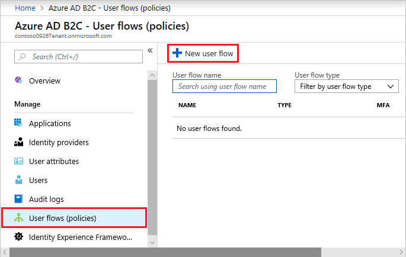
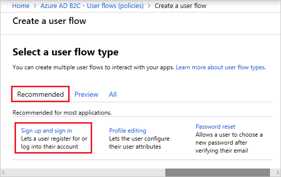
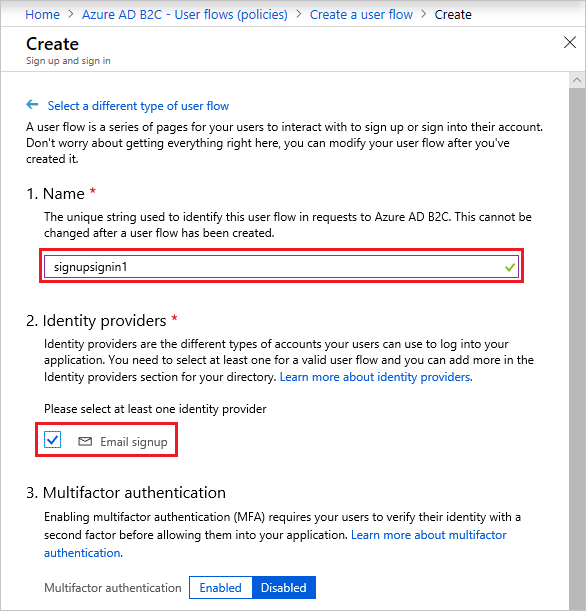
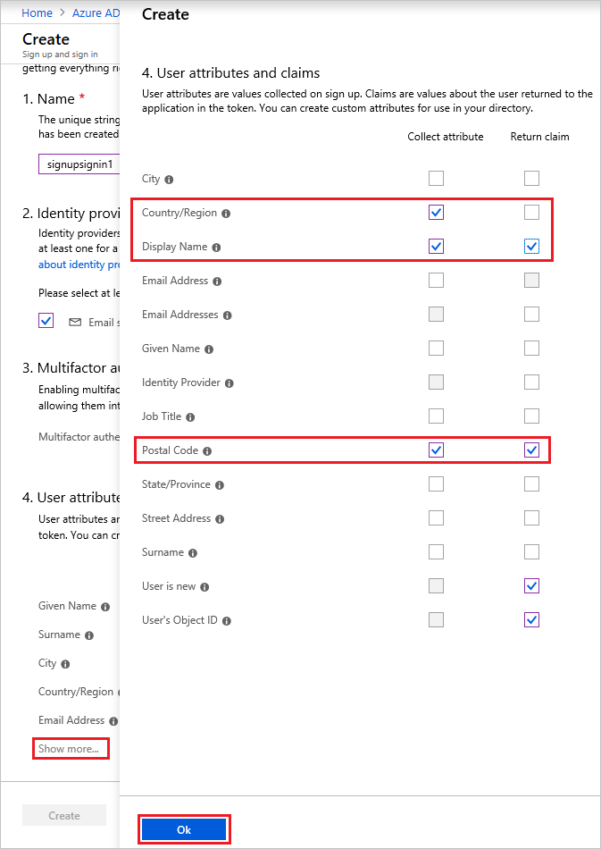
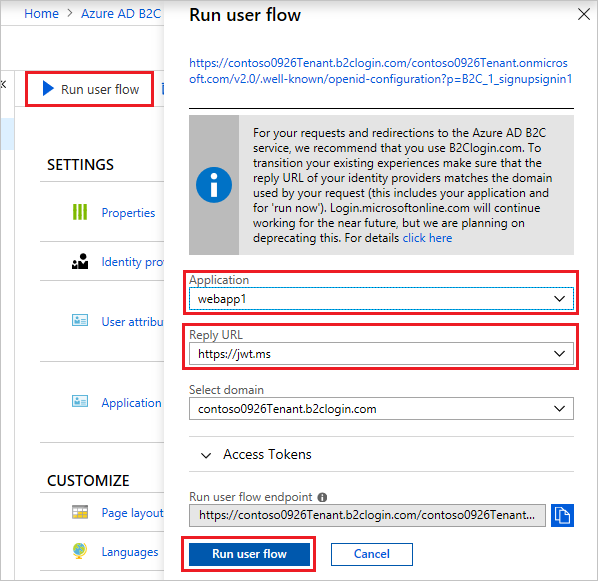

# Tutorial: Create user flows in Azure Active Directory B2C

In your applications you may have [user flows](user-flow-overview.md) that enable users to sign up, sign in, or manage their profile. You can create multiple user flows of different types in your Azure Active Directory B2C (Azure AD B2C) tenant and use them in your applications as needed. User flows can be reused across applications.

In this article, you learn how to:

> [!div class="checklist"]
> * Create a sign-up and sign-in user flow
> * Create a profile editing user flow
> * Create a password reset user flow

This tutorial shows you how to create some recommended user flows by using the Azure portal. If you're looking for information about how to set up a resource owner password credentials (ROPC) flow in your application, see [Configure the resource owner password credentials flow in Azure AD B2C](configure-ropc.md).

If you don't have an Azure subscription, create a [free account](https://azure.microsoft.com/free/?WT.mc_id=A261C142F) before you begin.

## Prerequisites

[Register your applications](tutorial-register-applications.md) that are part of the user flows you want to create.

## Create a sign-up and sign-in user flow

The sign-up and sign-in user flow handles both sign-up and sign-in experiences with a single configuration. Users of your application are led down the right path depending on the context.

1. Sign in to the [Azure portal](https://portal.azure.com).
1. Select the **Directory + Subscription** icon in the portal toolbar, and then select the directory that contains your Azure AD B2C tenant.

    

1. In the Azure portal, search for and select **Azure AD B2C**.
1. Under **Policies**, select **User flows (policies)**, and then select **New user flow**.

    

1. On the **Recommended** tab, select the **Sign up and sign in** user flow.

    

1. Enter a **Name** for the user flow. For example, *signupsignin1*.
1. For **Identity providers**, select **Email signup**.

    

1. For **User attributes and claims**, choose the claims and attributes that you want to collect and send from the user during sign-up. For example, select **Show more**, and then choose attributes and claims for **Country/Region**, **Display Name**, and **Postal Code**. Click **OK**.

    

1. Click **Create** to add the user flow. A prefix of *B2C_1* is automatically prepended to the name.

### Test the user flow

1. Select the user flow you created to open its overview page, then select **Run user flow**.
1. For **Application**, select the web application named *webapp1* that you previously registered. The **Reply URL** should show `https://jwt.ms`.
1. Click **Run user flow**, and then select **Sign up now**.

    

1. Enter a valid email address, click **Send verification code**, enter the verification code that you receive, then select **Verify code**.
1. Enter a new password and confirm the password.
1. Select your country and region, enter the name that you want displayed, enter a postal code, and then click **Create**. The token is returned to `https://jwt.ms` and should be displayed to you.
1. You can now run the user flow again and you should be able to sign in with the account that you created. The returned token includes the claims that you selected of country/region, name, and postal code.

## Create a profile editing user flow

If you want to enable users to edit their profile in your application, you use a profile editing user flow.

1. In the menu of the Azure AD B2C tenant overview page, select **User flows (policies)**, and then select **New user flow**.
1. Select the **Profile editing** user flow on the **Recommended** tab.
1. Enter a **Name** for the user flow. For example, *profileediting1*.
1. For **Identity providers**, select **Local Account SignIn**.
1. For **User attributes**, choose the attributes that you want the customer to be able to edit in their profile. For example, select **Show more**, and then choose both attributes and claims for **Display name** and **Job title**. Click **OK**.
1. Click **Create** to add the user flow. A prefix of *B2C_1* is automatically appended to the name.

### Test the user flow

1. Select the user flow you created to open its overview page, then select **Run user flow**.
1. For **Application**, select the web application named *webapp1* that you previously registered. The **Reply URL** should show `https://jwt.ms`.
1. Click **Run user flow**, and then sign in with the account that you previously created.
1. You now have the opportunity to change the display name and job title for the user. Click **Continue**. The token is returned to `https://jwt.ms` and should be displayed to you.

## Create a password reset user flow

To enable users of your application to reset their password, you use a password reset user flow.

1. In the Azure AD B2C tenant overview menu, select **User flows (policies)**, and then select **New user flow**.
1. Select the **Password reset** user flow on the **Recommended** tab.
1. Enter a **Name** for the user flow. For example, *passwordreset1*.
1. For **Identity providers**, enable **Reset password using email address**.
1. Under Application claims, click **Show more** and choose the claims that you want returned in the authorization tokens sent back to your application. For example, select **User's Object ID**.
1. Click **OK**.
1. Click **Create** to add the user flow. A prefix of *B2C_1* is automatically appended to the name.

### Test the user flow

1. Select the user flow you created to open its overview page, then select **Run user flow**.
1. For **Application**, select the web application named *webapp1* that you previously registered. The **Reply URL** should show `https://jwt.ms`.
1. Click **Run user flow**, verify the email address of the account that you previously created, and select **Continue**.
1. You now have the opportunity to change the password for the user. Change the password and select **Continue**. The token is returned to `https://jwt.ms` and should be displayed to you.

## Next steps

In this article, you learned how to:

> [!div class="checklist"]
> * Create a sign-up and sign-in user flow
> * Create a profile editing user flow
> * Create a password reset user flow

Next, learn about adding identity providers to your applications to enable user sign-in with providers like Azure AD, Amazon, Facebook, GitHub, LinkedIn, Microsoft, or Twitter.

> [!div class="nextstepaction"]
> [Add identity providers to your applications >](tutorial-add-identity-providers.md)
