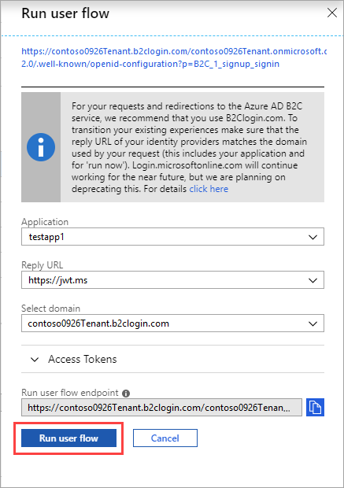

# Tutorial: Customize the interface of user experiences in Azure Active Directory B2C

For more common user experiences, such as sign-up, sign-in, and profile editing, you can use [user flows](user-flow-overview.md) in Azure Active Directory B2C (Azure AD B2C). The information in this tutorial helps you to learn how to [customize the user interface (UI)](customize-ui-overview.md) of these experiences using your own HTML and CSS files.

In this article, you learn how to:

> [!div class="checklist"]
> * Create UI customization files
> * Update the user flow to use the files
> * Test the customized UI

If you don't have an Azure subscription, create a [free account](https://azure.microsoft.com/free/?WT.mc_id=A261C142F) before you begin.

## Prerequisites

[Create a user flow](tutorial-create-user-flows.md) to enable users to sign up and sign in to your application.

## Create customization files

You create an Azure storage account and container and then place basic HTML and CSS files in the container.

### Create a storage account

Although you can store your files in many ways, for this tutorial, you store them in [Azure Blob storage](../storage/blobs/storage-blobs-introduction.md).

1. Sign in to the [Azure portal](https://portal.azure.com).
2. Make sure you're using the directory that contains your Azure subscription. Select the **Directory + subscription** filter in the top menu and choose the directory that contains your subscription. This directory is different than the one that contains your Azure B2C tenant.
3. Choose All services in the top-left corner of the Azure portal, search for and select **Storage accounts**.
4. Select **Add**.
5. Under **Resource group**, select **Create new**, enter a name for the new resource group, and then click **OK**.
6. Enter a name for the storage account. The name you choose must be unique across Azure, must be between 3 and 24 characters in length, and may contain numbers and lowercase letters only.
7. Select the location of the storage account or accept the default location.
8. Accept all other default values, select **Review + create**, and then click **Create**.
9. After the storage account is created, select **Go to resource**.

### Create a container

1. On the overview page of the storage account, select **Blobs**.
2. Select **Container**, enter a name for the container, choose **Blob (anonymous read access for blobs only)**, and then click **OK**.

### Enable CORS

 Azure AD B2C code in a browser uses a modern and standard approach to load custom content from a URL that you specify in a user flow. Cross-origin resource sharing (CORS) allows restricted resources on a web page to be requested from other domains.

1. In the menu, select **CORS**.
2. For **Allowed origins**, enter `https://your-tenant-name.b2clogin.com`. Replace `your-tenant-name` with the name of your Azure AD B2C tenant. For example, `https://fabrikam.b2clogin.com`. You need to use all lowercase letters when entering your tenant name.
3. For **Allowed Methods**, select `GET`,`PUT`, and `OPTIONS`.
4. For **Allowed Headers**, enter an asterisk (*).
5. For **Exposed Headers**, enter an asterisk (*).
6. For **Max age**, enter 200.

    

5. Click **Save**.

### Create the customization files

To customize the UI of the sign-up experience, you start by creating a simple HTML and CSS file. You can configure your HTML any way you want, but it must have a **div** element with an identifier of `api`. For example, `<div id="api"></div>`. Azure AD B2C injects elements into the `api` container when the page is displayed.

1. In a local folder, create the following file and make sure that you change `your-storage-account` to the name of the storage account and `your-container` to the name of the container that you created. For example, `https://store1.blob.core.windows.net/b2c/style.css`.

    ```html
    <!DOCTYPE html>
    <html>
      <head>
        <title>My B2C Application</title>
        <link rel="stylesheet" href="https://your-storage-account.blob.core.windows.net/your-container/style.css">
      </head>
      <body>
        <h1>My B2C Application</h1>
        <div id="api"></div>
      </body>
    </html>
    ```

    The page can be designed any way that you want, but the **api** div element is required for any HTML customization file that you create.

3. Save the file as *custom-ui.html*.
4. Create the following simple CSS that centers all elements on the sign-up or sign-in page including the elements that Azure AD B2C injects.

    ```css
    h1 {
      color: blue;
      text-align: center;
    }
    .intro h2 {
      text-align: center;
    }
    .entry {
      width: 300px ;
      margin-left: auto ;
      margin-right: auto ;
    }
    .divider h2 {
      text-align: center;
    }
    .create {
      width: 300px ;
      margin-left: auto ;
      margin-right: auto ;
    }
    ```

5. Save the file as *style.css*.

### Upload the customization files

In this tutorial, you store the files that you created in the storage account so that Azure AD B2C can access them.

1. Choose **All services** in the top-left corner of the Azure portal, search for and select **Storage accounts**.
2. Select the storage account you created, select **Blobs**, and then select the container that you created.
3. Select **Upload**, navigate to and select the *custom-ui.html* file, and then click **Upload**.

    

4. Copy the URL for the file that you uploaded to use later in the tutorial.
5. Repeat step 3 and 4 for the *style.css* file.

## Update the user flow

1. Choose **All services** in the top-left corner of the Azure portal, and then search for and select **Azure AD B2C**.
2. Select **User flows (policies)**, and then select the *B2C_1_signupsignin1* user flow.
3. Select **Page layouts**, and then under **Unified sign-up or sign-in page**, click **Yes** for **Use custom page content**.
4. In **Custom page URI**, enter the URI for the *custom-ui.html* file that you recorded earlier.
5. At the top of the page, select **Save**.

## Test the user flow

1. In your Azure AD B2C tenant, select **User flows** and select the *B2C_1_signupsignin1* user flow.
2. At the top of the page, click **Run user flow**.
3. Click the **Run user flow** button.

    

    You should see a page similar to the following example with the elements centered based on the CSS file that you created:

    

## Next steps

In this article, you learned how to:

> [!div class="checklist"]
> * Create UI customization files
> * Update the user flow to use the files
> * Test the customized UI

> [!div class="nextstepaction"]
> [Customize the UI in Azure Active Directory B2C](customize-ui-overview.md)
